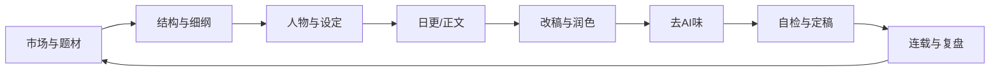

> **适用场景**：想系统学结构/人物/场景/描写/对话/爽点；海外写作法对照、卡文。
> **关联文件**：[QUICK_START](QUICK_START.md) · [INDEX](INDEX.md) · [SKILL](SKILL.md) · [最强知识蒸馏总集](最强知识蒸馏总集.md)

# 最强写作方法论：全球最强综合版（总纲索引）

> 定位：本文件是「小说创作总控大脑」的**总纲索引**。它不是某一本教材，而是把网文、短篇、长篇小说、去 AI 味、人物写法、改稿工序、平台运营，统一收编成你自己的最强操作手册的**入口**。
> 深拆内容已下沉到 `knowledge/craft/` 和 `methods/` 专题文件；本文件只保留**唯一框架层**（总原则 + 全局系统 + 市场研究）和**全主题交叉引用表**。

---

## 一、总原则：什么叫最强写法

最强写法，不是辞藻最强，而是下面六件事都最强：

- **市场命中最强**
- **结构控制最强**
- **人物可信最强**
- **情绪推进最强**
- **改稿纪律最强**
- **去 AI 味最强**

一句话：

> 最强写法 = 明确读者契约 + 可执行结构 + 人物会决策 + 场景有后果 + 改稿有工序 + 连载能持续。

---

## 二、全局写作系统

### 2.1 最强写作总流程



### 2.2 五层分离原则

- **设定层**：世界观、金手指、时间线、角色状态
- **大纲层**：主线、副线、节奏、情绪弧
- **细纲层**：章、节、场景、钩子、后果
- **正文层**：对话、动作、反应、节奏
- **追踪层**：伏笔、上下文、进度、定稿状态

最强标准：

- 正文只展开细纲已有事件
- 低压章不许硬塞爽点，但必须给往下看理由
- 读者契约破坏时，先改纲，再改章

### 2.3 最强写作哲学

- **先求像人写的，再求好看**
- **先保信息，再谈风格**
- **先看读者要什么，再谈作者想表达什么**
- **先能稳定日更，再谈封神**

---

## 三、市场与题材研究

### 3.1 最强市场研究清单

- **题材分类**：现言、古言、都市、重生、系统、悬疑、仙侠、科幻、历史、校园
- **平台分类**：起点、番茄、晋江、知乎盐言、小程序、短剧
- **人群分类**：学生、上班族、女性向、男性向、泛娱乐、垂直圈层
- **爽点分类**：装逼、打脸、碾压、逆袭、反转、甜宠、虐心、升级、权谋、探索

### 3.2 最强对标拆解方法

- 先看榜单前 50 本
- 再拆前 10 本
- 只对标同题材同情绪线
- 不同平台的对标书分开建库

### 3.3 最强题材判断公式

```text
题材强弱 = 人群够不够明确 × 情绪够不够强烈 × 反差够不够大 × 金手指够不够爽 × 篇幅能不能持续
```

---

## 四、深拆内容索引

> 详细内容已下沉到 `knowledge/craft/` 和 `methods/` 专题文件。完整的文件级索引见 [导览.md](导览.md) 和 [INDEX.md](INDEX.md)。

---

## 五、溯源与验证

本总纲的方法论来源、网络验证证据、外部 Skill 蒸馏映射，统一记录在：

- [外部 Skill 蒸馏总索引](../references/外部Skill蒸馏/00_总索引_外部Skill蒸馏.md) — 8 个外部 Skill 的吸收映射、最强知识点、验证状态
- [在线调研索引](../references/在线调研/INDEX.md) — 原始 web 调研数据

> 每更新一次方法论，追加一次联网验证；每遇到更强来源，替换或升级对应模块。

---

## 使用建议

- **开书前**：先看 [§一 总原则](#一总原则什么叫最强写法) 建立全局认知，再进 [网文写作最强SOP](网文写作最强SOP.md) 执行
- **卡文时**：看 [§四 深拆内容索引](#四深拆内容索引详细内容见专题文件) 找对应专题文件
- **人物写崩时**：看 [craft/人物学](../knowledge/craft/人物学.md)
- **对话假大空时**：看 [craft/对白进阶](../knowledge/craft/对白进阶.md)
- **写后改稿时**：看 [craft/改稿与拆文工序](../knowledge/craft/改稿与拆文工序.md) + [改稿润色指令库](改稿润色指令库.md)
- **交稿前**：看 [最强去AI味铁律](最强去AI味铁律.md) + [自检清单_升级版](自检清单_升级版.md)
