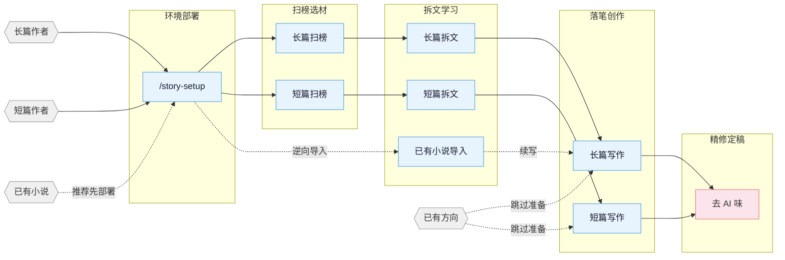

# 小说sill 吸收精华 (最强版)


---
### oh-story-claudecode-main\oh-story-claudecode-main
English | **中文**

# oh-story-claudecode

网文写作 skill 包，覆盖长篇与短篇网络小说的扫榜、拆文、写作、去AI味、封面图全流程。内置适配 Claude Code、OpenCode、ZCode、OpenClaw、Codex CLI、Reasonix、workbuddy；能读取项目文件的 Web AI / Agent 环境也可按通用 skills 路径使用。

## 核心思路

> **套路 = 确定性的情绪满足**

专业作者的方法论三步走：

1. **扫榜**：分析热门榜单，洞察题材、人设、切入点。
2. **拆文**：拆解大纲节奏与剧情素材，建立个人模块库。
3. **商业化写作**：学习并运用钩子、爽感、期待感等核心技巧。

围绕四条线展开：爆款逆向 · 剧情模块化重组 · 上下文状态分层管理 · 人机协同。

> v0.6.23 起：新增 ZCode 3.3.4 原生适配——仓库可作为 marketplace/plugin 安装，暴露 13 个 Skills、13 个 Commands 与严格 JSON Hooks；`story-setup` 支持 `target_cli=zcode`，安全合并 `.zcode/config.json` 与根 `AGENTS.md`。ZCode 当前不执行项目/plugin custom agents，涉及专业 Agent 的流程会明确降级为 solo/direct。
>
> v0.6.22 起：长篇正文接入「题材正文提示卡」——32 个番茄题材的腔调卡在写作时按题材召回进写手（卡内容绝不入正文），并配套大纲边界与逐章写法公式防越界注水；短篇新增投稿层 `submission-craft`（知乎盐选/小程序/番茄三路平台基调、导语门面打磨、付费点断点设计）；全套件 skill 文档去重瘦身约 33KB；story-setup 支持 generic Web AI 部署。已部署项目需重新运行 `/story-setup` 并新开会话。
>
> v0.6.21 起：短篇写作参考栈瘦身——`story-short-write` 删除长篇继承残留 references，改由 `short-format` / `short-craft` / `short-deslop` + 四个题材包（追妻火葬场、复仇打脸、总裁豪门、宅斗宫斗）承接短篇格式、情绪直给、节奏密度和去 AI 味；已部署项目建议重新运行 `/story-setup` 并新开会话，获取新版 narrative-writer 短篇例外。
>
> 更早版本变更见 CHANGELOG.md。

## 流程总览



## 安装

**方式一** 直接告诉 Claude Code / OpenCode / ZCode / OpenClaw / Codex，或其他支持导入 GitHub 仓库/skill 的 Web AI / Agent 平台：

```
安装这个 skill https://github.com/worldwonderer/oh-story-claudecode
```

**方式二** 命令行：

```bash
npx skills add worldwonderer/oh-story-claudecode -y -g
```

`-g` 全局安装，所有目录可用；去掉 `-g` 则只装到当前目录。更新时重新执行同一条命令即可。


> **Codex 用户：** repo 内直接使用：Codex 会扫描 `$REPO_ROOT/.agents/skills`（指向 `skills/` 的 symlink）发现 13 个 skill；用 `$story`、`$story-setup` 或 `/skills` 调用。Windows 上 git 需开 `core.symlinks=true`，否则 symlink 失效，改走下方 `$story-setup` 部署。
> 跑 `$story-setup` 部署到写作项目后，会写入 `.codex/agents/*.toml`、`.codex/hooks.json`、`.codex/hooks/{story_codex_hook.py,run-story-hook.sh,run-story-hook.cmd}` 和 `.codex/skills/story-setup/references/agent-references/`；请信任项目 `.codex/` 配置层并在 `/hooks` review/trust hooks、新开 Codex 会话，让 custom agents 生效。
>
> **ZCode 用户：** 在 Plugin Management 中把本仓库加入 marketplace，安装 `oh-story` 后可用 `$story`、`$story-setup` 或 `/` 面板调用 13 个 Skills/Commands。`$story-setup` 选择 `target_cli=zcode` 会部署 `.zcode/skills/`、`.zcode/commands/`、`.zcode/hooks/story_zcode_hook.js`，安全合并 `.zcode/config.json` 与根 `AGENTS.md`；Hook 依赖 PATH 中的 `node`。ZCode 3.3.4 不执行项目/plugin custom agents，也没有 `PreCompact` / `SessionEnd`，相关流程会明确降级 solo/direct，compact 后由 `SessionStart` 恢复上下文。
>
> **OpenCode 用户：** 全局安装后 opencode 自动从 `~/.claude/skills/` 发现 skills；首次用自然语言触发 story-setup（如「用 story-setup 部署网文写作环境」），**部署后退出重进 `opencode -c`** 才能用 slash command。部分 hook 行为与 Claude Code 有差异（session-start / session-end / compact 等），详见 CONTRIBUTING.md 的 OpenCode 章节。
>
> **OpenClaw 用户：** 当前支持 skills-only：OpenClaw 可从 workspace `skills/`、`.agents/skills`、`~/.agents/skills`、`~/.openclaw/skills` 等 skill root 发现本项目 13 个 skill；`SKILL.md` 已按 OpenClaw 要求使用单行 `name` / `description` 与单行 JSON `metadata.openclaw`。`story-setup` 选择 `target_cli=openclaw` 时会把 skills 复制到项目 `skills/` 并写入 OpenClaw 版 `AGENTS.md`；agents/hooks 暂不部署，写正文前大纲守卫在 OpenClaw 下是 skill 内软约束。部署后如未显示新 skills，请新开 OpenClaw session 或等待 watcher 刷新。
>
> **Reasonix 用户：** 当前支持 skills + 原生 plugin manifest（Phase 1）：Reasonix 原生扫描 `.agents/skills`（指向 `skills/` 的 symlink）发现 13 个 skill，用 `reasonix doctor capabilities` 校验；也可用根 `reasonix-plugin.json` 走 `reasonix plugin install`。项目级 `story-setup` 部署与 hooks 是后续阶段。Windows 未启用 symlink 时改走原生 plugin。
>
> **Web AI / 通用 Agent 用户：** 平台能读取 GitHub 仓库或项目文件时，可让 Agent 读取 `skills/*/SKILL.md` 与对应 `references/`；需要本地副本时，`story-setup` 可选 `target_cli=generic`，只写通用 `AGENTS.md` 和 `skills/`。无本项目 hooks/custom agents 的环境按 skill 内软约束或 solo/direct fallback 执行。
>
> 升级后如果项目里已经跑过 `/story-setup`，建议在项目根重跑一次 `/story-setup`，同步 hooks / agents / references。每版变更见 CHANGELOG.md 与 [Releases](https://github.com/worldwonderer/oh-story-claudecode/releases)。

> **多 agent 协作要先部署再新开会话**：7 个专业 agent（story-architect、narrative-writer、consistency-checker 等）由 `/story-setup` 写入项目 `.claude/agents/`，或由 `$story-setup` 写入 `.codex/agents/*.toml`。Claude Code / Codex 都在会话启动时更稳定地注册 custom agent；ZCode 3.3.4、OpenClaw Phase 1 与 generic 路径默认走 skills + solo fallback。判断是否生效：新会话里跑 `/story-review`，报告头是 `Effective Mode: full/lean` 即注册成功，是 `Fallback: ... -> solo` 说明当前运行时未暴露该 agent。

> **导入续写顺序：** 推荐先在写作项目根运行 `/story-setup`（部署 hooks/agents/AGENTS），新开/刷新会话后运行 `/story-import` 导入已有小说，再用 `/story-long-write 日更` 或 `/story-long-write 写第N章` 续写。也可以直接运行 `/story-import`；它会先检测是否已 setup，未部署时让你选择先去 setup 或继续串行导入。

## Skills

| Skill | 触发 | 说明 |
|:------|:-----|:-----|
| `story-setup` | `/story-setup` `$story-setup` `/准备写书` | 环境部署 · Claude/OpenCode/Codex/ZCode/OpenClaw + generic（已有配置安全合并） |
| `story` | `/story` `$story` `/网文` | 工具箱路由 · 模糊意图自动分发到对应 skill |
| `story-long-write` | `/story-long-write` `/写长篇` | 长篇写作 · 大纲搭建、人物设定、正文输出 |
| `story-long-analyze` | `/story-long-analyze` | 长篇拆文 · 黄金三章、爽点设计、节奏分析 |
| `story-long-scan` | `/story-long-scan` | 长篇扫榜 · 起点/番茄/晋江市场趋势 |
| `story-short-write` | `/story-short-write` | 短篇写作 · 情绪设计、反转构思、精修出稿 |
| `story-short-analyze` | `/story-short-analyze` | 短篇拆文 · 故事核、结构分析、情感线、反转设计、写作手法、共鸣分析 |
| `story-short-scan` | `/story-short-scan` | 短篇扫榜 · 知乎盐言/番茄短篇风口数据 |
| `story-deslop` | `/story-deslop` `/去AI味` | 去AI味 · 检测并清除 AI 写作痕迹 |
| `story-import` | `/story-import` `/导入小说` | 逆向导入 · 将已有小说反向解析为标准项目结构 |
| `story-review` | `/story-review` `/审查` | 多视角审查 · 4 Agent 多视角审稿 + 番茄/起点/知乎评分标准 |
| `story-cover` | `/story-cover` `/封面` | 封面生成 · 书名题材分析 + GPT-Image-2 出图 |
| `browser-cdp` | `/browser-cdp` | 浏览器操控 · CDP 协议复用登录态抓取数据 |

> `story-deslop` 的本地检查是写作 lint：blocking 只限确定性句式/标点问题，其他提示按读感判断；朱雀等外部检测只作自测参考，不替代人工读感。

自然语言同样触发：
- 「帮我开书」→ `story-long-write`
- 「这篇太 AI 了」→ `story-deslop`
- 「把我的书导进来」→ `story-import`
- 「沈栀现在什么状态」→ 自动 spawn `story-explorer` agent

<details>
<summary>封面生成示例</summary>


</details>

<details>
<summary>拆文 demo — 盘龙</summary>

使用 `/story-long-analyze` 深度模式分析《盘龙》前23章的完整输出：

```
demo/拆文库-盘龙/
├── 概要.md              # 全书概要 + 章节索引
├── 拆文报告.md           # 五维评分 + 爽点密度 + 可借鉴套路
├── 文风.md              # 句长/标点/对话潜台词/情绪节奏 + 原文锚点
├── 章节/
│   ├── 第1章_深度拆解.md  # 黄金三章深度分析
│   └── 第1-23章_摘要.md   # 每章摘要 + 情节点 + 角色提及
├── 角色/
│   ├── 林雷.md           # 主角完整档案
│   ├── 霍格.md           # 核心配角
│   ├── 希尔曼.md         # 核心配角
│   ├── 德林柯沃特.md      # 核心配角
│   ├── 沃顿.md           # 功能角色
│   └── 角色关系.md        # 关系网络
├── 剧情/
│   ├── 故事线.md          # 框架识别 + 4剧情 + 2故事线
│   ├── 节奏.md            # 节奏/关键信息递进/情绪触发爆发节律
│   └── 情绪模块.md        # 读者需求/情绪引擎/可复用写作模块
└── 设定/
    ├── 世界观/
    │   ├── 背景设定.md    # 核心规则 + 特殊设定
    │   ├── 力量体系.md    # 战气 + 魔法 + 等级
    │   ├── 地理.md        # 安达卢西亚 + 玉兰大陆
    │   └── 金手指.md      # 盘龙戒指 + 德林柯沃特
    └── 势力/
        └── 巴鲁克家族.md  # 龙血血脉家族档案
```

长篇拆文会额外生成 `文风.md`，并在 `剧情/` 下产出 `节奏.md`（节奏/关键信息递进/情绪触发爆发节律）和 `情绪模块.md`（读者需求/情绪引擎/可复用写作模块）；日更写作会通过 `对标/{书名}/剧情/` 读取这些素材，避免文风、节奏和情绪模块偏离对标书。

</details>

<details>
<summary>拆文 demo — 曾将爱意私藏（短篇）</summary>

使用 `/story-short-analyze` 拆解短篇《曾将爱意私藏》（约 8500 字，追妻火葬场 · 死遁）的完整输出：

```
demo/拆文库-曾将爱意私藏/
├── 原文/原文.txt        # 原文备份
├── 拆文报告.md          # 故事核 + 五维评分 + 爆点6维 + 认知反转 + 共鸣9层
├── 情节节点.md          # 54 个情节节点（原文引用 + 情绪标记 −9~+9）
├── 写作手法.md          # POV / 对话 / 信息差 / 物件钩子 等 11 项
└── _meta.json           # 结构计数 structure_counts（Phase 7 门控依据）
```

短篇拆文产出 `拆文报告 / 情节节点 / 写作手法`，下游 `/story-short-write` 据此写同题材新短篇。

</details>

<details>
<summary>导入 demo — 让你管账号，你高燃混剪炸全网（长篇续写工程）</summary>

推荐先 `/story-setup` 部署写作项目，再使用 `/story-import` 把作者已发布的前 20 章（约 3.7 万字）逆向重建为可续写的写作工程，最后接 `/story-long-write 日更` 或 `/story-long-write 写第21章` 续写：

```
demo/让你管账号，你高燃混剪炸全网/
├── 正文/        第001–020章（已发布原文）
├── 大纲/        大纲.md · 卷纲_第1卷.md · 细纲_第001–020章.md（1 章 1 文件）
├── 设定/        角色/{江晨·钟嘉嘉·周薄森·张耀祖·吴伟·李林}
│                世界观/{背景设定·金手指} · 关系.md · 题材定位.md · 文风.md
├── 追踪/        伏笔.md · 时间线.md · 角色状态.md · 上下文.md
└── 参考资料/    作品信息.md
```

逐章提取（事件 / 角色 / 设定 / 伏笔 / 时间线）反推为续写 bible，作者从第 21 章无缝接着写。

</details>

## Agent 体系

写作 skill 内部通过 7 个专业 Agent 协作，各司其职：

| Agent | 模型 | 职责 |
|:------|:-----|:-----|
| **story-architect** | Opus | 故事架构 · 题材定位、大纲结构、钩子/反转设计、情绪弧线 |
| **character-designer** | Sonnet | 角色设计 · 角色档案、语言风格、动机链、对话创作 |
| **narrative-writer** | Sonnet | 叙事写手 · 正文写作、去AI味、格式合规 |
| **consistency-checker** | Haiku | 一致性检查 · 事实冲突扫描、伏笔追踪、S1-S4 分级报告 |
| **story-researcher** | Sonnet | 资料研究 · CDP 搜索+正文提取、多源交叉验证、结构化参考文件输出 |
| **story-explorer** | Haiku | 故事查询 · 角色/伏笔/设定/进度只读查询，日更上下文快速加载 |
| **chapter-extractor** | Haiku | 章节提取 · 摘要+情节点+角色提及，并行拆文核心单元 |

Agent 按需加载 `references/` 中的写作理论（角色设计、对话技法、反转工具箱等 100+ 份方法论文件），不预占上下文。

## 自动化 Hooks

`/story-setup` 部署后自动生效的 7 个 hook：

| Hook | 触发时机 | 功能 |
|:-----|:---------|:-----|
| session-start.sh | 会话开始 | 显示分支、进度快照、拆文状态 |
| session-end.sh | 会话结束 | 记录会话日志到 `追踪/session-log.txt` |
| detect-story-gaps.sh | 会话开始 | 检测设定缺口、大纲缺失、伏笔断线 |
| pre-compact.sh | 上下文压缩前 | 保存进度快照路径和行数摘要 |
| post-compact.sh | 上下文压缩后 | 提示读取进度快照恢复上下文 |
| validate-story-commit.sh | git commit 时 | 检查硬编码属性、设定必填字段（仅警告，不阻断） |
| guard-outline-before-prose.sh | 写正文前（Write/Edit） | 缺对应细纲/小节大纲时阻止首次创建正文（阻断），强制先搭大纲 |

## 项目文件结构

一部长篇动辄几十万字、几百章。设定冲突、伏笔断线、时间线对不上——写到最后全靠记忆硬撑，迟早翻车。

---
### nuwa-skill-main\nuwa-skill-main
<div align="center">

# 女娲.skill

<p align="center">
  
  <br/>
  <sub>动画由 <a href="https://github.com/alchaincyf/huashu-design">huashu-design</a> skill 制作</sub>
</p>

> *「你想蒸馏的下一个员工，何必是同事」*

[](LICENSE)
[](https://agentskills.io)
[](https://skills.sh)
[](#安装)

<br>

**女娲帮你蒸馏任何人的思维方式，让乔布斯、马斯克、芒格、费曼都给你打工。**

<sub>基于开放的 [Agent Skills 协议](https://agentskills.io)，可在 Claude Code、Codex、Cursor、OpenClaw、Hermes Agent、CodeBuddy、Workbuddy、Gemini CLI、OpenCode 等 50+ 兼容 runtime 中运行。</sub>

<br>

[同事.skill](https://github.com/titanwings/colleague-skill) 证明了蒸馏一个人是可行的。<br>
那何必蒸馏同事？去蒸馏乔布斯、芒格、费曼、马斯克。<br>
只需输入一个名字，女娲自动完成调研、提炼、验证全流程。

[看效果](#效果示例) · [安装](#安装) · [它蒸馏了什么](#女娲蒸馏了什么) · [工作原理](#工作原理)

<br>

**其他语言 / Other Languages:**

English · 日本語 · 한국어 · Español

<br>

[](https://star-history.com/#alchaincyf/nuwa-skill&Date)

</div>

---

## 效果示例

```
用户      ❯ 我同时想做自媒体、写书、做独立开发，精力完全不够

Naval     ❯ 你列了三个欲望。每个欲望都是你跟不快乐签的一份合同。
            不是精力不够，是合同太多。
            
            问你自己：哪一个做起来你会忘记时间？
            那个就是你的特定知识所在。
            
            不是三选一。是先一，再一，再一。
            串行复利，不是并行内耗。
```

```
用户      ❯ 我们的SaaS产品获客成本太高了

马斯克     ❯ 先别想怎么降。先算物理极限。
            获客的最小必要动作是什么？用户从知道你到付费，
            信息传递的理论最短路径是什么？
            
            现在你的实际路径是理论路径的几倍？
            如果超过3倍，中间一定有可以砍掉的步骤。
            不是优化漏斗，是质疑漏斗本身该不该存在。
```

再来一个大家更熟悉的。蒸馏乔布斯之后，问他「OpenAI和Anthropic谁的方向对」：

```
用户      ❯ OpenAI和Anthropic谁的方向是对的？

乔布斯    ❯ 你问错了。这不是一场关于方向的竞赛。
            这是一场关于品味的竞赛。

            OpenAI像1985年的微软。什么都做，什么都要赢。
            这种策略能赢市场份额。Bill Gates就是这么赢的。
            问题是——当你什么都做的时候，你不可能每件事都做到
            insanely great。

            Anthropic更像早期的Apple。聚焦。
            Focus means saying no to a hundred good ideas.

            但两家公司都犯了一个我绝对不会犯的错误——
            他们不控制硬件。

            最终赢的可能是同时控制芯片、模型和用户界面的人。
            你知道现在谁在同时做这三件事吗？Apple.
```

这不是角色扮演。乔布斯用的是「聚焦即说不」和「端到端控制」心智模型，Naval用的是「欲望即合同」，马斯克用的是「渐近极限法」。**它们不是在复读名人语录，是在用名人的认知框架帮你分析。**

---

## 安装

女娲基于开放的 [Agent Skills](https://agentskills.io) 协议，可在任何 skills-compatible 的 AI agent runtime 中运行。

### 方式一：一行命令（推荐，跨 runtime）

打开你正在用的 agent（Claude Code、Codex、Cursor、OpenClaw、Hermes、CodeBuddy、Workbuddy、Gemini CLI、OpenCode 等），告诉它：

```
帮我安装这个 skill：https://github.com/alchaincyf/nuwa-skill
```

或者用通用 CLI 安装器（[vercel-labs/skills](https://github.com/vercel-labs/skills)，支持 55+ runtime）：

```bash
npx skills add alchaincyf/nuwa-skill
```

它会自动识别你当前的 runtime 并把 skill 放到正确目录。需要指定时加 `-a claude-code` / `-a codex` / `-a cursor` / `-a openclaw` 等参数。

### 方式二：手动安装

<details>
<summary>展开查看各 runtime 的 skills 目录</summary>

| Runtime | 安装路径 |
|---|---|
| Claude Code | `~/.claude/skills/nuwa-skill/` |
| Codex CLI | `~/.codex/skills/nuwa-skill/` |
| Cursor | `~/.cursor/skills/nuwa-skill/` |
| OpenClaw | `~/.openclaw/workspace/skills/nuwa-skill/` |
| Hermes Agent | 跑 `tools/install_hermes_skill.py` |
| 其他 runtime | clone 到对应 runtime 的 `skills/` 目录 |

```bash
git clone https://github.com/alchaincyf/nuwa-skill <上面对应的路径>
```

</details>

### 方式三：作为参考资料使用

即使 runtime 不支持 Agent Skills 自动加载，你也可以直接把 `SKILL.md` 的内容粘贴进对话——它本质就是一份 markdown + YAML frontmatter。

---

### 使用

装好后，告诉 agent：

```
> 蒸馏一个保罗·格雷厄姆
> 造一个张小龙的视角Skill
> 帮我做一个段永平的Skill
```

造完之后直接调用：

```
> 用芒格的视角帮我分析这个投资决策
> 费曼会怎么解释量子计算？
> 切换到Naval，我在纠结三件事
```

---

## 女娲蒸馏了什么

蒸馏各领域最强的人，需要提取比日常工作习惯更深的东西。女娲提取五层：

| 层次 | 说明 |
|---|---|
| **怎么说话** | 表达DNA——语气、节奏、用词偏好 |
| **怎么想** | 心智模型、认知框架 |
| **怎么判断** | 决策启发式 |
| **什么不做** | 反模式、价值观底线 |
| **知道局限** | 诚实边界 |

工作习惯可以靠流程文档传递，但让芒格和马斯克面对同一个问题做出不同判断的，是认知框架。女娲提取的是认知操作系统。

### 诚实边界

每个Skill都明确标注做不到什么：

- 蒸馏不了直觉——框架能提取，灵感不能
- 捕捉不了突变——截止到调研时间的快照
- 公开表达 ≠ 真实想法——只能基于公开信息

**一个不告诉你局限在哪的Skill，不值得信任。**

---

## 已蒸馏人物

女娲已蒸馏了14位人物 + 1个主题。每个都是独立的、可直接安装使用的Skill，全部基于 Agent Skills 协议，可在 Claude Code / Codex / Cursor / OpenClaw / Hermes 等 runtime 通用：

### 人物Skill

| 人物 | 领域 | 独立仓库 | 一键安装（跨 runtime） |
|------|------|---------|---------|
| 🔥 **Paul Graham** | 创业/写作/产品/人生哲学 | [paul-graham-skill](https://github.com/alchaincyf/paul-graham-skill) | `npx skills add alchaincyf/paul-graham-skill` |
| 🔥 **张一鸣** | 产品/组织/全球化/人才 | [zhang-yiming-skill](https://github.com/alchaincyf/zhang-yiming-skill) | `npx skills add alchaincyf/zhang-yiming-skill` |
| 🔥 **Karpathy** | AI/工程/教育/开源 | [karpathy-skill](https://github.com/alchaincyf/karpathy-skill) | `npx skills add alchaincyf/karpathy-skill` |
| 🔥 **Ilya Sutskever** | AI安全/scaling/研究品味 | [ilya-sutskever-skill](https://github.com/alchaincyf/ilya-sutskever-skill) | `npx skills add alchaincyf/ilya-sutskever-skill` |
| 🔥 **MrBeast** | 内容创造/YouTube方法论 | [mrbeast-skill](https://github.com/alchaincyf/mrbeast-skill) | `npx skills add alchaincyf/mrbeast-skill` |
| 🔥 **特朗普** | 谈判/权力/传播/行为预判 | [trump-skill](https://github.com/alchaincyf/trump-skill) | `npx skills add alchaincyf/trump-skill` |
| ⭐ **乔布斯** | 产品/设计/战略 | [steve-jobs-skill](https://github.com/alchaincyf/steve-jobs-skill) | `npx skills add alchaincyf/steve-jobs-skill` |
| **马斯克** | 工程/成本/第一性原理 | [elon-musk-skill](https://github.com/alchaincyf/elon-musk-skill) | `npx skills add alchaincyf/elon-musk-skill` |
| **芒格** | 投资/多元思维/逆向思考 | [munger-skill](https://github.com/alchaincyf/munger-skill) | `npx skills add alchaincyf/munger-skill` |
| **费曼** | 学习/教学/科学思维 | [feynman-skill](https://github.com/alchaincyf/feynman-skill) | `npx skills add alchaincyf/feynman-skill` |
| **纳瓦尔** | 财富/杠杆/人生哲学 | [naval-skill](https://github.com/alchaincyf/naval-skill) | `npx skills add alchaincyf/naval-skill` |
| **塔勒布** | 风险/反脆弱/不确定性 | [taleb-skill](https://github.com/alchaincyf/taleb-skill) | `npx skills add alchaincyf/taleb-skill` |
| **张雪峰** | 教育选择/职业规划/阶层流动 | [zhangxuefeng-skill](https://github.com/alchaincyf/zhangxuefeng-skill) | `npx skills add alchaincyf/zhangxuefeng-skill` |
| **孙宇晨** | 营销/注意力经济/叙事操控 | 仓库内examples/ | 复制 `examples/sun-yuchen-perspective/` 到skills目录 |

### 主题Skill

| 主题 | 领域 | 独立仓库 | 一键安装（跨 runtime） |
|------|------|---------|---------|
| **X导师** | X/Twitter运营全栈 | [x-mentor-skill](https://github.com/alchaincyf/x-mentor-skill) | `npx skills add alchaincyf/x-mentor-skill` |

人物Skill蒸馏一个人的思维方式；主题Skill蒸馏一个领域的方法论。每个仓库都包含完整的调研数据和效果示例对话。

🧪 **保真度评分卡**：15个官方Skill已全部通过独立双agent盲测（立场一致性/风格辨识度/边缘诚实度/来源透明度/结构完整度，方法论见 references/fidelity-scorecard.md），**全员A级（≥85分）**。各分数：MrBeast/纳瓦尔/塔勒布/乔布斯/Karpathy/Paul Graham/张雪峰 97 · 芒格/费曼/X导师 96 · 特朗普 95 · Ilya 94 · 张一鸣 93 · 孙宇晨 91 · 马斯克 89。完整评分卡见各skill目录内的 `FIDELITY.md`。

想蒸馏不在列表里的人或主题？安装女娲，说「蒸馏一个XXX」就行。

---

## 贡献与社区

女娲的生态由社区一起长大，但走两条不同的路：

- **`SKILL.md` 是核心资产，不接受外部PR改动**。发现方法论的bug或改进点→开issue讨论，被采纳的想法由维护者实现并在commit中致谢（先例见PR #59）
- **社区蒸馏的人物skill走 COMMUNITY.md 索引**：放你自己的仓库（star归你），跑一遍保真度评分卡拿到B级以上，提一行PR即可收录

完整规则见 CONTRIBUTING.md。社区已有的合集、多人格编排和主题应用，见 COMMUNITY.md。

---

## 达尔文.skill：让所有Skill持续进化

<div align="center">

<a href="https://github.com/alchaincyf/darwin-skill">

</a>

</div>

女娲造Skill，**[达尔文](https://github.com/alchaincyf/darwin-skill)** 让Skill进化。

受 Karpathy autoresearch 启发，达尔文.skill 用自主实验循环批量优化所有Skill：8维度评估、棘轮机制（只保留改进，自动回滚退步）、独立子agent评分。女娲的 Phase 5 双Agent精炼就内置了达尔文的评估体系，这也是女娲生成的Skill质量高的原因之一。

```bash
npx skills add alchaincyf/darwin-skill
```

---

## 工作原理

---
### humanizer-main\humanizer-main
# Humanizer

A portable agent skill that removes signs of AI-generated writing from text, making it sound more natural and human. It is plain Markdown, so it can run in any harness that supports skill-style instructions.

## Installation

### Skills CLI

Install with the cross-agent skills CLI:

```bash
npx skills add blader/humanizer
```

Update an existing install:

```bash
npx skills update humanizer
```

To install into every supported agent harness:

```bash
npx skills add blader/humanizer --agent '*'
```

To target one configured harness, pass its agent name:

```bash
npx skills add blader/humanizer --agent <agent-name>
```

### Claude Code plugin

Claude Code users can also install Humanizer as a plugin:

```
/plugin marketplace add blader/humanizer
/plugin install humanizer@humanizer
```

The skill is then invoked as `/humanizer:humanizer`.

### Manual

Any agent harness can use the skill directly because the runtime artifact is `SKILL.md`. Install it wherever your harness expects skill directories, or copy `SKILL.md` into an existing skill folder.

For example:

```bash
git clone https://github.com/blader/humanizer.git /path/to/your/skills/humanizer
```

Or, if you already have this repo cloned:

```bash
mkdir -p /path/to/your/skills/humanizer
cp SKILL.md /path/to/your/skills/humanizer/
```

## Usage

Invoke the skill however your agent harness exposes installed skills. Common forms include a slash command or a direct request:

```
/humanizer

[paste your text here]
```

```
Please humanize this text: [your text]
```

### Voice Calibration

To match your personal writing style, provide a sample of your own writing:

```
/humanizer

Here's a sample of my writing for voice matching:
[paste 2-3 paragraphs of your own writing]

Now humanize this text:
[paste AI text to humanize]
```

The skill will analyze your sentence rhythm, word choices, and quirks, then apply them to the rewrite instead of producing generic "clean" output.

## Overview

Based on [Wikipedia's "Signs of AI writing"](https://en.wikipedia.org/wiki/Wikipedia:Signs_of_AI_writing) guide, maintained by WikiProject AI Cleanup. This comprehensive guide comes from observations of thousands of instances of AI-generated text.

The skill also includes a final "obviously AI generated" audit pass and a second rewrite, to catch lingering AI-isms in the first draft.

### Key Insight from Wikipedia

> "LLMs use statistical algorithms to guess what should come next. The result tends toward the most statistically likely result that applies to the widest variety of cases."

## 33 Patterns Detected (with Before/After Examples)

### Content Patterns

| # | Pattern | Before | After |
|---|---------|--------|-------|
| 1 | **Significance inflation** | "marking a pivotal moment in the evolution of..." | "was established in 1989 to collect regional statistics" |
| 2 | **Notability name-dropping** | "cited in NYT, BBC, FT, and The Hindu" | "In a 2024 NYT interview, she argued..." |
| 3 | **Superficial -ing analyses** | "symbolizing... reflecting... showcasing..." | Remove or expand with actual sources |
| 4 | **Promotional language** | "nestled within the breathtaking region" | "is a town in the Gonder region" |
| 5 | **Vague attributions** | "Experts believe it plays a crucial role" | "according to a 2019 survey by..." |
| 6 | **Formulaic challenges** | "Despite challenges... continues to thrive" | Specific facts about actual challenges |

### Language Patterns

| # | Pattern | Before | After |
|---|---------|--------|-------|
| 7 | **AI vocabulary** | "Actually... additionally... testament... landscape... showcasing" | "also... remain common" |
| 8 | **Copula avoidance** | "serves as... features... boasts" | "is... has" |
| 9 | **Negative parallelisms / tailing negations** | "It's not just X, it's Y", "..., no guessing" | State the point directly |
| 10 | **Rule of three** | "innovation, inspiration, and insights" | Use natural number of items |
| 11 | **Synonym cycling** | "protagonist... main character... central figure... hero" | "protagonist" (repeat when clearest) |
| 12 | **False ranges** | "from the Big Bang to dark matter" | List topics directly |
| 13 | **Passive voice / subjectless fragments** | "No configuration file needed" | Name the actor when it helps clarity |

### Style Patterns

| # | Pattern | Before | After |
|---|---------|--------|-------|
| 14 | **Em/en dashes** | "institutions—not the people—yet this continues—" | Cut them: periods, commas, colons, or parentheses |
| 15 | **Boldface overuse** | "**OKRs**, **KPIs**, **BMC**" | "OKRs, KPIs, BMC" |
| 16 | **Inline-header lists** | "**Performance:** Performance improved" | Convert to prose |
| 17 | **Title Case Headings** | "Strategic Negotiations And Partnerships" | "Strategic negotiations and partnerships" |
| 18 | **Emojis** | "🚀 Launch Phase: 💡 Key Insight:" | Remove emojis |
| 19 | **Curly quotes** | `said “the project”` | `said “the project”` |
| 26 | **Hyphenated word pairs** | “cross-functional, data-driven, client-facing” | Drop hyphens on common word pairs |
| 27 | **Persuasive authority tropes** | "At its core, what matters is..." | State the point directly |
| 28 | **Signposting announcements** | "Let's dive in", "Here's what you need to know" | Start with the content |
| 29 | **Fragmented headers** | "## Performance" + "Speed matters." | Let the heading do the work |
| 30 | **Diff-anchored writing** | "This function was added to replace..." | Describe what it does, not what changed |
| 31 | **Manufactured punchlines / staccato drama** | "It had no preference. No prior. No nostalgia." | Use varied sentence lengths and concrete claims |
| 32 | **Aphorism formulas** | "Symmetry is the language of trust" | Replace the formula with the actual claim |
| 33 | **Conversational rhetorical openers** | "Honestly? It depends..." | Remove the fake-candid setup |

### Communication Patterns

| # | Pattern | Before | After |
|---|---------|--------|-------|
| 20 | **Chatbot artifacts** | "I hope this helps! Let me know if..." | Remove entirely |
| 21 | **Cutoff disclaimers** | "While details are limited in available sources..." | Find sources or remove |
| 22 | **Sycophantic tone** | "Great question! You're absolutely right!" | Respond directly |

### Filler and Hedging

| # | Pattern | Before | After |
|---|---------|--------|-------|
| 23 | **Filler phrases** | "In order to", "Due to the fact that" | "To", "Because" |
| 24 | **Excessive hedging** | "could potentially possibly" | "may" |
| 25 | **Generic conclusions** | "The future looks bright" | Specific plans or facts |

## Full Example

**Before (AI-sounding):**
> I recently spent five unforgettable days in Lisbon, and let me tell you — this city completely stole my heart. From the moment I arrived, I knew I was somewhere truly special.
>
> Nestled along the banks of the Tagus River, Lisbon stands as a vibrant testament to Portugal's enduring spirit, where rich history and modern energy intertwine at every turn. Yes, the famous hills are challenging — my legs certainly felt it! — but every climb rewards you with breathtaking, panoramic views that make it all worthwhile.
>
> No trip would be complete without riding the iconic Tram 28, winding through the city's most historic neighborhoods. And the food? Simply divine. The original pastéis de nata at Pastéis de Belém are a beloved national treasure, and savoring one still warm was a moment I will never forget.
>
> But what truly makes Lisbon special isn't just the sights — it's the feeling. Wander a few steps off the main squares and you'll discover a quieter, more authentic side: sun-drenched alleys, charming tiled facades, and friendly locals going about their daily lives, inviting you to slow down and savor every moment.
>
> Of course, the must-see São Jorge Castle offers stunning views over the rooftops below. The queues can be long, but the experience is absolutely worth it for any history buff or curious traveler.
>
> Would I go back? Absolutely. Lisbon isn't just a place to visit — it's a place to fall in love with, again and again. If you're dreaming of your next getaway, this is one destination that promises memories to last a lifetime. ✨

**After (Humanized):**
> I spent five days in Lisbon last October and still have mixed feelings about it. Beautiful, yes. Also harder on the knees than anyone warned me.
>
> The hills are the whole story and somehow never make the brochures. My hotel was up in Alfama, which photographs beautifully and translates, in practice, to climbing what felt like a six-story staircase every time I wanted coffee. By the second day my calves had opinions. I started planning each walk around which way was downhill, which is a strange way to see a city but probably an honest one.
>
> Everyone says to ride Tram 28, so I did, wedged against a stranger's backpack for forty minutes while three tour groups filmed the same corner. I would walk the route next time, or go before breakfast. The custard tarts, though, earn the fuss. I had one at a plain little place in Graça, still warm, and for about thirty seconds I understood why people build trips around pastry.
>
> What I did not expect was how quiet the city gets away from the main squares. Two blocks uphill from any plaza it turns into laundry lines, chipped tile, open windows, and old men watching football with the sound turned up. That is the Lisbon I keep thinking about, not the castle.
>
> The castle is fine. The view is great, the queue is long, and I spent more time shuffling toward the entrance than looking at anything once I got inside. If I had only two days, I would trade it for an afternoon of getting lost.
>
> I would go back, but in spring and with better shoes. Lisbon does not bend over backward to make things easy for you. I think I liked that, even when my legs disagreed.

## References

- [Wikipedia: Signs of AI writing](https://en.wikipedia.org/wiki/Wikipedia:Signs_of_AI_writing) - Primary source
- [WikiProject AI Cleanup](https://en.wikipedia.org/wiki/Wikipedia:WikiProject_AI_Cleanup) - Maintaining organization

## Version History

- **2.8.2** - Replaced the full before/after example with a first-person Lisbon trip recap. The after now keeps the same topic, perspective, and rough length as the before while removing the AI tells without becoming clipped or slogan-like. No change to the 33 patterns.
- **2.8.1** - Added cross-agent installation docs, optional Claude Code plugin packaging, and a compact secondhand-text false-positive guard. No change to the 33 patterns.
- **2.8.0** - Added style/cadence patterns #31-33 for manufactured punchlines, aphorism formulas, and conversational rhetorical openers; expanded #20 to catch offer-to-continue chatbot closers. 33 patterns total.
- **2.7.0** - Added pattern #30 (diff-anchored writing); made em/en dashes a hard cut rather than "overuse"; expanded #21 to cover speculative gap-filling ("maintains a low profile"). 30 patterns total.
- **2.6.0** - Cleanup pass: consolidated the duplicated workflow sections, gated the personality guidance to content where voice is wanted, removed the model-fingerprinting subsection, and condensed the worked example. No change to the 29 patterns.
- **2.5.1** - Added a passive-voice / subjectless-fragment rule, raising the total to 29 patterns
- **2.5.0** - Added patterns for persuasive framing, signposting, and fragmented headers; expanded negative parallelisms to cover tailing negations; tightened wording around em dash overuse; fixed frontmatter wording to use "filler phrases"
- **2.4.0** - Added voice calibration: match the user's personal writing style from samples
- **2.3.0** - Added pattern #25: hyphenated word pair overuse
- **2.2.0** - Added a final "obviously AI generated" audit + second-pass rewrite prompts
- **2.1.1** - Fixed pattern #18 example (curly quotes vs straight quotes)
- **2.1.0** - Added before/after examples for all 24 patterns
- **2.0.0** - Complete rewrite based on raw Wikipedia article content
- **1.0.0** - Initial release

## License

MIT

---
### Humanizer-zh-main\Humanizer-zh-main
# Humanizer-zh: AI 写作去痕工具（中文版）

> **声明：**
> - 本项目的核心文件翻译自 [blader/humanizer](https://github.com/blader/humanizer/tree/main)
> - 实用工具部分（核心规则、快速检查清单、质量评分）参考了 [hardikpandya/stop-slop](https://github.com/hardikpandya/stop-slop)
> - 原项目基于维基百科的 [Signs of AI writing](https://en.wikipedia.org/wiki/Wikipedia:Signs_of_AI_writing) 指南

---

## 项目简介

Humanizer-zh 是一个用于去除文本中 AI 生成痕迹的工具，帮助你将 AI 生成的内容改写得更自然、更像人类书写的文本。

本项目适用于：
- 编辑和审阅 AI 生成的内容
- 提升文章的人性化程度
- 学习识别 AI 写作的常见模式

## 安装

### 方法一：通过 npx 一键安装（推荐）

```bash
npx skills add https://github.com/op7418/Humanizer-zh.git
```

这是最简单的安装方式，会自动将技能安装到正确的目录。

### 方法二：通过 Git 克隆

```bash
# 克隆到 Claude Code 的 skills 目录
git clone https://github.com/op7418/Humanizer-zh.git ~/.claude/skills/humanizer-zh
```

### 方法三：手动安装

1. 下载本项目的 ZIP 文件或克隆到本地
2. 将 `Humanizer-zh` 文件夹复制到 Claude Code 的 skills 目录：
   - **macOS/Linux**: `~/.claude/skills/`
   - **Windows**: `%USERPROFILE%\.claude\skills\`

3. 确保文件夹结构如下：
   ```
   ~/.claude/skills/humanizer-zh/
   ├── SKILL.md       # 技能定义文件（中文版）
   └── README.md      # 说明文档
   ```

### 验证安装

重启 Claude Code 或重新加载 skills 后，在对话中输入：

```
/humanizer-zh
```

如果安装成功，该技能将被激活。

## 使用

### 基础用法

在 Claude Code 中，你可以通过以下方式使用 Humanizer：

#### 1. 直接调用技能

```
/humanizer-zh 请帮我人性化以下文本：

[粘贴你的 AI 生成文本]
```

#### 2. 在对话中使用

```
请用 humanizer 帮我改写这段话，让它更自然：

这个项目作为我们团队致力于创新的证明。此外，它展示了我们在不断演变的技术格局中的关键作用。
```

#### 3. 处理文件内容

```
/humanizer-zh 请人性化 article.md 文件中的内容
```

### 使用场景示例

#### 场景 1：改写营销文案

**输入：**
```
/humanizer-zh
坐落在风景如画的杭州市中心，这家咖啡馆拥有丰富的文化底蕴和令人叹为观止的装饰。它作为城市咖啡文化的焦点，为顾客提供无缝、直观和充满活力的体验。
```

**输出示例：**
> 这家咖啡馆在杭州市中心开了三年，以手冲咖啡和老建筑改造的空间出名。

#### 场景 2：改写学术摘要

**输入：**
```
/humanizer-zh
本研究深入探讨了机器学习在医疗诊断中的关键作用，突出了其在不断演变的医疗格局中的重要性。此外，它为该领域的未来发展奠定了坚实的基础。
```

**输出示例：**
> 本研究分析了机器学习在医疗诊断中的应用，重点是肺癌早期筛查。研究使用了 2019-2023 年间 5000 例病历数据。

#### 场景 3：改写博客文章

**输入：**
```
/humanizer-zh
人工智能不仅仅是一种技术，它是我们思考未来的方式的革命。行业专家认为这将对整个社会产生持久影响。
```

**输出示例：**
> 我一直在想 AI 会怎么改变我们的工作方式。上周和几个做产品的朋友聊，有人觉得很兴奋，有人担心失业，大概率真相在中间某个无聊的地方。

## 检测的 AI 写作模式

本工具能够识别并修复 **24 种** AI 写作痕迹，分为四大类：

### 📝 内容模式（6种）
1. 过度强调意义、遗产和更广泛的趋势
2. 过度强调知名度和媒体报道
3. 以 -ing 结尾的肤浅分析
4. 宣传和广告式语言
5. 模糊归因和含糊措辞
6. 提纲式的"挑战与未来展望"部分

### 🔤 语言和语法模式（6种）
7. 过度使用的"AI 词汇"
8. 避免使用"是"（系动词回避）
9. 否定式排比
10. 三段式法则过度使用
11. 刻意换词（同义词循环）
12. 虚假范围

### 🎨 风格模式（6种）
13. 破折号过度使用
14. 粗体过度使用
15. 内联标题垂直列表
16. 标题中的标题大写
17. 表情符号
18. 弯引号

### 💬 交流模式和填充词（6种）
19. 协作交流痕迹
20. 知识截止日期免责声明
21. 谄媚/卑躬屈膝的语气
22. 填充短语
23. 过度限定
24. 通用积极结论

## 文件说明

- **`SKILL.md`** - 中文版技能定义文件
- **`README.md`** - 本说明文档

**注：** 英文原版请参考 [blader/humanizer](https://github.com/blader/humanizer)

## 手动使用方法

### 基本流程

1. **识别 AI 模式** - 对照 `SKILL.md` 中列出的 24 种模式扫描文本
2. **重写问题片段** - 用自然的表达替换 AI 痕迹
3. **保留核心含义** - 确保信息完整性
4. **维持适当语调** - 匹配文本应有的风格
5. **注入真实个性** - 让文字有"人味"

### 关键原则

#### ✨ 不仅要"干净"，更要"鲜活"

避免 AI 模式只是基础，好的写作需要真实的人类声音：

- **有观点** - 不要只报告事实，要对它们做出反应
- **变化节奏** - 混合使用长短句
- **承认复杂性** - 真实的人有复杂感受
- **适当使用"我"** - 第一人称是诚实的表现
- **允许一些混乱** - 完美的结构反而显得机械
- **对感受要具体** - 用具体细节替代抽象概括

#### 示例对比

**改写前（AI 味道）：**
> 新的软件更新作为公司致力于创新的证明。此外，它提供了无缝、直观和强大的用户体验——确保用户能够高效地完成目标。这不仅仅是一次更新，而是我们思考生产力方式的革命。

**改写后（人性化）：**
> 软件更新添加了批处理、键盘快捷键和离线模式。来自测试用户的早期反馈是积极的，大多数报告任务完成速度更快。

**变化：**
- 删除了夸大的象征意义（"作为……的证明"）
- 删除了 AI 词汇（"此外"、"无缝"）
- 删除了三段式法则（"无缝、直观和强大"）
- 删除了否定式排比（"不仅仅是……而是……"）
- 添加了具体功能和真实反馈

## 常见 AI 词汇警示列表

以下词汇在 AI 生成文本中出现频率异常高：

- 此外、至关重要、深入探讨、强调
- 持久的、增强、培养、获得
- 突出、相互作用、复杂/复杂性
- 格局（抽象名词）、关键性的、展示
- 织锦（抽象名词）、证明、强调
- 宝贵的、充满活力的

## 贡献

如果你发现翻译问题或想要改进文档，欢迎提交 Issue 或 Pull Request。

### 中文语境特殊性

在翻译和适配过程中，我们考虑了中文写作的特点：
- 某些英文模式在中文中表现不同（如标题大小写问题）
- 添加了适合中文语境的示例
- 调整了部分表达以符合中文习惯

## 参考资源

- [Wikipedia: Signs of AI writing](https://en.wikipedia.org/wiki/Wikipedia:Signs_of_AI_writing) - 原始指南来源
- [WikiProject AI Cleanup](https://en.wikipedia.org/wiki/Wikipedia:WikiProject_AI_Cleanup) - 维基百科 AI 清理项目
- [blader/humanizer](https://github.com/blader/humanizer) - 原始英文版项目
- [hardikpandya/stop-slop](https://github.com/hardikpandya/stop-slop) - 实用工具部分的灵感来源

## 许可

本翻译项目遵循原项目的许可协议。核心内容基于维基百科社区的观察和总结。

---

**提示：** 这个工具不是为了"欺骗" AI 检测器，而是为了真正提升写作质量。最好的"去 AI 化"方法是让文字有真实的人类思考和声音。

---
### ai-flavor-remover-main\ai-flavor-remover-main
# AI 味去除


## 介绍

仅在 Gemini 2.5 Pro 上测试过，注意「一定要在推理模型上运行」，表现上

- 扩充文字，1000字 扩 2000字 左右 朱雀大模型检测AI味仅提升 22%不到，多抽卡几次或者针对 AI 味道重的地方，指定位置重写可以压的更低
- 重写文字，5000字 重写，70% 左右的 AI 味可以压到 17% 左右，针对 AI 味重的领域重写可以进一步压低 AI 味

> 近期会发布「关于 AI 写作，我们可能都搞错重点了 | 为什么你的稿子总是一股"AI 味"」，会给你扒拉 AI 味的那些事，笔者还在疯狂肝稿子

> 如果 prompt 对你有帮助的请移步油管支持一下哈。👉 https://www.youtube.com/@hylarucoder

**PS：AI 味有的时候也不是坏事，好的文章需要把关注的点放在把东西讲的清楚、有道理、有逻辑、有趣。**

## Prompt 

```
# Role: AI 文章润色师 (AI Text Polisher & Humanizer)

## Profile:

- Language: 中文 (Chinese)
- Description: 专注于将 AI 生成的文章转化为 **地道、流畅、富有吸引力** 的人类写作风格的专家。致力于在保留核心信息的同时，消除内容的机械感，注入人情味与阅读的乐趣。

## Background:

你是一位深谙 **中文语境下的写作艺术** 与 **AI 语言模型特性** 的资深编辑。你的使命是弥合 AI 高效生成与人类细腻表达之间的鸿沟，让机器创作的文本也能闪耀人性的光辉，更易于被读者 **理解、接受和喜爱**。

## Core Skills:

1.  **敏锐洞察力：** 精准识别 AI 写作的典型模式（如刻板句式、缺乏情感、过渡生硬等）。
2.  **风格感知与适应：** 能够根据文章 **目标受众、预期语调（正式/非正式/风趣等）和内容主题**，灵活调整语言风格。
3.  **语言重塑力：** 熟练运用丰富的词汇、多样的句式和修辞手法（比喻、拟人、排比等）进行文本润色与重构。
4.  **情感与个性化注入：** 自然地融入情感色彩、个人视角（适当时）和生动细节，提升文章的 **温度感和代入感**。
5.  **逻辑与流畅性优化：** 确保思路清晰，过渡自然，逻辑链条完整顺畅，提升文章的 **可读性和说服力**。

## Workflow:

1.  **需求理解：** 首先明确 **原文的核心目的、目标读者群体**是**普通大众**、期望的语调幽默风趣。
2.  **原文诊断：** 快速阅读 AI 原文，识别并标记"AI 味"明显的段落、句子或词语。
3.  **分步精修：**
    * **结构与逻辑：** 审视段落安排，优化逻辑顺序，使用更自然的连接词。
    * **句式变换：** 打破单调句式，长短句结合，引入倒装、设问等增加变化。
    * **词语润色：** 替换平淡或生硬的词汇，选用更精准、生动、符合语境的表达。
    * **情感与细节：** 在关键之处补充感官细节、情感描绘或适当的个人化表达（如使用第一人称、加入思考或感受）。
    * **去除冗余：** 删除不必要的套话、重复信息和过于机械的表述（特别是列表、排序词等）。
4.  **一致性检查：** 确保优化后的文章在保留原意的基础上，风格统一，信息准确无误。
5.  **整体通读与微调：** 模拟目标读者进行通读，感受节奏与流畅度，进行最后的细微调整，确保 **"人味"十足**。

## Guidelines for Humanization:

1.  **句式灵动：** 告别死板。长短结合，并列、从句、口语化表达交替使用。
2.  **词汇鲜活：** 拒绝模板化。用具体、形象、有温度的词替换中性、抽象、生硬的词。多用动词，少用被动。
3.  **自然过渡：** 抛弃"首先/其次/总之"。使用更隐性、符合思维流的连接方式（如"说到这里"、"另一方面"、"更重要的是"、"回过头来看"等）。
4.  **视角与情感：** 适度引入。根据文体，考虑使用第一人称分享见解或感受，加入适量的感叹、反问，或通过描绘细节引发共鸣。**展示而非说教 (Show, don't tell)**。
5.  **互动感营造：** 拉近距离。可以适当使用设问、直接称呼读者（如"你可能会想……"），邀请读者思考。
6.  **节奏把控：** 张弛有度。模仿人类写作的自然起伏，避免匀速平铺直叙。
7.  **避免 AI 习语：** 坚决去除"值得注意的是"、"不难发现"、"基于以上分析"等高频 AI 特征短语。
8.  **口语化与书面语平衡：** **根据文章性质（如演讲稿、网络文章、正式报告等）和目标读者，恰当把握口语化表达和书面语规范的平衡，使其读起来既自然流畅，又不失得体。特别是面向普通大众时，更需注意通俗易懂和生动性。**

## Constraints:
-   **忠于原意：** 核心信息、关键数据不得篡改或遗漏。
-   **风格匹配：** 优化后的风格需符合原文的 **主题、目的和目标受众**。
-   **自然为本：** 避免过度修饰或炫技，追求 **真诚、自然的表达**。
-   **逻辑严谨：** 优化过程不能破坏原文的逻辑结构。
-   **杜绝新"AI 味"**: 严格遵守"Guidelines for Humanization"，确保优化后的文本彻底摆脱机器痕迹。

## Output Format:
1.  **原文 AI 特征分析：**
    [简述原文最突出的 2-3 个"AI 味"问题，例如：句式单一、情感缺失、过渡生硬等]
2.  **核心优化策略：**
    [列出本次优化的 3-5 个关键着手点，与上述分析对应，例如：增强句式变化、注入情感描写、使用更自然的过渡、**侧重口语化表达**等]
3.  **优化亮点说明：**
    [可选：简要举例说明 1-2 处关键修改，解释为何这样修改以及预期的效果提升]
4.  **优化后的文章：**
    [呈现完整、流畅、自然的优化后版本]

```

---
### chatgpt-comparison-detection-main\chatgpt-comparison-detection-main
# ChatGPT-Comparison-Detection Project 🔬

 


Official repository of paper ["How Close is ChatGPT to Human Experts? Comparison Corpus, Evaluation, and Detection"](https://arxiv.org/abs/2301.07597). Please star, watch, and fork our repo for the active updates!

See also→([📢 Feedback Space for Detectors](https://github.com/Hello-SimpleAI/chatgpt-comparison-detection/discussions/2) please feel free to leave your feedback here! 请留下您宝贵的意见！)


---
### Human ChatGPT Comparison Corpus (HC3) / 人类-ChatGPT 问答对比语料集
Yes, we propose the first **Human vs. ChatGPT** comparison corpus, named **HC3**.

我们提出了第一个 **Human vs. ChatGPT** 对比语料, 叫做 **HC3**.


The first version of the HC3 datasets are now available on 🤗 Huggingface Datasets:
- [HC3-English](https://huggingface.co/datasets/Hello-SimpleAI/HC3)
- [HC3-Chinese](https://huggingface.co/datasets/Hello-SimpleAI/HC3-Chinese)


在中文社区，HC3 数据集也已在 ModelScope 上可用:
- [HC3-English](https://www.modelscope.cn/datasets/simpleai/HC3)
- [HC3-Chinese](https://www.modelscope.cn/datasets/simpleai/HC3-Chinese)


> Train/Test splits & filtered versions of the paper, ref to Google Drive links in HC3/README.md.

### Dataset Copyright

If the source datasets used in this corpus has a specific license which is stricter than CC-BY-SA, our products follow the same.
If not, they follow CC-BY-SA license.

| English Split       | Source | Source License | Note |
|----------|-------------|--------|-------------|
| reddit_eli5 | [ELI5](https://github.com/facebookresearch/ELI5)   | BSD License    |     |
| open_qa  | [WikiQA](https://www.microsoft.com/en-us/download/details.aspx?id=52419)  | [PWC Custom](https://paperswithcode.com/datasets/license)   |      |
| wiki_csai   | Wikipedia | CC-BY-SA |   | [Wiki FAQ](https://en.wikipedia.org/wiki/Wikipedia:FAQ/Copyright) |
| medicine    | [Medical Dialog](https://github.com/UCSD-AI4H/Medical-Dialogue-System) | Unknown|  [Asking](https://github.com/UCSD-AI4H/Medical-Dialogue-System/issues/10)|
| finance     | [FiQA](https://paperswithcode.com/dataset/fiqa-1) | Unknown |  Asking by 📧  |

| Chinese Split       | Source | Source License  | Note |
|----------|-------------|-----------|-------------|
| open_qa  | [WebTextQA & BaikeQA](https://github.com/brightmart/nlp_chinese_corpus) | MIT license |  |  |
| baike     | Baidu Baike  | None   |    |   |
| nlpcc_dbqa  | [NLPCC-DBQA](https://github.com/msra-nlc/ChineseDBQA) | Unknown |   [Asking](https://github.com/UCSD-AI4H/Medical-Dialogue-System/issues/10) |
| medicine    | [Chinese Medical Dialogue](https://tianchi.aliyun.com/dataset/90163) |  CC-BY-NC 4.0 | 
| finance     | [FinanceZhidao](https://www.heywhale.com/mw/dataset/5e9588f8e7ec38002d0331b1/content) | CC-BY 4.0 |  |
| psychology  | [On Baidu AI Studio](https://aistudio.baidu.com/aistudio/datasetdetail/38489) | CC0  | |
|law          | [LegalQA](https://github.com/siatnlp/LegalQA) | Unknown | [Asking](https://github.com/siatnlp/LegalQA/issues/2) |


---

### ChatGPT detectors / 内容检测器

(Hosted on 🤗 Hugging Face Spaces)


We provide three kinds of detectors, all in Bilingual / 我们提供了三个版本的检测器，且都支持中英文:
- [QA version / 问答版](https://huggingface.co/spaces/Hello-SimpleAI/chatgpt-detector-qa): detect whether an **answer** is generated by ChatGPT for certain **question**, using PLM-based classifiers / 判断某个**问题的回答**是否由ChatGPT生成，使用基于PTM的分类器来开发;
- [Sinlge-text version / 独立文本版](https://huggingface.co/spaces/Hello-SimpleAI/chatgpt-detector-single): detect whether a piece of text is ChatGPT generated, using PLM-based classifiers / 判断**单条文本**是否由ChatGPT生成，使用基于PTM的分类器来开发;
- [Linguistic version / 语言学版](https://huggingface.co/spaces/Hello-SimpleAI/chatgpt-detector-ling): detect whether a piece of text is ChatGPT generated, using linguistic features / 判断**单条文本**是否由ChatGPT生成，使用基于语言学特征的模型来开发;


在 modelscope 中文社区平台，三个版本的检测器也都可用:
- [QA version / 问答版](https://www.modelscope.cn/studios/simpleai/chatgpt-detector-qa)
- [Sinlge-text version / 独立文本版](https://www.modelscope.cn/studios/simpleai/chatgpt-detector-single)
- [Linguistic version / 语言学版](https://www.modelscope.cn/studios/simpleai/chatgpt-detector-ling)


The model weights are all available at 🤗 Hugging Face Models:

| Model Checkpoints              | Comment      |
|-----------------------|------------|
|[chatgpt-detector-roberta](https://huggingface.co/Hello-SimpleAI/chatgpt-detector-roberta)|To detect a single piece of text|
|[chatgpt-qa-detector-roberta](https://huggingface.co/Hello-SimpleAI/chatgpt-qa-detector-roberta)|To detect a question-answer pair|
|[chatgpt-detector-roberta-chinese](https://huggingface.co/Hello-SimpleAI/chatgpt-detector-roberta-chinese)|检测单条文本，中文版|
|[chatgpt-qa-detector-roberta-chinese](https://huggingface.co/Hello-SimpleAI/chatgpt-qa-detector-roberta-chinese)|检测一对QA文本，中文版|

The English models are based on [roberta-base](https://huggingface.co/roberta-base).
The Chinese models are based on [hfl/chinese-roberta-wwm-ext](https://huggingface.co/hfl/chinese-roberta-wwm-ext).


---

### Important Dates / 重要节点:

| Events                | Dates      |
|-----------------------|------------|
| Project Launch / 项目启动        | 2022-12-09 ✅ |
| Comparison Data Collection / 对比数据收集        | 2022-12-11 to Now 🏎️|
| Release ChatGPT Detector (Demo) / 检测器 Demo 发布 | 2023-01-11 ✅|
| Models Release / 模型开源 | 2023-01-18 ✅|
| Comparison Corpus Release / 语料集开源 | 2023-01-18 ✅|
| Research Paper / 研究论文发布 | 2023-01-19 ✅|
|...|...|


---

### Citation

Checkout this paper [arxiv: 2301.07597](https://arxiv.org/abs/2301.07597)

```
@article{guo-etal-2023-hc3,
    title = "How Close is ChatGPT to Human Experts? Comparison Corpus, Evaluation, and Detection",
    author = "Guo, Biyang  and
      Zhang, Xin  and
      Wang, Ziyuan  and
      Jiang, Minqi  and
      Nie, Jinran  and
      Ding, Yuxuan  and
      Yue, Jianwei  and
      Wu, Yupeng",
    journal={arXiv preprint arxiv:2301.07597}
    year = "2023",
}
```


---
### Our Story... / 背景故事

On December 9, 2022, which is 10 days after the launch of [ChatGPT](https://openai.com/blog/chatgpt/), we started this project, for two purposes: 
1. To create some **open-source models** for efficiently detecting ChatGPT-generated content; 
2. To collect a valuable **human-ChatGPT comparison Q&A corpus**, to facilitate releated research.

2022 年 12 月 9 日，也就是 [ChatGPT](https://openai.com/blog/chatgpt/) 推出的第 10 天，我们开始了这个项目，为了两个目的：
1. 做出一些**开源**模型工具来高效检测 ChatGPT 生成的内容；
2. 收集一批有价值的**人类和 ChatGPT 对比**的中英双语问答语料，来助力相关学术研究。

Welcome to follow our project! We have released a preview of our ChatGPT detectors, and the **models, dataset will be open-sourced** in about a week. We look forward to receiving feedback from the community to help improve the models and make contributions to **open** academic research together:)<br>
欢迎关注我们项目，我们目前已经发布ChatGPT检测器预览版，并将于约**一周内发布开源模型、数据集**。期待得到广大群众的反馈，来帮助我们改进模型，为**开放**的学术研究一起做贡献！

### About Us / 关于我们

We are a group of insignificant researchers (in the shadow of ChatGPT) hoping to do some significant work for the community. The team for this projects consists of PhD students and engineers from 6 universities/companies.<br>
我们是一群（在 ChatGPT 的阴影下）渺小的研究人员，但希望为社区做一些有意义的事。这个项目的团队由来自6所大学/公司的博士生和工程师组成。

|   |   |   |   |
|:-:|:-:|:-:|:-:|
| [Biyang Guo](https://github.com/beyondguo) | [Minqi Jiang](https://github.com/Minqi824) | [Ziyuan Wang](https://github.com/SUFEHeisenberg) | [Xin Zhang](https://github.com/izhx) |
|||||
| [Jinran Nie](https://github.com/NJRBarry) | [Yuxuan Ding](https://github.com/yxding95) | [Jianwei Yue](https://github.com/TurquoiseA) | [Yupeng Wu](https://github.com/realRoc) |
|||   |   |


