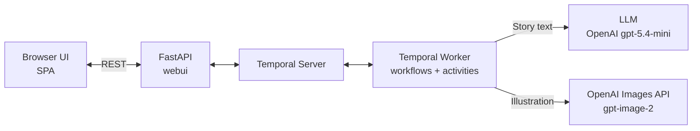

# alexandreroman/temporal-bedtime-agent

- **分类**：二、网文 / 长篇 AI 写作系统 库
- **链接**：https://github.com/alexandreroman/temporal-bedtime-agent
- **Stars**：1
- **语言**：Python
- **License**：Apache-2.0
- **Topics**：agent, ai, demo, durable-execution, temporal
- **GitHub 描述**：Interactive bedtime story generator with AI-powered narratives and illustrations, powered by Temporal with durable execution
- **本地描述**：Interactive bedtime story generator with AI-powered narratives and illustrations, powered by Temporal with durable execution
- **拉取时间**：2026-07-23 22:42:44

---

# Temporal Bedtime Agent

An interactive bedtime story creation agent powered by [Temporal](https://temporal.io/) durable execution and large language models ([OpenAI](https://openai.com/) or [Anthropic](https://www.anthropic.com/)).

The agent guides you through a conversation to collaboratively create a personalized bedtime story, complete with AI-generated illustrations.


## Features

- Conversational story creation (character, theme, special elements)
- AI-generated bedtime stories (3 paragraphs)
- Automatic illustration generation from story descriptions
- Durable execution via Temporal (workflows survive failures and restarts)
- Multi-language support (the agent detects the user's language)

## Architecture



- **Web UI (webui)** — FastAPI backend that serves the single-page app and exposes a REST API. It receives user messages and forwards them to Temporal as signals.
- **Temporal Server** — Orchestrates the story creation workflow with durable execution. It guarantees that workflows survive failures and restarts, and coordinates communication between the web UI and the worker.
- **Worker** — Executes the workflows and activities. It drives the conversational flow, calls the configured LLM to generate story text, and calls OpenAI to generate illustrations.

### Pure agent vs. durable execution

The conversational agent is a **pure [Pydantic AI](https://ai.pydantic.dev/) agent that knows nothing about Temporal**. Durability is layered on top without changing a single line of the agent:

- **`agent/`** — the pure agent, with no Temporal dependency: the Pydantic AI `Agent` (`story_agent`), its structured-output schema (`StoryResponse`), the system prompt, and a `Conversation` object that drives the multi-turn flow (per-turn hints, history rebuilding). It runs standalone — see [Run the pure agent](#run-the-pure-agent-standalone).
- **`worker/durable_agent.py`** — the durability layer: it wraps the pure agent in a Pydantic AI [`TemporalAgent`](https://ai.pydantic.dev/durable_execution/temporal/), turning each LLM call into a retryable Temporal activity. The original agent is untouched.
- **`worker/workflow_story_session.py`** — the workflow that orchestrates the conversation, reusing the *same* `Conversation` object as the standalone agent.

The dependency is strictly one-directional — `worker` depends on `agent`, never the reverse — which is what lets the very same agent run both as a plain CLI and as a durable workflow.

## Why Temporal?

Temporal brings [durable execution](https://temporal.io/how-temporal-works) to this project: the workflow state is automatically persisted, so the story creation process is resilient to failures without any custom recovery logic.

Here are a few scenarios where Temporal makes a difference:

- **Worker crashes mid-story** — The user is chatting with the agent and the worker process crashes (OOM, deployment, bug). Without Temporal, the entire conversation and story progress would be lost. With Temporal, the workflow state is preserved: when the worker restarts, the conversation resumes exactly where it left off.
- **LLM API timeout** — A call to Claude or OpenAI times out or returns a transient error. Temporal automatically retries the failed activity with configurable backoff, without duplicating work that already succeeded (e.g., the story text is not regenerated if only the illustration call failed).
- **Long-running interaction** — A user starts a story, closes the browser, and comes back hours later. The workflow keeps waiting for the next user message; there is no session timeout to manage and no state to serialize to a database.
- **Multiple workers** — In production, several worker instances can run in parallel. Temporal dispatches activities across workers and guarantees exactly-once execution, making the system horizontally scalable with no extra coordination code.

## Prerequisites

- **Python 3.11+**
- **[uv](https://docs.astral.sh/uv/)** — fast Python package manager
- **Temporal Server** running locally (see below)
- **OpenAI API key** — for story generation (gpt-5.4-mini) and illustration generation
- **Anthropic API key** — only if using an Anthropic model for story generation

## Getting Started

### 1. Configure Environment Variables

```bash
cp .env-sample .env
```

Edit `.env` and fill in your API keys:

| Variable              | Description                                                                                                                       | Default               |
|-----------------------|-----------------------------------------------------------------------------------------------------------------------------------|-----------------------|
| `OPENAI_API_KEY`      | OpenAI API key for LLM and image generation (required)                                                                            | —                     |
| `ANTHROPIC_API_KEY`   | Anthropic API key (required only if using an Anthropic model)                                                                     | —                     |
| `PYDANTIC_AI_MODEL`   | LLM model identifier. Examples: `openai:gpt-5.4-mini` (OpenAI GPT Mini), `anthropic:claude-sonnet-4-6` (Claude Sonnet)            | `openai:gpt-5.4-mini` |
| `OPENAI_IMAGE_MODEL`  | OpenAI image generation model (see [note below](#image-model-and-organization-verification))                                      | `gpt-image-2`         |
| `TEMPORAL_ADDRESS`    | Temporal server address                                                                                                           | `localhost:7233`      |
| `TEMPORAL_TASK_QUEUE` | Temporal task queue name                                                                                                          | `bedtime-story`       |
| `WEBUI_HOST`          | Web UI bind address                                                                                                               | `0.0.0.0`             |
| `WEBUI_PORT`          | Web UI port                                                                                                                       | `8000`                |

#### Image model and organization verification

The default image model `gpt-image-2` (ChatGPT Images 2.0) **requires a verified OpenAI organization**. If your organization is not verified, illustration generation will fail with:

> Your organization must be verified to use the model `gpt-image-2`.

You have two options:

1. **Verify your organization** on [platform.openai.com/settings/organization/general](https://platform.openai.com/settings/organization/general). Access propagates within ~15 minutes.
2. **Use `gpt-image-1.5` instead**, which works without verification. Set this in your `.env`:

   ```env
   OPENAI_IMAGE_MODEL=gpt-image-1.5
   ```

### 2. Run with Docker Compose

```bash
docker compose up --build
```

This starts the Temporal server, the worker, and the web UI. Open [http://localhost:8000](http://localhost:8000) to start creating a story, and [http://localhost:8233](http://localhost:8233) for the Temporal dashboard.

> **After changing `.env`**, recreate the worker containers so they pick up the new values.
> For example, to switch the LLM provider from Anthropic to OpenAI, edit `.env`:
>
> ```env
> PYDANTIC_AI_MODEL=openai:gpt-5.4-mini
> ```
>
> Then recreate the worker:
>
> ```bash
> docker compose up --build -d worker
> ```
>
> Docker Compose only reads `.env` at container creation time, so a simple `docker compose restart` is **not** enough — you need to recreate the containers.

### 3. Run without Docker

#### Install Dependencies

```bash
uv sync
```

#### Run the Application

Start each command in a separate terminal:

```bash
# Terminal 1 — Temporal Server
temporal server start-dev

# Terminal 2 — Temporal Worker
uv run worker

# Terminal 3 — Web UI
uv run webui
```

Then open [http://localhost:8000](http://localhost:8000) in your browser and start creating a bedtime story!

> You need the [Temporal CLI](https://docs.temporal.io/cli) to run `temporal server start-dev`.

### Run the pure agent (standalone)

The agent in `agent/` is a plain Pydantic AI agent with **no Temporal dependency**, so you can run it as a standalone command-line chat — no Temporal server, no worker, no web UI:

```bash
uv run agent
```

This drives the exact same `Conversation` and `story_agent` the durable workflow uses; only the execution model differs (in-process here, durable activities under Temporal). It needs only an LLM API key (`OPENAI_API_KEY`, or `ANTHROPIC_API_KEY` with an Anthropic model). Note that it is **not** durable: if the process stops, the conversation is lost — which is precisely the resilience Temporal adds in the full app.

## Development

### Dev Workflow

The recommended way to develop is to run each component separately so you get hot-reload and direct log output.

```bash
# 1. Install dependencies (including dev extras)
uv sync

# 2. Start the Temporal dev server (requires the Temporal CLI)
temporal server start-dev

# 3. Start the worker (auto-reloads on file changes via watchfiles)
uv run worker

# 4. Start the web UI (auto-reloads on file changes via uvicorn)
uv run webui
```

Each command runs in its own terminal. The worker watches the `agent/`, `worker/`, and `webui/` directories; any saved change restarts it automatically. The web UI reloads on changes to `webui/` and `static/`.

Open [http://localhost:8000](http://localhost:8000) for the app and [http://localhost:8233](http://localhost:8233) for the Temporal dashboard.

### Debugging

#### Temporal Dashboard

The Temporal dev server exposes a web dashboard at [http://localhost:8233](http://localhost:8233) where you can:

- List and inspect running/completed workflows
- View workflow execution history (events, signals, queries)
- Send signals or queries to a running workflow manually

#### Logs

Both the worker and the web UI use `structlog` with JSON output. Filter logs by component:

```bash
# Worker logs include events like "Connecting to Temporal", "Worker started"
uv run worker 2>&1 | jq .

# Web UI logs include events like "Creating session", "Message sent"
uv run webui 2>&1 | jq .
```

#### Common Issues

| Symptom                                                             | Cause                                        | Fix                                                                                                                                      |
|---------------------------------------------------------------------|----------------------------------------------|---------------------------------------------------------------------------------------------------------------------------------------related:
  - methods/网文写作最强SOP.md
  - methods/最强写作方法论_全球最强综合版.md
related:
  - methods/网文写作最强SOP.md
  - methods/最强写作方法论_全球最强综合版.md
---|
| `Connection refused` on port 7233                                   | Temporal server not running                  | Start it with `temporal server start-dev`                                                                                                |
| Worker starts but no workflows execute                              | Task queue mismatch                          | Check `TEMPORAL_TASK_QUEUE` matches in `.env`                                                                                            |
| `ANTHROPIC_API_KEY` / `OPENAI_API_KEY` errors                       | Missing or invalid API keys                  | Verify keys in `.env`                                                                                                                    |
| Illustration not generated                                          | OpenAI API key missing or model unavailable  | Check `OPENAI_API_KEY` and `OPENAI_IMAGE_MODEL` in `.env`                                                                                |
| `Your organization must be verified to use the model 'gpt-image-2'` | Default model requires a verified OpenAI org | Either [verify your org](https://platform.openai.com/settings/organization/general), or set `OPENAI_IMAGE_MODEL=gpt-image-1.5` in `.env` |

## Project Structure

```
├── agent/                # Pure Pydantic AI agent — NO Temporal dependency
│   ├── __init__.py       #   StoryResponse schema + story_agent
│   ├── prompt.py         #   System prompt
│   ├── conversation.py   #   Conversation: multi-turn flow (turns, hints, history)
│   ├── config.py         #   LLM model selection (PYDANTIC_AI_MODEL)
│   └── __main__.py        #   Standalone CLI: `uv run agent`
├── worker/               # Temporal worker (durability layer)
│   ├── durable_agent.py  #   Wraps story_agent in a TemporalAgent
│   ├── workflow_story_session.py   # Conversation workflow
│   ├── workflow_illustration_generation.py
│   ├── activities.py     #   Illustration generation (OpenAI Images)
│   └── ...
├── webui/                # FastAPI REST API serving the frontend
├── static/               # Single-page app (HTML, JS, CSS)
├── pyproject.toml        # Project metadata and dependencies
└── .env-sample           # Environment variable template
```

## License

[Apache License 2.0](https://github.com/alexandreroman/temporal-bedtime-agent/blob/main/LICENSE)
