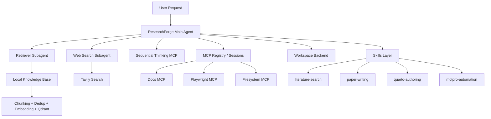
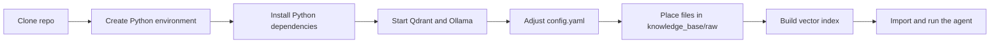

# ckz1/ResearchForge

- **分类**：二、网文 / 长篇 AI 写作系统 库
- **链接**：https://github.com/ckz1/researchforge
- **Stars**：0
- **语言**：Python
- **License**：MIT
- **Topics**：agent, agentic-ai, mcp, rag, skills
- **GitHub 描述**：A modular AI research agent scaffold for retrieval, tool use, scientific writing, and workflow-driven automation.
- **本地描述**：A modular AI research agent scaffold for retrieval, tool use, scientific writing, and workflow-driven automation.
- **拉取时间**：2026-07-23 22:44:12

---

<div align="center">

# ResearchForge

**A modular AI research agent scaffold for retrieval, tool use, scientific writing, and workflow-driven automation.**

<p>
  
  
  
  
  
  
  
  
</p>

<p>
  ResearchForge is designed for people who need more than a chatbot: local knowledge retrieval, web-aware answers,
  MCP-powered tools, reusable task skills, and an execution-ready workspace for technical and scientific work.
</p>

</div>

---

## Why ResearchForge

Most agent demos stop at “chat with tools.” Real research work does not.

A useful research assistant usually needs to:

- search a **local project knowledge base**,
- consult **up-to-date public sources**,
- plan multi-step tasks,
- call **external tools and MCP servers**,
- write structured outputs,
- and support domain workflows such as **paper drafting** or **computational chemistry automation**.

**ResearchForge** is a scaffold for exactly that kind of system.

---

## What makes it different

| | |
|---|---|
| **Multi-agent orchestration** | A main DeepAgents-based orchestrator delegates retrieval and web-search tasks to specialized subagents. |
| **Local RAG pipeline** | Documents are loaded, chunked, deduplicated, embedded with Ollama, and stored in Qdrant for semantic retrieval. |
| **MCP-native design** | External tools and resources can be exposed through MCP servers such as filesystem, Playwright, docs, and sequential thinking. |
| **Reusable skill layer** | Task-focused skills package instructions, references, and examples for recurring workflows. |
| **Research-first orientation** | The repository is clearly shaped around technical writing, literature workflows, project understanding, and scientific automation. |
| **Execution-friendly workspace** | The main agent is designed to operate inside a controlled local workspace backend rather than a pure prompt-only environment. |


---

## Core capabilities

### 1. Local knowledge retrieval
ResearchForge includes a retrieval pipeline that reads files from a local knowledge base, normalizes content, splits documents into chunks, computes embeddings, and stores vectors in Qdrant for similarity search.

### 2. Web-aware answering
A dedicated web-search subagent uses Tavily to retrieve time-sensitive or external public information, making the final answer less dependent on stale model knowledge.

### 3. MCP tool integration
The project includes MCP configuration, registry, session management, and tool-loading code for integrating external capabilities into the agent runtime.

### 4. Domain-specific skills
The `skills/` directory already contains reusable workflow instructions for:

- `literature-search`
- `paper-writing`
- `quarto-authoring`
- `molpro-automation`

### 5. Structured reasoning for complex tasks
The current agent build also wires in a Sequential Thinking MCP server, which is particularly useful for planning, decomposition, diagnosis, and iterative workflows.

---

## Architecture



---

## Install and run at a glance



---

## Repository layout

```text
researchforge_agent/
├── agent.py                 # main DeepAgents assembly and orchestration
├── runtime.py               # chat model factory
├── settings.py              # YAML-backed settings loader
├── config.yaml              # runtime configuration
│
├── memory/
│   └── AGENTS.md            # long-lived agent memory / behavioral guidance
│
├── retrieval/
│   ├── hashing.py           # stable IDs and content hashing
│   ├── indexer.py           # chunking, dedup, and sync-to-Qdrant logic
│   ├── loaders.py           # local KB file loading
│   ├── qdrant_ops.py        # Qdrant record operations
│   ├── retriever.py         # retrieval tool exposed to the agent
│   └── store.py             # embeddings and vector-store factory
│
├── mcp/
│   ├── config.yaml          # MCP server registry
│   ├── interceptors.py      # MCP interceptor hooks
│   ├── registry.py          # stateful/stateless client management
│   ├── sessions.py          # session lifecycle helpers
│   └── tools.py             # MCP tool loading utilities
│
├── tools/
│   ├── local_tools.py       # local helper tools
│   └── retriever.py
│
├── services/
│   └── README.md            # placeholder for future services
│
└── skills/
    ├── literature-search/
    ├── paper-writing/
    ├── quarto-authoring/
    └── molpro-automation/
```

---

## Current project status

This repository already contains **real core modules**, not just a concept note:

- DeepAgents-based main agent assembly
- explicit retrieval and web-search subagents
- Qdrant-backed local retrieval
- Ollama chat and embedding wiring
- MCP config, registry, and tool loading
- Sequential Thinking MCP integration in the current build path
- reusable research-oriented skills
- a Molpro-oriented automation skill with examples, references, and a helper script

At the same time, this snapshot should still be described honestly as an **early-stage but credible prototype**.

What is **not yet clearly packaged** in the uploaded snapshot:

- pinned dependency management such as `pyproject.toml` or `requirements.txt`
- a polished CLI entrypoint
- a production API service wrapper
- a dedicated frontend app in this repository snapshot
- full deployment automation

That makes ResearchForge a strong foundation for open-source release, while still leaving room for contributor-friendly engineering work.

---

## Getting started

The steps below are based on the **actual uploaded code structure** and should be treated as a practical bootstrap path.

### 1. Clone the repository

```bash
git clone <your-repo-url>
cd researchforge_agent
```

### 2. Create a virtual environment

```bash
python -m venv .venv
source .venv/bin/activate
```

On Windows PowerShell:

```powershell
python -m venv .venv
.\.venv\Scripts\Activate.ps1
```

### 3. Install dependencies

The repository snapshot does not include a locked dependency file, so start with the packages directly implied by the source tree:

```bash
pip install \
  deepagents \
  langchain \
  langgraph \
  langchain-core \
  langchain-ollama \
  langchain-qdrant \
  langchain-tavily \
  langchain-mcp-adapters \
  langchain-text-splitters \
  qdrant-client \
  pyyaml
```

You will also need:

- **Node.js / npx** for stdio-based MCP servers
- **Qdrant** for vector storage
- **Ollama** for embeddings and chat model serving

### 4. Review configuration

The project reads runtime settings from:

```text
researchforge_agent/config.yaml
```

Important areas include:

- Qdrant URL and collection name
- Ollama embedding and chat endpoints
- workspace, uploads, artifacts, and knowledge base paths
- chunk size, overlap, and retrieval top-k
- supported source file extensions

Example:

```yaml
qdrant:
  url: http://localhost:6333
  collection: kb_docs

ollama:
  embed_url: http://localhost:11434
  embed_model: qwen3-embedding:8b
  chat_url: https://ollama.com
  chat_model: gpt-oss:120b
```

### 5. Prepare the knowledge base

Place supported files into the configured raw knowledge base directory:

```text
knowledge_base/raw/
```

### 6. Build the local vector index

```python
from researchforge_agent.retrieval.indexer import sync_index

stats = sync_index()
print(stats)
```

### 7. Load the agent

The current source file initializes the agent at import time using `asyncio.run(build_agent())`, so the simplest bootstrap is:

```python
from researchforge_agent.agent import agent

print(agent)
```

### 8. Integrate it into your own interface

From there, you can connect the agent to:

- a terminal loop,
- a web API,
- a chat UI,
- or a larger orchestration service.

---

## Example use cases

- **Project-aware question answering** from local notes, documents, and code
- **Compare internal materials with current public documentation**
- **Draft paper sections** from user-provided materials
- **Build Quarto reports** with citations, figures, and structure guidance
- **Prototype scientific automation workflows**, including Molpro-related runs and iterative repair loops

---

## Skill highlights

### `literature-search`
A lightweight discovery skill for paper finding, title cleanup, citation lookup, and concise evidence-based summaries.

### `paper-writing`
A writing-oriented skill for abstracts, introductions, methods descriptions, and short academic correspondence.

### `quarto-authoring`
A richer documentation skill with structured references for citations, cross-references, figures, callouts, tables, and Quarto migration patterns.

### `molpro-automation`
A workflow-focused skill for preparing inputs, running Molpro, checking outcomes, and iteratively improving calculation runs. This is one of the most distinctive parts of the repository.

---

## MCP integration

The repository includes MCP configuration under:

```text
researchforge_agent/mcp/config.yaml
```

The uploaded snapshot references servers such as:

- `docs-langchain`
- `playwright`
- `filesystem`

And the current `agent.py` also wires in:

- `@modelcontextprotocol/server-sequential-thinking`

This makes ResearchForge a promising base for:

- browser automation,
- external docs lookup,
- filesystem actions,
- structured reasoning,
- and future MCP-native integrations.

---

## Acknowledgements

ResearchForge builds on the broader Python ecosystem around:

- LangChain
- DeepAgents
- LangGraph
- Qdrant
- Ollama
- Tavily
- Model Context Protocol (MCP)

related:
  - methods/网文写作最强SOP.md
  - methods/最强写作方法论_全球最强综合版.md
related:
  - methods/网文写作最强SOP.md
  - methods/最强写作方法论_全球最强综合版.md
---

## License

This project is released under the **MIT License**.
