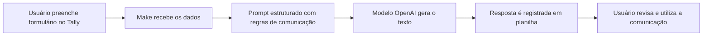

# Gbrito90/ai-corporate-writing-copilot

- **分类**：二、网文 / 长篇 AI 写作系统 库
- **链接**：https://github.com/gbrito90/ai-corporate-writing-copilot
- **Stars**：0
- **语言**：None
- **License**：NOASSERTION
- **Topics**：—
- **GitHub 描述**：—
- **本地描述**：Gbrito90/ai-corporate-writing-copilot
- **拉取时间**：2026-07-23 22:48:22

---

# Copiloto de Comunicação Interna com IA Generativa


## Visão geral

Este projeto apresenta um protótipo de **copiloto de comunicação interna com IA Generativa**, criado para apoiar equipes de RH, Comunicação Interna e lideranças na elaboração de textos corporativos de forma mais rápida, clara e padronizada.

A solução utiliza um formulário no **Tally** para coletar informações do usuário, uma automação no **Make** para processar os dados e um modelo de linguagem da **OpenAI** para gerar mensagens corporativas adequadas ao canal escolhido, como e-mail, Microsoft Teams, WhatsApp corporativo, aviso institucional ou resumo de reunião.

## Problema resolvido

Em empresas com alto volume de comunicação interna, áreas como RH, Comunicação e Liderança precisam criar mensagens com frequência, incluindo:

- e-mails internos;
- mensagens para WhatsApp corporativo;
- comunicados institucionais;
- avisos para colaboradores;
- resumos de reunião;
- mensagens para lideranças.

Essas tarefas são repetitivas, mas exigem clareza, tom profissional, adaptação ao público e alinhamento com a cultura da empresa. O principal gargalo identificado foi o **bloqueio da tela em branco**, ou seja, o tempo gasto para criar a primeira versão de uma mensagem.

## Solução proposta

O projeto propõe um assistente de IA capaz de transformar informações simples em uma primeira versão estruturada de comunicação corporativa. A partir dos dados preenchidos em um formulário, a automação envia o contexto para um modelo de linguagem, aplica regras de escrita e retorna um texto pronto para revisão humana.

A proposta não substitui o colaborador, mas atua como um apoio para acelerar a produção textual e reduzir retrabalho.

## Arquitetura da solução



## Fluxo de funcionamento

1. O usuário informa o tipo de comunicação que deseja criar.
2. O formulário coleta dados como público-alvo, canal, tom desejado, contexto e informações obrigatórias.
3. O Make recebe as respostas do formulário.
4. A automação monta um prompt estruturado.
5. A IA gera o texto corporativo.
6. O resultado é registrado para consulta e validação.
7. O usuário revisa o texto antes do envio final.

## Ferramentas utilizadas

| Ferramenta | Papel no projeto |
|---|related:
  - methods/网文写作最强SOP.md
  - methods/最强写作方法论_全球最强综合版.md
related:
  - methods/网文写作最强SOP.md
  - methods/最强写作方法论_全球最强综合版.md
---|
| Tally | Formulário de entrada das informações |
| Make | Automação do fluxo entre formulário, IA e registro |
| OpenAI | Geração dos textos corporativos |
| Google Sheets | Registro das respostas e resultados |
| Prompt Engineering | Definição das regras, tom e estrutura de saída |

## Tipos de comunicação suportados

- E-mail corporativo
- Mensagem para Microsoft Teams
- WhatsApp corporativo
- Aviso institucional
- Resumo de reunião
- Comunicado para colaboradores
- Mensagem de liderança

## Diferenciais do projeto

- Reduz o tempo de criação da primeira versão de textos corporativos.
- Padroniza tom, clareza e estrutura das mensagens.
- Usa prompt engineering para evitar informações inventadas.
- Mantém revisão humana antes do envio.
- Pode ser adaptado para diferentes áreas, canais e culturas organizacionais.

## Prompt Engineering

O prompt foi criado com regras para:

- escrever em português do Brasil;
- manter linguagem clara, profissional e colaborativa;
- adaptar a mensagem ao canal escolhido;
- evitar excesso de formalidade e jargões;
- não inventar dados, datas, nomes, políticas, benefícios ou decisões;
- gerar uma comunicação pronta para revisão.

O prompt completo está disponível em `[`prompts/prompt-copiloto-comunicacao.md`](prompts/prompt-copiloto-comunicacao.md)`.

## Demonstração e links do protótipo

- Formulário: https://tally.so/r/VLdQAy
- Cenário público no Make: https://us2.make.com/public/shared-scenario/eTDoIAszJx8/conecta
- Planilha de respostas: https://docs.google.com/spreadsheets/d/1V8l5KY126_qEnNw8UOEKAuP-iloGtUvIC4ARpl13Hv4/edit?usp=sharing

## Exemplos de entrada e saída

Os exemplos simulados estão em:

- `[`examples/exemplo-entrada.md`](examples/exemplo-entrada.md)`
- `[`examples/exemplo-saida.md`](examples/exemplo-saida.md)`

## Estrutura do repositório

```text
ai-corporate-writing-copilot/
│
├── README.md
├── prompts/
│   └── prompt-copiloto-comunicacao.md
├── docs/
│   ├── arquitetura.md
│   ├── parte-teorica.md
│   └── roteiro-video-pitch.md
├── examples/
│   ├── exemplo-entrada.md
│   └── exemplo-saida.md
├── automation/
│   └── make-scenario.md
├── .gitignore
└── LICENSE
```

## Aprendizados

Durante o desenvolvimento deste protótipo, foram aplicados conceitos de:

- IA Generativa;
- modelos de linguagem;
- prompt engineering;
- automação low-code;
- desenho de solução;
- documentação de produto;
- prototipação rápida;
- análise de problema e solução.

## Roadmap

- [ ] Criar interface web própria para o copiloto.
- [ ] Adicionar histórico de comunicações geradas.
- [ ] Permitir seleção de tom por perfil de público.
- [ ] Criar revisão automática de clareza e objetividade.
- [ ] Implementar aprovação humana antes do envio.
- [ ] Adicionar integração com e-mail, Slack ou Microsoft Teams.
- [ ] Criar métricas de uso e economia de tempo.

## Autor

Projeto desenvolvido por **Guilherme Brito** como estudo prático de IA Generativa, automação e criação de soluções aplicadas ao contexto corporativo.
