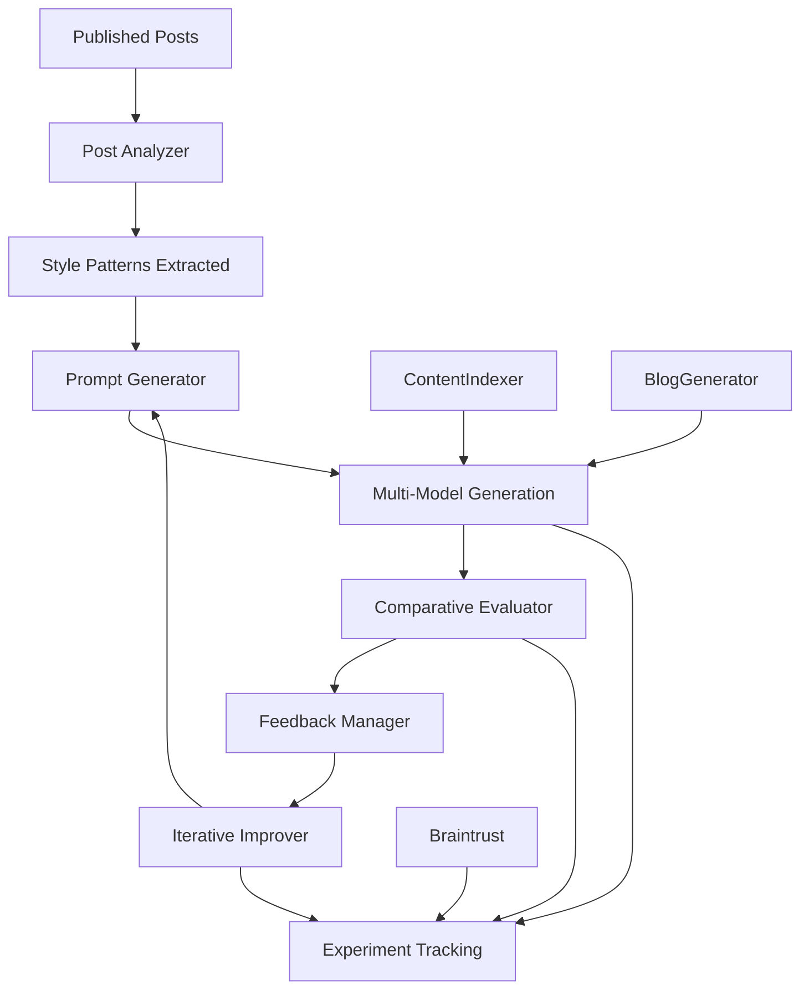

# ttunguz/evo_blog_public

- **分类**：二、网文 / 长篇 AI 写作系统 库
- **链接**：https://github.com/ttunguz/evo_blog_public
- **Stars**：5
- **语言**：Python
- **License**：None
- **Topics**：—
- **GitHub 描述**：AI-powered blog post generation system with iterative prompt optimization and multi-model evaluation. Configurable writing style system using Claude, GPT-4, and Gemini with LLM-as-judge scoring and automated setup.
- **本地描述**：AI-powered blog post generation system with iterative prompt optimization and multi-model evaluation. Configurable writing style system using Claude, GPT-4, and Gemini with LLM-as-judge scoring and automated setup.
- **拉取时间**：2026-07-23 22:51:22

related:
  - methods/网文写作最强SOP.md
  - methods/最强写作方法论_全球最强综合版.md
related:
  - methods/网文写作最强SOP.md
  - methods/最强写作方法论_全球最强综合版.md
---

# Evolutionary Blog Post Generator with Iterative Prompt Improvement

An AI-powered blog post generation system that uses multiple language models in parallel and iteratively improves prompts through programmatic evaluation against published content.

## Overview

This system generates high-quality blog posts by:
1. **Multi-model Generation**: Using Claude, GPT-4, and local models in parallel
2. **GEPA Optimization**: Genetic evolution of prompts and generation components (enabled by default)
3. **Braintrust Integration**: Tracking experiments and evaluating outputs
4. **Iterative Improvement**: Automatically refining prompts based on comparative analysis
5. **Style Analysis**: Learning from published posts to match writing patterns

## System Architecture



## Key Features

### 🧬 GEPA Optimization (Default)
- **Genetic Evolution**: Optimizes system prompts, style guides, and content structures using GEPA framework
- **Multi-Metric Evaluation**: Quality, originality, style consistency, and generation speed
- **Component-Level Tuning**: Evolves 3 core generation components through 10+ iterations
- **Async Integration**: Seamlessly integrated with existing generation pipeline
- **Graceful Fallback**: Automatically uses standard generation if GEPA library unavailable
- **Real Implementation**: Full BlogPostGEPAAdapter with training instances and reflection

### 🔄 Iterative Prompt Optimization
- Analyzes 20 recent published posts to extract writing patterns
- Generates improved prompt variations based on evaluation feedback
- Runs 20 iterations to find optimal prompt configuration
- Achieved **81.7% best score** in testing

### 📊 Comprehensive Evaluation
- **Structure Analysis**: Paragraph flow, hook effectiveness, conclusion impact
- **Content Quality**: Data integration, voice authenticity, topic relevance
- **Style Matching**: Sentence length, transitions, business focus
- **AP English Grading**: 0-100 scoring with detailed feedback

### 🤖 Multi-Model Generation
- **Claude Sonnet**: Primary generation model
- **GPT-4**: Alternative perspective generation
- **Local Models**: Cost-effective iterations via Ollama
- **Parallel Processing**: Faster generation cycles

### 📈 Braintrust Integration
- Experiment tracking and comparison
- Score normalization (0-1 scale)
- Detailed evaluation metrics
- Performance trend analysis

## Installation

### Prerequisites
- Python 3.13+
- uv package manager (recommended) or pip
- GEPA library (for optimization - automatically handled in setup)
- API keys for:
  - Anthropic Claude (required)
  - OpenAI GPT-4 (optional)
  - Google Gemini (optional)
  - Braintrust (optional for experiment tracking)

### Automated Setup (Recommended)

```bash
# 1. Clone the repository
git clone <repository-url>
cd evo_blog_public

# 2. Run automated setup
python setup_evo_blog.py

# 3. Follow the prompts to configure your API keys
# The script will:
# - Create virtual environment (.venv)
# - Install all dependencies
# - Set up configuration files
# - Test the installation
```

### Manual Setup

```bash
# 1. Clone the repository
git clone <repository-url>
cd evo_blog_public

# 2. Create virtual environment
uv venv --python=3.13 .venv
source .venv/bin/activate  # On Windows: .venv\Scripts\activate

# 3. Install dependencies
uv pip install -r requirements.txt

# 4. Configure environment variables
cp .env.example .env
# Edit .env with your API keys

# 5. Setup configuration files
cp config/model_configs.json.example config/model_configs.json
# Edit config/model_configs.json with your API keys (alternative to .env)

# 6. Test installation
python scripts/generate_blog_post.py "Test topic: AI in startups" --cycles 1 --no-gepa
```

### Environment Configuration

The system supports two methods for API key configuration:

#### Method 1: Environment Variables (.env file)
```bash
# Copy the example file
cp .env.example .env

# Edit .env with your keys:
ANTHROPIC_API_KEY=your_claude_api_key_here
OPENAI_API_KEY=your_openai_api_key_here  
GOOGLE_API_KEY=your_google_api_key_here
BRAINTRUST_API_KEY=your_braintrust_api_key_here
```

#### Method 2: Configuration File
```bash
# Copy the example config
cp config/model_configs.json.example config/model_configs.json

# Edit config/model_configs.json:
{
  "anthropic_api_key": "your_claude_api_key_here",
  "openai_api_key": "your_openai_api_key_here",
  "google_api_key": "your_google_api_key_here"
}
```

### Minimum Configuration

For basic functionality, you only need:
- **Anthropic Claude API key** (required for generation)
- Python 3.13+ with uv/pip

Optional components:
- OpenAI API key (for GPT-4 generation)
- Google API key (for Gemini generation and LLM-as-judge evaluation)
- Braintrust API key (for experiment tracking and advanced evaluation)

## Usage

### Basic Blog Generation
```bash
# With GEPA optimization (default)
python scripts/generate_blog_post.py "AI in Enterprise Software"

# With custom GEPA iterations
python scripts/generate_blog_post.py "AI in Enterprise Software" \
  --gepa-iterations 20

# Disable GEPA optimization (faster but lower quality)
python scripts/generate_blog_post.py "AI in Enterprise Software" \
  --no-gepa
```

### Iterative Prompt Improvement
```bash
# Run 20 iterations of prompt improvement
python scripts/iterative_improver.py

# Analyze results
ls iterative_improvements/run_*/summary_report.md
```

### Individual Components

#### Analyze Published Posts
```bash
python scripts/post_analyzer.py
```

#### Generate Improved Prompts
```bash
python scripts/prompt_generator.py \
  --feedback "Improve data integration depth" \
  --iteration 5
```

#### Evaluate Generated Content
```bash
python scripts/comparative_evaluator.py \
  --ai-post generated_post.md \
  --reference-post published_post.md
```

## Project Structure

```
evo_blog/
├── scripts/
│   ├── generate_blog_post.py         # Main blog generation (GEPA-enabled)
│   ├── gepa_adapter.py               # GEPA optimization adapter
│   ├── evaluator.py                  # AP grading evaluation
│   ├── models/                       # AI model clients
│   │   ├── claude_client.py
│   │   ├── openai_client.py
│   │   └── gemini_client.py
│   ├── braintrust_integration.py     # Experiment tracking
│   └── content_retriever.py          # Enhanced context
├── config/
│   ├── model_configs.json            # API keys and model settings
│   ├── global_settings.json          # GEPA and system settings
│   └── evaluation_weights.json       # Scoring criteria
├── generations/                      # Generated blog posts with GEPA stats
├── test_gepa_integration.py          # GEPA integration test
├── requirements.txt                  # Including gepa>=0.1.0
└── README.md
```

## Evaluation Metrics

### Overall Score Calculation
- **Structure Flow** (25%): Paragraph transitions and logical flow
- **Opening Hook** (20%): First paragraph engagement
- **Conclusion Impact** (15%): Final paragraph effectiveness
- **Data Integration** (20%): Use of statistics and examples
- **Voice Authenticity** (20%): Match to target writing style

### Performance Results
- **Initial Score**: 78.6%
- **Best Score**: 81.7% (Iteration 13)
- **Final Score**: 75.5%
- **Total Iterations**: 20

## Key Insights

### What Works Well
1. **Structural adherence** - AI consistently matches paragraph patterns
2. **Data integration** - Effective use of statistics and company examples
3. **Business focus** - Maintains analytical tone and practical insights
4. **Length control** - Stays within 500-600 word target

### Areas for Improvement
1. **Voice authenticity** - Slightly more formulaic than human writing
2. **Transition smoothness** - Could improve flow between concepts
3. **Industry context** - Needs deeper domain knowledge integration
4. **Nuanced analysis** - Could benefit from more sophisticated reasoning

## Configuration

### Model Settings
```json
{
  "claude-3-5-sonnet-latest": {
    "temperature": 0.7,
    "max_tokens": 2000,
    "system_prompt": "optimized_prompt_v13.txt"
  }
}
```

### Evaluation Criteria
```json
{
  "structure_flow": {
    "weight": 0.25,
    "description": "Logical flow and paragraph transitions"
  },
  "voice_authenticity": {
    "weight": 0.20,
    "description": "Match to target writing style"
  }
}
```

## Contributing

1. Fork the repository
2. Create a feature branch
3. Add tests for new functionality
4. Submit a pull request

## License

MIT License - see LICENSE file for details

## Acknowledgments

- Contributors and the open source community
- Braintrust for evaluation infrastructure
- Anthropic Claude for content generation
