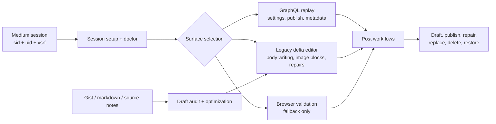
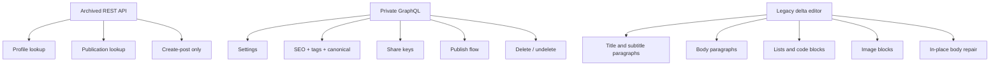

# minanagehsalalma/medium-editor-mcp

- **分类**：二、网文 / 长篇 AI 写作系统 库
- **链接**：https://github.com/minanagehsalalma/medium-editor-mcp
- **Stars**：0
- **语言**：TypeScript
- **License**：MIT
- **Topics**：automation, editor, gist, graphql, mcp, medium, playwright, reverse-engineering, typescript
- **GitHub 描述**：Research-first MCP for Medium editor discovery, GraphQL replay, legacy delta writing, post repair, and gist-to-draft workflows
- **本地描述**：Research-first MCP for Medium editor discovery, GraphQL replay, legacy delta writing, post repair, and gist-to-draft workflows
- **拉取时间**：2026-07-23 22:55:55

---

# Medium Editor MCP

<p align="center">
  
</p>

<p align="center">
  Research-first MCP for Medium's real editor surfaces: GraphQL discovery, legacy delta writing, session diagnostics, post repair, and gist-to-draft workflows.
</p>

<p align="center">
  <a href="https://github.com/minanagehsalalma/medium-editor-mcp/actions/workflows/ci.yml"></a>
  
  
  
  
  
</p>

<p align="center">
  <a href="#why-this-repo-exists">Why</a>
  ·
  <a href="#quickstart">Quickstart</a>
  ·
  <a href="#install-in-clients">Install</a>
  ·
  <a href="#architecture">Architecture</a>
  ·
  <a href="#tooling-map">Tooling Map</a>
  ·
  <a href="docs/medium-editor-research.md">Research Notes</a>
  ·
  <a href="docs/content-workflows.md">Content Workflows</a>
</p>

## Why This Repo Exists

Most Medium automation repos die in one of two dumb ways:

- they pretend the archived public API still covers the editor
- they fall back to fragile browser scripting for everything

This repo takes the harder but correct route:

- map the live GraphQL surfaces Medium still uses
- write article bodies through the legacy delta editor that still powers drafts
- verify session and transport health before pretending a mutation failed for business logic reasons
- turn that research into reusable MCP tools instead of one-off scripts

That makes it useful for both research and production draft workflows.

## What You Can Actually Do

- create and repair real Medium drafts without routing everything through the browser DOM
- discover and replay live GraphQL operations with a cookie-backed session
- write titles, subtitles, links, lists, code blocks, images, and body content through the verified editor path
- audit and optimize draft packaging before publishing
- clone, replace, repair, delete, and restore Medium posts with explicit tooling
- import GitHub gists and GitHub repositories and turn them into cleaner Medium drafts

## Quickstart

```bash
npm install
npm run build
npm test -- --runInBand
```

Create a `.env` from the template:

```bash
copy .env.example .env
```

Then bootstrap a Medium session with one of the supported cookie formats:

- browser-exported JSON array
- wrapped JSON with a `cookies` array
- raw `Cookie:` header
- Netscape cookie file

Recommended first-run tool order:

1. `setup-medium-session`
2. `doctor-medium-mcp`
3. `test-medium-write-path`

## Install In Clients

The whole point of the repo is that it can be mounted into an MCP client cleanly, not just studied as code.

Start here:

- [Install in Codex and other MCP clients](https://github.com/minanagehsalalma/medium-editor-mcp/blob/main/docs/installing-in-clients.md)

Included examples:

- [`examples/clients/codex.config.toml`](examples/clients/codex.config.toml)
- [`examples/clients/vscode.mcp.json`](examples/clients/vscode.mcp.json)
- [`examples/clients/cursor.mcp.json`](examples/clients/cursor.mcp.json)

## Architecture



## Tooling Map

| Layer | What it covers | Main tools |
| --- | --- | related:
  - methods/网文写作最强SOP.md
  - methods/最强写作方法论_全球最强综合版.md
related:
  - methods/网文写作最强SOP.md
  - methods/最强写作方法论_全球最强综合版.md
--- |
| Session | Cookie parsing, redaction, diagnostics, transport health | `setup-medium-session`, `inspect-medium-session-config`, `doctor-medium-mcp`, `probe-medium-session` |
| GraphQL | Discovery, replay, operation capture, live metadata/publish workflows | `discover-medium-graphql`, `capture-medium-graphql-operations`, `medium-graphql-request`, `run-medium-graphql-operation` |
| Legacy editor | Real body writing and delta-based post repair | `create-medium-legacy-draft`, `apply-medium-legacy-deltas`, `write-medium-rich-draft`, `create-medium-rich-draft` |
| Content pipeline | Gist import, GitHub repo import, draft audit, package optimization, article restructuring | `import-gist`, `prepare-gist-draft`, `import-github-repo`, `prepare-github-repo-draft`, `audit-medium-draft`, `optimize-medium-draft-package`, `optimize-medium-article-draft` |
| Post operations | Inspection, visibility fixes, share keys, clone/replace, delete/restore | `inspect-medium-post-state`, `optimize-medium-post`, `optimize-medium-visibility`, `create-medium-share-key`, `delete-medium-post`, `undelete-medium-post` |

## Research-Backed Surfaces



## Fast Proof

### 1. Session and health

You do not have to guess whether the environment is broken.

- `inspect-medium-session-config` shows the active cookie source with redacted values
- `doctor-medium-mcp` checks session load, probe, transport, registry, and workflow coverage
- `test-medium-write-path` creates a disposable draft and verifies the body round-trip

### 2. Article body writing

The writer path is not cosmetic. It handles real Medium-specific formatting decisions:

- title and subtitle go into the correct Medium paragraph types
- inline links stay clickable
- gist images can be pulled into the body when fetchable
- simple markdown tables are converted into Medium-safe readable blocks
- local images can be uploaded as actual Medium image paragraphs

### 3. Post repair

The post workflow layer came out of fixing real broken posts, not toy examples:

- imported-date lock handling
- metadata drift repair
- stale subtitle repair
- cloned replacement posts
- visibility fixes
- delete and restore

## Example Workflow

```text
gist or repo -> normalize source -> audit draft -> optimize package -> write legacy body
     -> apply GraphQL metadata -> verify public state -> publish or repair
```

That split is the whole point: use the right Medium surface for the right job.

## Repository Layout

```text
src/
  medium-session*.ts         cookie parsing, setup, doctor, diagnostics
  medium-graphql*.ts         GraphQL replay and discovery
  medium-legacy-editor.ts    delta editor and upload paths
  medium-rich-draft.ts       markdown -> Medium paragraph writer
  medium-post-workflows.ts   post inspection, repair, clone, replace, delete
  gist.ts                    gist import and Medium-oriented draft prep
  github-repo.ts             GitHub repository import and Medium-oriented draft prep
  medium-*-optimizer.ts      package and article optimization

docs/
  medium-editor-research.md  observed editor behavior and boundaries
  content-workflows.md       draft and publishing workflows
  repo-scope.md              scope guardrails
```

## Public Guardrails

This repo is intentionally strict about what it does **not** claim:

- it does not pretend the archived Medium REST API gives full editor parity
- it does not invent private mutation contracts without evidence
- it does not treat browser automation as the main architecture when direct surfaces exist
- it does not hide the fact that Cloudflare, session expiry, or account state can still block a flow

## Documentation

- [docs/medium-editor-research.md](https://github.com/minanagehsalalma/medium-editor-mcp/blob/main/docs/medium-editor-research.md)
- [docs/content-workflows.md](https://github.com/minanagehsalalma/medium-editor-mcp/blob/main/docs/content-workflows.md)
- [docs/installing-in-clients.md](https://github.com/minanagehsalalma/medium-editor-mcp/blob/main/docs/installing-in-clients.md)
- [docs/repo-scope.md](https://github.com/minanagehsalalma/medium-editor-mcp/blob/main/docs/repo-scope.md)
- [docs/CHANGELOG.md](https://github.com/minanagehsalalma/medium-editor-mcp/blob/main/docs/CHANGELOG.md)
- [.github/CONTRIBUTING.md](https://github.com/minanagehsalalma/medium-editor-mcp/blob/main/.github/CONTRIBUTING.md)
- [.github/SECURITY.md](https://github.com/minanagehsalalma/medium-editor-mcp/blob/main/.github/SECURITY.md)

## Sources

- Medium archived API docs: https://github.com/Medium/medium-api-docs
- GitHub Gist REST docs: https://docs.github.com/en/rest/gists/gists
