# coroboros/agent-skills

- **分类**：二、网文 / 长篇 AI 写作系统 库
- **链接**：https://github.com/coroboros/agent-skills
- **Stars**：2
- **语言**：Python
- **License**：MIT
- **Topics**：agent-skills, ai-agents, anthropic, automation, claude, claude-code, plugin, skills
- **GitHub 描述**：AI agent skills for Claude Code and compatible agents — workflow, coding, design, Claude Code meta, media, productivity, and writing
- **本地描述**：AI agent skills for Claude Code and compatible agents — workflow, coding, design, Claude Code meta, media, productivity, and writing
- **拉取时间**：2026-07-23 22:57:45

---

<div align="center">


<!-- omit in toc -->
# Agent Skills

**AI agent skills for Claude Code and compatible agents**

Tested per skill, scanned by Cisco's `skill-scanner`.

[](https://github.com/coroboros/agent-skills/releases)
[](https://github.com/coroboros/agent-skills/actions/workflows/ci.yml)
[](https://github.com/coroboros/agent-skills/actions/workflows/scan-skills.yml)
[](https://github.com/coroboros/agent-skills)
[](https://opensource.org/licenses/MIT)
[](https://github.com/coroboros/agent-skills)
[](https://coroboros.com)

</div>

- [Install](#install)
- [Requirements](#requirements)
- [Skills](#skills)
  - [Workflow Skills](#workflow-skills)
  - [Coding Skills](#coding-skills)
  - [Design Skills](#design-skills)
  - [Claude Code Skills](#claude-code-skills)
  - [Media Skills](#media-skills)
  - [Productivity Skills](#productivity-skills)
  - [Writing Skills](#writing-skills)
  - [Companion Skills](#companion-skills)
- [Pipeline](#pipeline)
- [Testing](#testing)
- [Security](#security)
- [Standards](#standards)
- [License](#license)

---

## Install

Install via [skills.sh](https://skills.sh):

```bash
# All skills
npx skills add coroboros/agent-skills

# Individual skill
npx skills add coroboros/agent-skills --skill <name>
```

---

## Requirements

- `bash`
- `python3` (3.10+, stdlib only — no `pip install` needed)
- A filesystem

Some skills wrap external CLIs — each is declared in its SKILL.md.

---

## Skills

Skills are grouped by plugin. Each plugin collects related skills — expand any section below to see usage, flags, and behavior. Companion skills live in their tool's repo and install from it — see [Companion Skills](#companion-skills).

| Plugin | Skill | Description |
|--------|-------|-------------|
| Workflow | [forge](#forge) | Research, weigh approaches, decide — emit one apex-ready plan |
| Workflow | [apex](#apex) | Structured implementation — Analyze, Plan, Execute, eXamine |
| Workflow | [ultrapex](#ultrapex) | Judgment-first APEX for Fable-class models — invariants, parallel subagents, adversarial verification |
| Workflow | [oneshot](#oneshot) | Single-pass Explore-Code-Test for small, well-scoped tasks |
| Coding | [scaffold](#scaffold) | Bootstrap Next.js/Astro projects on Cloudflare Workers |
| Coding | [code-ultrareview](#code-ultrareview) | Eight-axis judgment review at full strength, in-session — fresh eyes before commit |
| Design | [award-design](#award-design) | Frontend design engineer for award-winning sites — forces a visual universe, builds it, audits any site |
| Design | [design-system](#design-system) | Govern an existing DESIGN.md — token enforcement plus a CLI lifecycle |
| Claude Code | [claude-md](#claude-md) | Create and optimize CLAUDE.md and .claude/rules/ |
| Claude Code | [agent-creator](#agent-creator) | Expert guidance for creating Claude Code subagents |
| Media | [video-loop](#video-loop) | Loop background videos with invisible cut points |
| Media | [audio-loop](#audio-loop) | Gapless web-ready ambient audio loops (FLAC + Web Audio) |
| Media | [suno-produce](#suno-produce) | Turn a music brief into Suno v5.5 prompt artifacts |
| Media | [markitdown](#markitdown) | Convert PDF/Office/HTML/audio/YouTube to Markdown via Microsoft's CLI |
| Media | [download-media](#download-media) | Download video, audio, playlists, clips, subtitles from ~1800 sites via `yt-dlp` |
| Productivity | [notion](#notion) | Notion via the official MCP connector, or the `ntn` CLI for uploads and CI |
| Writing | [brand-voice](#brand-voice) | Govern BRAND-VOICE.md — extract, update, validate; feeds `humanize-en -f` |
| Writing | [write-clear-readme](#write-clear-readme) | Author, audit, or polish READMEs — clarity, structure, concision |
| Writing | [humanize-en](#humanize-en) | Strip AI tells from English prose — brand-aware via `-f BRAND-VOICE.md` |
| Companion | [scrybe](#companion-skills) | Offline Whisper speech-to-text — transcripts, subtitles, translation |
| Companion | [skillward](#companion-skills) | Vet an untrusted skill, plugin, or MCP server before install — offline scanner ensemble, one verdict |
| Companion | [shellscan](#companion-skills) | Find and lint every shell in a project — `.sh`, shebangs, GitLab CI YAML |
| Companion | [karate](#companion-skills) | Write, run, and triage Karate API and integration tests |

Skills inherit the session model — no `model:` pins, so a stronger session is never downgraded by a skill. Scope is two-tier per the [Agent Skills spec](https://agentskills.io): portable skills omit the `compatibility` field entirely; Claude Code-optimized skills declare it and degrade gracefully on any open-standard agent (see [Standards](#standards)).

---

### Workflow Skills

Strategic thinking, planning, and implementation — `forge`, `apex`, `ultrapex`, `oneshot`.

<details>
<summary><em>forge · apex · ultrapex · oneshot</em></summary>

<br>

#### forge

Pre-implementation thinking — research the problem space, weigh approaches with devil's-advocate rigor, decide what's reversible while surfacing the load-bearing forks for the user, and emit one apex-ready plan. The "think" half; `apex` is the "build" half.

**Usage**

```bash
# Exploratory question — default emits a Decision and pauses for decompose
/forge should we use Neon or Supabase for our serverless Postgres?

# Build verb in the idea — promotes to a Spec with workstreams
/forge -s add user authentication with OAuth and email/password

# Auto mode + create GitHub issues
/forge -s -a -i migrate from REST to GraphQL
```

**Flags**

| Flag | Description |
|------|-------------|
| `-s` / `-S` | Save artifact to `~/.agents/output/{project}/forge/forge-{slug}.md` / force no-save |
| `-i` / `-I` | Create GitHub issues from workstreams (implies `-s`) / disable |
| `-a` / `-A` | Auto mode — skip Q&A, decide reasonable forks, no revision pause / disable |
| `-e` / `-E` | Economy mode — no subagents (Hunt research floor and Judge's adversarial panel) / disable |
| `-f` | Load prior context (forge plan, RFC, GitHub issue `#N` or URL) |

Uppercase forms disable the ambient default when the skill runs with a pre-set mode. Requires `gh` authenticated when using `-i` or passing a GitHub URL/`#N` to `-f`.

**What it does**

1. **Hunt** — frames and reframes the real problem, then researches wide via parallel subagents above a hard floor: ≥1 codebase + ≥1 external agent every run, `-e` the only escape. Triangulates sources rather than picking one, and auto-launches a second research round when the premortem surfaces an unresearched failure mode. On-demand references for breadth (`research-discipline.md`), the 5-question clarify playbook (`clarify-playbook.md`), and subagent prompt skeletons (`subagent-prompts.md`).
2. **Judge** — diverges ≥3 structurally distinct approaches, stress-tests with premortem + steelman, then runs an **adversarial panel** (3-5 lensed clean-context critics in parallel) and a bounded **convergence** round on the survivors — the same conversation cannot reliably argue against the plan it just shipped (`adversarial-panel.md`).
3. **Decide** — three tiers: **decide** the reversible and conventional calls, **surface** the structurally load-bearing forks for the user (named with the pick, the runner-up, and what would flip it), **escalate** the few forks the user genuinely owns.
4. **Forge** — chooses the artifact shape, walks a pre-save audit, saves, validates (when there are workstreams), pauses for revision under non-auto, then routes.

**Routing.** Default = `# Decision:` (terminal — present and ask the user whether to decompose into workstreams, then wait). Promotes to `# Spec:` (with 3-7 workstreams + `/apex` bridge) when `-a` is set, when `-i` forces issue creation, when `-f` points at a prior Spec, when the idea carries an unambiguous build verb (`build`, `add`, `implement`, `migrate`, `refactor`, `create`, …), when it carries an explicit decomposition signal (`plan`, `break down`, `spec out`, `workstreams`, `issues`, `roadmap`), or when the Decision IS the build plan.

**Sources**

- [anthropics/knowledge-work-plugins — product-brainstorming](https://github.com/anthropics/knowledge-work-plugins/tree/main/product-management/skills/product-brainstorming) — divergent/convergent ideation modes and frameworks
- [anthropics/knowledge-work-plugins — write-spec](https://github.com/anthropics/knowledge-work-plugins/tree/main/product-management/skills/write-spec) — PRD structure, acceptance-criteria craft, ruthless prioritization
- [Melvynx/aiblueprint — ultrathink](https://github.com/Melvynx/aiblueprint) — craftsman simplification discipline
- [mattpocock/skills — grill-me](https://github.com/mattpocock/skills/tree/main/skills/productivity/grill-me) — decision-tree interview behind the opt-in deep grill
- [mattpocock/skills — to-issues](https://github.com/mattpocock/skills/tree/main/skills/engineering/to-issues) — vertical-slice decomposition and HITL/AFK tagging

---

#### apex

Systematic implementation using the APEX methodology — Analyze, Plan, Execute, eXamine — with parallel subagents and self-validation.

**Usage**

```bash
# Autonomous + save outputs
/apex -a -s implement user registration

# From a GitHub issue
/apex -f "#42" implement what issue 42 describes

# From a prior forge plan
/apex -f ~/.agents/output/{project}/forge/forge-{slug}.md implement WS-1

# Resume a previous task
/apex -r 01-auth-middleware
```

**Flags**

| Flag | Description |
|------|-------------|
| `-a` / `-A` | Autonomous mode — skip confirmations / disable |
| `-s` / `-S` | Save outputs to `~/.agents/output/{project}/apex/{task-id}/` / force no-save |
| `-e` / `-E` | Economy mode — no subagents / disable |
| `-b` / `-B` | Branch mode — verify not on main, create branch if needed / disable |
| `-g` / `-G` | Wire `/goal` to loop step-04 until AC verified (auto-on under `claude -p`; requires Claude Code v2.1.139+) / disable |
| `-f` | Load prior context (GitHub issue `#N`, forge plan, RFC) |
| `-r` | Resume a previous task by ID |
| `-i` | Interactive flag configuration |

Uppercase forms disable the ambient default when the skill runs with a pre-set mode.

**What it does**

- **Analyze** — launches 1–10 parallel subagents based on task complexity. Infers acceptance criteria in Given/When/Then form with explicit `## Not Included` negative scope. When `-f` points to a spec (H1 `# Spec:` + `## Workstreams`), accepts the spec's AC verbatim (closure rule) instead of re-inferring.
- **Plan** — file-by-file implementation strategy with AC mapping. Inline Challenge mini-phase (premortem + alternative consideration) stress-tests the plan. Surgical-scope advisory fires when the plan touches >5 files, >2 systems, or introduces cross-cutting concerns — advisory only, never blocks.
- **Execute** — todo-driven implementation with progressive step loading.
- **eXamine** — derivation lens (code↔plan reconciliation, classifying each divergence as GAP / SCOPE-ADD / DECISION-OVERRIDE / CONSISTENT) runs before typecheck/lint/tests. GAP blocks completion; SCOPE-ADD advisory unless declared in negative scope; DECISION-OVERRIDE surfaces for user judgment. Optional `/goal` integration via `-g` loops the session until AC verified — transcript-only Haiku evaluator, requires Claude Code v2.1.139+; auto-on under `claude -p`.
- **Resume** — `-r` auto-validates state via `validate_state.sh` before restoration; partial or corrupt task dirs fail loud rather than cascade.

Accepts output from `forge` via `-f`. Works standalone.

**Trust model**

Analyze fetches third-party content into the workflow — web research via `general-purpose` subagents, library docs via Context7, GitHub issue bodies via `-f #N`, any file passed to `-f`. An adversarial document hosted at a fetched URL, or pasted into an issue body, can attempt indirect prompt injection. User review of the analysis report before approving the plan is the trust boundary — confirm the surfaced files, patterns, and acceptance criteria match intent. Pass `-e` (economy mode) to disable subagents and remove the third-party surface entirely. Full disclosure in `skills/apex/SKILL.md` § *Trust model*.

**Sources**

- [Melvynx/aiblueprint — apex](https://github.com/Melvynx/aiblueprint) — APEX methodology (Analyze, Plan, Execute, eXamine) reference implementation

---

#### ultrapex

Outcome-driven end-to-end implementation for Fable-class frontier models — the judgment-first sibling of `/apex`: same mission, invariants instead of step scripts.

**Usage**

```bash
# Implement end to end, save the report
/ultrapex -s implement user registration

# Build a forge plan
/ultrapex -f ~/.agents/output/{project}/forge/forge-{slug}.md
```

**Flags**

| Flag | Description |
|------|-------------|
| `-s` | Save the final report to `~/.agents/output/{project}/ultrapex/` |
| `-f` | Feed a producer artifact (usually a forge plan) as the task context |

**What it does**

Five invariants instead of gated steps: understand before building, decide and commit (pause only at genuine forks), build complete and scoped, verify adversarially with fresh-context refuter subagents scaled to blast radius, report grounded in tool-result evidence. Self-scoped by a Model scope section — on models below Fable-class it routes to `/apex`, which keeps step gates, resume, and economy mode.

---

#### oneshot

Single-pass feature implementation — Explore, Code, Test. Ship now, iterate later.

**Usage**

```bash
/oneshot add dark mode toggle to the navbar
/oneshot #42
```

**What it does**

1. **Resolve** — if input is a GitHub issue (`#N` or URL), fetches via `gh` and uses the title/body
2. **Explore** — finds 2–3 key files, searches for patterns (no tours)
3. **Complexity check** — if >5 files or multiple systems, suggests `/apex` or `/forge` instead
4. **Code** — follows existing codebase patterns exactly
5. **Test** — runs lint and typecheck, fixes only what it broke

One task only. No tangential improvements, no refactoring outside scope. Stops after 2 failed attempts.

**Sources**

- [Melvynx/aiblueprint — oneshot](https://github.com/Melvynx/aiblueprint) — Explore/Code/Test loop with complexity escalation to `apex` or `forge`

</details>

---

### Coding Skills

Bootstrap projects and review changes before commit — `scaffold`, `code-ultrareview`.

<details>
<summary><em>scaffold · code-ultrareview</em></summary>

<br>

#### scaffold

Scaffold new web projects with an opinionated stack on Cloudflare Workers.

**Strict opinion** — no Vercel/Netlify, no ESLint/Prettier. Use a different scaffold for any other stack.

**Requirements**

- `pnpm` — enable via Corepack: `corepack enable && corepack prepare pnpm@latest --activate`
- Node.js ≥ 22

**Usage**

```bash
/scaffold next-cloudflare my-saas
/scaffold astro-cloudflare landing-page
/scaffold next-cf                        # alias
```

**Scaffolds**

| Scaffold | Framework | Infra | Key stack |
|----------|-----------|-------|-----------|
| `next-cloudflare` | Next.js (App Router) | Cloudflare Workers (OpenNext) | Drizzle + Neon, Better-Auth, shadcn/ui, Vitest, Playwright |
| `astro-cloudflare` | Astro (SSG-first) | Cloudflare Workers | Zero JS default, Content Collections, SEO rules |

Shared: TypeScript strict, pnpm, Biome, Tailwind CSS.

**What it does**

Runs the official framework CLI, overlays the opinionated config (Biome, Cloudflare Workers, CLAUDE.md, pnpm scripts, `.worktreeinclude` — copies dev-critical gitignored files into Claude Code worktrees), and installs the full stack. Chains to `/award-design` then `/design-system` for design tokens.

---

#### code-ultrareview

Eight-axis judgment code review at full strength, in-session — every axis run, full battery, no sampling. The 8 axes (Correctness, Simplification, Tests, Documentation, Style, Intent, Design/API, Performance) run as parallel `Explore` subagents; Coherence joins as a 9th when a manifest, `SKILL.md`, `tsconfig.json`, `pyproject.toml`, `Cargo.toml`, `go.mod`, or root `README.md` is in the diff. In-session on the user's own subscription — distinct from Anthropic's remote `/ultrareview`.

**Usage**

```bash
/code-ultrareview                              # full 8-axis review, print report
/code-ultrareview -s                           # save the report + JSONL for /apex -f
/code-ultrareview -b origin/main               # review HEAD against an explicit base
/code-ultrareview --verify-build               # promote sub-80 findings via real build verification
/code-ultrareview --mutation-test              # add Stryker / Pitest / mutmut on changed files
/code-ultrareview --reconcile @auto            # add Intent-axis derivation sub-mode
/code-ultrareview --apply-safe                 # full review + gated low-risk fixes
/code-ultrareview --preflight                  # list tools the battery would run, no review
/code-ultrareview --axes correctness,tests     # subset of axes
```

**Flags**

| Flag | Description |
|------|-------------|
| `-s` / `-S` | Save the report + JSONL to `~/.agents/output/{project}/code-ultrareview/code-ultrareview-{slug}.{md,jsonl}` / force no-save |
| `-b <ref>` | Override the review base (skip auto-detection) |
| `--repo-kind <kind>` | Override the scope classifier. `<kind>` ∈ `skills`, `app`, `library`, `docs`, `monorepo`, `python`, `rust`, `go`, `unknown`. Persistent per-repo at `.code-ultrareview.yaml`; the flag wins on conflict. Invalid value exits 2 |
| `--reconcile <input>` | Activate the Intent-axis derivation sub-mode. `<input>` ∈ `@auto`, `@pr`, an explicit path or directory, `gh:pr:<N>`, `gh:issue:<owner>/<repo>#<N>`, or a GitHub issue URL |
| `--verify-build` | Confirm sub-80 findings against a real build before validation |
| `--mutation-test` | Stryker (JS/TS), Pitest (JVM), or mutmut (Python) on changed files only. Surviving mutants route to the Tests axis as Medium severity |
| `--apply-safe` | Opt-in writers — manifest version sync, structured-field description sync (full-agreement guard), one failing test per confirmed bug. Diff preview + per-file confirmation |
| `--include-prose` | Coherence axis compares README freeform paragraphs (default: structured fields only) |
| `--axes <list>` | Comma-separated axes subset (e.g. `correctness,tests`). Default: all 8 + Coherence when triggered |
| `--preflight` | List detected tools per repo_kind + install commands for missing ones. Informational, no install |

**The five phases**

1. **Scope** — deterministic, no LLM: resolves the diff, classifies the repo (one of 9 kinds), reads the CLAUDE.md chain, decides whether Coherence activates.
2. **Tool battery** — per-language static analysis (table below); findings carry `confidence: 100` and skip validation. Never auto-installs.
3. **Axis review** — 8–9 parallel `Explore` subagents, each scoped to its axis with the diff + filtered tool findings, scoring 0–100 against the verbatim Anthropic rubric.
4. **Validation** — a Haiku validator re-scores every sub-80 finding. A2 no-silent-drop: promoted (≥80), demoted with reason, or surfaced in `### ⚠️ Unverified` — never omitted. `--verify-build` runs before this.
5. **Synthesis** — dedup, inter-axis precedence, a `Ship` / `Fix-then-ship` / `Needs work` verdict, Conventional Comments JSONL, and a mandatory `What I did NOT check` closing section (defers security to `/security-review`, runtime perf, flaky detection, skipped tools).

**Tool battery — tool → axis**

`npx` / `uvx` wrappers are zero-install (cached after first run); native binaries are PATH-only, skipped gracefully when absent. Run `/code-ultrareview --preflight` for the exact list on the repo plus install commands for the missing ones.

| Tool | Axis | Wrapper |
|------|------|---------|
| `knip` | Simplification (JS/TS dead code) | `npx` |
| `jscpd` | Simplification (cross-language duplication) | `npx` |
| `markdownlint-cli2` | Documentation (Markdown lint) | `npx` |
| `api-extractor` | Design/API (TS public surface) | `npx` |
| `lizard` | Simplification (cyclomatic complexity) | `uvx` |
| `vulture` | Simplification (dead Python code) | `uvx` |
| `semgrep` | Correctness + Performance (perf-rules) | `uvx` |
| `vale` | Documentation (prose lint) | native |
| `oasdiff` | Design/API (OpenAPI breaking changes) | native |
| `atlas` | Design/API (DB migration lint) | native |
| `deadcode` | Simplification (Go unreachable) | native |
| `gocyclo` | Simplification (Go complexity) | native |
| `dupl` | Simplification (Go duplication) | native |
| `cargo-machete` | Simplification (Rust unused deps) | native |

Bundled Semgrep perf-rules (`references/perf-rules/`) route N+1 and sync-IO findings to the Performance axis.

**Rules**

- **Zero auto-install** — never runs `brew` / `cargo` / `go` / `pip` / `npm -g`; natives are installed explicitly.
- **Cite precisely** — every finding carries `file:line`; CLAUDE.md findings quote the violated rule verbatim.

**Sources**

- [anthropics/claude-plugins-official — code-review](https://github.com/anthropics/claude-plugins-official/tree/main/plugins/code-review) — verbatim 0/25/50/75/100 rubric, HIGH SIGNAL criteria, false-positive taxonomy, agent-assumption rule, parallel-reviewer + Haiku-validator pattern
- [anthropics/claude-plugins-official — code-simplifier](https://github.com/anthropics/claude-plugins-official/tree/main/plugins/code-simplifier) — Simplification axis precedent (nested ternaries forbidden, "fewer lines over readability" forbidden)
- [Anthropic — Code Review docs](https://code.claude.com/docs/en/code-review) — Managed Code Review severity tiers (Important / Nit / Pre-existing) adopted in synthesis
- [Anthropic — `/ultrareview` docs](https://code.claude.com/docs/en/ultrareview) — remote sandbox + multi-agent fleet + per-finding independent verification (the upstream this skill distinguishes itself from — in-session vs remote, distinct namespace)
- [mattpocock/skills — improve-codebase-architecture](https://github.com/mattpocock/skills/tree/main/skills/engineering/improve-codebase-architecture) — deletion test for shallow-module / wide-interface smells (Ousterhout deep modules) in the Design/API axis

</details>

---

### Design Skills

Recommend design archetypes and enforce DESIGN.md tokens across UI — `award-design`, `design-system`.

<details>
<summary><em>award-design · design-system</em></summary>

<br>

#### award-design

Takes the lead on any frontend design, build, or redesign — an **art-director** (ambient forcing, not a phased checklist) targeting Awwwards SOTD 7.5+, FWA, CSSDA. Forces a committed, anti-default visual **universe**, writes it as a **DESIGN.md** (the [Google open standard](https://github.com/google-labs-code/design.md)) when none exists, adapts to an existing one and alerts when it is thin, then **builds the frontend itself** under that direction. Frontend only — single-token tweaks route to `/design-system`, never backend. A **review mode** audits any site at any time.

**Usage**

```bash
/award-design landing page for a sustainable coffee brand
/award-design -u https://linear.app portfolio for a motion designer
/award-design review https://example.com         # audit an existing site
```

`-u <url>` reverse-engineers the brand from a live site as the archetype seed; the observation informs the direction but doesn't constrain it — the brief is still the destination. `review <url|path>` runs the adversarial critic against any site at any time, no build required.

**Archetypes**

Each archetype anchors to a canonical reference (article-credentialed; Spatial Organic is the emerging exception). The reference file splits DNA (non-negotiable identity, mood-agnostic) from common expressions (2–4 named stacks per archetype), so one DNA admits multiple valid styles — Immersive runs cinematic-dark, editorial-portrait, or daylight-automotive without losing identity.

| Archetype | Canonical reference | Ideal for |
|-----------|---------|-----------|
| Minimalist | Terminal Industries (SOTM Sept 2025) | SaaS, luxury, architecture, portfolios |
| Brutalist | FlowFest 2025 (SOTD July 2025) | Creative agencies, indie tech, festivals |
| Editorial | Siena Film Foundation (SOTM April 2025) | Media, fashion, cultural institutions |
| Bold / Maximal | Ponpon Mania (SOTM Oct 2025) | Entertainment, music, Gen Z brands |
| Immersive / Cinematic | Lando Norris (Site of the Year 2025) | Automotive, luxury, gaming, athlete portfolios |
| Experimental | Bruno Simon (SOTM Jan 2026) | Developer portfolios, art institutions |
| Corporate Luxury | Cartier WAW 2025 (SOTM Aug 2025) | Fashion, hotels, jewelry, wealth, watchmaking |
| Bento / Card | Anime.js v4 (SOTM May 2025) | SaaS product pages, AI products, feature comparisons |
| Spatial Organic | *trend-credentialed (Arc, Granola)* | Sustainability, wellness, post-2025 creative studios |

**Key features**

- **Ambient forcing, not a checklist** — an art-director, not a project-manager. The direction rules are the air the whole build breathes, from the first line to the last, never phases to clear before coding; once the universe is set, it never relaxes into a default
- **Universe mandatory** — no frontend ships without a committed world: Design Read (one line — page kind, audience, vibe, archetype line), Concept Spine (one named world that layout, type, color, motion, and copy each express), anti-default-with-teeth (name the lazy default, reject it; rotate the palette / type pairing / hero layout across builds; invent ≥1 new mechanic per build), signature moment (one loud climax + a quiet second-read detail). A thin, literal, or safe universe is refused and regenerated
- **Commit-and-prove** — a binding `design_plan` before any JSX commits explicit per-element choices (hero architecture, type stack, color roles, the real visual per section, motion paradigms, the signature beat, spacing rhythm) and proves each load-bearing one (the `clamp()`/`max-w` that lands the H1 in ≤2 lines, the named hero asset, the easing + trigger for the signature, the grid spans with zero empty cells). Drifting to a default mid-build is forbidden
- **Builds the frontend itself** — conceives AND builds in one coherent context, no handoff; **claimed = shown** (every universe claim present in the code, not just promised), section by section, no section ships generic
- **Verify in the browser** — when Chrome DevTools MCP or the `dev-browser` CLI is available, renders and screenshots its work (mobile + desktop) to trace computed styles to the DESIGN.md tokens and reach pixel-perfect; the pre-ship pass reads the rendered page, not the markup
- **Review mode** — `award-design review <url|path>` is the always-on adversarial fresh-eyes: refute by default against the awwwards rubric (Nielsen usability heuristics included) + the anti-slop catalog + the DESIGN.md, with cited fixes and an on-track / off-track verdict, never a silent pass. Runs internally twice — at the direction-commit and before ship
- **Brief-signal routing** — picks a first-pass archetype from the brief (`luxury` → Corporate Luxury, `bento` → Bento, `bespoke nav` → Experimental); a hybrid brief mixes via the remixing arbitration framework. Match the brand's personality, not what is trending
- **Anti-AI-slop ambient** — axiomatic rejections (the AI-purple gradient, Inter/Roboto on the display face, pure `#000`/`#fff`, placeholder names and fake stats, the centered-hero-over-dark template, 3 equal feature cards, `SECTION 01` labels, a hero with no real visual) plus countable archetype-scoped checks, applied through the build — not held back as a final gate
- **Imagery** — real assets, an acquire-and-verify protocol for branded builds (secure real logos and photography, verify resolution and rights), never faked out of divs, never a CSS-pastiche product shot
- **Stack** — locked universal craft every build (GSAP + Lenis + CSS scroll-driven + View Transitions API + variable fonts + OKLCH) with the framework keyed to the archetype: Astro for content/perf archetypes (zero-JS LCP), TanStack Start (React on Vite + Nitro) for motion/3D. The existing project's stack wins; host orthogonal via Nitro
- **WebGL/3D delegation** — a self-contained WebGL/R3F signature delegates to ONE specialist subagent briefed with the DESIGN.md and pointed at the embedded ingredient cheats (web3d-for-sites, web-audio, ogl-shaders) or the official GSAP/R3F skill by name; the returned module is integrated in-context. Never co-writes a shared file, never more than one parallel writer
- **Ship-ready** — the judged craft floor (semantic HTML + landmarks, `:focus-visible`, reduced-motion, AA contrast, real imagery, explicit `` dimensions) auto-authored inline; production plumbing (canonical/OG, sitemap/robots, JSON-LD, PWA manifest, prerender, blur-up) offered per-brief, never auto-built
- **Judging criteria** — Design 40%, Usability 30%, Creativity 20%, Content 10%. Performance targets LCP < 1.5s, CLS < 0.05, INP < 100ms
- **DESIGN.md handoff** — authors the DESIGN.md up front and builds under it; `/design-system` governs it afterward (drift, updates, audits). Clean author-vs-govern boundary

**Sources**

- [Award-winning websites 2025-2030 (Coroboros Research)](https://github.com/coroboros/research/blob/main/articles/award-winning-websites-2025-2030/award-winning-websites-2025-2030.md) — judging criteria, SOTD/SOTY patterns, studio analysis (Locomotive, Active Theory, Resn, Immersive Garden, Cuberto)
- [Leonxlnx/taste-skill](https://github.com/Leonxlnx/taste-skill) — the ambient-forcing / art-director reference
- [Google DESIGN.md](https://github.com/google-labs-code/design.md) — the open standard for the DESIGN.md this skill writes; `@google/design.md` CLI lints the output
- [greensock/gsap-skills](https://github.com/greensock/gsap-skills) — motion canon, deferred to by name when installed
- [Vercel Web Interface Guidelines](https://github.com/vercel-labs/web-interface-guidelines) — UX quality rules
- [dev-browser](https://github.com/SawyerHood/dev-browser) — CLI visual review

---

#### design-system

Govern an existing `DESIGN.md` — the [Google DESIGN.md open standard](https://github.com/google-labs-code/design.md) (YAML frontmatter tokens + eight prose sections). Auto-activates during UI edits to enforce token-only sourcing **when a DESIGN.md is present**, and **steps aside when none exists** — it never blocks the edit and never authors a design file from scratch (that is `/award-design`'s job; it forces a universe, writes the DESIGN.md, and builds the frontend). Exposes seven CLI-backed subcommands for the full DESIGN.md lifecycle. `audit-extensions` closes the bidirectional drift loop between DESIGN.md extension namespaces (motion, shadows, aspect-ratios, heights, containers, breakpoints, z-index, border-widths, opacity, scroll-triggers — see `references/extended-tokens.md`) and the `globals.css` `@theme` mirror.

**Requirements**

- `npx` (for the `@google/design.md` CLI wrapped by `audit`, `diff`, `export`, `spec`). Missing → subcommands fall back to manual validation against the bundled spec.

**Usage**

Auto-activates when editing:
- `src/components/**`, `src/app/**`, `src/pages/**`, `src/layouts/**`, `src/styles/**`
- `src/features/*/components/**`
- `DESIGN.md`, `tailwind.config.*`

Also invocable directly via `/design-system` with one of seven subcommands:

```bash
/design-system audit                                # lint ./DESIGN.md, report with fix proposals
/design-system audit ./docs/DESIGN.md -s            # save the report under ~/.agents/output/
/design-system diff                                 # diff ./DESIGN.md vs HEAD (git-aware)
/design-system diff old.md new.md                   # two-file diff
/design-system export tailwind                      # → tailwind.theme.json
/design-system export dtcg -o tokens.json           # W3C DTCG format
/design-system spec --rules                         # emit canonical spec + lint rules
/design-system migrate ./legacy-DESIGN.md           # Stitch 9-section → Google standard
/design-system init editorial                       # scaffold a minimal DESIGN.md
/design-system audit-extensions                     # YAML ↔ prose ↔ globals.css drift check
/design-system audit-extensions --strict            # promote orphan warnings to errors
```

**Subcommands**

| Subcommand | Purpose | Output |
|------------|---------|--------|
| `audit` (aliases `check`, `lint`) | Lint DESIGN.md + produce fix proposals per finding | Markdown report |
| `diff` | Regression check between versions — git-aware default | Markdown report |
| `export` | Convert tokens to Tailwind theme or W3C DTCG | `tailwind.theme.json` / `tokens.json` |
| `spec` | Emit the canonical spec from the installed CLI | Markdown or JSON |
| `migrate` | Port legacy Stitch 9-section DESIGN.md → Google standard | New DESIGN.md + backup + migration report |
| `init` | Scaffold a minimal valid DESIGN.md (fallback from `/award-design`) | New DESIGN.md |
| `audit-extensions` | Bidirectional drift check between DESIGN.md extension YAML, prose refs, and `globals.css` `@theme` | Markdown report |

**Flags**

| Flag | Subcommand | Description |
|------|------------|-------------|
| `-s` | `audit`, `diff`, `audit-extensions` | Save the report to `~/.agents/output/{project}/design-system/{sub}/report.md` |
| `-o <path>` | `export`, `spec`, `migrate`, `init` | Output file (defaults vary by subcommand) |
| `--json` | `audit`, `diff`, `spec`, `audit-extensions` | Raw JSON instead of the formatted report |
| `--strict` | `audit`, `audit-extensions` | `audit`: cross-check the DESIGN.md against `/award-design`'s anti-patterns catalog. `audit-extensions`: promote `extension-orphan-css` warnings to errors |
| `--rules` | `spec` | Append the active lint rules table |
| `--rules-only` | `spec` | Output only the lint rules |
| `--format tailwind\|dtcg` | `export` | Target format (default: `tailwind`) |
| `--base <ref>` | `diff` | Git comparison base (default: `HEAD`) |
| `--css <path>` | `audit-extensions` | Path to `globals.css` (auto-detected when omitted) |

When `dev-browser` is installed globally (`pnpm add -g dev-browser` / `npm i -g dev-browser` / `bun add -g dev-browser`), `audit` auto-suggests visual verification in its Next steps — no flag needed. Skip silently otherwise.

**What it does**

- **Source of truth** — reads `DESIGN.md` before any UI code; colors, fonts, spacing, and radius come only from its YAML tokens, never arbitrary values (`text-[13px]`) when a token exists. Maps to CSS custom properties and `tailwind.config.ts` (or `export tailwind`).
- **Post-edit invariant** — after any DESIGN.md mutation (token update, `migrate`, `init`), runs `audit` and surfaces findings; a mutation that leaves errors behind is not done.

**DESIGN.md structure**

A DESIGN.md has two layers: YAML frontmatter (normative design tokens) + eight ordered prose sections (rationale).

Canonical YAML token groups (validated by the Google CLI): `colors`, `typography`, `rounded`, `spacing`, `components` — with `{path.to.token}` cross-references. Components bind ONLY to the closed set of 8 property tokens (`backgroundColor`, `textColor`, `typography`, `rounded`, `padding`, `size`, `height`, `width`).

Extension YAML namespaces (preserved-but-unvalidated per the Google spec, validated by `audit-extensions` against the `globals.css` `@theme` mirror): `motion`, `shadows`, `aspectRatios`, `heights`, `containers`, `breakpoints`, `zIndex`, `borderWidths`, `opacity`, `scrollTriggers`. Extension tokens are referenced from prose only — never as `components:` keys (the empirical lint-failure mode). See `references/extended-tokens.md` for the full convention and the 1:1 CSS-mirror mapping table.

Eight ordered prose sections: Overview, Colors, Typography, Layout, Elevation & Depth, Shapes, Components, Do's and Don'ts. Per-section token and extension mapping: `references/design-md-spec.md`.

**Lint rules** — `audit` runs the Google CLI rules (`broken-ref`, `contrast-ratio` at WCAG AA, `section-order`, …); `audit-extensions` adds project-side extension rules. Severities, fix strategies, and per-rule logic: `references/cli-reference.md`.

Ships a condensed spec, CLI + subcommand references, deterministic scripts, and two example DESIGN.md files. Never authors a design file — that is `/award-design`'s job; design-system governs from there.

**Sources**

- [Google DESIGN.md](https://github.com/google-labs-code/design.md) — the canonical open standard this skill enforces; `@google/design.md` CLI for `lint`, `diff`, `export`, `spec`
- [W3C Design Token Format](https://www.designtokens.org/) — token schema inspiration; `export --format dtcg` produces a compatible `tokens.json`

</details>

---

### Claude Code Skills

Meta skills for configuring Claude Code itself — `claude-md`, `agent-creator`.

<details>
<summary><em>claude-md · agent-creator</em></summary>

<br>

#### claude-md

Create and optimize CLAUDE.md memory files and `.claude/rules/` modular rules for Claude Code projects.

**Usage**

```bash
/claude-md init        # Scaffold a new CLAUDE.md
/claude-md optimize    # Deep cleanup of existing CLAUDE.md
/claude-md revise      # Capture session learnings
```

**What it does**

- **`init`** — detects stack, scripts, and architecture-critical files. Generates a minimal CLAUDE.md (20–50 lines)
- **`optimize`** — research-backed cleanup using 6 bloat categories (ETH Zurich study). Target: < 100 lines
- **`revise`** — reviews the current session for commands, patterns, and corrections. Drafts additions with diffs for approval

**Key features**

- File hierarchy (enterprise > project > user > local)
- Modular `.claude/rules/` with path-scoped YAML frontmatter
- Size limits guidance (< 100 ideal, < 150 max, > 200 = directives get lost)
- Writing rules — directive phrasing, emphasis reserved for genuine constraints, show don't tell

**Sources**

- [Anthropic — Memory and CLAUDE.md docs](https://code.claude.com/docs/en/memory) — official memory system architecture and file resolution
- [anthropics/claude-plugins-official — claude-md-management](https://github.com/anthropics/claude-plugins-official/tree/main/plugins/claude-md-management) — canonical scaffolding and optimization patterns
- [Melvynx/aiblueprint — claude-memory](https://github.com/Melvynx/aiblueprint) — bloat categorization (ETH Zurich study) and revision workflow

---

#### agent-creator

Expert guidance for creating, configuring, and orchestrating Claude Code subagents.

**Usage**

```bash
/agent-creator
```

**What it does**

- Walks through creating new agents with proper YAML frontmatter (`name`, `description`, `tools`, `model`)
- Covers tool restrictions, model selection, permission modes, hooks, memory, isolation
- Explains the execution model (subagents are black boxes — no user interaction)
- Provides system prompt writing guidelines with anti-patterns
- Documents scope and priority resolution (managed > CLI > project > user > plugin)
- Background execution patterns for parallel agent workflows
- Includes reference files for orchestration, evaluation, error handling, context management, and debugging

**Sources**

- [Anthropic — Claude Code sub-agents docs](https://code.claude.com/docs/en/sub-agents) — official spec for subagent frontmatter, model selection, tool restrictions
- [Melvynx/aiblueprint — subagent-creator](https://github.com/Melvynx/aiblueprint) — orchestration patterns and system-prompt anti-patterns

</details>

---

### Media Skills

Media conversion, polishing, and production — `video-loop`, `audio-loop`, `suno-produce`, `markitdown`, `download-media`.

<details>
<summary><em>video-loop · audio-loop · suno-produce · markitdown · download-media</em></summary>

<br>

#### video-loop

Loop background videos for the web — crossfade the cut point, optimize, multi-format encode. The ffmpeg pipeline runs via a bundled `scripts/video-loop.sh` for deterministic, typo-proof execution.

**Requirements**

- `ffmpeg` and `ffprobe` on PATH
  - macOS: `brew install ffmpeg`
  - Debian/Ubuntu: `sudo apt install ffmpeg`
  - Windows: https://ffmpeg.org/download.html

**Usage**

```bash
/video-loop hero.mp4                    # Crossfade + optimize + encode MP4/WebM
/video-loop hero.mp4 -d 2.0             # Custom crossfade duration (default: 1.5s)
/video-loop hero.mp4 -q 23 -w 28        # Higher quality (lower CRF = bigger file)
/video-loop hero.mp4 -p                 # Also extract poster frame
/video-loop hero.mp4 -C                 # Skip crossfade — optimize/encode only
/video-loop hero.mp4 -o public/videos/  # Custom output directory
```

**Flags**

| Flag | Default | Description |
|------|---------|-------------|
| `-d` | `1.5` | Crossfade duration (seconds) |
| `-q` | `26` | H.264 CRF (18 = high, 28 = small) |
| `-w` | `32` | VP9 WebM CRF |
| `-o` | input dir | Output directory |
| `-p` | off | Extract poster frame (JPEG) |
| `-C` | off | Disable crossfade, encode only (`-n` deprecated alias) |

**What it does**

Builds a lossless intermediate with an `xfade` crossfade at the **start** — so the loop point (`end → start`) lands on identical frames and the transition is invisible. Then encodes optimized H.264 MP4 (faststart, audio stripped) + VP9 WebM, optionally a poster frame, and reports a size table + suggested `<video>` markup.

Output duration = original − crossfade (8s video, 2s fade → 6s loop). Rejects `-d >= duration/2` with a hard error.

**Sources**

- [FFmpeg](https://ffmpeg.org) — the video pipeline this skill orchestrates

---

#### audio-loop

Produce a gapless web-ready ambient audio loop from a source clip — auto-balance stereo, normalize loudness, encode lossless FLAC, emit the Web Audio JS pattern that starts playback on the first user gesture. The ffmpeg pipeline runs via a bundled `scripts/audio-loop.sh` for deterministic, typo-proof execution.

**Requirements**

- `ffmpeg` and `ffprobe` on PATH
  - macOS: `brew install ffmpeg`
  - Debian/Ubuntu: `sudo apt install ffmpeg`
  - Windows: https://ffmpeg.org/download.html

**Usage**

```bash
/audio-loop breeze.wav                  # Balance + normalize + FLAC encode
/audio-loop breeze.wav -t -24           # Louder target (default -28 LUFS)
/audio-loop breeze.wav -v 0.4           # Lower volume in the emitted JS snippet
/audio-loop breeze.wav -B               # Skip stereo balance auto-correction
/audio-loop breeze.wav -o public/audio/ # Custom output directory
/audio-loop -s breeze.wav               # Save under ~/.agents/output/{project}/audio-loop/breeze/
```

**Flags**

| Flag | Default | Description |
|------|---------|-------------|
| `-t <LUFS>` | `-28` | Integrated loudness target |
| `-v <0..1>` | `0.6` | Target volume baked into the emitted JS snippet |
| `-o <dir>` | input dir | Output directory |
| `-s` / `-S` | off | Save to `~/.agents/output/{project}/audio-loop/{slug}/` / force no-save |
| `-B` | off | Disable stereo balance auto-correction |

**What it does**

Auto-corrects stereo imbalance (attenuates the louder channel when the L/R delta exceeds 1 dB; skipped below 1 dB or with `-B` or with `-B`), normalizes loudness, resamples, and encodes lossless FLAC. Emits a drop-in `<script>` implementing the Web Audio play-on-first-gesture pattern with fade-in, tuned to `-v`.

**Why FLAC and not AAC.** Web Audio's `AudioBufferSourceNode{loop:true}` loops sample-accurate by spec, but it loops the buffer that `decodeAudioData` returned — AAC's priming samples are baked into that buffer on most browser decoders, producing an audible gap at the loop boundary. FLAC is lossless with no priming, so the decoded buffer is byte-identical to the source WAV. Trade: FLAC is ~6–8× larger than AAC 128 kbps on noise-heavy content, but still modest for typical ambient loops (a few hundred KB to low MB).

**No crossfade flag.** If the user reports a lingering bump and a crossfade fix makes it *worse*, the discontinuity is at the codec layer, not the signal — the fix is format (FLAC), not masking. The skill's absence of a crossfade flag enforces this diagnostic.

Ships with `references/scroll-tied-pattern.md` documenting the multiplicative factors architecture (`gain = TARGET × fadeInFactor × scrollVolumeFactor`) for cases where audio should track a visual transition like a hero video contracting out of view.

**Sources**

- [FFmpeg](https://ffmpeg.org) — the audio pipeline this skill orchestrates
- [MDN Web Audio API](https://developer.mozilla.org/docs/Web/API/Web_Audio_API) — `AudioContext`, `AudioBufferSourceNode`, `GainNode` reference

---

#### suno-produce

Turn a music brief into Suno v5.5-ready prompt artifacts. Artifact-emit-only — the user copy-pastes the prompt block into Suno's Web/iOS/Android UI, listens, then iterates via `revise`. No API integration (Suno has no official public API; reverse-engineered wrappers are degrading — PiAPI dropped V5, the WMG settlement signals tighter enforcement).

Three artifact tiers, scaffolded progressively:

- **TRACK.md** — always emitted. The unit of Suno generation: copy-paste-ready Style of Music + Lyrics + Exclude Styles + Sliders, plus rationale and iteration log.
- **ALBUM.md** — emitted only when album mode is detected from the brief. Holds concept, arc, tracklist with BPM/key flow, transitions.
- **ARTIST.md** — optional artist-identity layer, **artist-scoped** (one file referenced from many album folders via `-f`). Declares Voice profile, Custom Model, recurring instrumentation, rights/compliance posture. The filename is `ARTIST.md` rather than the alternative `MUSIC.md` because the contents describe an artist persona, not music — a deliberate evolution of the open standard.

On request, `create` also draws on a songwriting-craft reference (song structure, rhyme, meter, hook, prosody) to help write singable lyrics — supplied lyrics stay verbatim.

**Usage**

```bash
/suno-produce indie folk track about a long winter
/suno-produce melodic-trap EP about leaving home
/suno-produce -f ~/artists/studio-a/ARTIST.md cinematic single
/suno-produce revise tracks/01-midnight-letter "chorus too dry, vocals washed out"
/suno-produce validate projects/quiet-rooms/
```

**Subcommands**

| Subcommand | Purpose |
|------------|---------|
| `create` (default) | Synthesise TRACK.md from brief; ALBUM.md when multi-track; reads bound ARTIST.md if `-f` |
| `revise <path> "<feedback>"` | Archive current TRACK.md to `versions/v{N+1}.md`, emit refined TRACK.md |
| `validate <path>` (aliases `lint`, `check`) | Run multi-type linter — TRACK.md / ALBUM.md / ARTIST.md, auto-dispatch by filename |

**Flags**

| Flag | Description |
|------|-------------|
| `-f <path/to/ARTIST.md>` | Bind the artifact to an artist identity (Voice / Custom Model / instrumentation defaults flow in) |

**What it does**

1. Detects album mode from brief language (`EP`, `album`, `4-track`, …) and confirms before scaffolding
2. Auto-detects "sufficiently specified" — skips the AskUserQuestion interview when the brief covers ≥ 3 of: genre, mood, vocal direction, length, references
3. Synthesises Style of Music (4–7 descriptors, 5 classes), Lyrics (Tier 1 bracket metatags, parenthetical performance cues), Exclude Styles (cap 3), Sliders (per-genre defaults from the operator reference)
4. Adjusts for Voice / Custom Model — drops vocal descriptors and redundant style cues; raises Audio Influence to 70–90%
5. Validates every write through `scripts/validate.py` — RED never reaches disk
6. Archives prior takes under `versions/v{N}.md` on `revise`; keeps the audio takes (`audio/`) gitignored

**Validator (multi-type)**

`scripts/validate.py` auto-dispatches by filename and runs the matching check set. Verdicts: GREEN (zero issues), YELLOW (warnings only), RED (errors — blocks the write). Exit codes: 0 / 2 / 1.

| Artifact | RED checks | YELLOW checks |
|----------|-----------|---------------|
| TRACK.md | Style/Lyrics/Title length, slider out of range, BPM in Lyrics, SFX bracket, **artist-citation patterns in Style or Lyrics** (`in the style of X`, `voice of/like X`, `sounds like X`, `à la X`, `X's sound/style/voice/era`) | descriptor count, genre count, conflicting eras, Tier 3 brackets, voice/style conflict, exclude > 3, **title-case proper-noun pair in Style outside the safe-phrase whitelist** |
| ALBUM.md | invalid release_format, missing Concept/Arc/Tracklist/Transitions, track_count mismatch | arc-label missing, malformed tracklist line, bad ISO date |
| ARTIST.md | voice_profile without voice_consent, slider_bias out of range, missing required sections, empty artist | bad consent format, custom_model without training-set posture, bad rights_posture |

**Bundled references** (loaded on demand): `style-and-lyrics.md` (descriptor stack, the never-name-artists rule, bracket metatags), `sliders-and-personalization.md` (three sliders + voice / custom-model prompting), `genre-templates.md` (8 copy-paste recipes), `track-schema.md` (TRACK / ALBUM / ARTIST schemas), `rights-and-deprecation.md` (plan tiers, v5.5 access, copyright + voice-cloning consent, v6 deprecation cliff).

**Sources**

- [Coroboros Research — Suno v5.5 Operator Reference](https://github.com/coroboros/research/blob/main/articles/suno-v5-5-operator-reference.md) — the canonical operator reference distilled into the bundled refs
- [Suno v5.5 release post](https://suno.com/blog/v5-5) and [help center](https://help.suno.com) — official documentation
- [Spidy88/suno-claude-skill](https://github.com/Spidy88/suno-claude-skill) — community schema convergence (Title / Style / Lyrics / Sliders / Tips)
- [Blake Crosley — Suno V5.5 reference](https://blakecrosley.com/guides/suno) and [Stoke McToke — Suno meta tags guide](https://stokemctoke.com/the-complete-suno-ai-meta-tags-guide/) and [suno.wiki metatags](https://www.suno.wiki/faq/metatags/) — community-validated prompt-engineering frameworks

---

#### markitdown

Convert any document to Markdown using [Microsoft's `markitdown` CLI](https://github.com/microsoft/markitdown) — PDF, DOCX, PPTX, XLSX, HTML, CSV, JSON, XML, ZIP, EPub, images (OCR/EXIF), audio (transcription), and YouTube URLs.

**Requirements**

- Python ≥ 3.10 with the `markitdown` CLI on PATH:
  - Full install: `pip install 'markitdown[all]'`
  - Selective: `pip install 'markitdown[pdf,docx,pptx,xlsx]'` (groups: `pdf`, `docx`, `pptx`, `xlsx`, `xls`, `outlook`, `audio-transcription`, `youtube-transcription`, `az-doc-intel`)
- For Azure Document Intelligence (`-d`): export `MARKITDOWN_DOCINTEL_ENDPOINT=https://<resource>.cognitiveservices.azure.com/`

**Usage**

```bash
/markitdown ~/Downloads/report.pdf            # convert and print to terminal
/markitdown -s ~/Downloads/report.pdf         # convert + save under ~/.agents/output/{project}/markitdown/report/
/markitdown -s -p deck.pptx                   # use third-party plugins (e.g. markitdown-ocr)
/markitdown -d invoice.pdf                    # Azure Document Intelligence
/markitdown -k brand.html                     # keep base64 images inline
/markitdown https://youtu.be/dQw4w9WgXcQ      # YouTube transcript
/markitdown -l                                # list installed plugins, then exit
```

**Flags**

| Flag | Default | Description |
|------|---------|-------------|
| `-s` | off | Save Markdown to `~/.agents/output/{project}/markitdown/{slug}/{stem}.md` |
| `-S` | — | Force no-save (override an ambient save mode) |
| `-d` | off | Use Azure Document Intelligence (needs `MARKITDOWN_DOCINTEL_ENDPOINT`) |
| `-p` | off | Enable installed third-party `markitdown` plugins |
| `-k` | off | Keep data URIs (base64 images) inline in the output |
| `-l` | — | List installed plugins and exit |

**What it does**

Composes the right `markitdown` invocation from the flags and streams Markdown to the terminal — or, with `-s`, writes it under `~/.agents/output/{project}/markitdown/{slug}/{stem}.md` for downstream skills to consume via `-f`. Never auto-installs: a missing CLI prints the install command and stops.

**Sources**

- [Microsoft `markitdown`](https://github.com/microsoft/markitdown) (MIT) — the CLI this skill wraps

---

#### download-media

Download video or audio from any [yt-dlp-supported site](https://github.com/yt-dlp/yt-dlp/blob/master/supportedsites.md) (~1800 — YouTube, Vimeo, SoundCloud, Twitch, X…) using the [`yt-dlp` CLI](https://github.com/yt-dlp/yt-dlp) — full videos, mp3 audio, playlists, time-range clips, subtitles. Personal and authorized use; no DRM circumvention.

**Requirements**

- `yt-dlp` on PATH: `brew install yt-dlp` (macOS) or `pipx install yt-dlp`
- `ffmpeg` strongly recommended (merging, mp3 extraction, clipping): `brew install ffmpeg`

**Usage**

```bash
/download-media https://youtu.be/dQw4w9WgXcQ                 # video, mp4, best compatible
/download-media -a <url>                                      # mp3
/download-media -r 1080 <url>                                 # cap at 1080p
/download-media -p <playlist-url>                             # whole playlist
/download-media -c 10:15-12:30 <url>                          # clip a segment
/download-media -u "en.*" <url>                               # video + English subtitles
/download-media -i <url>                                      # list formats, download nothing
/download-media -d ~/Downloads <url>                          # custom destination
/download-media <url> --embed-thumbnail --embed-metadata      # passthrough to yt-dlp
```

**Flags**

| Flag | Default | Description |
|------|---------|-------------|
| `-a` | off | Audio only, mp3 (needs ffmpeg) |
| `-b` | off | Best native quality — skip the mp4 compatibility preset |
| `-p` | off | Full playlist (default: single video) |
| `-i` | off | Inspect only — list available formats |
| `-c A-B` | — | Clip a time range (needs ffmpeg) |
| `-u <langs>` | — | Subtitles as sidecar files, e.g. `-u "en.*,fr"` |
| `-r <height>` | — | Cap resolution, e.g. `-r 1080` |
| `-d <dir>` | `~/.agents/output/{project}/download-media/{slug}/` | Destination directory |

Anything after the URL passes to `yt-dlp` verbatim — cookies, SponsorBlock, download archives, chapter splitting, the full flag surface.

**What it does**

Composes the right `yt-dlp` invocation from the flags — mp4-compatible by default, preset-based audio extraction, playlist templating — downloads to a predictable destination, and reports the real post-merge file paths. Never auto-installs: a missing CLI prints the install command and stops.

**Sources**

- [`yt-dlp`](https://github.com/yt-dlp/yt-dlp) (Unlicense) — the CLI this skill wraps

</details>

---

### Productivity Skills

External knowledge and workflow integrations — `notion` (with future room for Linear, Slack, calendars).

<details>
<summary><em>notion</em></summary>

<br>

#### notion

Notion access from Claude Code. Default path is the [official Notion MCP connector](https://developers.notion.com/page/changelog) — covers ~95% of intents (pages, databases, views, comments, search, blocks, users, teams). The [`ntn` CLI](https://developers.notion.com/cli/get-started/installation) is optional and used only for: file uploads, Notion Workers, headless/CI scripts, raw API discovery, and shell piping.

**Requirements**

- The Notion MCP connector enabled at https://claude.ai/settings/connectors (account-level toggle, powers the default path).
- The `ntn` CLI on PATH — only when one of the five CLI-required cases applies. Install + auth: https://developers.notion.com/cli/get-started/installation, https://developers.notion.com/cli/get-started/authentication. Set `NOTION_API_TOKEN` (prefix `ntn_…` or `secret_…`) in `.envrc` (gitignored, `chmod 600`) for headless / CI use; never commit it.

**Usage**

The skill auto-triggers from prose intent — there are no flags. Examples of trigger phrases:

```
create a Notion database called Demo Tasks in the Engineering page
fetch the Notion page about Q4 strategy and summarize it
add a Status column with options Todo / Doing / Done to my Sprint DB
upload screenshot.png to my Notion page about Q4 mockups
build a Notion Worker that listens for new database rows
script a daily Notion sync from a GitHub Actions workflow
list every Notion API endpoint that touches comments
```

**What it does**

1. **Routes** the user's intent to the right transport — MCP for ~95% of cases (pages, DBs, views, comments, search), `ntn` CLI for the five exceptions (uploads, Workers, headless/CI, raw API discovery, shell piping).
2. **Pre-flights** before any content write — reads the `notion://docs/enhanced-markdown-spec` MCP resource for Markdown rules, and `notion-fetch`es target data sources to retrieve the current SQLite-style schema (case-sensitive property names, expanded date / place keys, `__YES__` / `__NO__` checkboxes, `userDefined:` prefix for properties literally named `id` or `url`).
3. **Applies the gotchas** that aren't surfaced by tool descriptions or `ntn --help` — `selection_with_ellipsis` matches rendered Markdown verbatim; new databases land at the bottom of the parent page; `notion-create-pages` batches up to 100 rows per call; the MCP gains tools roughly monthly so check the changelog when something looks missing; writes fail with `archived ancestor` if any parent is in the trash (pre-flight masks this — verify with `notion-fetch` and check the `deleted` attribute on the `<page>` tag).
4. **Defers everything else** — per-tool DSL syntax goes through the tool description in the live session; CLI commands through `ntn --help`; capability evolution through the changelog. A new MCP tool or `ntn` subcommand needs no skill update.

**Sources**

- [Notion MCP overview](https://developers.notion.com/guides/mcp/overview) — start here for setup and first-call walkthroughs
- [Notion MCP changelog](https://developers.notion.com/page/changelog) — capability evolution, monthly cadence
- [`ntn` CLI command reference](https://developers.notion.com/cli/reference/commands) — authoritative for CLI surface
- [Notion REST API reference](https://developers.notion.com/reference) — when neither MCP nor CLI covers an action

</details>

---

### Writing Skills

Structural and prose writing for project documentation — `brand-voice`, `write-clear-readme`, `humanize-en`.

<details>
<summary><em>brand-voice · write-clear-readme · humanize-en</em></summary>

<br>

#### brand-voice

Govern `BRAND-VOICE.md` — the canonical writing voice document for a brand. Mirrors the `design-system` pattern: a canonical file at the project root, five CLI-style subcommands. Produces a YAML frontmatter (machine-readable rules) plus eleven prose sections (human rationale). Multi-voice via `voice.extends` — a child file inherits a parent's rules and overrides only what differs (founder voice on top of corporate, persona on top of institutional, multi-host media brand). Optional `lexical_exceptions: { acronyms, compound_idioms }` whitelists let a voice admit `BPM`, `MIDI`, `in-your-face` and similar tokens without false positives in `humanize-en`. Consumed by writing skills via `-f`.

**Usage**

```bash
/brand-voice extract -u https://example.com/about               # ingest URL → ./BRAND-VOICE.md
/brand-voice extract -f ~/notes/style.md                        # ingest a local MD file
/brand-voice extract -d ~/style-archive/                        # ingest a folder of MDs
/brand-voice extract -n <notion-page-id>                        # ingest a Notion page (MCP)
/brand-voice extract                                            # interview mode (8 questions)
/brand-voice extract -u https://x.com -f ./notes.md             # combine multiple sources
/brand-voice extract -o ./assets/voice.md -u https://x.com      # override output path

/brand-voice update -u https://example.com/v2                   # refresh from new sources
/brand-voice diff HEAD~5 HEAD                                   # show what changed (git-aware)
/brand-voice diff BRAND-VOICE-FOUNDER.md                        # single-arg: child vs resolved parent (multi-voice)
/brand-voice validate                                           # lint ./BRAND-VOICE.md against canonical format
/brand-voice lint ./assets/voice.md                             # alias on a custom path
/brand-voice show --rules                                       # print testable rules
/brand-voice show --chain                                       # print the resolved inheritance chain
/brand-voice show --explain                                     # annotate each rule with origin file
/brand-voice show --all                                         # rules + examples + counter-examples

/brand-voice extract --extends ./BRAND-VOICE.md \
                     -o ./BRAND-VOICE-FOUNDER.md                # scaffold a child voice (multi-voice)
```

**Subcommands**

| Subcommand | Purpose |
|------------|---------|
| `extract` | Ingest sources, synthesise canonical voice doc, write to `./BRAND-VOICE.md` |
| `update` | Refresh an existing voice doc; preserves manual sections; shows diff before write |
| `diff` | Read-only — what changed between two versions or two refs (git-aware) |
| `validate` (aliases: `lint`, `check`) | Lint a voice doc against the canonical format — verdict + errors + warnings + fix suggestions, CI-friendly exit codes |
| `show` | Print the flat list of testable rules from the voice doc |

**Flags**

| Flag | Meaning |
|------|---------|
| `-u <url>` | URL source — `WebFetch` direct, fallback to `/markitdown -s <url>` |
| `-n <id\|url>` | Notion page — via `mcp__claude_ai_Notion__notion-fetch` |
| `-d <dir>` | Folder of MD/MDX — `Glob` aggregate |
| `-f <file>` | Single MD/MDX/TXT file |
| `-o <path>` | Output path (default: `./BRAND-VOICE.md`) |
| `-s` / `-S` | Save / disable save under `~/.agents/output/{project}/brand-voice/brand-voice-{slug}.md` |
| `--extends <parent>` | (`extract`) scaffold a child voice inheriting from `<parent>`; pre-flight lints the parent (refuses on RED) |
| `--raw` | (`show`) skip `voice.extends` chain resolution; print child-only rules |
| `--chain` | (`show`) print the resolution chain root → child |
| `--explain` / `--explain-json` | (`show`) annotate each rule with origin file (text or structured JSON) |
| `--resolved` | (`diff`) compare merged outputs (chain-aware) instead of files-as-written |
| `--full` / `--legacy` | full output (default; adds `core_attributes` + `contexts` + `source_urls`) vs v1 minimal output for back-compat consumers |

**What it does**

1. **Ingests** sources from URL, Notion, MD file, MD directory, or interactive interview
2. **Synthesises** the canonical format — YAML normative rules (forbidden lexicon, rewrite rules with stable `rule_id`s, sentence norms, forbidden patterns, contexts, pronouns) plus eleven prose sections explaining each rule. `sentence_norms` are **measured** from the source corpus via `measure_corpus.py` when it holds ≥ 30 sentences of prose, else estimated
3. **Lints** every write through `voice_lint.py` — RED never reaches disk
4. **Diffs** semantically — shows added/removed lexicon, modified rules, prose changes, manual-section preservation
5. **Surfaces** the rules — `show --rules` emits a flat rule block consumed by `humanize-en -f` and pipeable to other tooling
6. **Inheritance** — a child file declaring `voice.extends: ./BRAND-VOICE.md` inherits the parent's rules and overrides only what differs. `_replace` and `_remove` suffixes give surgical control. Cycle detection uses inode identity so case-insensitive filesystems do not mask cycles. See `references/example-multi-voice.md`.

**Pipeline**

```
/brand-voice extract -u https://example.com/about
      |
/humanize-en -f ./BRAND-VOICE.md draft.md
      → universal AI-tells + brand-specific rewrite rules applied
```

**Audit (CI / pre-merge)**

```bash
python3 ~/.claude/skills/brand-voice/scripts/lint_all.py .
```

Globs every `BRAND-VOICE*.md` under the root and lints each. Exit 1 on any RED. Catches parent-change regressions across all children in one command — recommended for CI on every PR that touches a voice file.

**Sources**

- [Google DESIGN.md](https://github.com/google-labs-code/design.md) — the architectural pattern this skill mirrors (canonical project-root file, lifecycle subcommands)
- [Wikipedia: Signs of AI writing](https://en.wikipedia.org/wiki/Wikipedia:Signs_of_AI_writing) — overlap with universal AI-tells; `humanize-en` consumes the brand voice rules in addition
- [Spiral by Every](https://every.to/on-every/introducing-spiral-v3-an-ai-writing-partner-with-taste) — the stylometry-from-corpus approach that inspired corpus-grounded `sentence_norms` (sentence-length distribution and punctuation conventions via `measure_corpus.py`)

---

#### write-clear-readme

Author, audit, or polish a project README — clarity, scannable structure (Pattern A per-section collapse / Pattern B grouped / Pattern C per-entry), wording concision, anchor integrity. Reads the repo first; proposes diffs and applies on approval.

**Usage**

```bash
/write-clear-readme                      # Default — audit if README.md exists, author if not
/write-clear-readme author               # Create or fully restructure README.md
/write-clear-readme audit                # Review existing README for structure + clarity issues
/write-clear-readme polish               # Wording-only pass — structure stays, prose tightens
/write-clear-readme audit docs/GUIDE.md  # Audit a specific file
```

**What it does**

1. **Inspects the repo** — `package.json`, top-level folders, entry points, `CLAUDE.md` — to understand what the README must cover
2. **Maps audiences and content shape** — identifies the implicit reader per section, flags multi-audience files, and surfaces content-reshape opportunities (cut, merge, split tables) BEFORE any collapse pattern is picked
3. **Picks the pattern** — Pattern A (per-section collapse) for long human-facing multi-audience docs; Pattern B (grouped collapse) for 5+ peer items in ≤7 groups; Pattern C (per-entry collapse) for reference docs with dozens of API entries; no collapse for short docs
4. **Drafts (author mode)** — overview table at top with anchors, Install / Quick Start uncollapsed, chosen pattern applied uniformly across peers; applies the canonical *Writing rules* + *README-specific style* as it writes
5. **Audits (audit mode)** — runs the structural script (anchors, nested `<details>`, `<br>` after `<summary>`, bloat tokens, `Expand —` prefixes, stale counts adjacent to nouns, h3-above-details redundancy, visual-rhythm signal) AND scores prose against the canonical *Writing rules* + *README-specific style*. Names the silent assumption: audit checks structure, not whether the right content is in the file
6. **Polishes (polish mode)** — wording-only pass; structure stays, prose tightens. Drops filler, replaces marketing voice, splits compound sentences, backticks code-like tokens, swaps numeric content-counts for qualitative descriptors
7. **Verifies the rendered output** before declaring done — source-only checks miss visual monotony and inconsistent collapse
8. **Applies on approval** — edits `README.md` only after explicit user approval

**Key rules**

- Group / section anchors go OUTSIDE `<details>` — GitHub auto-expands parent collapsibles on hash navigation
- Install / Quick Start / Requirements never inside `<details>`
- One level of `<details>` max — nested collapsibles confuse navigation
- **One rule per level** — every peer at the chosen collapse level collapses or none does; selective collapse driven by per-section judgment turns the page into a minefield
- **No `Expand —` prefix** in `<summary>` text — the disclosure triangle is the affordance
- **No h3 directly above `<details>` that repeats the `<summary>` label** — duplicate signal; drop the h3 and let the summary carry the label
- **No numeric content-counts** adjacent to maintainable nouns (`25 symlinks`, `14 tasks`) — counts rot the moment a row is added; use qualitative descriptors
- Signature-first `<summary>` for Pattern C so `Ctrl+F` hits the right entry
- One idea per sentence; front-load the verb; drop filler (`in order to`, `it's important to note that`)
- No marketing voice (`powerful`, `robust`, `leverage`, `seamlessly`)

---

#### humanize-en

Strip AI writing tells from English prose — em-dash overuse, rule of three, negative parallelisms, AI vocabulary (*delve*, *tapestry*, *crucial*, *pivotal*, *underscore*, *showcase*), vague attributions, promotional tone, conjunctive padding (*moreover*, *furthermore*, *indeed*), hedging, signposting, chatbot artifacts. Preserves meaning, structure, code blocks, links, anchors, and frontmatter — rewrites only the flagged phrasing.

Under `-f <BRAND-VOICE.md>` the skill raises the bar: the brand voice becomes the primary contract. A deterministic brand-aware prescan flags every mechanically detectable rule (forbidden lexicon, `rewrite_rules[*].reject`, all-caps emphasis, pronoun violations, signposting, negative parallelism, rule-of-three headings, rhetorical questions, emoji), the LLM walks the full catalogue plus brand rules, then `validate.py` re-runs the checks after the edit and classifies the outcome (`clean` / `residuals` / `regression`). Auto-iterates up to three passes by default.

**Usage**

```bash
/humanize-en README.md                              # file — propose diff, apply on approval
/humanize-en "paste any text to humanize"           # inline — return rewritten text
/humanize-en                                        # ask for input
/humanize-en -f BRAND-VOICE.md draft.md             # brand-aware: prescan + validate + auto-iterate
/humanize-en -f BRAND-VOICE-FOUNDER.md draft.md     # multi-voice (resolves voice.extends chain)
/humanize-en --iterate 1 -f BRAND-VOICE.md draft.md # disable auto-iteration (single pass)
/humanize-en --iterate 5 -f BRAND-VOICE.md draft.md # raise the iteration cap to 5 rounds
/humanize-en --strict-code-only README.md           # treat every fenced block as code (legacy masking)
```

**Flags**

| Flag | Default | Effect |
|---|---|---|
| `-f <voice-doc>` | off | Load a `BRAND-VOICE.md` and apply its rules deterministically (prescan + validate + auto-iterate). |
| `--iterate <N>` | `3` under `-f`, `1` without | Iteration cap. Each round runs `detect → rewrite → validate`; the loop exits early when residuals reach 0 or a regression is detected. `--iterate 1` keeps the legacy single-pass behaviour. |
| `--strict-code-only` | off | Blank every fenced block (legacy masking). Default behaviour scans pseudo-blocks (fences with no info-string or `text`) for prose patterns. |

**What it does**

1. **Detects** against a 32-pattern universal catalogue grouped into six families. Under `-f`, also runs `prescan.py --brand` which flags every mechanically detectable brand rule — fences with no info-string or `text` are pseudo-blocks (scanned), language-hinted fences (`python`, `bash`, etc.) stay verbatim
2. **Rewrites** flagged phrasing with direct, specific alternatives — preserves code, links, anchors, quoted material, technical terms; pseudo-table column alignment is preserved across edits
3. **Validates** — under `-f`, `validate.py` re-runs prescan + brand checks on the rewritten file and surfaces residuals or regressions; auto-iterates up to three rounds
4. **Self-audits** rule-by-rule under `-f`: every `forbidden_pattern`, every `forbidden_lexicon` entry, every `pronouns.forbid` rule appears in the *Coverage report* — even with 0 hits — so a future pass can verify the prior one actually checked the rule
5. **Reports** which patterns (by number for universal, by `rule_id` for brand) were touched, with per-rule hit counts and residuals

Invoked as a subroutine by [`write-clear-readme`](#write-clear-readme) after clarity edits, before presenting the diff. Other skills that produce substantial English prose can invoke it the same way.

**Scope**

- **In** — neutral pattern removal on docs, READMEs, release notes, blog drafts, PR bodies, commentary
- **Out** — voice/personality injection (only on explicit request, via opt-in `references/voice.md`); structural restructuring (use `write-clear-readme`); non-English text

**Sources**

- [Wikipedia: Signs of AI writing](https://en.wikipedia.org/wiki/Wikipedia:Signs_of_AI_writing) (maintained by WikiProject AI Cleanup) — canonical pattern taxonomy
- [`blader/humanizer`](https://github.com/blader/humanizer) (MIT) — pattern extensions (filler phrases, hedging, signposting, authority tropes, fragmented headers) and the voice-calibration approach used in `references/voice.md`

</details>

---

### Companion Skills

Some Coroboros tools ship their own skill inside the tool's repo — versioned with the tool, installed straight from it.

| Skill | Repo | Install |
|-------|------|---------|
| scrybe | [github.com/coroboros/scrybe](https://github.com/coroboros/scrybe) | `npx skills add coroboros/scrybe` |
| skillward | [github.com/coroboros/skillward](https://github.com/coroboros/skillward) | `npx skills add coroboros/skillward` |
| shellscan | [github.com/coroboros/shellscan](https://github.com/coroboros/shellscan) | `npx skills add coroboros/shellscan` |
| karate | [github.com/coroboros/karate](https://github.com/coroboros/karate) | `npx skills add coroboros/karate` |

Companion repos install by `owner/repo` shorthand.

---

## Pipeline

Skills chain together by design. Each works standalone; chaining covers longer workflows without extra tooling.

### Thinking → Planning → Building

```
/forge -s "<question or idea>"               think, decide, and plan
      |
/apex -f <abs forge path> "<task>"           implement systematically
      |
/code-ultrareview -s                       review the change (full strength, report-only)
      |
/apex -f <abs code-ultrareview path>       fix the findings
```

Or skip ahead: `/forge` → `/apex` for planned work, or `/oneshot` for trivial tasks. Run `/code-ultrareview` after any change for a full-strength fresh-eyes pass before committing.

### Deep external research → Plan

The native `/deep-research` and [Claude's Research](https://claude.com/blog/research) run hundreds of queries — deeper than `forge`'s Hunt. Neither scores source reliability nor detects bias, so treat the output as untrusted. Save the cited Markdown to an absolute path and pipe it into `forge`:

```
/deep-research or Claude Desktop Research     hundreds of queries, cited Markdown
      |
save the report to e.g. ~/.agents/output/{project}/external-research/{slug}.md
      |
/forge -f <abs path> "<question informed by the research>"   forge reads verbatim per the -f contract
      |
/apex -f <abs forge path> "<task>"                           apex builds
```

`forge` and `apex` accept any absolute Markdown path verbatim via `-f`. Hunt is research-as-input sized for tens of queries; deep research is research-as-deliverable sized for hundreds.

### Design → Develop

Happy path, new project:

```
/scaffold next-cloudflare              bootstrap project
      |
/award-design "brief"                  force a universe (writes DESIGN.md) + build the frontend
      |
/design-system audit                   lint the tokens, fix findings
      |
/design-system export tailwind         generate tailwind.theme.json (canonical)
      |
/design-system audit-extensions        verify YAML extensions ↔ globals.css @theme are in sync
      |
/design-system                         enforce tokens going forward (auto-activate; steps aside if no DESIGN.md)
```

Legacy project with a Stitch 9-section DESIGN.md:

```
/design-system migrate ./DESIGN.md     port to Google standard (auto-audits, writes backup)
      |
/design-system                         enforce tokens going forward
```

### Voice → Write

Define a brand voice once; apply it on every prose draft.

```
/brand-voice extract -u <brand-url>      ingest sources → ./BRAND-VOICE.md (lints automatically)
      |
/humanize-en -f BRAND-VOICE.md draft.md  apply universal AI-tells + brand-specific rules
      |
/brand-voice update -u <new-source>      refresh as the voice evolves; diff before merge
```

`/brand-voice extract` accepts URL (`-u`), Notion (`-n`), MD file (`-f`), MD directory (`-d`), or interview mode when no source is provided.

Multi-voice via inheritance — when a brand has a founder voice on top of corporate, a persona on top of institutional, or multi-host channels, scaffold a child voice that inherits the parent and overrides only what differs:

```
/brand-voice extract --extends ./BRAND-VOICE.md \
                     -o ./BRAND-VOICE-FOUNDER.md   scaffold child; pre-flights the parent
      |
/humanize-en -f BRAND-VOICE-FOUNDER.md draft.md    chain auto-resolved; merged rules applied
      |
python3 ~/.claude/skills/brand-voice/scripts/lint_all.py .   audit every BRAND-VOICE*.md in CI
```

<details>
<summary><strong>Dependency Graph</strong></summary>

<br>

All dependencies are optional — each skill works standalone.

```mermaid
graph LR
  forge -->|"-f"| apex
  forge -->|"-i"| issues(GitHub Issues)
  issues -->|"-f #N"| apex

  scaffold --> award-design
  award-design <-->|DESIGN.md| design-system

  brand-voice -->|"BRAND-VOICE.md / -f"| humanize-en
  write-clear-readme -.->|if installed| humanize-en

  style issues fill:#2d333b,stroke:#8b949e,stroke-dasharray: 5 5
```



`oneshot` escalates to `apex` or `forge` when a task outgrows it. `markitdown -s` produces a file any `-f` consumer can read. `write-clear-readme` falls back to a manual pattern check when `humanize-en` is absent.

</details>

---

## Testing

Python `unittest` suite under `tests/` covers bundled scripts across every skill.

```bash
# Run everything
python3 -m unittest discover tests/ -v

# Run one skill
python3 -m unittest discover tests/<skill-name>/ -v
```

Stdlib only. See `[`.agents/rules/skill-authoring.md`](./.agents/rules/skill-authoring.md)` for the testing requirement.

---

## Security

Every push and PR scans the `skills/` tree with [`cisco-ai-defense/skill-scanner`](https://github.com/cisco-ai-defense/skill-scanner) — policy `balanced`, fail-on `critical`. The reusable workflow is SHA-pinned to a tagged release; Dependabot opens a PR when a new version lands.

---

## Standards

This repo follows the [agentskills.io](https://agentskills.io) open standard. Each skill uses the canonical frontmatter fields (`name`, `description`, `license`, `metadata`) plus `compatibility` on harness-coupled skills (two-tier scope) and Claude Code extensions (`when_to_use`, `argument-hint`, `disable-model-invocation`, `allowed-tools`, `paths`) where applicable. No `model:` or `effort:` pins — skills inherit the session.

Repo guidance is cross-agent: `[`AGENTS.md`](./AGENTS.md)` is the agent-facing index (Codex and every `AGENTS.md`-reading harness), `[`CLAUDE.md`](./CLAUDE.md)` imports it for Claude Code. Authoring conventions live in `[`.agents/rules/`](./.agents/rules/)`:

- `[`agentskills-spec.md`](./.agents/rules/agentskills-spec.md)` — canonical frontmatter, folder anatomy, size budget
- `[`claude-code-skills.md`](./.agents/rules/claude-code-skills.md)` — Claude Code extensions and string substitutions
- `[`skill-authoring.md`](./.agents/rules/skill-authoring.md)` — mandatory use of Anthropic's official `skill-creator`, and the testing requirement that ships with any script change
- `[`repo-conventions.md`](./.agents/rules/repo-conventions.md)` — flag model, output paths, install, plugin marketplace, test placement
- `[`skill-prose-rules.md`](./.agents/rules/skill-prose-rules.md)` — canonical writing-rules block embedded in every prose-emitting skill
- `[`skill-label-hygiene-rules.md`](./.agents/rules/skill-label-hygiene-rules.md)` — canonical label-hygiene block embedded in skills that ship code, commits, PR bodies, and review prose
- `[`skill-execution-discipline-rules.md`](./.agents/rules/skill-execution-discipline-rules.md)` — canonical execution-discipline block embedded in code-producing skills
- `[`skill-adversarial-verification-rules.md`](./.agents/rules/skill-adversarial-verification-rules.md)` — canonical adversarial-verification block embedded in skills whose output is a finding or decision

### Canonical blocks

Four rule blocks are embedded verbatim in the skills that declare them — *Writing rules* (prose-emitting skills), *Label hygiene* (skills shipping code, commits, or review prose), *Engineering discipline* (code-producing skills), and *Adversarial verification* (skills whose output is a finding or decision). Each ships inside its skill folder so the rules travel on independent install (`~/.claude/rules/*` is not propagated by `npx skills add`); the canonical sources live in `.agents/rules/` (linked above). `scripts/sync_writing_rules.py` propagates all four; `tests/_meta/test_skill_writing_rules.py` enforces byte parity and blocks merge on drift. Label hygiene adds a repo backstop — `tests/_meta/test_no_internal_label_leak.py` scans shipped source (per-line opt-out `# noqa: internal-label`).

related:
  - methods/网文写作最强SOP.md
  - methods/最强写作方法论_全球最强综合版.md
related:
  - methods/网文写作最强SOP.md
  - methods/最强写作方法论_全球最强综合版.md
---

## License

`[MIT](LICENSE.md)`
