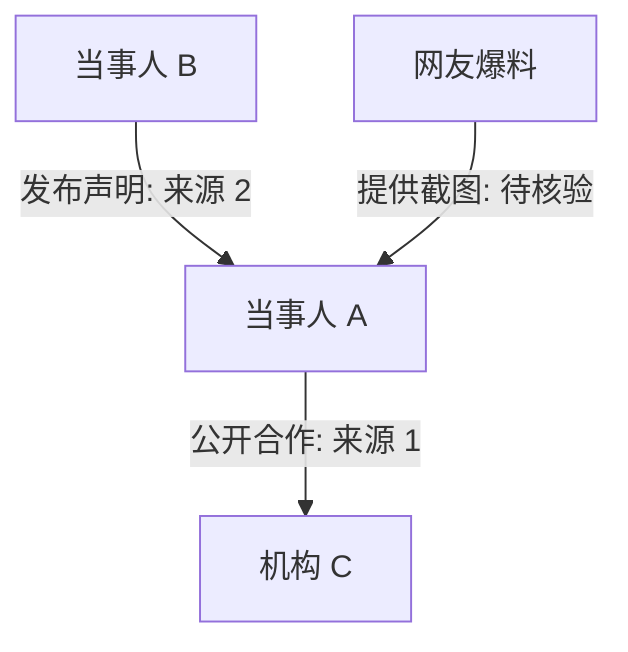

# ShawnSiao/siao-skills

- **分类**：二、网文 / 长篇 AI 写作系统 库
- **链接**：https://github.com/shawnsiao/siao-skills
- **Stars**：0
- **语言**：None
- **License**：MIT
- **Topics**：—
- **GitHub 描述**：A growing collection of Siao's Agent Skills for analysis, writing, research, visualization, automation, and knowledge workflows.
- **本地描述**：A growing collection of Siao's Agent Skills for analysis, writing, research, visualization, automation, and knowledge workflows.
- **拉取时间**：2026-07-23 22:57:59

---

# siao-skills

> 一组面向真实任务的 Agent Skills：把零散材料整理成可读、可核验、可复用的结构化成果。

[](https://agentskills.io)
[](LICENSE)
[](#安装)

English: [README.en.md](https://github.com/ShawnSiao/siao-skills/blob/main/README.en.md)

## 当前 Skills

### Siao Event Map

`siao-event-map` 是一个「事件图谱助手」。它可以把公开事件材料、截图、长文、声明、新闻链接、PDF、评论区线索，整理成：

- 一分钟结构化摘要
- 人物 / 组织 / 角色关系图
- 事件时间线
- 证据可信度分层
- 争议点矩阵
- 已证实 / 未证实 / 待核验清单
- 信息缺口和下一步核验建议
- 必要时生成信息图、人物关系阅读卡片或「一图看懂」图片

它不只适用于「吃瓜」。同一套方法也能用于复杂叙事阅读，例如梳理长篇小说的人物网络、历史事件脉络、政策资料、公司事故复盘、长篇报道事实线索。

在 Codex 或 ChatGPT 等支持 `imagegen` 的环境中，`siao-event-map` 可以在完成结构化分析后调用 `$imagegen`，生成 PNG 图片版关系图、时间线图、证据分层图或阅读卡片。用户明确要求图片时，不用 SVG、HTML、Mermaid-only 或代码图替代。

### Siao Event Map REDSkill

`siao-event-map-redskill` 是事件图谱助手的 REDSkill 专用版。它面向小红书创作服务平台的 `Red Skill` 上传限制设计，只包含 Markdown 文件，不包含 YAML、Python、Node、Shell 脚本或本地路径依赖。

它适合上传到 REDSkill 后挂载在小红书笔记里，让读者复制口令到自己的 Agent 中使用。能力范围保持聚焦：

- 整理公开事件、声明、截图、评论区线索和新闻链接
- 输出材料清单、时间线、人物 / 组织关系图、证据分层、争议矩阵、信息缺口
- 使用 Mermaid 生成可复制的 Markdown 关系图
- 用户需要图片时，只给图片提示词或 Mermaid 源码，不假装已经生成 PNG

### Siao World Cup Match Predictor

`siao-worldcup-match-predictor` 用于世界杯赛前预测和赛后复盘。它要求先核验赛程、阵容、伤停、战术、赛程压力、天气、舆论、专家观点和公开市场情绪，再给出胜平负概率、可能比分、置信度和风险因素。

这个 Skill 只做足球分析，不提供下注建议、仓位建议、串关方案、盘口选择或任何保证结果的表达。

## 快速看效果

用户可以直接丢材料：

```text
请用 $siao-event-map 分析这些材料：
1. A 的声明截图
2. B 的长文
3. 两条新闻链接
4. 评论区流传的时间线

输出一分钟摘要、时间线、关系图、证据分层和待核验清单。
```

输出会保持谨慎边界：

~~~markdown
以下内容仅基于用户提供材料和可核验公开来源整理，不代表事实认定。

## 一分钟结构化摘要

这是一个围绕 A、B、机构 C 的公开争议。当前可确认的是：
1. A 与机构 C 在 2024 年存在公开合作关系。
2. B 于 2025-05-29 发布过一份公开声明。
3. 多张截图指向同一时间段，但缺少原始链接。

尚未证实的是：
1. A 是否参与被指称行为。
2. 机构 C 是否提前知情。
3. 评论区流传的聊天记录是否完整。

## 关系图


~~~

## 安装

仓库发布到 GitHub 后，推荐用通用 Skills 安装器：

```bash
npx skills add <your-github-user>/siao-skills
```

Claude Code 插件方式：

```text
/plugin marketplace add <your-github-user>/siao-skills
/plugin install siao-skills
```

手动安装单个 Skill：

```bash
git clone https://github.com/<your-github-user>/siao-skills.git
cp -R siao-skills/skills/<skill-name> ~/.codex/skills/<skill-name>
```

## Skills

| Skill | 中文名 | 适合场景 | 状态 |
|---|---|---|related:
  - methods/网文写作最强SOP.md
  - methods/最强写作方法论_全球最强综合版.md
related:
  - methods/网文写作最强SOP.md
  - methods/最强写作方法论_全球最强综合版.md
---|
| `siao-event-map` | 事件图谱助手 | 公开事件、争议材料、长文、截图、PDF、关系图、时间线、复杂叙事阅读、图片版图解 | MVP |
| `siao-event-map-redskill` | 事件图谱 REDSkill 版 | REDSkill 上传、小红书 Skill 挂载、Markdown-only 事件图谱、时间线、关系图、证据分层 | MVP |
| `siao-worldcup-match-predictor` | 世界杯比赛预测助手 | 世界杯赛前预测、胜平负概率、比分预测、晋级概率、赛后预测复盘 | MVP |

## 示例提示词

自然语言可能触发，但不同 runtime 的隐式触发并不完全稳定：

```text
用 siao-event-map 把这篇长文拆成事实、观点、猜测、传闻，并列出证据可信度。
```

如果 runtime 的隐式触发不稳定，直接写 `$siao-event-map`：

```text
我有 6 张聊天截图和 2 个声明链接。请用 $siao-event-map 整理事件时间线、人物关系图、争议点矩阵和信息缺口。
```

```text
帮我梳理这部长篇小说的人物网络，输出世代表、人物关系图、主要事件时间线和理解线索。
```

```text
根据这些政策 PDF 和新闻材料，整理这个政策从提出到实施的关键节点、相关机构和争议点。
```

```text
请用 $siao-event-map-redskill 把这些截图、声明和链接整理成 REDSkill 可复制的事件图谱，包含材料清单、时间线、关系图、证据分层和信息缺口。不要生成图片，只给 Mermaid 和图片提示词。
```

```text
请用 $siao-event-map 梳理这部长篇小说的人物网络，并在 Codex/ChatGPT 中用 $imagegen 生成一张适合阅读时参考的人物关系图。
```

图片风格会根据材料调性选择：平淡叙事适合克制信息图，惊悚/高冲突材料适合暗色电影感关系板，家庭温暖材料适合柔和阅读卡片，男女关系错乱或身份误认材料适合分层、颜色编码的关系网。

```text
请用 $siao-worldcup-match-predictor 生成一份世界杯 A 队 vs B 队的赛前预测简报，包含胜平负概率、可能比分、证据缺口和风险因素。不要给下注建议。
```

## 触发排查

如果你问“刚才有没有使用这个 Skill”，模型只能回答上一轮是否实际加载了 Skill，不能补救上一轮。测试时请在同一条请求里显式写 `$siao-event-map`，并新开线程或重载 runtime，避免旧线程缓存旧 metadata。

## 仓库结构

```text
siao-skills/
├── .claude-plugin/
│   └── marketplace.json
├── docs/
│   ├── creating-skills.md
├── skills/
│   ├── siao-event-map/
│   │   ├── SKILL.md
│   │   ├── agents/
│   │   │   └── openai.yaml
│   │   └── references/
│   │       ├── output-templates.md
│   │       ├── safety-boundaries.md
│   │       ├── source-credibility.md
│   │       └── use-cases.md
│   ├── siao-event-map-redskill/
│   │   ├── SKILL.md
│   │   └── references/
│   │       ├── evidence-policy.md
│   │       ├── output-templates.md
│   │       └── use-cases.md
│   └── siao-worldcup-match-predictor/
│       ├── SKILL.md
│       └── agents/
│           └── openai.yaml
├── AGENTS.md
├── LICENSE
└── README.md
```

## 设计原则

- 每个 Skill 都能独立复制到任意兼容 runtime。
- `SKILL.md` 只放核心流程和必须遵守的边界。
- 大模板、案例、证据分层细则放到 `references/`，按需加载。
- README 用中英双语、真实用例、安装命令和效果片段降低试用成本。
- 涉及公开事件分析时，不做事实裁判，不制造人肉搜索线索，不放大未证实传闻。
- 涉及预测时，明确数据时间戳、证据缺口、置信度和非博彩边界。
