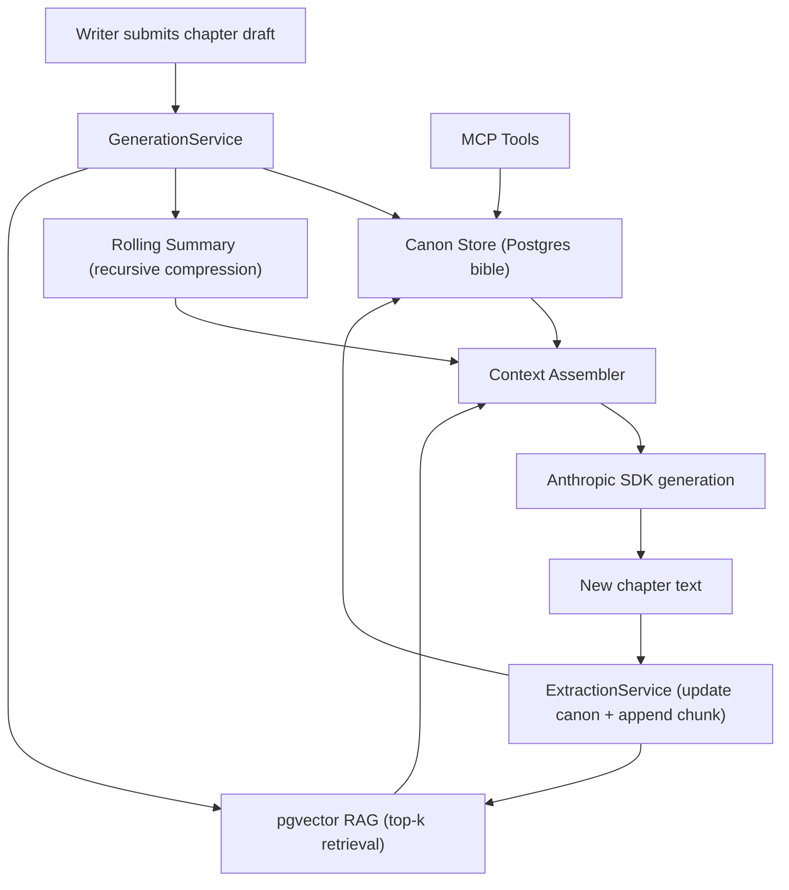

# dadadadas111/novel-studio

- **分类**：二、网文 / 长篇 AI 写作系统 库
- **链接**：https://github.com/dadadadas111/novel-studio
- **Stars**：0
- **语言**：TypeScript
- **License**：MIT
- **Topics**：llm, mcp, nestjs, nextjs, nodejs, pgvector, postgresql, rag, supabase, typescript
- **GitHub 描述**：AI novel-writing studio with cost-effective 3-tier long-story memory: canon store + rolling summary + pgvector RAG. NestJS + Supabase/PostgreSQL + Anthropic + MCP.
- **本地描述**：AI novel-writing studio with cost-effective 3-tier long-story memory: canon store + rolling summary + pgvector RAG. NestJS + Supabase/PostgreSQL + Anthropic + MCP.
- **拉取时间**：2026-07-23 23:01:17

---

# novel-studio

**AI novel-writing studio with bounded token cost at any novel length — three-tier memory keeps context precise without exploding the context window.**


---

## The Problem

Large language models have fixed context windows. A novel can be 100,000+ words — far more than any model can process at once. Naive approaches (feed everything, truncate arbitrarily) either fail or produce incoherent chapters that forget earlier events and characters.

**novel-studio** solves this with a three-tier memory architecture so the prompt fed to the model is always bounded, always relevant, and always coherent — regardless of how long the novel grows.

---

## Architecture



After each chapter, an extraction step parses new characters, locations, and plot facts into the Canon store. The rolling summary is recursively compressed so it never grows unbounded. pgvector retrieves only the top-k past chunks relevant to the current scene. The generation prompt is assembled from exactly these four inputs — the model never sees the full raw novel.

### Three-Tier Memory Detail

| Tier | Storage | Strategy | Status |
|------|---------|----------|--------|
| **Canon Store** | PostgreSQL (TypeORM) | Structured key-value story bible; queried by name or tag | Implemented |
| **Rolling Summary** | PostgreSQL (`novels.rollingSummary`) | Incremental compression: fold one chapter into prior summary; input is always O(1) | Implemented |
| **Vector Store** | pgvector (cosine similarity) | Embed each chapter chunk; retrieve top-k by scene relevance | Implemented |

The **Context Assembler** merges all three tiers under a configurable token budget — it trims from the least-relevant tier first, ensuring the most critical canon facts always fit.

---

## Features

- **Canon CRUD** — create/read/update/delete characters, locations, plot facts (Implemented)
- **MCP tools for canon** — expose `canon-read`, `canon-write`, and `continuity-check` as Model Context Protocol tools (Implemented)
- **pgvector RAG** — embed chapter chunks, cosine-similarity retrieval (Implemented)
- **Context assembler** — merge 4-part context under token budget (Implemented)
- **Anthropic generation** — calls Claude SDK with assembled context (Implemented)
- **Novel + chapter CRUD** — full persistence layer (Implemented)
- **Rolling summary** — incremental recursive compression (Implemented)
- **Post-chapter extraction** — parse new canon facts from generated chapter (Implemented)
- **Markdown export** — concatenate all chapters into a manuscript (Implemented; EPUB stub)
- **Character relationship graph** — co-mention graph (nodes + edges) for the CanonSidebar (Implemented)
- **Supabase Auth guard** — Firebase-style JWT validation middleware (Stub)
- **Writing studio UI** — Next.js 14 app with editor, sidebar, debug panel (Implemented)

---

## Project Structure

```
novel-studio/
├── LICENSE
├── README.md
├── .gitignore
├── .env.example                    # All env vars with comments; copy to .env
│
├── apps/api/                       # NestJS backend (Node.js, TypeScript)
│   ├── package.json
│   ├── tsconfig.json
│   └── src/
│       ├── main.ts                 # Bootstrap, Swagger setup
│       ├── app.module.ts           # Root module wiring
│       │
│       ├── canon/                  # Story bible: characters, locations, facts
│       │   ├── canon.module.ts
│       │   ├── canon.service.ts    # IMPL: full CRUD via TypeORM
│       │   ├── canon.mcp.ts        # MCP tool definitions: canon-read, canon-write
│       │   └── entities/
│       │       ├── character.entity.ts
│       │       ├── location.entity.ts
│       │       └── plot-fact.entity.ts
│       │
│       ├── memory/                 # Rolling summary + pgvector store
│       │   ├── memory.module.ts
│       │   ├── rolling-summary.service.ts  # STUB: recursive compression
│       │   ├── vector-store.service.ts     # IMPL: upsert + cosine top-k
│       │   └── chunk.entity.ts             # content, embedding, chapterIdx
│       │
│       ├── generation/             # Core generation pipeline
│       │   ├── generation.module.ts
│       │   ├── generation.service.ts       # IMPL: orchestrate 4-part context + Anthropic call
│       │   ├── context-assembler.service.ts # IMPL: merge tiers under token budget
│       │   └── generation.controller.ts    # POST /generation/chapter
│       │
│       ├── extraction/             # Post-generation canon extraction
│       │   ├── extraction.module.ts
│       │   ├── extraction.service.ts       # STUB: LLM-parse new facts from chapter
│       │   └── extraction.prompts.ts       # Prompt templates (the asset)
│       │
│       ├── novels/                 # Novel + chapter persistence
│       │   ├── novels.module.ts
│       │   ├── novels.service.ts           # IMPL: novel + chapter CRUD
│       │   ├── novels.controller.ts        # REST endpoints
│       │   └── entities/
│       │       ├── novel.entity.ts
│       │       └── chapter.entity.ts
│       │
│       └── auth/                   # Supabase auth middleware
│           ├── auth.module.ts
│           └── supabase-auth.guard.ts  # STUB: validate Supabase JWT
│
└── apps/web/                       # Next.js 14 frontend
    ├── package.json
    ├── tsconfig.json
    └── src/
        ├── app/
        │   ├── layout.tsx          # Root layout with Supabase Auth provider
        │   └── page.tsx            # Dashboard: list all novels
        ├── studio/
        │   ├── page.tsx            # Writing view (studio shell)
        │   ├── ChapterEditor.tsx   # IMPL: textarea + generate button + streaming
        │   ├── CanonSidebar.tsx    # Shows characters/locations from canon store
        │   └── MemoryDebugPanel.tsx # Shows assembled context tiers (great for demos)
        └── lib/
            ├── supabase.ts         # Supabase client singleton
            └── api.ts              # Typed API client for backend calls
```

---

## Getting Started

### Prerequisites

- Node.js 20+
- A [Supabase](https://supabase.com) project with pgvector enabled
- An [Anthropic API key](https://console.anthropic.com)

Enable pgvector in Supabase SQL editor:
```sql
CREATE EXTENSION IF NOT EXISTS vector;
```

### Install

```bash
# Clone
git clone https://github.com/dadadadas111/novel-studio.git
cd novel-studio

# Install API dependencies
cd apps/api && npm install

# Install web dependencies
cd ../web && npm install
```

### Configuration

Copy `.env.example` to `.env` and fill in all values:

| Variable | Description | Example |
|----------|-------------|---------|
| `SUPABASE_URL` | Supabase project API URL | `https://xxx.supabase.co` |
| `SUPABASE_ANON_KEY` | Public anon key | `eyJ...` |
| `SUPABASE_SERVICE_ROLE_KEY` | Server-side service key (bypasses RLS) | `eyJ...` |
| `DATABASE_URL` | Postgres connection string | `postgresql://postgres:pw@db.xxx.supabase.co:5432/postgres` |
| `ANTHROPIC_API_KEY` | Anthropic API key for Claude | `sk-ant-...` |
| `ANTHROPIC_MODEL` | Claude model to use | `claude-opus-4-5` |
| `CONTEXT_TOKEN_BUDGET` | Max tokens for assembled context | `8000` |
| `VECTOR_TOP_K` | pgvector top-k retrieval count | `5` |
| `PORT` | API server port | `3001` |

### Run

```bash
# API (from apps/api)
npm run start:dev

# Web (from apps/web)
npm run dev
```

---

## What's Implemented vs Stubbed

| Feature | Status | Notes |
|---------|--------|-------|
| Canon CRUD (characters, locations, plot facts) | **Implemented** | TypeORM entities + full service layer |
| MCP tools for canon (canon-read, canon-write, continuity-check) | **Implemented** | canon-read/write registered; continuity-check flags contradictions vs stored canon |
| pgvector upsert + cosine top-k retrieval | **Implemented** | Uses `pg` driver with raw SQL for vector ops |
| Context assembler (4-part merge, token budget) | **Implemented** | Trims least-relevant tier first under budget |
| Anthropic generation (Claude SDK) | **Implemented** | Key from env; model configurable |
| Novel + chapter CRUD | **Implemented** | Full REST API with TypeORM |
| Rolling summary (incremental compression) | **Implemented** | Folds one chapter into existing summary; LLM input is O(1) regardless of novel length |
| Post-chapter canon extraction | **Implemented** | LLM call + JSON parse + upsert loop; malformed responses swallowed, dedup by name |
| Markdown export (`GET /novels/:id/export/markdown`) | **Implemented** | Concatenates chapters in order; falls back to scene draft if not yet generated; EPUB stub |
| Character relationship graph (`GET /canon/:id/relationship-graph`) | **Implemented** | Co-mention graph from plot facts; nodes = characters, edges = shared mentions |
| Supabase auth guard (JWT validation) | **Stub** | Shape correct; actual JWT verify deferred |
| Next.js writing studio UI | **Implemented** | Editor, sidebar, memory debug panel |

---

## API Reference

All API routes are prefixed `/api/v1` (configurable via `PORT` env var, default port `3001`).
Authentication: `Authorization: Bearer <supabase-jwt>` on all routes (guard is a stub in dev).

### Generation

| Method | Path | Body / Params | Description |
|--------|------|---------------|-------------|
| `POST` | `/generation/chapter` | `{ novelId, chapterIdx, sceneDraft }` | Assemble three-tier context, call Claude, return chapter text + debug breakdown. Post-generation pipeline (extraction, summary, vector) runs async. |

**Response:**
```jsonc
{
  "chapterText": "...",
  "contextDebug": {
    "estimatedTokens": 4320,
    "tierBreakdown": { "scene": 210, "canon": 870, "summary": 540, "chunks": 2700 }
  }
}
```

### Novels

| Method | Path | Description |
|--------|------|-------------|
| `POST` | `/novels` | Create a novel (`{ userId, title, synopsis? }`) |
| `GET` | `/novels/user/:userId` | List novels for a user |
| `GET` | `/novels/:id/user/:userId` | Get a single novel |
| `PUT` | `/novels/:id/user/:userId` | Update title or synopsis |
| `DELETE` | `/novels/:id/user/:userId` | Delete a novel |
| `POST` | `/novels/chapters` | Save a chapter draft |
| `GET` | `/novels/:novelId/chapters` | List chapters ordered by index |
| `GET` | `/novels/:novelId/export/markdown/user/:userId` | Export full novel as Markdown manuscript |

### Canon

| Method | Path | Description |
|--------|------|-------------|
| `GET` | `/canon/:novelId/characters` | List all characters |
| `GET` | `/canon/:novelId/locations` | List all locations |
| `GET` | `/canon/:novelId/plot-facts` | List all plot facts |
| `GET` | `/canon/:novelId/relationship-graph` | Character co-mention graph (nodes + edges) |
| `POST` | `/canon/mcp/tool` | Invoke MCP tool by name (`{ toolName, input }`) |

### MCP Tools

Three tools are registered. Any MCP-capable client can call them via `POST /canon/mcp/tool`.

| Tool | Input | Description |
|------|-------|-------------|
| `canon-read` | `{ novelId, entityType?, nameFilter? }` | Read canon (characters / locations / plotFacts / all) |
| `canon-write` | `{ novelId, entityType, name?, description?, fact?, tags? }` | Create a canon entry |
| `continuity-check` | `{ novelId, draftText }` | Flag contradictions between draft and canon; returns `{ issues: [...] }` |

### Three-Tier Memory: How It Works

```
POST /generation/chapter
  │
  ├─ getSummary(novelId)        → novels.rollingSummary  [O(1) read]
  ├─ getFullCanon(novelId)      → characters + locations + plotFacts
  ├─ retrieveTopK(novelId, ...)  → pgvector cosine top-k chunks
  │
  ├─ ContextAssembler.assemble() → bounded prompt block (≤ CONTEXT_TOKEN_BUDGET tokens)
  │
  └─ anthropic.messages.create() → chapter text
       │
       └─ async postGenerate():
            ├─ vectorStore.upsertChunk()        (add new chapter to RAG)
            ├─ extraction.extractAndUpdateCanon() (LLM parse → canon upsert)
            └─ rollingSummary.compressAndUpdate() (fold into summary, O(1))
```

---

## Roadmap

| Item | Notes |
|------|-------|
| Supabase Auth guard (real JWT) | Wire `@supabase/supabase-js` `getUser()` into the guard; shape already correct |
| EPUB export | Pipe the Markdown export through Pandoc or `epub-gen` |
| Streaming generation | Switch `anthropic.messages.create` to `stream()` and pipe SSE to the frontend |
| Tiktoken-based token counting | Replace the word-heuristic estimator in ContextAssemblerService |
| Semantic canon queries | Embed canon entries and retrieve by cosine similarity instead of name substring |
| Chapter versioning | Allow multiple generation attempts per scene draft; let the writer pick the best |
| Multi-user collaboration | Add contributor roles at the novel level |
| Jitter on rolling summary | Avoid thundering-herd on summary compression for long novels with many concurrent writers |

related:
  - methods/网文写作最强SOP.md
  - methods/最强写作方法论_全球最强综合版.md
related:
  - methods/网文写作最强SOP.md
  - methods/最强写作方法论_全球最强综合版.md
---

## License

MIT — see [LICENSE](https://github.com/dadadadas111/novel-studio/blob/main/LICENSE).

Copyright (c) 2026 Nguyen Thanh Long
