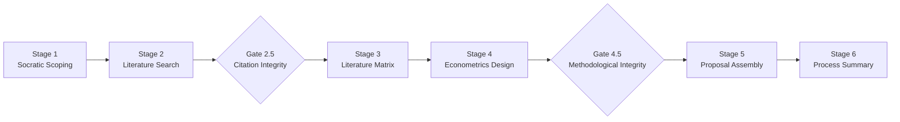

# nguyenthaitoan/ai-research-proposal-copilot

- **分类**：二、网文 / 长篇 AI 写作系统 库
- **链接**：https://github.com/nguyenthaitoan/ai-research-proposal-copilot
- **Stars**：0
- **语言**：None
- **License**：NOASSERTION
- **Topics**：academic-writing, ai-research, chatgpt, claude, econometrics, higher-education, human-in-the-loop, literature-review, phd, prompt-engineering, research-proposal, stata
- **GitHub 描述**：A 6-stage human-in-the-loop AI pipeline for writing economics research proposals. Socratic scoping, verified lit search, econometric design, integrity gates.
- **本地描述**：A 6-stage human-in-the-loop AI pipeline for writing economics research proposals. Socratic scoping, verified lit search, econometric design, integrity gates.
- **拉取时间**：2026-07-23 23:09:05

---

# AI Research Proposal Copilot

A structured, AI-assisted pipeline for writing economics and social science research proposals. Designed for PhD students, faculty, and researchers who want AI as a **copilot, not the pilot**.

> "AI is your copilot, not the pilot."
> The goal is for researchers to **master AI tools**, not to let AI do the work for them.

## What This Is

A 6-stage pipeline that guides researchers from a vague idea to a publication-ready research proposal, with two mandatory integrity gates. The AI acts as a Socratic mentor, coach, and verifier — while the researcher makes all decisions.

Built for **econometrics-focused** research (causal inference, endogeneity mitigation, robust empirical designs), but adaptable to other quantitative social science disciplines.

## Pipeline Overview



| Stage | What Happens | Who Does What |
|-------|-------------|---------------|
| **1. Socratic Scoping** | Refine raw idea into a precise Research Question + Objectives | AI asks 5 critical questions; researcher answers |
| **2. Literature Search** | Find and verify seed papers | Researcher searches (Consensus, Elicit, Scholar); AI coaches and verifies |
| **Gate 2.5** | Citation integrity check | AI verifies every reference exists via API triangulation |
| **3. Literature Matrix** | Build structured evidence table + identify gaps | AI structures; researcher validates |
| **4. Econometrics Design** | Specify models, identification strategy, Stata/R code | AI proposes; researcher approves |
| **Gate 4.5** | Methodological integrity check | AI audits model-gap alignment |
| **5. Proposal Assembly** | Compile full proposal + multi-perspective peer review | AI assembles; 3 reviewers critique; researcher decides |
| **6. Process Summary** | Document the human-AI collaboration process | AI generates; researcher reflects |

## Key Design Principles

- **Human-in-the-loop**: The researcher searches, reads, and decides. AI coaches and verifies.
- **Hard checkpoints**: AI never auto-advances to the next stage. Researcher must explicitly confirm.
- **Anti-hallucination**: All citations verified via Semantic Scholar + OpenAlex + Crossref triangulation.
- **Objective traceability**: Every model specification traces back to a specific research objective.
- **Iron rules**: Integrity gates cannot be bypassed. Reviewers are read-only (suggest, never edit).

## Who This Is For

- PhD students writing research proposals in economics, finance, or social sciences
- Faculty supervising thesis/dissertation work who want a structured AI workflow
- Researchers who want to use AI responsibly without sacrificing academic rigor

## Quick Start

### Option A: Claude Code / Kiro (native skills)

```bash
# Copy skills into your project
cp -r skills/ .claude/skills/         # for Claude Code
cp -r skills/ .agents/skills/         # for Kiro / Antigravity
cp -r skills/ ~/.gemini/config/skills/ # for Antigravity (global)
```

Then start with:
```
I have a research idea about [your topic]. Help me develop it into a proposal.
```

### Option B: ChatGPT / Gemini / Other AI Tools

Each `skills/*/SKILL.md` file is a self-contained prompt. Use them as system instructions:

1. Start with `skills/research-proposal-generator/SKILL.md` (orchestrator overview)
2. Paste `skills/rpg-stage1-socratic-scoping/SKILL.md` as your first conversation's system prompt
3. After completing Stage 1, start a new conversation with Stage 2's SKILL.md
4. Continue stage by stage

See `[docs/adapting-for-other-tools.md](docs/adapting-for-other-tools.md)` for detailed instructions.

### Option C: Read and Adapt

Even without any AI tool, the SKILL.md files document a rigorous methodology for proposal writing. Use them as a checklist or supervisor's guide.

## Repository Structure

```
skills/
├── research-proposal-generator/   # Orchestrator — pipeline overview & routing
├── rpg-stage1-socratic-scoping/   # Stage 1: Research question refinement
├── rpg-stage2-lit-search/         # Stage 2: Human-driven literature search
├── rpg-stage3-lit-matrix/         # Stage 3: Evidence matrix & gap analysis
├── rpg-stage4-econometrics/       # Stage 4: Model specification & code
├── rpg-stage5-assembly/           # Stage 5: Full proposal + peer review
├── rpg-stage6-process-summary/    # Stage 6: Collaboration documentation
├── rpg-file-structure/            # Project directory conventions
├── rpg-human-tools-guide/         # Guide to external AI tools (Consensus, Elicit...)
├── rpg-integrity-gates/           # Gate 2.5 & Gate 4.5 protocols
├── rpg-checkpoint-protocol/       # Hard-stop checkpoint rules
└── shared-protocols/              # Anti-hallucination & verification protocols
```

## External Tools Referenced

The pipeline coaches researchers to use these tools themselves (not through the AI):

| Tool | Purpose | Stage |
|------|---------|-------|
| [Consensus.app](https://consensus.app) | Evidence synthesis across peer-reviewed papers | 2 |
| [Elicit.com](https://elicit.com) | Systematic paper discovery | 2 |
| [Google Scholar](https://scholar.google.com) | Broad literature search | 2 |
| [NotebookLM](https://notebooklm.google.com) | Deep reading & PDF analysis | 2 |
| [Research Rabbit](https://researchrabbit.ai) | Citation network exploration | 2 |
| [Stata](https://www.stata.com) / [R](https://www.r-project.org) | Econometric estimation | 4 |

## Language

The skill files are written in a mix of English and Vietnamese, reflecting their origin in a Vietnamese PhD seminar. The protocols and logic are language-independent.

## License

This work is licensed under `[Creative Commons Attribution 4.0 International (CC BY 4.0)](LICENSE)`.

You are free to share and adapt this material for any purpose, including commercial use, as long as you give appropriate credit.

## Citation

If you use this pipeline in your teaching or research, please cite:

```
Nguyen, T. T. (2026). AI Research Proposal Copilot: A Human-in-the-Loop Pipeline
for Economics Research Proposals. https://github.com/nguyenthaitoan/ai-research-proposal-copilot
```

## Contributing

Contributions are welcome. Please open an issue to discuss changes before submitting a pull request.

related:
  - methods/网文写作最强SOP.md
  - methods/最强写作方法论_全球最强综合版.md
related:
  - methods/网文写作最强SOP.md
  - methods/最强写作方法论_全球最强综合版.md
---

## Tiếng Việt

Bộ công cụ này hỗ trợ NCS kinh tế viết đề cương nghiên cứu với AI làm trợ thủ. Pipeline gồm 6 giai đoạn từ ý tưởng thô đến đề cương hoàn chỉnh, với 2 cổng kiểm tra tính toàn vẹn bắt buộc.

Triết lý cốt lõi: **NCS làm chủ công cụ AI, không phải AI làm thay.**

Xem hướng dẫn đầy đủ bằng tiếng Việt: `[README.vi.md](README.vi.md)`
