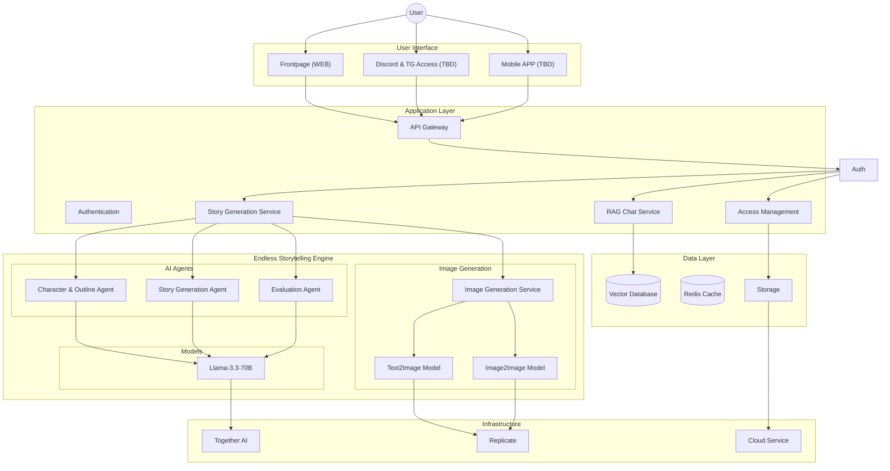
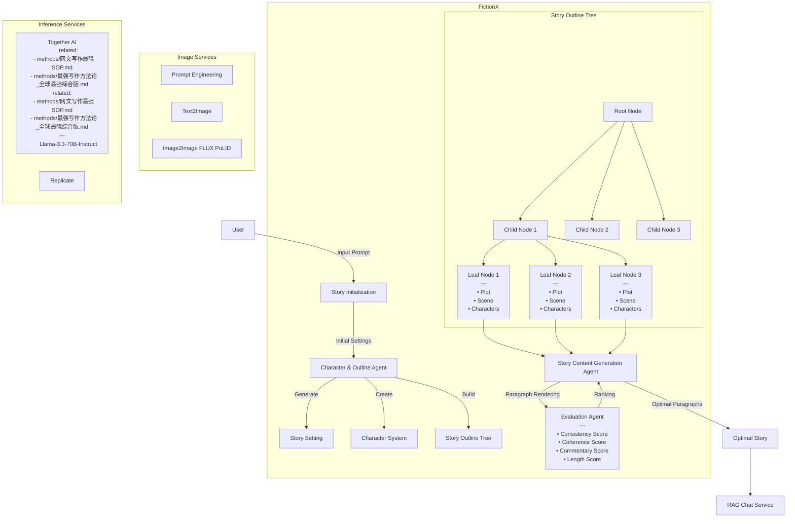

# OctoEvo/fictionx-story-gen

- **分类**：二、网文 / 长篇 AI 写作系统 库
- **链接**：https://github.com/octoevo/fictionx-story-gen
- **Stars**：26
- **语言**：Python
- **License**：Apache-2.0
- **Topics**：ai, multi-agent, story-telling, zero-shot
- **GitHub 描述**：An Interactive Infinite Story Generation Framework Based on Multi-Agent
- **本地描述**：An Interactive Infinite Story Generation Framework Based on Multi-Agent
- **拉取时间**：2026-07-23 23:13:14

---

[![Python Version][python-image]][python-url]
[![Package License][package-license-image]][package-license-url]
[![Star][star-image]][star-url]
[![Twitter][twitter-image]][twitter-url]

<p align="center">
  <a href="https://fictionx.ai/">FictionX Website</a> |
  <a href="https://github.com/fictionxai/fictionx-story-gen/tree/main/story_samples">Story Samples</a> |
  <a href="https://github.com/fictionxai/fictionx-story-gen/blob/main/README.md">English</a> |
  <a href="https://github.com/fictionxai/fictionx-story-gen/blob/main/README.zh-cn.md">中文</a>
</p>

______________________________________________________________________


# FictionX: An Interactive Infinite Story Generation Framework Based on Multi-Agent

This project aims to explore and push the boundaries of continuous long-form content generation, providing a fully automated or interactive high-quality novel generation system.

## Core Challenges

Compared to mainstream short-form content generation, automated long-form content generation faces unique challenges. The key challenges include:

**Plot Coherence**  
When generating content spanning thousands of words, the system must maintain a coherent narrative thread. This requires not only ensuring that the content consistently develops from the user's initial prompt but also avoiding plot contradictions or logical discontinuities throughout the extended creative process, providing readers with a smooth reading experience.

**Narrative Quality**  
High-quality long-form content demands consistent writing style throughout the creative process while ensuring the coherence of core elements such as character personalities and background settings. It must construct a reasonable plot development that is both engaging and logically sound.

**Technical Limitations**  
Despite significant advances in natural language processing achieved by large language models like GPT-4 and Llama 3.3, challenges remain in processing long-form content. Understanding and generating coherent long-text context continues to be a critical research direction in artificial intelligence requiring breakthrough solutions.

## FictionX's Solution

FictionX focuses on long-form story generation technology, currently achieving stable generation of 4,000-5,000 word stories. While the system technically supports even longer content creation, the main limitation lies in the complexity of quality assessment: defining what constitutes a good story.

### Infinity Long Story Generator

#### Architecture



**Agents**
 - Character & Outline Agent
 - Story Content Generation Agent
 - Evaluation Agent

The framework contains 3 core Agents: `Character & Outline Agent`, `Story Content Generation Agent`, and `Evaluation Agent` (which includes scoring across f dimensions: `consistency`, `coherence`, `commentary`, and `length`).

#### Generation Process

Story generation process is a multi-round iterative approach, with each round comprising four key phases: planning, drafting, writing, and evaluation:

**Story Initialization**  
Based on the user's input prompt, the system automatically generates matching story titles and premises. Simultaneously, it creates a cover image reflecting the core theme through the `Text2Image` service.

**World Building**  
During this phase, the `Character & Outline Agent` constructs a complete story world. It first establishes the story's background environment (setting), then creates a comprehensive character system including protagonists, supporting characters, and background characters. Each character receives a unique name and personality description, with corresponding character portraits generated through the `Text2Image` service.

**Story Structure Design**  
`Character & Outline Agent` generates a multi-layered tree as the story outline. In this tree, level-1 nodes define the overall story direction, middle-layer nodes represent significant plot turns, and leaf nodes contain specific events, scene descriptions, and involved character information. This hierarchical tree ensures logical and coherent story development.

**Content Generation and Optimization**  
In the final content generation phase, the `Story Content Generation Agent` processes each leaf node sequentially. For each node, it performs 4-8 different content renderings, each generating one or more paragraphs. `Evaluation Agent` cluster comprehensively assesses these renderings across dimensions of consistency, coherence, commentary, and length, selecting the highest-scoring version as the final content for that node.

Simultaneously, using the `FLUX PuLID` model through the `Image2Image` service, the Agent maintains visual consistency of character appearances throughout story development and generates matching illustrations based on current plot and scene context, enhancing story immersion.

#### Workflow



### Interactive Story Generation

FictionX provides both automated and interactive story generation modes. In interactive mode, users can:
- Customize high-level plot outlines
- Define character backgrounds and descriptions
- Directly modify story content
- Create multiple story branches at key plot points

### T2I(Text2Image) and I2I(Image2Image) Integration

The project integrates multimodal generation services, utilizing advanced image generation models:

- **Model Selection**  
Primarily utilizes `Flux Dev` as the core model, supplemented by `FLUX PuLID` for I2I processing. The image generation system is built upon a specialized `Prompt Engineering System` based on Llama-3.3 to optimize image quality and accuracy.

- **Image Generation Strategy**  
FictionX implements differentiated processing approaches for various scenarios. For character portraits, utilizes `Image2Image` combined with `PuLID` model to maintain visual consistency; scene images are dynamically generated based on current plot content and environmental descriptions; for key story props, generates visual representations based on specific descriptions to enhance story immersion.

### RAG-based Character Interaction Chat

The framework implements natural character interaction functionality based on `Retrieval-Augmented Generation (RAG)`:

- **Data Construction Process**  
Upon story completion, content is automatically vectorized, with character, scene, plot, and other information stored in a local vector database. This process ensures efficient retrieval and utilization of all story elements.

- **Interaction Features**  
Chating supports real-time dialogue with any character from the story. All character responses are dynamically generated based on story context while strictly maintaining character personality traits and unique speech patterns. Multi-language interaction is supported to enable natural dialogue for readers from different language backgrounds.

See the detailed implementation of the chat system in [StoryChatV1](https://github.com/fictionxai/story-chat-v1).

## How to Use

### LLM

FictionX's core language model is developed and tested on Meta's `Llama-3.3-70B-Instruct`, an instruction-tuned large-scale model capable of precisely understanding and executing complex text generation tasks. The model service is provided by `Together AI`.

For greater flexibility, the framework supports multiple model service options. Users can utilize `GPT-4o` through OpenAI's API. Based on testing results, it demonstrates superior performance in strict instruction adherence, while `Claude 3.5 Sonnet` shows slightly lower instruction compliance. For users with GPU computing resources, self-hosted `vllm` services are also supported, allowing flexible model service switching based on specific requirements.

### Installation

```
pip install -r requirements.txt
pip install -e .
```

### .env Configuration

- `OPENAI_API_KEY`
- `TOGETHER_API_KEY`
- `FLUX_DEV_API_KEY`
- `FLUX_PULID_API_KEY`
- `VLLM_API_URL`

### Start API Service

```
cd api
gunicorn -c gunicorn_config.py api:app
```

Upon execution, an `output/` directory is created in the current directory, storing generated content including:
- Story premise (premise.json)
- Story outline (outline.json)
- Complete story content (story.txt)

## FAQ

- **What languages are supported?**  
Currently, story generation only supports English. Future plans include multi-language support through additional language instructions at the initial prompt input stage. However, the character chat feature already supports interaction in any language.

- **Are there any content examples?**  
Yes, you can view generated story samples in the [story_samples](./story_samples/) directory.

## Contact

For any questions or suggestions, please feel free to engage with us through: 
- submitting Issues or creating Pull Requests. 
- contacting us through info@fictionx.ai. We will provide timely responses.

[python-image]: https://img.shields.io/badge/Python-3.10%2C%203.11%2C%203.12-brightgreen.svg
[python-url]: https://www.python.org/
[star-image]: https://img.shields.io/github/stars/fictionxai/fictionx-story-gen?label=stars&logo=github&color=brightgreen
[star-url]: https://github.com/fictionxai/fictionx-story-gen/stargazers
[twitter-url]: https://x.com/FictionXAI
[twitter-image]: https://img.shields.io/twitter/follow/FictionXAI?style=social&color=brightgreen&logo=twitter
[package-license-image]: https://img.shields.io/badge/License-Apache_2.0-blue.svg
[package-license-url]: https://github.com/fictionxai/fictionx-story-gen/blob/main/LICENSE
