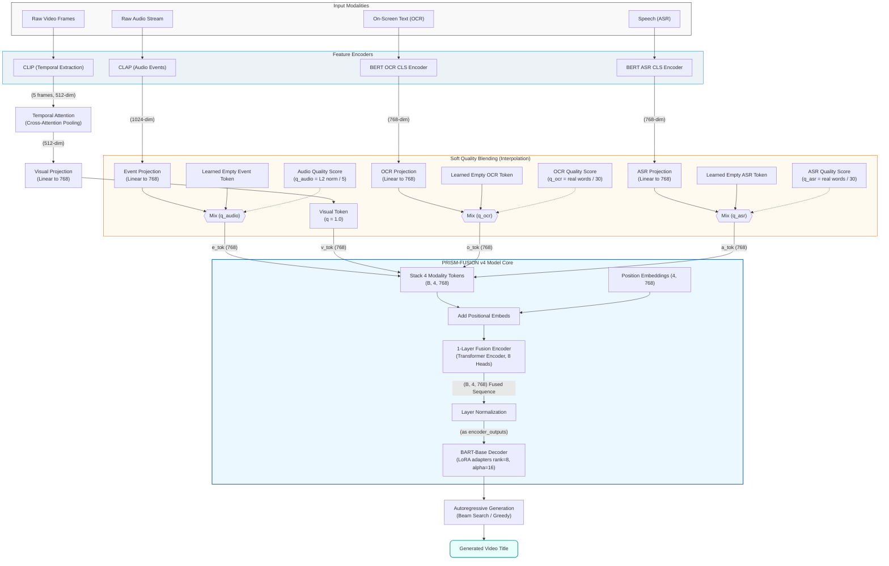

# smash273/Multimodal-AI-Driven-Contextual-Story-Title-Generation-Samsung-PRISM-

- **分类**：二、网文 / 长篇 AI 写作系统 库
- **链接**：https://github.com/smash273/multimodal-ai-driven-contextual-story-title-generation-samsung-prism-
- **Stars**：1
- **语言**：Jupyter Notebook
- **License**：None
- **Topics**：—
- **GitHub 描述**：Multimodal AI framework capable of understanding and fusing visual information, speech transcripts, OCR text, audio-event semantics to generate contextually accurate and human-like video story titles in real time using CLIP/SigLIP visual encoders, Whisper ASR, EasyOCR, CLAP audio encoders.
- **本地描述**：Multimodal AI framework capable of understanding and fusing visual information, speech transcripts, OCR text, audio-event semantics to generate contextually accurate and human-like video story titles in real time using CLIP/SigLIP visual encoders, Whisper ASR, EasyOCR, CLAP audio encoders.
- **拉取时间**：2026-07-23 23:14:34

---

# 🌈 PRISM: Multimodal AI-Driven Contextual Video Title Generation

> Automatic video title generation combining visual, acoustic, and textual cues using state-of-the-art multimodal fusion and sequence-to-sequence decoding models.

[](https://pytorch.org/)
[](https://huggingface.co/)
[](https://colab.research.google.com/)
[](https://opensource.org/licenses/MIT)

---

## 📖 Table of Contents
1. [Overview](#-overview)
2. [Evolution of the PRISM Architecture](#-evolution-of-the-prism-architecture)
3. [PRISM-FUSION v4 Pipeline Architecture](#-prism-fusion-v4-pipeline-architecture)
4. [Project Structure](#-project-structure)
5. [Modality Features & Dimensions](#-modality-features--dimensions)
6. [Feature Extraction Pipelines](#-feature-extraction-pipelines)
7. [3-Phase Training Pipeline (v4)](#-3-phase-training-pipeline-v4)
8. [Getting Started (Google Colab / Local Setup)](#-getting-started-google-colab--local-setup)
9. [Data Directory Structure](#-data-directory-structure)
10. [Ground-Truth Generation (RTX A4000 / Qwen2.5-VL)](#-ground-truth-generation-rtx-a4000--qwen25-vl)
11. [Inference & Evaluation](#-inference--evaluation)
12. [Model Export & API Deployment](#-model-export--api-deployment)

---

## 🔍 Overview

**PRISM** is an end-to-end framework designed to solve the challenging task of **automatic video title generation**. Traditional methods often fail on diverse video corpora because they rely strictly on a single modality (e.g., visual only or text only). PRISM solves this by fusing **four core modalities**:
- 🎬 **Visual (Temporal)**: Capturing scenes, objects, actions, and motion patterns.
- 🔊 **Audio Events**: Spotting critical acoustic events (e.g., crashes, music, engines, speech).
- 💬 **Speech (ASR)**: Transcribing spoken narration, dialogues, or interviews.
- 📝 **On-screen Text (OCR)**: Reading overlays, chyrons, product labels, and news banners.

PRISM is capable of automatically adjusting to **text-rich**, **silent**, or **visual-only** videos using a novel **soft quality-weighting scheme**.

---

## 📈 Evolution of the PRISM Architecture

PRISM has evolved from a custom from-scratch model into a powerful pretrained-aligned generative architecture:

```
┌──────────────────────────────────────────────┐
│                  PRISM v1                    │
│   • Custom PyTorch Transformer (from scratch)│
│   • Visual (CLIP) + OCR/ASR (BERT) + YAMNet  │
│   • Custom Vocabulary & Greedy Token Decoder │
└──────────────────────┬───────────────────────┘
                       │
                       ▼
┌──────────────────────────────────────────────┐
│         PRISM-FUSION v4 (Latest)             │
│   • BART-base Sequence-to-Sequence Decoder   │
│   • 4 Modalities (CLIP5, CLAP, OCR, ASR)     │
│   • Cross-Attention Temporal Pooling (CLIP5) │
│   • Soft Quality Interpolation (Low-Q blend) │
│   • 3-Phase Hybrid LoRA Optimization         │
└──────────────────────────────────────────────┘
```

### Key Differences
| Feature | PRISM v1 | PRISM-FUSION v4 (Latest) |
| :--- | :--- | :--- |
| **Foundation Decoder** | Custom Transformer (3-Layer, 8-Head from scratch) | Pretrained **BART-base** (Sequence-to-Sequence) |
| **Fine-Tuning Method** | Full parameter training from scratch | **LoRA** (Rank 8, Alpha 16) + Joint End-to-End |
| **Acoustic Modality** | YAMNet audio classification embeddings | **CLAP** (Contrastive Language-Audio Pretraining) |
| **Visual Temporal Pool** | Single mean-pooled frame | **Temporal Attention** (Cross-attention with learnable query) |
| **Modality Missingness** | Hard zeros (collapses under missing modalities) | **Soft Quality Blend** (Interpolates with learned empty tokens) |
| **Semantic Warm-up** | None (direct training) | **Phase 0 Contrastive Alignment** (using frozen BERT CLS) |

---

## 🏗️ PRISM-FUSION v4 Pipeline Architecture

The pipeline processes high-dimensional multimodal representations, scales their influence based on continuous quality signals, merges them through a Transformer Fusion Encoder, and decodes them into descriptive titles via BART-base optimized with LoRA adapters.



### ⚙️ The Mechanics of Quality Weighting (Soft Interpolation)
If a video is a silent tutorial, ASR and audio details will be junk (zeros or garbage text). To prevent the decoder from conditioning on noise, PRISM-FUSION v4 computes continuous quality weights ($q \in [0, 1]$) dynamically:
- **Visual ($q_{vis}$)**: Kept at `1.0` (visual is always active).
- **Audio ($q_{audio}$)**: L2 norm of the CLAP embedding divided by 5 (capped at `1.0`).
- **Text ($q_{ocr}$, $q_{asr}$)**: Extracted word count filtered by real dictionary terms, normalized: $\min(\text{words}/30, 1.0)$.

Each projected embedding is interpolated dynamically:
$$\text{token}_{\text{final}} = q \cdot \text{embedding}_{\text{projected}} + (1 - q) \cdot \text{token}_{\text{empty\_learned}}$$
When $q=0$, the modal slot collapses completely to a **learned, constant "empty" embedding**, giving the fusion encoder a continuous, learnable representation of missing modalities.

---

## 📁 Project Structure

```
.
├── PRISM_Multimodal_v4_Colab.ipynb # 🚀 PRISM-FUSION v4 Unified Training, Evaluation & Inference Notebook
├── PRISM_BERT_Extract.ipynb        # 📝 EasyOCR + faster-whisper extraction & BERT-base encoding notebook
├── PRISM_AudioVision_Extract.ipynb  # 🔊 Microsoft CLAP & OpenAI CLIP5 multimodal feature extractor notebook
├── PRISM_OCR_Colab.ipynb           # ⚡ Google Colab T4 EasyOCR fast resume-safe extractor notebook
├── run_gt_a4000.py                 # 🌈 Standalone RTX A4000 Ground Truth Generator using Qwen2.5-VL-7B
├── config.py                       # Global configs, hyperparams & constants
├── requirements.txt                # Unified library dependencies
├── setup_colab.py                  # Colab environment setup utilities
├── main.py                         # Unified Command Line interface
│
├── PRISM_Colab.ipynb               # ⚠️ [OLD/Obsolete] Custom Transformer Pipeline
├── train.py                        # [OLD/PRISM v1] Training loop script
├── inference.py                    # [OLD/PRISM v1] Bulk batch inference
├── evaluate.py                     # PRISM v1 & v4 bulk evaluation metrics
├── predict_custom.py               # Custom video title inference utility
├── generate_gt_vlm.py              # ⚠️ [OLD/Deprecated] Qwen2-VL 2B automated GT title labeler (replaced by run_gt_a4000.py)
├── generate_pseudo_labels.py       # GPT-based pseudo-label generator
├── extract_ocr.py                  # ⚠️ [OLD/Deprecated] OCR extraction using Rapid/Paddle (replaced by PRISM_OCR_Colab.ipynb)
├── test_architecture.py            # Quick execution & shapes sanity test
│
├── data/                           # Data components
│   ├── dataset.py                  # PyTorch VideoTitleDataset (v1)
│   ├── data_utils.py               # Data split, loader, and vocab helpers
│   ├── text_encoder.py             # BERT OCR/ASR utilities
│   ├── audio_utils.py              # YAMNet helper functions
│   └── visual_utils.py             # Visual CLIP helper tools
│
├── models/                         # Custom model components
│   └── transformer_model.py        # PRISM v1 custom transformer
│
├── utils/                          # Miscellaneous utilities
│   └── gpt_generator.py            # GPT LLM api wrappers
│
└── System Architecture.jpg         # Architecture diagram
```

---

## 📊 Modality Features & Dimensions

In the v4 architecture, the multimodal inputs represent the following:

| Modality | Features Source | Raw Shape | Projected Embed Dim | Semantics Captured |
| :--- | :--- | :--- | :--- | :--- |
| **Visual** | `CLIP5` | `(5, 512)` | `(768,)` | Scene backgrounds, physical objects, camera motion, temporal transitions. |
| **Audio Events** | `CLAP` | `(1024,)` | `(768,)` | Sound patterns (screaming, breaking glass, alarm, engines, instrumental music). |
| **On-screen text** | `OCR-BERT` | `(768,)` | `(768,)` | Graphical chyrons, presentation titles, news crawls, watermark text. |
| **Speech**| `ASR-BERT` | `(768,)` | `(768,)` | Verbal narration, spoken voiceover, dialogues, interviews. |

---

## 🛠️ Feature Extraction Pipelines

Before training the **PRISM-FUSION v4** model, the raw video modalities must be pre-extracted into high-dimensional embeddings using the following modern extraction Jupyter notebooks:

### 1. ⚡ On-Screen Text Extraction ([PRISM_OCR_Colab.ipynb](https://github.com/smash273/Multimodal-AI-Driven-Contextual-Story-Title-Generation-Samsung-PRISM-/blob/main/file:///c:/Users/Admin/Documents/projects/githubprism/Multimodal-AI-Driven-Contextual-Story-Title-Generation/PRISM_OCR_Colab.ipynb))
*   **Purpose**: Extracts on-screen text overlays (chyrons, watermarks, presentation slides) on Google Colab T4.
*   **Engine**: EasyOCR (GPU-accelerated via PyTorch & CUDA).
*   **Output**: Saved as individual `.txt` files in `ocr_text/{video_id}.txt`.
*   **Performance**: ~1.5–3s per video (~2.5–4 hours for all 4,500 videos).
*   **Key Feature**: **Resume-safe design**. If your Colab session disconnects, simply re-run the main extraction cell; it automatically skips already-processed videos.

### 2. 📝 Unified Text BERT Encoding ([PRISM_BERT_Extract.ipynb](https://github.com/smash273/Multimodal-AI-Driven-Contextual-Story-Title-Generation-Samsung-PRISM-/blob/main/file:///c:/Users/Admin/Documents/projects/githubprism/Multimodal-AI-Driven-Contextual-Story-Title-Generation/PRISM_BERT_Extract.ipynb))
*   **Purpose**: Transcribes voice narration and encodes both speech (ASR) and on-screen text (OCR) into semantic vectors.
*   **Engine**: `faster-whisper` (ASR) + `easyocr` (OCR fallback) + HuggingFace `bert-base-uncased`.
*   **Outputs**:
    *   `features/bert/{video_id}_ocr.npy`: `(768,)` BERT CLS embedding of the on-screen text.
    *   `features/bert/{video_id}_asr.npy`: `(768,)` BERT CLS embedding of the spoken narration.
    *   `ocr_text/{video_id}.txt` & `audio_text/{video_id}.txt`: Cleaned raw text files.
*   **Filtering**: Employs an intelligent alpha-ratio scoring function to discard garbled OCR boxes, website URLs, and timestamps, ensuring only clean words are encoded.

### 3. 🔊 Audio-Visual Feature Extraction ([PRISM_AudioVision_Extract.ipynb](https://github.com/smash273/Multimodal-AI-Driven-Contextual-Story-Title-Generation-Samsung-PRISM-/blob/main/file:///c:/Users/Admin/Documents/projects/githubprism/Multimodal-AI-Driven-Contextual-Story-Title-Generation/PRISM_AudioVision_Extract.ipynb))
*   **Purpose**: Extracts deep acoustic event patterns and temporal visual features.
*   **Engine**: Microsoft CLAP (Contrastive Language-Audio Pretraining) + OpenAI CLIP (`ViT-B/32`).
*   **Outputs**:
    *   `features/clap/{video_id}.npy`: `(512,)` embedding representing audio events (engine noises, crashes, music, glass breaking). Used dynamically by the model to compute `q_audio`.
    *   `features/clip5/{video_id}.npy`: `(5, 512)` matrix containing CLIP visual embeddings uniformly sampled at 5 temporal frames (0%, 25%, 50%, 75%, 99%) to capture scene changes and action flow.

> [!IMPORTANT]
> All other `.ipynb` / `.python` notebooks in the workspace (such as `PRISM_Colab.ipynb`) are **old/obsolete** custom architectures and should be ignored in favor of the unified `PRISM_Multimodal_v4_Colab.ipynb` training pipeline.

---

## 🔄 3-Phase Training Pipeline (v4)

A direct end-to-end training of the Fusion Encoder and BART decoder from scratch leads to semantic representation collapse. Thus, v4 utilizes a carefully orchestrated **3-Phase training process**:

```mermaid
gantt
    title PRISM-FUSION v4 Training Phases
    dateFormat  X
    axisFormat %s
    
    section Phase 0: Warm-Up
    Warm-up Fusion Encoder (Trainable) :active, 0, 10
    BART Decoder (Frozen)              :crit, 0, 10
    BERT Ground Truth Semantic Target  : 0, 10

    section Phase 1: LoRA Align
    Fusion Encoder (Frozen)            :crit, 10, 30
    BART-LoRA Adapters (Trainable)     :active, 10, 30

    section Phase 2: Joint FT
    Fusion Encoder (Trainable - Low LR):active, 30, 40
    BART-LoRA Adapters (Trainable)     :active, 30, 40
```



### Phase 0: Contrastive Warm-Up (10 Epochs)
- **Goal**: Align the randomly initialized fusion encoder with the high-level semantic space of the titles.
- **Method**: 
  - Mean-pool the fusion output sequence `(B, 4, 768) -> (B, 768)`.
  - Pass the Ground Truth title string through a **frozen pretrained BERT encoder** to get a target CLS token `(B, 768)`.
  - **Loss**: Cosine distance loss between the fused mean pool and the title embedding:
    $$\mathcal{L}_{\text{Phase0}} = 1 - \text{CosineSimilarity}(\vec{f}_{\text{pooled}}, \vec{t}_{\text{bert}})$$
  - *No BART decoder is involved in this stage.* This builds a semantic "north star" projection layer.

### Phase 1: LoRA Alignment (20 Epochs)
- **Goal**: Adapt the BART decoder to read the new fused tokens without losing its general language model capabilities.
- **Method**:
  - **Freeze** the Fusion Encoder.
  - **Train** only the low-rank adapters inside the BART decoder self and cross-attention blocks (~300k parameters, rank=8, alpha=16).
  - **Loss**: Cross-Entropy token-level prediction loss.

### Phase 2: Joint Fine-Tuning (10 Epochs)
- **Goal**: Co-adapt the Fusion Encoder and BART decoder parameters end-to-end for optimal domain-specific title formulation.
- **Method**:
  - **Unfreeze** both the Fusion Encoder and BART LoRA layers.
  - Fine-tune end-to-end with a heavily scaled-down learning rate ($3 \times 10^{-5}$) to prevent catastrophic forgetting.
  - **Loss**: Cross-Entropy token loss.

---

## 🚀 Getting Started

### 🖥️ Standard Local Environment Setup

1. **Clone the repository:**
   ```bash
   git clone https://github.com/YOUR_USERNAME/prism.git
   cd Multimodal-AI-Driven-Contextual-Story-Title-Generation
   ```

2. **Install requirements:**
   ```bash
   pip install -r requirements.txt
   ```

3. **Verify the environment and model shapes:**
   ```bash
   python test_architecture.py
   ```

---

### ☁️ Google Colab Workflow (`PRISM_Multimodal_v4_Colab.ipynb`)

1. Open the [Jupyter Notebook](https://github.com/smash273/Multimodal-AI-Driven-Contextual-Story-Title-Generation-Samsung-PRISM-/blob/main/file:///c:/Users/Admin/Documents/projects/githubprism/Multimodal-AI-Driven-Contextual-Story-Title-Generation/PRISM_Multimodal_v4_Colab.ipynb) inside your Google Colab instance.
2. Ensure you have selected a **GPU Runtime** (T4, L4, or A100 for high speeds).
3. **Step 1 — Install Requirements**: Runs `!pip install` to setup transformers, peft, and evaluations libraries.
4. **Step 2 — Mount Google Drive**: Mounts your drive to load pre-extracted visual (`clip5`), acoustic (`clap`), and text (`bert`) embeddings from `MyDrive/videostory_prism`.
5. **Step 3 — Run Phases**: Step-by-step cells guide you to train **Phase 0** (contrastive warmup), save the best checkpointer, train **Phase 1** (LoRA adapt), and train **Phase 2** (joint unfreeze tuning).
6. **Step 4 — Inference & Evaluator**: Generates predictions on validation/test videos and runs the complete ROUGE, BLEU, and BERTScore report.

---

## 📂 Data Directory Structure

For both local training and Colab configurations, structure your data folder as follows:

```
/content/drive/MyDrive/videostory_prism/
├── final.csv                      # Primary index: (video_id, title)
│
├── ocr_text/                      # OCR raw strings
│   ├── vs_3.txt                   # OCR lines from vs_3.mp4
│   └── vs_4.txt                   
│
├── audio_text/                    # ASR raw transcripts
│   ├── vs_3.txt                   # ASR transcript from vs_3.mp4
│   └── vs_4.txt                   
│
└── features/                      # High-dimensional embeddings
    ├── clip5/                     # Frame visual features
    │   ├── vs_3.npy               # shape (5, 512) - float32 numpy array
    │   └── vs_4.npy               
    ├── clap/                      # Audio event features
    │   ├── vs_3.npy               # shape (1024,) - float32 numpy array
    │   └── vs_4.npy               
    └── bert/                      # Textual BERT CLS embeddings
        ├── vs_3_ocr.npy           # shape (768,) - BERT representation of OCR
        ├── vs_3_asr.npy           # shape (768,) - BERT representation of ASR
        ├── vs_4_ocr.npy           
        └── vs_4_asr.npy           
```

---

## 🤖 Ground-Truth Generation ([run_gt_a4000.py](https://github.com/smash273/Multimodal-AI-Driven-Contextual-Story-Title-Generation-Samsung-PRISM-/blob/main/file:///c:/Users/Admin/Documents/projects/githubprism/Multimodal-AI-Driven-Contextual-Story-Title-Generation/run_gt_a4000.py))

If you are expanding the dataset with new videos or need to generate high-quality, factual descriptions to train your models, use the standalone ground truth generation script. It is highly optimized for server environments with an RTX A4000 GPU (16 GB VRAM) + 32 GB RAM, but can run on any CUDA-compatible machine.

### Key Capabilities:
*   **State-of-the-Art Model**: Automatically downloads and runs **`Qwen/Qwen2.5-VL-7B-Instruct`** (a massive improvement over the older 2B model).
*   **Automatic VRAM Optimization & Quantization**: Supports **8-bit quantization** (`--quant 8bit`, recommended) and **4-bit quantization** (`--quant 4bit`) out-of-the-box using `bitsandbytes`, keeping model weights under 8 GB VRAM.
*   **Dynamic OOM Fallback**: If processing an extremely long video triggers a CUDA Out-of-Memory error, the script intercepts it and **automatically retries** with a progressively scaled-down frame resolution and temporal sampling rate to prevent crash failures!
*   **Checkpoint-Resume**: Enabled by default (`--resume`), saving results after every 10 videos and automatically resuming interrupted runs.

### How to Run:

1.  **Install standalone dependencies:**
    ```bash
    pip install torch torchvision --index-url https://download.pytorch.org/whl/cu121
    pip install transformers>=4.47 qwen-vl-utils bitsandbytes tqdm
    pip install flash-attn --no-build-isolation   # Optional but highly recommended for RTX A4000
    ```

2.  **Generate Ground Truth Titles:**
    ```bash
    # Recommended: 8-bit quantization (safe on 16 GB VRAM)
    python run_gt_a4000.py --videos /path/to/videos/raw --out vlm_titles.csv

    # Max quality: unquantized (automatically falls back if OOM occurs)
    python run_gt_a4000.py --videos /path/to/videos/raw --out vlm_titles.csv --quant none

    # Fast test: preview the first 5 videos without a full run
    python run_gt_a4000.py --videos /path/to/videos/raw --out vlm_titles.csv --preview 5
    ```

> [!NOTE]
> The older `generate_gt_vlm.py` script (which utilized the older `Qwen2-VL-2B` model) is now **deprecated** in favor of the new, more robust, and higher-quality `run_gt_a4000.py` script.

---

## 🔮 Inference & Evaluation

### Batch Prediction
To run bulk generation over all complete video records in your test partition:
```bash
python main.py infer
```
This saves a detailed output file: `outputs/checkpoints_v4/predictions_v4.csv` mapping `video_id`, `gt_title`, `pred_title`, and quality scores.

### Custom Single Video Prediction
To predict a title for a single custom video from scratch:
```bash
python predict_custom.py --video_path /path/to/my_video.mp4
```

### Run Evaluation
To analyze generated predictions against ground truths:
```bash
python main.py eval
```

This runs the comprehensive evaluation pipeline:
- **ROUGE-1, ROUGE-2, ROUGE-L** (n-gram overlap overlaps)
- **BLEU-1, BLEU-4** (translation accuracy)
- **BERTScore F1** (deep contextual semantic similarity)
- **Distinct-3** (diversity & unique vocabulary presence)
- **Repetition %** (loops/decoding issues identifier)

---

## 📤 Model Export & API Deployment

At the end of training inside the v4 notebook, the export cell separates the unified parameters into lightweight deployable artifacts:

```python
# Save LoRA adapters using HuggingFace PEFT
model.bart.save_pretrained(export_dir / 'lora_adapter')

# Save the custom 10.7M parameter Fusion Encoder separately
torch.save(model.encoder.state_dict(), export_dir / 'fusion_encoder.pt')
```

### 📦 Deploying to API
1. Transfer the lightweight `lora_adapter` directory and `fusion_encoder.pt` weight file to your production CPU or GPU API server.
2. Re-instantiate the model structure using `config.py` and the `PRISMFusionV4` module.
3. Load the weights:
   ```python
   # Load custom fusion weights
   model.encoder.load_state_dict(torch.load('fusion_encoder.pt'))
   # Load LoRA adapters
   model.bart = PeftModel.from_pretrained(model.bart, 'lora_adapter')
   ```
4. This ensures your deployment payload is minimal (~11MB for fusion + 1.2MB for LoRA) while utilizing the power of a standard BART-base backbone model!

related:
  - methods/网文写作最强SOP.md
  - methods/最强写作方法论_全球最强综合版.md
related:
  - methods/网文写作最强SOP.md
  - methods/最强写作方法论_全球最强综合版.md
---

> [!TIP]
> **Recommended System Specs**: When executing the notebook on Colab, check the top bar to verify that a T4 or higher GPU is active. Pre-extracted embeddings reduce training time significantly, allowing Phase 0-2 to complete in **~1.5 hours** total!
