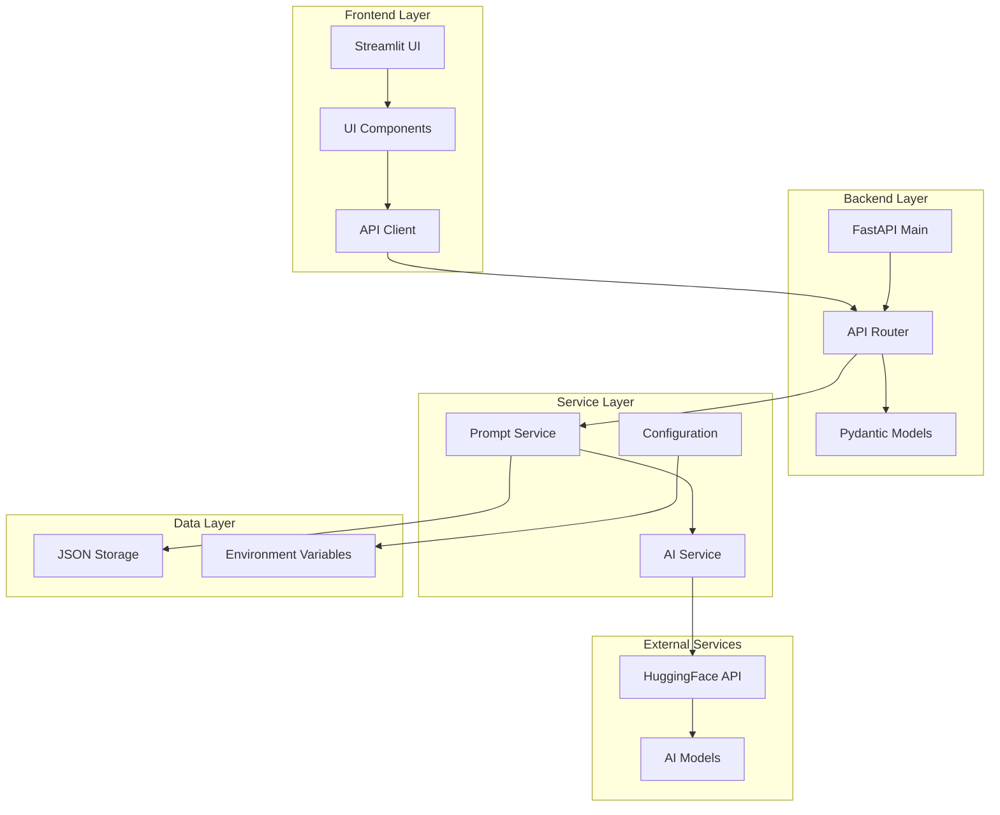

# ahmedrzakhan/ai-writing-prompt-generator

- **分类**：二、网文 / 长篇 AI 写作系统 库
- **链接**：https://github.com/ahmedrzakhan/ai-writing-prompt-generator
- **Stars**：0
- **语言**：Python
- **License**：None
- **Topics**：fastapi, huggingface, machine-learning, python, stramlit
- **GitHub 描述**：AI-powered writing prompt generator with personalized preferences. Built with FastAPI, Streamlit, and HuggingFace integration. Features smart prompt engineering, local storage, and export functionality.
- **本地描述**：AI-powered writing prompt generator with personalized preferences. Built with FastAPI, Streamlit, and HuggingFace integration. Features smart prompt engineering, local storage, and export functionality.
- **拉取时间**：2026-07-23 23:17:21

---

# 🎯 AI Writing Prompt Generator

A complete full-stack AI-powered writing prompt generator built with FastAPI backend and Streamlit frontend, integrated with HuggingFace Inference API for free AI text generation.


## 🌟 Features

- **🎨 Customizable Prompt Generation**: Configure genre, tone, setting, character types, themes, and more
- **🤖 AI-Powered**: Uses HuggingFace's free Inference API with intelligent fallbacks
- **💾 Local Storage**: Save, manage, and organize your favorite prompts
- **🔍 Search & Filter**: Find prompts by content, genre, tone, or favorites
- **📤 Export Functionality**: Export prompts as JSON or plain text files
- **🎲 Quick Generate**: Random prompt generation for instant inspiration
- **📱 Responsive UI**: Clean, modern interface that works on all devices
- **⚡ Real-time**: Fast generation with loading states and progress indicators

## 📸 Screenshots

### 🎨 Custom Preferences & Prompt Generation

Configure your writing preferences and generate personalized prompts:


### ✨ Generated Prompt Display

View your AI-generated prompt with detailed metadata and action buttons:


### 📚 Prompt Library Management

Search, filter, and manage your saved writing prompts:


### 📤 Library Export & Organization

Organize your prompts and export your entire library:


## 🏗️ Architecture

```
Streamlit Frontend ←→ FastAPI Backend ←→ HuggingFace Inference API
```

- **Backend**: FastAPI with async support, Pydantic models, and robust error handling
- **Frontend**: Streamlit with custom CSS, component-based architecture
- **AI Service**: HuggingFace integration with multiple model support and fallbacks
- **Storage**: JSON-based local storage with atomic operations

## 🎯 System Architecture Overview

### High-Level Architecture Diagram



### 🖥️ Frontend Architecture (Streamlit)

#### **Component Structure**

```
frontend/
├── streamlit_app.py           # Main application entry point
├── components/                # Reusable UI components
│   ├── preferences_form.py    # User preference selection
│   ├── prompt_generator.py    # Prompt display and actions
│   └── prompt_library.py      # Library management interface
└── utils/
    └── api_client.py          # HTTP client for backend communication
```

#### **Key Features**

- **Session State Management**: Maintains user preferences and current prompt state
- **Component-Based Design**: Modular, reusable UI components
- **Responsive Layout**: Custom CSS for modern, mobile-friendly interface
- **Error Handling**: User-friendly error messages and fallback states
- **Real-time Updates**: Dynamic content updates without page refresh

#### **Data Flow**

1. User interacts with preference forms
2. Components trigger API calls through `api_client`
3. Session state manages application state
4. UI components re-render based on state changes

### ⚙️ Backend Architecture (FastAPI)

#### **Layered Architecture**

```
backend/app/
├── main.py                    # Application entry point & CORS setup
├── api/
│   └── endpoints.py          # RESTful API routes
├── models/
│   └── prompt_models.py      # Pydantic data models & validation
├── services/
│   ├── prompt_service.py     # Business logic layer
│   └── ai_service.py         # AI integration layer
├── core/
│   └── config.py            # Configuration management
└── data/
    └── saved_prompts.json   # Local data persistence
```

#### **Service Layer Design**

**1. Prompt Service (`prompt_service.py`)**

- **Responsibilities**: CRUD operations, business logic, data validation
- **Key Methods**:
  - `generate_prompt()`: Orchestrates AI generation
  - `save_prompt()`: Persists prompts to storage
  - `search_prompts()`: Implements filtering and search
  - `export_prompts()`: Handles data export

**2. AI Service (`ai_service.py`)**

- **Responsibilities**: HuggingFace API integration, prompt engineering
- **Key Features**:
  - Model-specific prompt templates
  - Retry logic with exponential backoff
  - Graceful fallbacks when API unavailable
  - Response cleaning and validation

#### **Data Models (Pydantic)**

```python
# Core models with validation
PromptRequest      # User preferences with enums
PromptResponse     # Generated prompt with metadata
SavedPrompt        # Persisted prompt with timestamps
PreferencesModel   # Available options for UI
```

### 🤖 AI Integration Layer

#### **HuggingFace Integration Strategy**

```python
class HuggingFaceService:
    def __init__(self):
        self.api_token = settings.huggingface_api_token
        self.model_name = settings.model_name
        self.fallback_prompts = [...]  # Quality fallbacks

    async def generate_prompt(self, preferences: PromptRequest) -> str:
        # 1. Build model-specific prompt template
        # 2. Make async API request with retry logic
        # 3. Clean and validate response
        # 4. Return fallback if API fails
```

#### **Supported Models & Templates**

- **DialoGPT-large**: Conversational prompt template
- **FLAN-T5-large**: Instruction-following template
- **GPT-2-large**: Classic generation template

#### **Error Handling Strategy**

1. **Retry Logic**: 3 attempts with exponential backoff
2. **Fallback System**: High-quality pre-written prompts
3. **Graceful Degradation**: Application works offline
4. **User Feedback**: Clear error messages

### 💾 Data Architecture

#### **Storage Design**

```json
{
  "prompts": [
    {
      "id": "uuid-string",
      "prompt": "Generated writing prompt text",
      "preferences": { "genre": "Sci-fi", "tone": "Dark", ... },
      "generated_at": "2024-01-01T12:00:00",
      "saved_at": "2024-01-01T12:05:00",
      "model_used": "microsoft/DialoGPT-large",
      "is_favorite": false
    }
  ]
}
```

#### **Data Operations**

- **Atomic Writes**: JSON file operations are atomic
- **Backup Strategy**: File-based backup on errors
- **Search/Filter**: In-memory operations on loaded data
- **Export Formats**: JSON (structured) and TXT (readable)

### 🔧 Configuration Management

#### **Environment-Based Config**

```python
class Settings(BaseSettings):
    huggingface_api_token: str
    fastapi_host: str = "localhost"
    fastapi_port: int = 8000
    model_name: str = "microsoft/DialoGPT-large"
    max_retries: int = 3
    request_timeout: int = 30

    class Config:
        env_file = "../.env"
```

#### **Security Considerations**

- API tokens stored in environment variables
- No sensitive data in logs
- Local-only data storage
- CORS configured for development

### 🔄 Request Flow

#### **Prompt Generation Flow**

```
1. User fills preferences form in Streamlit
2. Frontend sends POST to /api/v1/generate-prompt
3. FastAPI validates request with Pydantic
4. Prompt Service calls AI Service
5. AI Service builds model-specific template
6. HuggingFace API call with retry logic
7. Response cleaning and validation
8. Return to frontend with metadata
9. UI displays prompt with save/export options
```

#### **Library Management Flow**

```
1. User navigates to Library tab
2. Frontend calls GET /api/v1/prompts with filters
3. Prompt Service loads and filters JSON data
4. Pagination and sorting applied
5. Formatted response returned
6. UI renders prompt cards with actions
7. User actions trigger PUT/DELETE endpoints
8. Real-time UI updates via session state
```

### 📊 Performance Characteristics

#### **Scalability Considerations**

- **Frontend**: Streamlit session state for 1 user
- **Backend**: Async FastAPI handles concurrent requests
- **Storage**: JSON suitable for thousands of prompts
- **AI API**: Rate limited by HuggingFace (30k chars/month free)

#### **Optimization Features**

- Async/await throughout backend
- Lazy loading of prompt library
- Pagination for large datasets
- Connection pooling for HTTP requests
- Caching of preference options

### 🛡️ Error Handling & Resilience

#### **Multi-Layer Error Handling**

1. **Frontend**: User-friendly error messages
2. **API Layer**: HTTP status codes and error responses
3. **Service Layer**: Business logic validation
4. **AI Integration**: Fallback prompts and retry logic
5. **Storage Layer**: File operation error handling

#### **Monitoring & Logging**

- Request/response logging in FastAPI
- Error tracking with context
- Performance metrics collection
- Health check endpoints for monitoring

## 🚀 Quick Start

### Prerequisites

- Python 3.7 or higher
- HuggingFace account (free) for API token

### Installation

1. **Clone the repository**

   ```bash
   git clone <repository-url>
   cd ai-writing-prompt-generator
   ```

2. **Set up environment**

   ```bash
   cp .env.example .env
   ```

3. **Configure your HuggingFace API token**

   - Visit [HuggingFace Settings](https://huggingface.co/settings/tokens)
   - Create a new token (read access is sufficient)
   - Edit `.env` and set `HUGGINGFACE_API_TOKEN=your_token_here`

4. **Run the application**
   ```bash
   python run.py
   ```

The launcher script will:

- Install all dependencies
- Start the FastAPI backend (http://localhost:8000)
- Start the Streamlit frontend (http://localhost:8501)
- Open your browser automatically

### Manual Setup (Alternative)

If you prefer manual setup:

```bash
# Install backend dependencies
cd backend
pip install -r requirements.txt

# Start backend (in one terminal)
python -m uvicorn app.main:app --reload

# Install frontend dependencies (in another terminal)
cd ../frontend
pip install -r requirements.txt

# Start frontend
streamlit run streamlit_app.py
```

## 📊 API Documentation

Once the backend is running, visit:

- **Interactive API Docs**: http://localhost:8000/docs
- **ReDoc Documentation**: http://localhost:8000/redoc

### Key Endpoints

- `POST /api/v1/generate-prompt` - Generate new writing prompt
- `GET /api/v1/prompts` - Get saved prompts with pagination/filtering
- `POST /api/v1/prompts` - Save a prompt to library
- `DELETE /api/v1/prompts/{id}` - Delete a prompt
- `PUT /api/v1/prompts/{id}/favorite` - Toggle favorite status
- `GET /api/v1/export` - Export prompts (JSON/TXT)

## 🎯 Usage Guide

### Generating Prompts

1. **Custom Preferences**:

   - Select genre (Sci-fi, Fantasy, Mystery, etc.)
   - Choose tone (Dark, Humorous, Serious, etc.)
   - Pick setting (Urban, Rural, Futuristic, etc.)
   - Define character type (Hero, Anti-hero, Villain, etc.)
   - Optional: Add themes, story length, additional elements

2. **Quick Generate**:
   - Click "Random Prompt" for instant inspiration
   - Uses randomized preferences for variety

### Managing Your Library

- **Save Prompts**: Click "Save to Library" after generation
- **Search**: Use the search bar to find specific prompts
- **Filter**: Filter by genre, tone, or favorites only
- **Export**: Download your entire library as JSON or text
- **Favorites**: Mark prompts as favorites for easy access

## 🔧 Configuration

### Environment Variables

```bash
# Required
HUGGINGFACE_API_TOKEN=your_hf_token_here

# Optional (with defaults)
FASTAPI_HOST=localhost
FASTAPI_PORT=8000
STREAMLIT_PORT=8501
MODEL_NAME=microsoft/DialoGPT-large
MAX_RETRIES=3
REQUEST_TIMEOUT=30
```

### Supported Models

The application supports multiple HuggingFace models:

- `microsoft/DialoGPT-large` (default) - Conversational AI
- `google/flan-t5-large` - Instruction-following
- `gpt2-large` - Classic text generation

Change the model in your `.env` file or through the configuration.

## 📁 Project Structure

```
ai-writing-prompt-generator/
├── backend/
│   ├── app/
│   │   ├── __init__.py
│   │   ├── main.py                 # FastAPI application
│   │   ├── models/
│   │   │   └── prompt_models.py    # Pydantic models
│   │   ├── services/
│   │   │   ├── ai_service.py       # HuggingFace integration
│   │   │   └── prompt_service.py   # Business logic
│   │   ├── api/
│   │   │   └── endpoints.py        # API routes
│   │   └── core/
│   │       └── config.py           # Configuration
│   ├── data/
│   │   └── saved_prompts.json      # Local storage
│   └── requirements.txt
├── frontend/
│   ├── streamlit_app.py           # Main Streamlit app
│   ├── components/
│   │   ├── preferences_form.py    # Preference selection
│   │   ├── prompt_generator.py    # Prompt display
│   │   └── prompt_library.py      # Library management
│   ├── utils/
│   │   └── api_client.py          # Backend communication
│   └── requirements.txt
├── .env.example                   # Environment template
├── run.py                         # Application launcher
└── README.md
```

## 🧪 Testing

### Manual Testing Checklist

- [ ] Backend starts without errors
- [ ] Frontend connects to backend successfully
- [ ] Prompt generation works with custom preferences
- [ ] Quick/random generation works
- [ ] Prompts can be saved to library
- [ ] Library displays saved prompts correctly
- [ ] Search and filtering work
- [ ] Favorite toggle works
- [ ] Export functionality works (JSON/TXT)
- [ ] Error handling displays user-friendly messages

### API Testing

Use the interactive docs at http://localhost:8000/docs to test individual endpoints.

## 🔒 Security & Privacy

- **Local Storage**: All prompts are stored locally in JSON files
- **API Security**: HuggingFace API token is kept secure in environment variables
- **No User Data**: No personal information is collected or transmitted
- **Rate Limiting**: Built-in retry logic respects API rate limits

## 🚨 Troubleshooting

### Common Issues

1. **Backend won't start**:

   - Check if port 8000 is available
   - Verify Python version (3.7+)
   - Check .env file configuration

2. **HuggingFace API errors**:

   - Verify your API token is correct
   - Check if you've exceeded rate limits (30k chars/month free)
   - Model might be loading (503 error) - app will retry automatically

3. **Frontend connection issues**:

   - Ensure backend is running first
   - Check if port 8501 is available
   - Verify environment variables

4. **Import errors**:
   - Make sure all dependencies are installed
   - Try upgrading pip: `pip install --upgrade pip`

### Getting Help

1. Check the [Issues](https://github.com/your-repo/issues) page
2. Review the API documentation at http://localhost:8000/docs
3. Check the console logs for detailed error messages

## 🎨 Customization

### Adding New Preferences

1. Update the enums in `backend/app/models/prompt_models.py`
2. Modify the prompt templates in `backend/app/services/ai_service.py`
3. Update the frontend forms in `frontend/components/preferences_form.py`

### Styling

The Streamlit app uses custom CSS. Modify the styles in `frontend/streamlit_app.py` in the `st.markdown()` section.

### AI Models

To use a different HuggingFace model:

1. Change `MODEL_NAME` in your `.env` file
2. Update the prompt templates in `ai_service.py` if needed
3. Test the integration thoroughly

## 📈 Performance

- **Generation Speed**: 2-5 seconds per prompt (depending on model and API load)
- **Local Storage**: Supports thousands of saved prompts
- **Memory Usage**: Minimal - uses streaming and pagination
- **API Limits**: Free tier provides 30k characters/month

## 🤝 Contributing

1. Fork the repository
2. Create a feature branch
3. Make your changes
4. Add tests if applicable
5. Submit a pull request

## 📄 License

This project is licensed under the MIT License - see the LICENSE file for details.

## 🙏 Acknowledgments

- **HuggingFace** for providing free AI model inference
- **FastAPI** for the excellent async web framework
- **Streamlit** for making beautiful web apps simple
- **Pydantic** for robust data validation

## 🚀 Deployment

### Local Development

The application is designed for local development and personal use.

### Docker (Optional)

A Dockerfile can be added for containerized deployment:

```dockerfile
# Example Dockerfile structure
FROM python:3.9-slim
WORKDIR /app
COPY . .
RUN pip install -r backend/requirements.txt
RUN pip install -r frontend/requirements.txt
EXPOSE 8000 8501
CMD ["python", "run.py"]
```

related:
  - methods/网文写作最强SOP.md
  - methods/最强写作方法论_全球最强综合版.md
related:
  - methods/网文写作最强SOP.md
  - methods/最强写作方法论_全球最强综合版.md
---

**Made with ❤️ for writers and creators everywhere**
