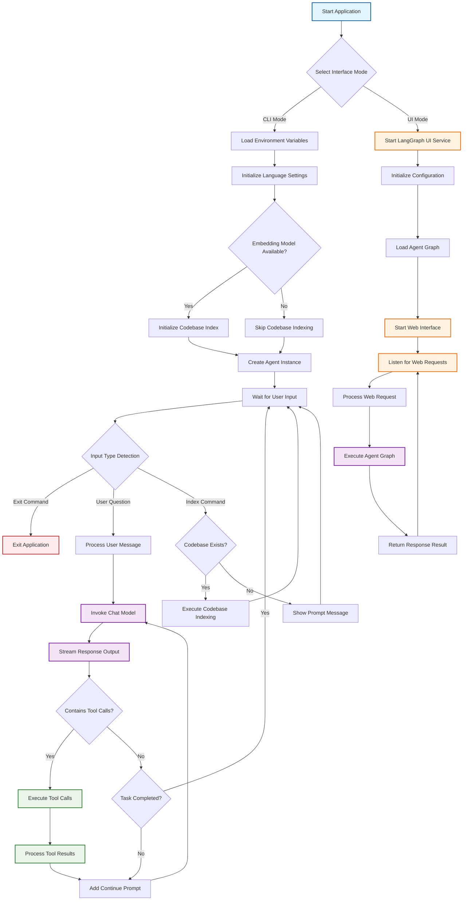

# dragons96/elpis-agent

- **分类**：二、网文 / 长篇 AI 写作系统 库
- **链接**：https://github.com/dragons96/elpis-agent
- **Stars**：2
- **语言**：Python
- **License**：MIT
- **Topics**：—
- **GitHub 描述**：An ultra-lightweight command-line AI coding assistant tool that mimics Cursor implementation. Elpis is an intelligent code assistant based on LangChain and OpenAI API that helps developers with code writing, file operations, and project management through natural language interaction.
- **本地描述**：An ultra-lightweight command-line AI coding assistant tool that mimics Cursor implementation. Elpis is an intelligent code assistant based on LangChain and OpenAI API that helps developers with code writing, file operations, and project management through natural language interaction.
- **拉取时间**：2026-07-23 23:21:08

---

# Elpis Agent

[中文文档](https://github.com/dragons96/elpis-agent/blob/main/README_zh.md) | English

An ultra-lightweight command-line AI coding assistant tool that mimics Cursor implementation. Elpis is an intelligent code assistant based on LangChain and OpenAI API that helps developers with code writing, file operations, and project management through natural language interaction.

> 🎓 **Learning Project**: This is a minimalist project that is perfect for learning and understanding the working principles of AI coding assistants such as Cursor. Very suitable for developers who want to explore the basic principles of AI driven development tools.

## Features

- 🤖 **Intelligent Conversation**: Natural language interaction based on large language models
- 📁 **File Operations**: Support for reading and writing file contents
- 💻 **Command Execution**: Execute terminal commands (with user confirmation)
- 🔧 **Tool Integration**: Built-in various development tools and features
- 🎯 **Continuous Dialogue**: Support for multi-turn conversations with context preservation
- ⚙️ **Configurable**: Support for custom models, temperature, and other parameters
- 🧠 **Persistent Memory**: SQLite-based conversation history with automatic persistence across sessions
- 🔍 **Codebase Indexing**: Intelligent codebase analysis and semantic search capabilities
- 🌐 **Multi-language Support**: Built-in internationalization (i18n) support
- 🏭 **Model Factory**: Flexible model initialization supporting multiple providers and types
- 💾 **Session Management**: Automatic session isolation and memory persistence using LangGraph checkpoints
- ✅ **User Confirmation**: Interactive confirmation for dangerous operations (file creation/deletion, command execution)
- 🔌 **MCP Tool Integration**: Support for Model Context Protocol (MCP) servers to extend functionality with external tools
- 🧠 **Advanced Memory with Mem0**: Intelligent summarization, key information extraction, and long-term memory management powered by Mem0

## Quick Start (Recommended)

### Run with uvx (No Installation Required)

The easiest way to use Elpis Agent is with `uvx`, which requires no local installation:

```bash
# From PyPI
uvx --from elpis-agent elpis --env_file /path/to/.env --lang [en|zh]
# Use mem0 to manage context
uvx --from elpis-agent[mem0] elpis --env_file /path/to/.env --lang [en|zh]

# From GitHub
uvx --no-cache --from https://github.com/dragons96/elpis-agent.git elpis --env_file /path/to/.env --lang [en|zh]
#  From Gitee and use mem0 to manage context
uvx --no-cache --from https://github.com/dragons96/elpis-agent.git elpis --with mem0ai --env_file /path/to/.env --lang [en|zh]

# From Gitee
uvx --no-cache --from https://gitee.com/dragons96/elpis-agent.git elpis --env_file /path/to/.env --lang [en|zh]
```

This command will:

- Automatically download and run the latest version of elpis-agent
- Use your custom environment file for configuration
- No need for local installation or virtual environment setup
- Always get the latest features and bug fixes

You can also use 'uvx' to directly run the UI interface without the need for local installation:

```bash
# From PyPI
uvx --from elpis-agent[ui] elpis-ui --env_file /path/to/.env --lang [en|zh]
# Use mem0 to manage context
uvx --from elpis-agent[ui,mem0] elpis --env_file /path/to/.env --lang [en|zh]

# From Github
uvx --no-cache --from https://github.com/dragons96/elpis-agent.git --with langgraph-cli[inmem] elpis-ui --env_file /path/to/.env --lang [en|zh]
# From Github and use mem0 to manage context
uvx --no-cache --from https://github.com/dragons96/elpis-agent.git --with langgraph-cli[inmem] --with mem0ai elpis-ui --env_file /path/to/.env --lang [en|zh]

# From Gitee
uvx --no-cache --from https://gitee.com/dragons96/elpis-agent.git --with langgraph-cli[inmem] elpis-ui --env_file /path/to/.env --lang [en|zh]
```

This will:

- Automatically download and run the latest version with UI interface
- Use your custom environment file for configuration
- No need for local installation or virtual environment setup
- Open a web interface in your browser for interactive use

### Requirements

- Python >= 3.11
- OpenAI API Key
- Create a `.env` file with your configuration (see Configuration section below)

## Development Setup

### For Secondary Development

If you want to modify the code or contribute to the project, follow these steps:

1. Clone the repository

```bash
git clone <repository-url>
cd elpis-agent
```

2. Create virtual environment

```bash
uv venv
.venv\Scripts\activate
```

3. Install dependencies

```bash
uv pip install -e .
```

4. Configure environment variables

```bash
cp .env.example .env
```

## Configuration

Create a `.env` file and fill in the necessary configurations:

```env
# Define a called CHAT model.
# *_BASE_URL:  Base URL for the model provider
CHAT_BASE_URL=https://api.openai.com/v1
# *_API_KEY:  API key for the model provider, if ollama model, do not set it.
CHAT_API_KEY=your_openai_api_key_here
# *_MODEL:  Model name
CHAT_MODEL=gpt-4o-mini
# *_PROVIDER:  Model provider, allow: [openai, ollama], default: openai. Other provider can use openai and update *_BASE_URL
CHAT_MODEL_PROVIDER=openai
# *_MODEL_TYPE:  Model type, allow: [chat, embedding], default: chat
CHAT_MODEL_TYPE=chat
# *_TEMPERATURE:  Model temperature, default: 0.3
CHAT_TEMPERATURE=0.3

# Define a called EMBEDDING model.
EMBEDDING_BASE_URL=https://api.openai.com/v1
EMBEDDING_API_KEY=your_openai_api_key_here
EMBEDDING_MODEL=text-embedding-3-small
EMBEDDING_MODEL_PROVIDER=openai
EMBEDDING_MODEL_TYPE=embedding
EMBEDDING_TEMPERATURE=0.3

# The name of the Chat model for the Agent is CAHT, which is the model defined above
CHAT_MODEL_KEY_PREFIX=CHAT
# The name of the Embedding model for the Agent is EMBEDDING, which is the model defined above (Optional - for codebase indexing)
EMBEDDING_MODEL_KEY_PREFIX=EMBEDDING

# General Settings
SYSTEM_PROMPT=                    # Custom system prompt (optional)

# MCP Configuration (Optional - for external tool integration)
MCP_FILE_PATH=mcp.json                   # Path to MCP servers configuration file

# Mem0 Advanced Memory Configuration (Optional)
# Mem0 provides intelligent summarization, key information extraction, and long-term memory management
# To use mem0, install with: "uvx --from elpis-agent[mem0] ..."

# Method 1: Cloud API Configuration (Recommended)
# Use Mem0's cloud service with API key - simplest setup
MEM0_API_KEY=m-********************

# Method 2: Self-hosted Model Configuration
# Configure your own models for mem0 - more control and privacy
# LLM model for mem0 processing (uses model defined above, e.g., CHAT)
MEM0_MODEL_KEY_PREFIX=CHAT
# Embedding model for mem0 vector storage (uses model defined above, e.g., EMBEDDING)
# If not set, defaults to mem0's built-in OpenAI embedding model (requires OPENAI_API_KEY)
MEM0_EMBEDDING_KEY_PREFIX=EMBEDDING
# OPENAI_API_KEY=your_openai_api_key_here  # Required if MEM0_EMBEDDING_KEY_PREFIX is not set
# Vector dimension for embedding model (default: 1536 for OpenAI models)
# Adjust this value to match your embedding model's output dimension
MEM0_VECTOR_STORE_EMBEDDING_MODEL_DIMS=1536

```

### Configuration Notes

- **Chat Model**: Required for all functionality
- **Embedding Model**: Optional, only needed for codebase indexing and semantic search
- **Language Settings**: Set `LANG=en` for English interface or `LANG=zh` for Chinese
- **UI Mode**: When using `elpis --ui`, the LangGraph UI will be available at the configured URL
- **MCP Integration**: Optional, allows integration with external MCP servers for additional tools
- **Mem0 Advanced Memory**: Optional, provides intelligent memory management with two configuration modes:
  - **Cloud Mode**: Use `MEM0_API_KEY` for Mem0's cloud service (easiest setup)
  - **Self-hosted Mode**: Use `MEM0_MODEL_KEY_PREFIX` and `MEM0_EMBEDDING_KEY_PREFIX` for custom models (more control)

### MCP Tool Integration

Elpis Agent supports Model Context Protocol (MCP) for integrating external tools and services. To use MCP tools:

1. Create a `mcp.json` configuration file in your project root:

```json
{
  "mcpServers": {
    "filesystem": {
      "command": "npx",
      "args": ["-y", "@modelcontextprotocol/server-filesystem", "/path/to/allowed/files"]
    },
    "brave-search": {
      "command": "npx",
      "args": ["-y", "@modelcontextprotocol/server-brave-search"]
    }
  }
}
```

2. Set the `MCP_FILE_PATH` environment variable (optional, defaults to `./mcp.json`)

3. Install required MCP servers (e.g., using npm/npx for Node.js-based servers)

4. Start Elpis Agent - MCP tools will be automatically loaded and available

**Available MCP Servers:**
- `@modelcontextprotocol/server-filesystem`: File system operations
- `@modelcontextprotocol/server-brave-search`: Web search capabilities
- `@modelcontextprotocol/server-git`: Git repository operations
- And many more from the MCP ecosystem

**Note**: MCP servers run as separate processes and communicate via stdio. Ensure the specified commands and arguments are correct for your system.

## Usage

### Command Line Interface

You can start Elpis Agent using elpis (recommended) or after local installation:

```bash

elpis
```

Or run directly with uv:

```bash
uv run elpis
```

### UI Interface

Elpis Agent also provides a web-based UI interface for easier interaction:

#### Local Installation and Run

After installation, you can start the UI interface using:

```bash
elpis-ui
```

Or run directly with UV:

```bash
uv run elpis-ui
```

### Interactive Commands

- Type your questions or requests in natural language
- Use `exit` or `quit` to end the session
- The agent can help with:
  - Code writing and debugging
  - File reading and modification
  - Terminal command execution
  - Project structure analysis
  - Development guidance

### Example Usage

```
> Can you help me create a Python function to calculate fibonacci numbers?
> Read the contents of main.py file
> Run the test command to check if everything works
> Help me refactor this code to make it more efficient
```

### Memory Persistence Examples

```bash
# First session
> Hello, my name is Alice and I'm working on a Python project
> What's my name?  # Agent remembers: Alice

# After restarting the application with same session
> Do you remember my name?  # Agent still remembers: Alice
> What project was I working on?  # Agent remembers: Python project
```

```python
# Cross-session memory persistence example
agent1 = LangGraphElpisAgent(chat_model=chat_model, session_id="project_analysis")
agent1.ask("Please analyze the main.py file")
# ... conversation continues ...

# Later, resume the same session
agent2 = LangGraphElpisAgent(chat_model=chat_model, session_id="project_analysis")
agent2.ask("What did we discuss about main.py earlier?")  # Agent remembers previous context

# User confirmation for dangerous operations
agent = LangGraphElpisAgent(chat_model=chat_model)
agent.ask("Please create a new config file with database settings")
# Output:
# [Elpis] Detected dangerous operation requiring confirmation:
#   1. create_file
#      target_file: config.json
#      content: {"database": {"host": "localhost", "port": 5432}}
# 
# Please confirm whether to execute the above operation (y/n): y
# [Elpis] User confirmed, executing operation...
```

**Note**: The agent automatically creates a `.elpis/memory.db` file in your current working directory to store conversation history. Different projects will have separate memory databases.

## Project Structure

```
elpis-agent/
├── src/elpis/
│   ├── __init__.py          # Package initialization
│   ├── main.py              # Main entry point for CLI
│   ├── langgraph_agent.py   # LangGraph-based agent with SQLite memory
│   ├── tools.py             # Tool definitions and implementations
│   ├── prompts.py           # Prompt templates
│   ├── constants.py         # Constants and configurations
│   ├── codebase.py          # Codebase indexing and semantic search
│   ├── factories/           # Factory pattern implementations
│   │   ├── __init__.py
│   │   ├── model_factory.py      # Model factory for flexible initialization
│   │   └── checkpointer_factory.py # Checkpointer factory for memory management
│   ├── i18n/                # Internationalization support
│   │   ├── __init__.py
│   │   ├── en.py            # English language support
│   │   └── zh.py            # Chinese language support
│   └── ui/                  # Web UI components
│       ├── __init__.py
│       ├── graph.py         # LangGraph UI integration
│       ├── graph_main.py    # UI main entry point
│       └── langgraph.json   # LangGraph configuration
├── tests/                   # Test files
├── docs/                    # Documentation
├── .env.example             # Environment variables template
├── pyproject.toml           # Project configuration
├── README.md                # Project documentation (English)
├── README_zh.md             # Project documentation (Chinese)
└── LICENSE                  # License file
```

## Agent Workflow



## Core Components

### ElpisAgent

The core AI agent class responsible for:

- Handling tool calls and message flows
- Maintaining conversation context
- Integrating codebase indexing and search capabilities
- **SQLite-based Persistent Memory**: Uses SQLite database for reliable memory storage
- **Session Isolation**: Each conversation session maintains separate memory context
- **Cross-session Memory Recovery**: Automatically restores conversation history when resuming sessions
- **Memory Management**: Automatic cleanup of old sessions and efficient memory usage
- **Thread Safety**: Safe for concurrent access across multiple sessions
- **Automatic Persistence**: All conversations are automatically saved without manual intervention
- **User Confirmation System**: Interactive confirmation for dangerous operations using LangGraph interrupt functionality
  - Automatic detection of risky operations (file creation/deletion, command execution)
  - Real-time user interaction through command-line interface
  - Graceful handling of user approval/rejection decisions
  - Detailed operation information display for informed decision-making

### CodebaseIndexer

Intelligent codebase analysis component:

- Semantic search across project files
- Support for multiple programming languages
- Automatic gitignore filtering
- Vector-based document indexing
- Configurable text chunking strategies

### Model Factory

Flexible model initialization system:

- Support for multiple model providers (OpenAI, etc.)
- Chat and embedding model types
- Environment-based configuration
- Prefix-based model selection

### Tools

Built-in tools include:

- **read_file**: Read file contents
- **run_terminal_cmd**: Execute terminal commands with user confirmation

**MCP Tools**: When MCP servers are configured, additional tools become available automatically:
- **Filesystem operations**: Advanced file and directory management
- **Web search**: Real-time web search capabilities
- **Git operations**: Repository management and version control
- **And more**: Extensible through the MCP ecosystem

### Memory Management

The agent implements persistent memory management using SQLite:

- **SQLite-based Storage**: Conversation history stored in `.elpis/memory.db`
- **Session Isolation**: Different session IDs maintain separate conversation histories
- **Automatic Persistence**: Memory survives application restarts
- **LangGraph Checkpoints**: Built on LangGraph's checkpoint system for reliability
- **Thread Safety**: Concurrent access support with built-in locking mechanisms
- **Auto-initialization**: Database and directory created automatically on first run

### Internationalization (i18n)

Multi-language support:

- Language detection and selection
- Localized user interface messages
- Extensible language pack system

## Configuration

Environment variables can be configured in the `.env` file:

### Chat Model Configuration

| Variable                | ion                                 | Default                   |
| ----------------------- | ----------------------------------- | ------------------------- |
| `CHAT_BASE_URL`       | Chat model API                      | `https://apenai.com/v1` |
| `CHAT_API_KEY`        | Chat model API                      | -                         |
| `CHAT_MODEL`          | Chat model name                 g1` |                           |
| `CHAT_MODEL_PROVIDER` | Chat model provr (openlama)         | `i`                     |
| `CHAT_MODEL_TYPE`     | Chat model type                     |                           |
| `CHAT_TEMPERATURE`    | Chat model temperature              | `0.3`                   |

### Embedd ing Model C onfiguration

| Variable                      | Description                                        | Default |
| ----------------------------- | -------------------------------------------------- | ------- |
| `EMBEDDING_BASE_URL`        | Embedding model APIe URL                           |         |
| `EMBEDDING_API_KEY `        | Embedding model API key                            |         |
| `EMBEDDING_MODEL `          | Embedding model name                               |         |
| `EMBEDDING_MODEL_PROVIDER ` | Embedding model provider (openai, ollama)          |         |
| `EMBEDDING_MODEL_TYPE`      | Embedding model type                      mbedding |         |
| `EMBEDDING_TEMPERATU`       | Embedding model    temperature                     | `0.3` |

### Model Key Prefixes

| Variable                       | Description                              | Defalut |
| ------------------------------ | ---------------------------------------- | ------- |
| `CHAT_MODEL_KEY_PREFIX`      | Prefix for chat model configuration      |         |
| `EMBEDDING_MODEL_KEY_PREFIX` | Prefix for embedding model configuration |         |

### General Settings

| Variable          | Description                | Default |
| ----------------- | -------------------------- | ------- |
| `SYSTEM_PROMPT` | Custom system prompt       | -       |
| `LANG`          | Interface language (zh/en) | `zh`  |

### Memory Configuration

The SQLite-based memory system automatically manages conversation history:

- **Database Location**: `.elpis/memory.db` in current working directory
- **Session Management**: Each session ID maintains separate conversation threads
- **Automatic Cleanup**: No manual configuration required
- **Persistence**: Conversations survive application restarts
- **Thread Safety**: Built-in support for concurrent access

### User Confirmation Configuration

The agent includes a safety system that requires user confirmation for potentially dangerous operations:

- **Dangerous Operations**: File creation, deletion, editing, and command execution
- **Interactive Confirmation**: Real-time prompts through command-line interface
- **Customizable**: Can be configured to include/exclude specific operations
- **Graceful Handling**: Proper cancellation and error handling for rejected operations

```python
# Customize dangerous operations list
agent.DANGEROUS_TOOLS = {
    'create_file',
    'delete_file', 
    'edit_file',
    'run_terminal_cmd'
}

# Disable confirmation for specific tools
agent.DANGEROUS_TOOLS.discard('create_file')

# Disable all confirmations
agent.DANGEROUS_TOOLS = set()
```

### Model Configurati

on Prefixes

The model factory supports flexible configuration using prefixes:

- `CHAT_MODEL_KEY_PRE FIX` - For chat model configuration
- `TOOL_MODEL_KEY_PREFIX` - For tool model configuration
- `EMBEDDING_MODEL_KEY_PREFIX` - For embedding model configuration

Each prefix supports:

- `{PREFIX}_MODEL` - Model name
- `{PREFIX}_MODEL_PROVIDER` - Provider (openai, anthropic, etc.)
- `{PREFIX}_MODEL_TYPE` - Type (chat, embedding)
- `{PREFIX}_API_KEY` - API key
- `{PREFIX}_BASE_URL` - Base URL
- `{PREFIX}_TEMPERATURE` - Temperature setting

## Development

### Setting up Development Environment

1. Clone the repository
2. Create virtual environment: `uv venv`
3. Activate environment: `.venv\Scripts\activate`
4. Install in development mode: `uv pip install -e .`
5. Install development dependencies: `uv pip install pytest black flake8`

### Code Formatting

```bash
black src/
flake8 src/
```

### Building Distribution

```bash
python -m build
```

## TODO - Feature Roadmap

The following are the planned functional features that will be gradually implemented in subsequent versions:

###  📚  Code repository and indexing function

-[X] **Code Base Analysis**: ✅  Automatically analyze project structure and dependency relationships
-[X] **Intelligent Index**: ✅  Establish code semantic index to support fast retrieval
-[X] **Multi language support**: ✅  Built in internationalization (i18n) support, supporting both Chinese and English interfaces
-[ ] **Context aware**: Provide more accurate suggestions based on the context of the code repository
-[ ] **Cross file Reference**: Intelligent recognition and processing of code reference relationships across files
-[ ] **Advanced Code Library Features**: Code Dependency Graph, Refactoring Suggestions, Code Quality Analysis
-[ ] **Incremental Index**: Supports incremental index updates for file changes

###  🌐  Improved online search tools

-[ ] **Multi search engine support**: Integrated with search engines such as Google, Bing, DuckDuckGo, etc
-[ ] **Technical Document Search**: Search optimization specifically for technical documents and API documents
-[ ] **Real time information acquisition**: Obtain the latest technical information and solutions
-[ ] **Search result filtering**: Intelligent filtering and sorting of search results

###  🧠  Message and operation memorization
-[X] **Persistent Memory System**: ✅  SQLite based dialogue history storage and session management
-[ ] **Operation Record**: Record the user's operating habits and preferences
-[ ] **Intelligent Recommendation**: Providing personalized suggestions based on historical records
-[X] **Advanced Memory Features**: Intelligent Summary, Key Information Extraction, Long Term Memory Management

###  🔌  IDE plugin development
-[ ] **VS Code Plugin**: Developing Official VS Code Extension
-[ ] **JetBrains Plugin**: Supports JetBrains series IDEs such as IntelliJ IDEA and PyCharm
-[ ] **Vim/Neovim plugin**: provides integrated support for Vim users
-[ ] **Real time Collaboration**: Seamless Collaboration with Elpis in IDE

###  🎯  Other planning functions
-[ ] **Code Review**: Automatic Code Review and Quality Check
-[ ] **Test Generation**: Intelligent Generation Unit Testing and Integration Testing
-[ ] **Document Generation**: Automatically generate code and API documentation
-[ ] **Code Base Indexing Guide**: Provides best practices and usage guidelines for code base indexing

> 💡 **Contribution Tip**: If you are interested in the above features or have other suggestions, please feel free to submit an Issue or Pull Request!
## License

This project is licensed under the MIT License - see the [LICENSE](https://github.com/dragons96/elpis-agent/blob/main/LICENSE) file for details.

## Contributing

We welcome contributions! Please feel free to submit a Pull Request. For major changes, please open an issue first to discuss what you would like to change.

## Author

- **dragons96** - [521274311@qq.com](mailto:521274311@qq.com)

related:
  - methods/网文写作最强SOP.md
  - methods/最强写作方法论_全球最强综合版.md
related:
  - methods/网文写作最强SOP.md
  - methods/最强写作方法论_全球最强综合版.md
---

**Note**: This project is inspired by Cursor and aims to provide similar functionality in a command-line interface with extensible tool integration.
