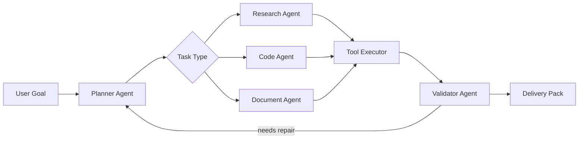

# quentinzh/agentic-consult-workbench

- **分类**：二、网文 / 长篇 AI 写作系统 库
- **链接**：https://github.com/quentinzh/agentic-consult-workbench
- **Stars**：0
- **语言**：Python
- **License**：MIT
- **Topics**：—
- **GitHub 描述**：A multi-agent workflow demo for research writing, code repair, document automation, and verifiable AI delivery.
- **本地描述**：A multi-agent workflow demo for research writing, code repair, document automation, and verifiable AI delivery.
- **拉取时间**：2026-07-23 23:28:55

---

# Agentic Consult Workbench

> 将“一次性 AI 回答”升级为“可规划、可执行、可验证”的多 Agent 交付流水线。


Agentic Consult Workbench 是一个面向科研写作、代码开发、文档处理和日常咨询交付的 AI Agent 工作流样例项目。它的目标不是再做一个聊天机器人，而是把复杂任务拆成可追踪的阶段：理解目标、规划任务、调度专长 Agent、调用工具执行、验证结果、沉淀交付物。

这个仓库可作为 Xiaomi MIMO API 申请中“使用 Agent 或 AI 驱动构建的具体成果”的项目证明：README 展示完整方案，CLI 展示运行日志，`docs/` 展示架构与评估方法，`examples/` 展示可直接粘贴到申请表中的项目描述。

## Why

复杂任务很少是“一问一答”能完成的。

科研写作、代码重构、PDF/Word/PPT/表格处理、文献核验、AI 产品调研等工作通常包含多个隐性步骤：

- 需要先理解目标，再拆解任务。
- 需要读取文件、代码、日志或网页，而不是凭空回答。
- 需要跨工具执行，例如代码运行、文档渲染、表格计算、浏览器检查。
- 需要结果验证，例如单元测试、引用核验、格式检查、截图比对。
- 需要把过程沉淀为可复用工作流，而不是每次重新提示。

Agentic Consult Workbench 用多 Agent 协作把这些步骤显式化，让 AI 从“答案生成器”变成“交付协作者”。

## What It Builds

本项目模拟并固化了一个可扩展的 Agent 工作流：

| Layer | Purpose | Output |
| --- | --- | related:
  - methods/网文写作最强SOP.md
  - methods/最强写作方法论_全球最强综合版.md
related:
  - methods/网文写作最强SOP.md
  - methods/最强写作方法论_全球最强综合版.md
--- |
| Planner Agent | 将用户目标拆解为任务图，判断任务类型和风险点 | Task graph / routing plan |
| Research Agent | 处理论文、资料、引用、调研类任务 | Evidence notes / source checklist |
| Code Agent | 处理代码阅读、修改、测试与回归风险 | Patch plan / test plan |
| Document Agent | 处理 PDF、Word、PPT、表格等交付物 | Render checklist / formatting plan |
| Tool Executor | 调用本地命令、文件处理、浏览器或 API | Execution log |
| Validator Agent | 对结果进行闭环验证 | Validation score / handoff summary |

## Core Pain Points

### 1. 长链任务容易断

普通 AI 对话在 3 到 5 步后容易丢失上下文，尤其是需要连续执行“读文件 -> 分析 -> 修改 -> 测试 -> 复查”的任务。本项目把长链任务拆为结构化阶段，每个阶段都有明确输入、输出和验证标准。

### 2. 工具调用缺乏统一编排

真实工作不是只调用一个模型。它可能同时需要代码解释器、浏览器、Git、文档转换、表格计算、截图验证。本项目用 Orchestrator 统一调度不同 Agent 和工具，把“会回答”推进到“能做事”。

### 3. 缺少交付前验证

很多 AI 生成结果看似完整，但没有经过测试、渲染、引用检查或人工可读的验收清单。本项目把 Validator Agent 放在末尾，强制输出质量门禁。

## Core Logic Flow



The workflow supports long-chain reasoning and multi-agent collaboration:

1. Intent mapping: identify the real goal, expected deliverable, constraints, and risk level.
2. Task decomposition: split the request into ordered tasks with owner Agent and validation rule.
3. Specialist execution: route work to Research, Code, or Document Agent.
4. Tool use: run local commands, inspect files, render artifacts, or call external APIs.
5. Verification: check tests, references, formatting, logs, and final handoff.
6. Iteration: if validation fails, feed the error back into the Planner Agent.

## Quick Start

Clone the project and run the demo CLI:

```bash
python -m agentic_consult_workbench --sample
```

Run a custom goal:

```bash
python -m agentic_consult_workbench \
  --goal "检查一篇论文的语法、引用格式和 Word 排版，并输出修改清单" \
  --mode document
```

Run tests:

```bash
python -m unittest discover -s tests
```

## Example Output

```text
Goal: 检查一篇论文的语法、引用格式和 Word 排版，并输出修改清单
Mode: document

[Planner Agent]
- Build task graph
- Route document formatting checks to Document Agent
- Route citation checks to Research Agent

[Document Agent]
- Inspect artifact structure
- Prepare render checklist
- Flag layout risks

[Research Agent]
- Verify citation consistency
- Detect missing metadata

[Validator Agent]
- Validation score: 0.92
- Required evidence: render screenshot, citation checklist, final DOCX/PDF
```

## Project Scenarios

### Scenario A: 科研论文与参考文献检查

痛点：论文语法、引用格式、参考文献一致性和 Word/PDF 排版检查往往需要人工反复核对。

Agent 流程：

- Planner Agent 拆解语法、引用、排版、最终交付四类任务。
- Research Agent 检查参考文献信息完整性和引用一致性。
- Document Agent 处理 Word/PDF 渲染、页面结构和格式风险。
- Validator Agent 输出最终验收清单。

### Scenario B: 代码项目分析与修改

痛点：代码问题通常需要先读仓库，再定位根因，再做局部修改，最后运行测试。

Agent 流程：

- Planner Agent 判断代码语言、模块边界和风险范围。
- Code Agent 搜索相关文件、提出最小修改方案。
- Tool Executor 运行测试、lint 或构建命令。
- Validator Agent 对失败日志进行二次归因。

### Scenario C: AI 平台调研与表格交付

痛点：价格、模型能力、套餐权益等信息变化快，人工整理容易过时。

Agent 流程：

- Research Agent 收集来源并记录时间。
- Document Agent 或 Spreadsheet Agent 生成结构化表格。
- Validator Agent 检查字段完整性和可追溯链接。

## Repository Structure

```text
agentic-consult-workbench/
├── agentic_consult_workbench/
│   ├── __init__.py
│   ├── __main__.py
│   ├── cli.py
│   └── workflow.py
├── docs/
│   ├── ARCHITECTURE.md
│   └── EVALUATION.md
├── examples/
│   ├── sample_tasks.json
│   └── xiaomi_mimo_application.md
├── tests/
│   └── test_workflow.py
├── .github/workflows/ci.yml
├── .gitignore
├── LICENSE
└── README.md
```

## For Xiaomi MIMO Application

This repository aligns with the following application answer:

> 我构建了一个面向科研写作、代码开发和日常咨询交付的 AI Agent 工作流。核心痛点是：传统 AI 对复杂任务往往只能给一次性答案，遇到论文格式检查、文献核验、代码调试、PDF/Word/PPT/表格处理等长链任务时，仍需要人工反复拆解、验证和修正，效率低且容易遗漏细节。
>
> 我的 Agent 系统采用“规划 Agent + 执行 Agent + 验证 Agent”的协作流程：先将用户目标拆解为可执行子任务，再根据任务类型调用浏览器、代码运行环境、文档/表格/演示文稿处理工具等能力完成操作，最后由验证环节检查引用、格式、测试结果和交付物质量。对于复杂任务会进行多轮长链推理，例如先理解需求，再读取文件或代码仓库，定位问题，修改实现，运行测试或渲染预览，最后输出可直接使用的文件或结论。

Recommended proof materials for the application:

- GitHub repository link.
- Screenshot of this README and architecture diagram.
- Terminal screenshot of `python -m agentic_consult_workbench --sample`.
- Screenshot of test result: `python -m unittest discover -s tests`.

## Validation Philosophy

The workflow treats every final answer as a hypothesis until it has evidence.

Typical evidence includes:

- Unit test output for code changes.
- Rendered screenshots for documents or frontend work.
- Source links and access dates for research.
- Diff summary for repository edits.
- Human-readable acceptance checklist.

## Roadmap

- Add OpenAI-compatible model provider adapters.
- Add persistent run logs in JSONL format.
- Add browser automation hooks for local app verification.
- Add document rendering and screenshot comparison examples.
- Add multi-agent parallel execution mode.

## License

MIT License. See [LICENSE](https://github.com/quentinzh/agentic-consult-workbench/blob/main/LICENSE).
