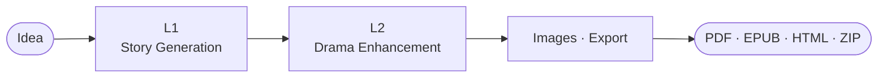

# HieuNTg/STORYFORGE

- **分类**：二、网文 / 长篇 AI 写作系统 库
- **链接**：https://github.com/hieuntg/storyforge
- **Stars**：1
- **语言**：Python
- **License**：MIT
- **Topics**：ai, ai-agents, alpinejs, branching-narrative, chromadb, creative-writing, docker, fastapi, gemini, image-generation, llm, multi-agent, openai, pipeline, python, rag, self-hosted, sse, story-generator
- **GitHub 描述**：AI-powered story generator with multi-agent drama simulation, branching narratives, and character-consistent image generation. Self-hosted & privacy-first.
- **本地描述**：AI-powered story generator with multi-agent drama simulation, branching narratives, and character-consistent image generation. Self-hosted & privacy-first.
- **拉取时间**：2026-07-23 23:31:43

---

<h1 align="center">StoryForge</h1>

<p align="center"><strong>AI story generation with multi-agent drama simulation</strong></p>

<p align="center">
  <a href="https://www.python.org/"></a>
  <a href="https://fastapi.tiangolo.com"></a>
  <a href="LICENSE"></a>
  <a href="README.vi.md">Tiếng Việt</a>
</p>

<p align="center">
  Turn a one-sentence idea into a complete, drama-rich Vietnamese web novel — with character-consistent images, cinematic backgrounds, and any OpenAI-compatible LLM. Self-hosted.
</p>

<p align="center">
  
</p>

---

## Why

Most AI writers produce flat stories. StoryForge turns each character into an **autonomous agent** that argues, allies, and betrays in a multi-round drama simulation — uncovering conflicts the author never planned, then rewriting around them until quality thresholds clear.

---

## Sample output

Generated by the pipeline itself — **character-consistent portraits** that keep the same face across every chapter, plus a **cinematic scene background**, for a Vietnamese tiên hiệp (cultivation) story. All rendered locally for free.

<table>
  <tr>
    <td align="center" width="33%"><br/><sub><b>Triệu Thiên Phong</b> · nam chính</sub></td>
    <td align="center" width="33%"><br/><sub><b>Tiểu Vũ</b> · nữ chính</sub></td>
    <td align="center" width="33%"><br/><sub><b>Hắc Phong Lão Tổ</b> · phản diện</sub></td>
  </tr>
</table>

<p align="center">
  <br/>
  <sub>Scene background — the same characters, kept consistent across chapters · <a href="#image-generation">how to set this up ↓</a></sub>
</p>

---

## Quick Start

```bash
git clone https://github.com/HieuNTg/STORYFORGE.git
cd STORYFORGE
pip install -r requirements.txt
cd frontend && npm install && cd ..

# Windows PowerShell: start backend + frontend in two windows
./dev.ps1
```

Manual mode is still available: run `python app.py` for the API (`:7860`) and `cd frontend && npm run dev -- --port 3001` for the UI (`:3001`).

Then open **http://localhost:3001/forge/** → **Settings → API Keys** (add provider profiles + choose models) → **Forge** → **Run** → **Library / Reader / Branching / Simulation** → **Export** (PDF/EPUB/HTML/ZIP).

---

## Features

- **2-layer pipeline** — L1 story generation → L2 drama simulation, with checkpoints, SSE streaming, optional L3 sensory polish
- **13 specialized agents** — drama critic, editor, pacing, dialogue, reader simulator, …; 6-dim LLM-as-judge auto-revision
- **Vietnamese-first** — VN names default; Chinese tiên hiệp / wuxia / xianxia and Western/Sci-Fi optional; arc scaling by chapter count
- **Continuation tools** — multi-path preview, outline editor, collaborative polish, consistency checker, mid-story insertion, retroactive fixes
- **Local-library-first flows** — Reader, Branching, Simulation, and Characters start from stories already saved in the local library; no fake `demo` sessions or pasted orphan text.
- **Branch reader** — LLM-generated CYOA, SVG tree + minimap, undo/redo, bookmarks, WebSocket multi-user, EPUB tree export
- **Character-consistent images** — the same face carries across every chapter (reference-image / IP-Adapter consistency) plus cinematic scene backgrounds. Free local generation via HuggingFace FLUX or the [FlowKit provider](https://github.com/HieuNTg/STORYFORGE/blob/main/docs/flowkit-integration.md) (Imagen 3, local-only — account-ban risk, use a secondary Google account); paid via DALL·E / Seedream. See [Sample output](#sample-output) and the [setup table below](#image-generation).
- **Provider profiles + model dropdowns** — Settings has quick-add cards for Gemini, Anthropic, OpenAI, OpenRouter Free, Z.AI, and Kyma. Model choice is a select list (including Gemini/Gemma, OpenRouter free text models, OpenAI/Anthropic, GLM/Qwen/DeepSeek fallbacks), and L1/L2/cheap-model routing chooses from configured provider profiles instead of raw text fields.
- **Any OpenAI-compatible LLM** — OpenAI, Gemini, Anthropic, OpenRouter, Z.AI, Kyma, Ollama, custom; preemptive rate-limit switching, latency-aware routing, smart cheap/premium routing, SQLite cache
- **Security** — CSRF double-submit, 10 MB body cap, prompt-injection middleware, encrypted secrets at rest

---

## Configuration

Settings tab persists to `data/config.json`. When `STORYFORGE_SECRET_KEY` is set,
sensitive fields in that file are encrypted. Key env vars:

| Variable | Purpose |
|----------|---------|
| `STORYFORGE_API_KEY` / `STORYFORGE_BASE_URL` / `STORYFORGE_MODEL` | provider key, OpenAI-compatible base URL, primary model |
| `STORYFORGE_SECRET_KEY` | encryption/signing key — **set in production** for encrypted secrets |
| `STORYFORGE_AUTH_REQUIRED` | `1` = enforce JWT/RBAC on sensitive API routes |
| `REDIS_URL` | required for multi-instance (`NUM_WORKERS>1`) shared cache/sessions |
| `STORYFORGE_ALLOWED_ORIGINS` | CORS origins (comma-separated) |
| `STORYFORGE_HANDOFF_STRICT` | `1` = fail-fast on malformed L1→L2 signals (default: warn) |
| `STORYFORGE_SEMANTIC_STRICT` | `1` = fail-fast on missed foreshadowing payoffs (default: warn) |
| `CHROMA_PERSIST_DIR` / `CHROMA_COLLECTION_NAME` | RAG persistence |

Per-layer model overrides, drama ceilings, batch size, voice-revert anchoring, etc. live in `config/defaults.py` (`PipelineConfig`) and the Settings UI. Agent prompts are editable in `data/prompts/agent_prompts.yaml`.

### Image generation

Images are **off by default** (`image_provider = none` → text-only). Pick a provider in **Settings → API Keys → Provider hình ảnh**, or set it in `data/config.json`:

| Provider | Setup | Cost | Notes |
|----------|-------|------|-------|
| `none` | — | — | Default. No image calls. |
| `huggingface` | Set `hf_token` | **Free tier** | `FLUX.1-schnell` via HF Inference API — easiest free path. |
| `dalle` | Set `image_api_key` (+ optional `image_api_url`) | Paid | OpenAI / Azure-compatible image endpoint. |
| `seedream` | Set `seedream_api_key` + `seedream_api_url` | Paid | ByteDance Seedream; also the default character-consistency engine. |
| `flowkit` | Chrome extension + Google Labs login | **Free\*** | Local-only proxy to Imagen 3. **\*Account-ban risk — use a secondary Google account.** Full walkthrough: [FlowKit guide](https://github.com/HieuNTg/STORYFORGE/blob/main/docs/flowkit-integration.md). |

**Character consistency** — set `enable_character_consistency = true` to reuse a character's first portrait as a reference image, so the same face carries across every chapter (`character_consistency_provider`: `seedream` or `replicate`). Visual style is set by `image_prompt_style` (default `cinematic`) and portraits default to `9:16`. The [sample portraits above](#sample-output) were produced this way.

### Current UI routes

| Route | Purpose | Notes |
|-------|---------|-------|
| `/library/` | Local story library | Source of truth for reader, branching, simulation, and character tools |
| `/forge/` | One-sentence story creation pipeline | Runs the main generation flow |
| `/reader/` | Story/chapter picker | Opens `/reader/[storyId]/[chapterId]` after a local story is selected |
| `/branching/` | Branch-session starter | Selects a local story, then creates a real `/branching/[sessionId]/` session |
| `/simulation/` | Multi-character stage setup | Selects a local story and characters; transcript simulation can be enabled via config |
| `/characters/` | Character list/detail/generation | Story picker is controlled and library-backed |
| `/settings/` | General, API Keys, L1/L2 settings | Provider quick-add, model dropdowns, image style select |
| `/providers/` | Provider status table | Shows configured provider profiles only; legacy Primary/Mặc định row is hidden |


### Test markers

```bash
pytest tests/ -v -m "not calibration and not bench"   # fast subset
pytest tests/ -v -m calibration                       # real-model calibration
```

---

## Architecture



L1→L2 signals: `conflict_web` + `foreshadowing_plan` feed the simulator; `arc_waypoints` + `threads` feed the analyzer/enhancer; `voice_fingerprints` preserve speaker voice through L2 rewrites.

See [`docs/system-architecture.md`](https://github.com/HieuNTg/STORYFORGE/blob/main/docs/system-architecture.md) for the full flow.

---

## Documentation

- [`docs/`](https://github.com/HieuNTg/STORYFORGE/blob/main/docs/README.md) — full index (architecture, code standards, deployment)
- [`docs/adr/`](https://github.com/HieuNTg/STORYFORGE/blob/main/docs/adr/) — architecture decision records
- [CONTRIBUTING.md](https://github.com/HieuNTg/STORYFORGE/blob/main/CONTRIBUTING.md) — dev setup, code style, PR process

related:
  - methods/网文写作最强SOP.md
  - methods/最强写作方法论_全球最强综合版.md
---

## License

[MIT](https://github.com/HieuNTg/STORYFORGE/blob/main/LICENSE) — Copyright 2026 StoryForge Contributors
