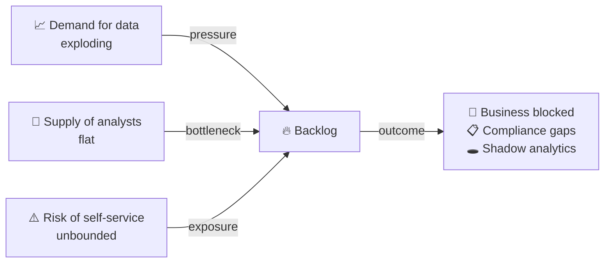
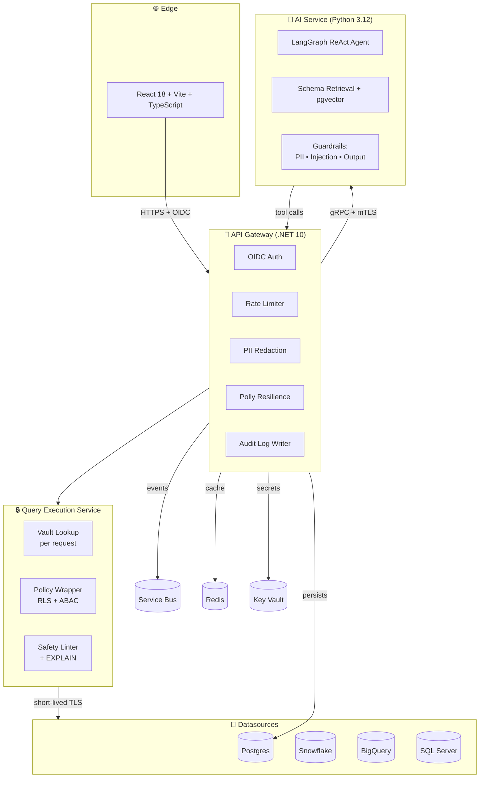
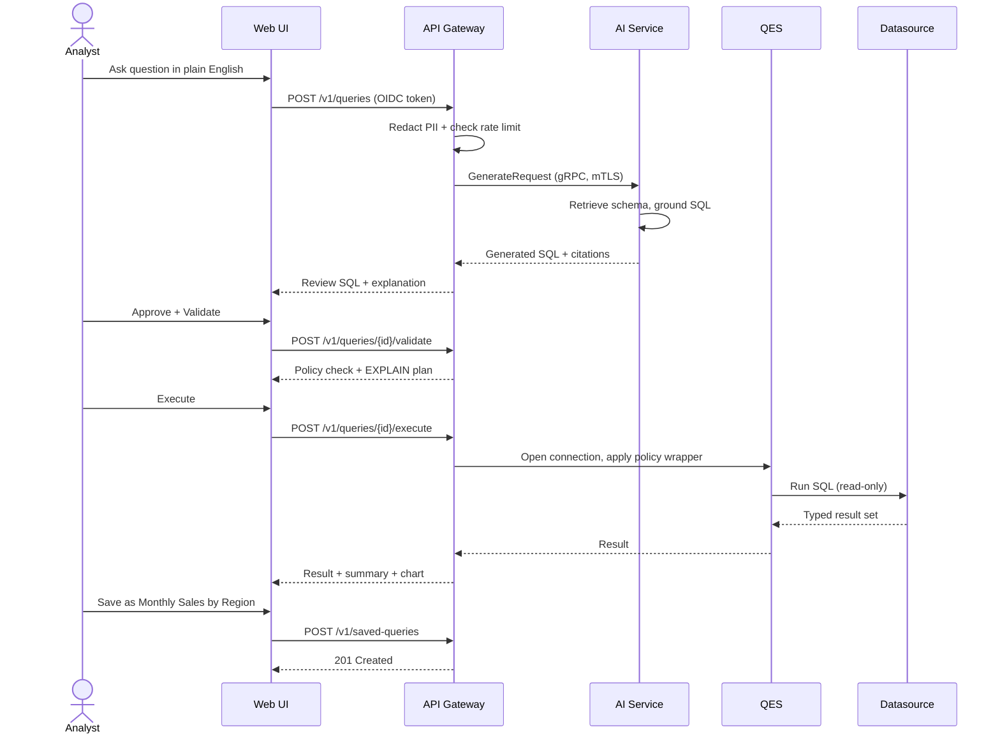
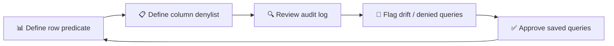
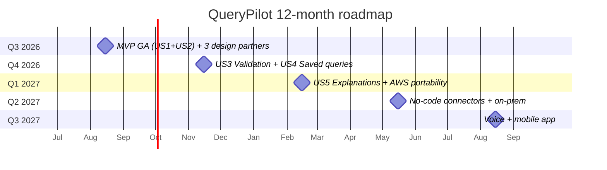

# rcrock1978/QueryPilot

- **分类**：二、网文 / 长篇 AI 写作系统 库
- **链接**：https://github.com/rcrock1978/querypilot
- **Stars**：0
- **语言**：Python
- **License**：None
- **Topics**：—
- **GitHub 描述**：QueryPilot is a **governed, AI-powered NL-to-SQL copilot** that lets anyone in your organization ask plain-English questions of their data and get trustworthy, audit-ready answers — without writing SQL, requesting a report from data engineering, or risking accidental data exposure.
- **本地描述**：QueryPilot is a **governed, AI-powered NL-to-SQL copilot** that lets anyone in your organization ask plain-English questions of their data and get trustworthy, audit-ready answers — without writing SQL, requesting a report from data engineering, or risking accidental data exposure.
- **拉取时间**：2026-07-23 23:32:29

---

<div align="center">

# 🚀 QueryPilot

### *Turn questions into governed answers.*

**The AI-powered NL-to-SQL copilot that lets anyone in your organization ask plain-English questions of their data — safely, auditably, in under six seconds.**

[](#)
[](#)
[](#)
[](#)
[](#)
[](#)
[](#)
[](#)

[What it is](#-what-is-querypilot) · [Why](#-why-do-we-need-it) · [How it works](#-how-does-it-work) · [Stack](#-tech-stack) · [Security](#-security--compliance) · [Quickstart](#-quickstart) · [Roadmap](#-roadmap) · [FAQ](#-faq)

</div>

---

## 📑 Table of contents

1. [What is QueryPilot?](#-what-is-querypilot)
2. [Why do we need it?](#-why-do-we-need-it)
3. [Who is it for?](#-who-is-it-for)
4. [How does it work?](#-how-does-it-work)
5. [Tech stack](#-tech-stack)
6. [Security & compliance](#-security--compliance)
7. [Performance & scale](#-performance--scale)
8. [Quickstart](#-quickstart)
9. [Roadmap](#-roadmap)
10. [Pricing](#-pricing)
11. [FAQ](#-faq)
12. [Where to go next](#-where-to-go-next)
13. [Contact](#-contact)

---

## 🎯 What is QueryPilot?

> **QueryPilot is a governed, AI-powered NL-to-SQL copilot** that turns plain-English questions into safe, audit-ready answers — in under six seconds.

It is **not a chatbot**. It is a **production-grade analytics platform** with four pillars:

| Pillar | What it does |
|---|---|
| 🧠 **NL→SQL** | A state-of-the-art language model translates questions into SQL — grounded in your live schema, with citations surfaced to the user. |
| 🛡️ **Governed execution** | Every query runs through a tenant-isolated boundary that enforces row- and column-level access policies. |
| 📜 **Audit log** | Every state change is recorded in an append-only log. Raw SQL and raw questions are never stored. |
| 🔍 **Schema grounding** | Vector-based retrieval prevents the model from inventing tables or columns. |

> *In short: QueryPilot turns questions into safe, fast, governed answers.*

---

## 🤔 Why do we need it?

### The three forces



The result, in every modern organization, is a familiar pattern:

- **Backlog grows.** Tickets pile up while analysts context-switch.
- **Shadow analytics.** Users copy data into spreadsheets, losing the controls the warehouse has.
- **Compliance gaps.** Every unmonitored query is an audit finding waiting to happen.

### Why an NL-to-SQL copilot, and not just a BI tool?

BI tools require trained authors, curated datasets, and pre-built dashboards. They answer the *known* questions well, but the moment a user has a *new* question, the loop restarts. **QueryPilot inverts the model:** the data team stops authoring dashboards and starts **authoring policy**, and the questions are answered on demand.

> 💡 **The insight:** *Stop authoring dashboards. Start authoring policy.*

### What makes QueryPilot different

| Concern | How QueryPilot handles it |
|---|---|
| 🧠 **Hallucinated tables** | Every query is grounded in the live schema, retrieved via vector search, with citations surfaced to the user. |
| ⚠️ **Unsafe SQL** | A safety linter rejects DDL/DML; only parameterized `SELECT` is allowed. |
| 🔒 **Data exposure** | Row- and column-level policies are applied at the **execution boundary**, not in the prompt. |
| 🏢 **Tenant isolation** | Every table carries a `tenant_id`; Postgres RLS is enabled as defense-in-depth. |
| 📜 **Auditability** | Append-only audit log; no `UPDATE`/`DELETE` grants on the audit table. |
| 🙈 **PII** | PII is redacted before the prompt leaves the gateway and restored only in the final result. |
| 💸 **Cost** | A model adapter ACL lets you swap providers (OpenAI, Azure OpenAI, Ollama) without code changes. |

---

## 👥 Who is it for?

| Persona | What they do with QueryPilot |
|---|---|
| 👩‍💼 **Business analyst** | Asks natural-language questions, gets grounded SQL + explanations + charts, saves reusable queries. |
| 🧑‍⚖️ **Data steward** | Authors row- and column-level policies; reviews the audit log; flags drift. |
| 🛡️ **Compliance officer** | Reads the tamper-evident audit log; verifies tenant isolation; signs off on the threat model. |
| ⚙️ **IT / Platform engineer** | Operates the platform on AKS; rotates secrets; tunes SLOs. |
| 👑 **Tenant owner** | Onboards users, sets roles, manages datasources. |

---

## 🛠️ How does it work?

### Architecture overview



### Workflow — analyst



### Workflow — data steward



---

## 💻 Tech stack

| Layer | Choice | Why |
|---|---|---|
| 🌐 **Web** | React 18 + Vite + TypeScript | Fast, accessible, easy to extend. |
| 🚪 **API** | .NET 10 (C# 14) | Enterprise-grade observability, EF Core, MassTransit, ArchUnitNET. |
| 🧠 **AI** | Python 3.12 + LangGraph | Densest AI ecosystem, model-agnostic adapter. |
| 💾 **Data** | PostgreSQL 16 + pgvector | One system of record + vector search. |
| ⚡ **Cache** | Redis 7 | Session, rate-limit, ephemeral disambiguation. |
| 📨 **Messaging** | Azure Service Bus + MassTransit + transactional outbox | At-least-once events, no lost writes. |
| 🔐 **Secrets** | Azure Key Vault (customer-managed keys) | Credentials never in code, images, or logs. |
| 👤 **Identity** | Microsoft Entra ID (OIDC/OAuth2) | Workforce SSO + service-to-service. |
| ☸️ **Orchestration** | AKS + Helm + Argo Rollouts | Multi-region, progressive delivery. |
| 📊 **Observability** | Serilog / structlog + OpenTelemetry → App Insights | Structured logs, traces, metrics, SLOs. |
| 🔁 **CI/CD** | GitHub Actions + cosign + SBOM + CodeQL + Trivy | Signed images, full security scanning. |
| 💻 **Local dev** | .NET Aspire + Postgres + Redis + Service Bus emulator | One command to run the whole stack. |

---

## 🔒 Security & compliance

| Control | Status |
|---|---|
| OIDC/OAuth2 authentication (Entra ID) | ✅ |
| RBAC + ABAC (row- and column-level policies) | ✅ |
| Multi-tenant isolation (DB row-level + RLS defense-in-depth) | ✅ |
| Append-only audit log (no `UPDATE`/`DELETE` grants) | ✅ |
| PII redaction before LLM (Presidio + reversible mapping) | ✅ |
| Prompt-injection and output-safety classifiers | ✅ |
| Tool-call allowlist enforced at runtime per role | ✅ |
| Secrets in managed vault, customer-managed keys | ✅ |
| SBOM + cosign-signed images | ✅ |
| SAST (CodeQL) + SCA (Trivy) + secret-scan (gitleaks) in CI | ✅ |
| Quarterly threat-model review | ✅ |

A full **STRIDE** threat model is published at `[`docs/security/threat-model.md`](docs/security/threat-model.md)`.

### Compliance frameworks

| Framework | Status | Notes |
|---|---|---|
| **GDPR** | Aligned | PII redaction, append-only audit, data subject access via audit log. |
| **SOC 2 Type II** | Ready | Audit log, encryption at rest, RBAC, change management, monitoring. |
| **HIPAA** | Conditional | BAA + dedicated tenant + customer-managed keys required. |
| **ISO 27001** | In progress | Threat model + controls map to Annex A. |

---

## ⚡ Performance & scale

| Metric | Budget |
|---|---|
| API reads p95 | < 200 ms |
| API writes p95 | < 400 ms |
| AI first token p95 | < 1.5 s |
| AI grounded answer p95 | < 6 s |
| Concurrent users per tenant | ≥ 5 (headroom to 25 via HPA) |
| Saved queries per tenant | 10,000 |
| Schemas per datasource | 1,000 tables / 50,000 columns |
| Prompt-injection block rate | 100% (CI-gated) |
| PII redaction recall | ≥ 99% (CI-gated) |
| AI semantic accuracy (BIRD-SQL) | ≥ 85% (CI-gated) |

The platform is designed to **degrade gracefully** under load: circuit breakers, retries with jitter, bulkheads, and per-tenant timeouts are applied to every external dependency.

---

## 🚀 Quickstart

> For a deeper walkthrough see `[`specs/001-nl2sql-copilot/quickstart.md`](specs/001-nl2sql-copilot/quickstart.md)`.

```bash
# 1. Clone the repository
git clone https://github.com/your-org/querypilot.git
cd querypilot

# 2. Boot the local polyglot stack (.NET Aspire)
dotnet run --project src/AppHost/QueryPilot.AppHost

# 3. In a new terminal — run the Web UI
cd src/Api/QueryPilot.Web
npm install && npm run dev

# 4. Open the app
open http://localhost:5173
```

You'll get:

- API gateway at `http://localhost:5180`
- AI service at `http://localhost:5181` (gRPC)
- Web UI at `http://localhost:5173`
- Postgres + pgvector at `localhost:5432`
- Redis at `localhost:6379`
- Service Bus emulator at `localhost:5672`
- Vault emulator at `http://localhost:8200`

### Your first question

```text
1. Open http://localhost:5173
2. Click "Choose a datasource…" → pick the demo `acme-demo`
3. Type: "show me total sales by region for last quarter"
4. Review the generated SQL, the explanation, the citations
5. Click "Validate" → "Run query"
6. Click "Save as …" to share with your team
```

You should see a typed result, a plain-English summary, and a bar chart in **under six seconds**.

### Ten runnable scenarios

The full validation suite has 10 scenarios — register, end-to-end, disambiguation, row policies, column redaction, validation, saved queries, drift, explanation, PII. See `[`specs/001-nl2sql-copilot/quickstart.md`](specs/001-nl2sql-copilot/quickstart.md)`.

---

## 🗺️ Roadmap



| Quarter | Theme |
|---|---|
| Q3 2026 | MVP GA (US1 + US2), first 3 design partners |
| Q4 2026 | US3 (validation) + US4 (saved queries) GA |
| Q1 2027 | US5 (explanations + charts) GA, AWS portability |
| Q2 2027 | No-code datasource connectors, on-prem option |
| Q3 2027 | Voice-authored saved queries, mobile app |

---

## 💰 Pricing

*Reserved for the commercial team.* Suggested pricing axes:

- **Tenant count** (per active tenant per month)
- **Analyst seats** (per named user with execute privileges)
- **LLM usage** (per grounded answer, with a fair-use band driven by the AI eval suite)
- **Premium support** (response SLAs, named TAM)

A reference architecture for **3, 30, 300 tenants** is available on request.

---

## ❓ FAQ

**Q: Can the model leak data?**
A: No. The model never sees raw row data. It produces a SQL statement; the QES runs it under your policies. PII in the user's question is redacted before the prompt.

**Q: Can a user run a `DROP TABLE`?**
A: No. The safety linter rejects anything other than `SELECT` (with CTEs). Validation runs on every generated query before execution.

**Q: What happens if a saved query references a column that no longer exists?**
A: QueryPilot flags the query as "needs review" and refuses to execute it silently. The data steward sees the drift event in the audit log.

**Q: How is this different from a chatbot over my warehouse?**
A: A chatbot has no execution boundary. QueryPilot executes every query through a hardened gateway that enforces your policies, records every action in an append-only audit log, and never pools credentials.

**Q: Can I use my own LLM?**
A: Yes. The model provider is behind an adapter (`IModelProvider`). OpenAI, Azure OpenAI, Ollama, and vLLM are supported. You can switch with a configuration change.

**Q: What languages does the UI support?**
A: English in v1. The architecture is i18n-ready; additional languages are a Q2 2027 deliverable.

**Q: Will this work on air-gapped networks?**
A: Yes — the on-prem variant is on the Q2 2027 roadmap. The polyglot microservices can be deployed on a private AKS cluster or any Kubernetes distribution with no external dependencies.

**Q: How do I audit a single user's history?**
A: `GET /v1/audit-log?actor_user_id={userId}` returns every action that user took, in chronological order, with the outcome and the correlation ID. The audit log never loses entries; retention is configurable per tenant.

**Q: How do you prevent the model from leaking training data or PII?**
A: PII is redacted before the prompt. The output classifier blocks any response that contains URLs, scripts, or known-unsafe patterns. The audit log never stores raw question text or raw SQL — only hashes and pre-redaction summaries.

**Q: Can I bring my own vector store?**
A: In v1 the only supported vector store is **pgvector** on the same Postgres cluster as the system of record. This is intentional: keeping vectors and relational data in one cluster reduces the ACL surface and the failure modes. Pinecone/Qdrant support is on the request list for Q1 2027.

---

## 🧭 Where to go next

| If you are a… | Read this next |
|---|---|
| 👩‍💼 Business user | `[`docs/user-guide/`](docs/user-guide/)` — "How to ask your first question" |
| 🧑‍⚖️ Data steward | `[`docs/user-guide/`](docs/user-guide/)` — "Authoring policies" |
| ⚙️ Platform engineer | `[`docs/operator-runbook/`](docs/operator-runbook/)` — "Deploying QueryPilot" |
| 🔍 Evaluator / procurement | `[`specs/001-nl2sql-copilot/spec.md`](specs/001-nl2sql-copilot/spec.md)` + `[`data-model.md`](specs/001-nl2sql-copilot/data-model.md)` |
| 🔒 Security reviewer | `[`docs/security/threat-model.md`](docs/security/threat-model.md)` |
| 👩‍💻 Developer | `[`docs/dev-onboarding/`](docs/dev-onboarding/)` + `[`quickstart.md`](specs/001-nl2sql-copilot/quickstart.md)` |
| 🌐 LinkedIn / pitch | `[`docs/linkedin-pitch.md`](docs/linkedin-pitch.md)` |
| 📊 Client presentation | `[`docs/presentation.md`](docs/presentation.md)` |

---

## 🧩 Repository layout

```
QueryPilot/
├── src/
│   ├── AppHost/                  .NET Aspire local-dev orchestrator
│   ├── Api/QueryPilot.Api/       REST + gRPC gateway, controllers, auth, Polly
│   ├── Api/QueryPilot.Web/       React 18 + Vite + TypeScript SPA
│   ├── Application/              Use cases (MediatR), services, validators
│   ├── Domain/                   Aggregates, value objects, events
│   ├── Infrastructure/           EF Core, MassTransit, vault, telemetry
│   ├── Execution/                Query Execution Service (QES) — the hardened gateway
│   ├── AI/QueryPilot.Agent/      Python 3.12 LangGraph service, guardrails
│   └── Shared/                   Versioned protobuf, CloudEvents schemas
├── tests/
│   ├── unit/                     xUnit + pytest
│   ├── contract/                 OpenAPI + protobuf + CloudEvents validation
│   ├── integration/              Testcontainers (Postgres, Redis, Service Bus)
│   ├── architecture/             ArchUnitNET dependency direction
│   ├── ai-eval/                  BIRD-SQL, Spider 2.0, golden set
│   └── ai/                       Python unit + eval
├── infra/
│   ├── terraform/subscription/   Azure subscription baseline
│   ├── helm/                     Per-service charts + Argo Rollouts
│   └── azure/                    azd template
├── docs/                         User, operator, security, portability, validation
├── specs/001-nl2sql-copilot/     spec.md, plan.md, tasks.md, data-model.md,
│                                 contracts/, research.md, quickstart.md
└── .github/workflows/            ci.yml, image.yml, codeql.yml
```

---

## 📣 What people are saying

> *"We were three weeks away from hiring a third analyst. QueryPilot cut our ticket backlog in half in the first month."*
> — Director of Data, mid-market SaaS (design partner)

> *"The append-only audit log is what closed the deal with our CISO. It wasn't a feature, it was the whole pitch."*
> — Head of Platform, regulated financial services (design partner)

---

## 📬 Contact

- **Email:** querypilot@example.com
- **Web:** https://querypilot.example
- **Design partner program:** https://querypilot.example/partners
- **Repository:** this directory

related:
  - methods/网文写作最强SOP.md
  - methods/最强写作方法论_全球最强综合版.md
---

## 📄 License

Proprietary — internal evaluation only. © 2026 QueryPilot, Inc.

<div align="center">

Made with focus, by a small team that believes **the question is the asset, and the answer is the side effect.**

</div>
