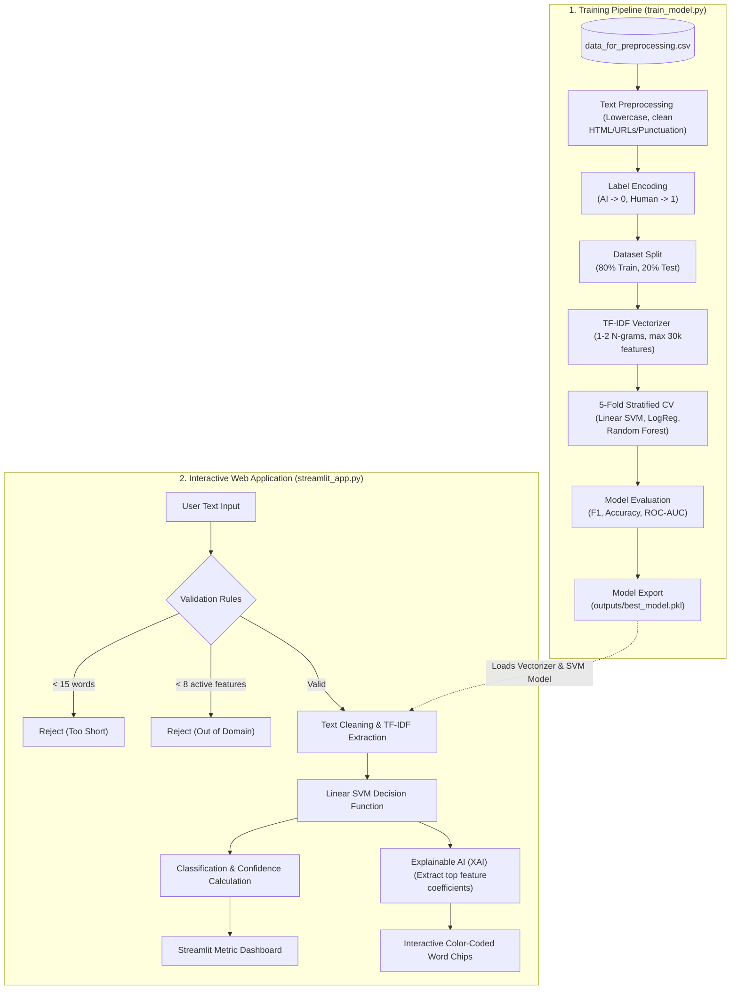

# Aswathi1205/ai-vs-human-text-detector

- **分类**：一、去 AI 味 / Humanizer 库
- **链接**：https://github.com/aswathi1205/ai-vs-human-text-detector
- **Stars**：0
- **语言**：Python
- **License**：None
- **Topics**：—
- **GitHub 描述**：An NLP & Machine Learning pipeline to detect AI-generated vs. human-written academic text. Features a Linear SVM model, TF-IDF vectorization, and a Streamlit web app with word-level Explainable AI (XAI) feature highlights.
- **本地描述**：An NLP & Machine Learning pipeline to detect AI-generated vs. human-written academic text. Features a Linear SVM model, TF-IDF vectorization, and a Streamlit web app with word-level Explainable AI (XAI) feature highlights.
- **拉取时间**：2026-07-25 17:57:35

---

# 🔍 AI vs Human Text Detector (QuadX)

An NLP and Machine Learning classification pipeline designed to distinguish between AI-generated and Human-written academic text. This project was developed as part of **InnovateX (Cluster 4)** at **Presidency University**.

The project features a full machine learning training pipeline, model evaluation visualizations, and a sleek, interactive dark-themed web application built with **Streamlit** that includes **Explainable AI (XAI)** to highlight word-level influences.

---

## 🌟 Key Features

*   **Sleek Dark UI**: Built with Streamlit, using modern typography (Inter font), smooth gradients, and custom components.
*   **Explainable AI (XAI)**: Identifies and highlights the specific words in the text that most heavily influenced the model's decision (with positive/negative classification weights).
*   **Robust NLP Pipeline**: Custom text normalization (cleaning URLs, HTML, and punctuation) paired with a high-dimensional TF-IDF vectorizer (up to 30,000 unigram and bigram features).
*   **Multi-Model Evaluation**: Trains and evaluates multiple classifiers (Linear SVM, Logistic Regression, and Random Forest) using 5-fold Stratified Cross-Validation.
*   **Automated Insights**: Saves confusion matrices, model comparisons, and top discriminative features as high-resolution plots.

---

## 📂 Project Structure

```text
AI_and_Human_Text_Dataset/
├── data_for_preprocessing.csv  # Raw dataset containing text samples and author labels
├── train_model.py              # Machine learning training & evaluation pipeline
├── streamlit_app.py            # Streamlit dashboard & interactive detector app
├── outputs/                    # Output directory for models and visualizations
│   ├── best_model.pkl          # Saved pipeline (TF-IDF vectorizer + Linear SVM classifier)
│   ├── confusion_matrix.png    # Confusion matrix plot for the best model
│   ├── model_comparison.png    # F1/Accuracy comparison plot across classifiers
│   └── top_features.png        # Bar chart showing top AI vs. Human indicator words
├── AI_vs_Human_QA_Guide.docx   # QA Documentation
├── Executive Summary.docx      # Project executive summary
└── Innovatex_Round1_Problem_Solution_Template.docx # Solution deck template
```

---

## 🏗️ System Architecture

The system is designed with a clear separation of concerns between the offline **Training Pipeline** and the online **Interactive Web Application**:



### Architectural Components

1. **Preprocessing Engine**:
   - The same normalization logic (`clean_text`) is shared between training and inference to ensure consistent input formats. Punctuation, HTML entities, and URLs are removed to avoid model reliance on noise.

2. **Feature Extraction Layer (TF-IDF)**:
   - Evaluates word frequencies up to bigrams (e.g., `"the photosynthesis"`) to capture stylistic phrasing patterns characteristic of AI tools vs. human writing.

3. **Classification Engine (Linear SVM)**:
   - Uses a support vector classifier to determine a decision boundary. A threshold score is computed:
     - **$\text{Score} \ge 0.0$**: Human Written (High Confidence)
     - **$\text{-0.5} \le \text{Score} < 0.0$**: Low Confidence / Indeterminate
     - **$\text{Score} < -0.5$**: AI Generated (High Confidence)

4. **Explainability Module (Word-Level XAI)**:
   - Computes features coefficients directly from the SVM decision function to extract feature weights for matching tokens, rendering interactive color-coded tags indicating the strength of the prediction source (AI vs. Human).

---

## ⚙️ Setup & Installation

### 1. Prerequisites
Ensure you have **Python 3.8+** installed on your system.

### 2. Set Up Virtual Environment (Recommended)
Open your terminal in the project directory and run:
```bash
python -m venv venv
# On Windows (PowerShell/CMD):
venv\Scripts\activate
# On Linux/macOS:
source venv/bin/activate
```

### 3. Install Dependencies
Install the required packages using `pip`:
```bash
pip install streamlit scikit-learn pandas numpy matplotlib seaborn
```

---

## 🚀 How to Run

### Run the Interactive Web App
Once dependencies are installed, you can start the Streamlit application:
```bash
streamlit run streamlit_app.py
```
This will launch the app in your default web browser (usually at `http://localhost:8501`). 

> 💡 **Usage Note**: The model is optimized for **academic and research-style texts** (abstracts, scientific articles, essays). Short, casual, or conversational sentences may lead to low confidence or out-of-domain classification.

---

## 🧠 Machine Learning Pipeline

The project compares three main classification models:
1.  **Linear SVM** (Selected as the best model: $\text{C}=0.5$, balanced class weights)
2.  **Logistic Regression** ($\text{C}=1.0$, balanced class weights)
3.  **Random Forest Classifier** ($200$ estimators, balanced class weights)

### Pipeline Details:
*   **Text Cleaning**: Strips out HTML tags, URLs, special characters, and normalizes whitespaces.
*   **Vectorization**: `TfidfVectorizer` extracting both unigrams and bigrams (`ngram_range=(1, 2)`) with a maximum of 30,000 features, using sublinear term frequency scaling.
*   **Cross-Validation**: 5-fold Stratified Cross-Validation ensures robust performance metrics and prevents overfitting.
*   **Metrics**: Logs accuracy, precision, recall, F1-score, ROC-AUC, and saves training visualization plots directly in the `outputs/` folder.

---

## 📈 Model Performance & Visualizations

Every time `train_model.py` is run, it generates several evaluation plots in the `outputs/` directory:
- **`confusion_matrix.png`**: Breakdown of true positives, true negatives, false positives, and false negatives.
- **`model_comparison.png`**: Metric comparison (Accuracy, Precision, Recall, F1, ROC-AUC) across all three trained models.
- **`top_features.png`**: The 20 most discriminative words for both human and AI-generated texts based on SVM coefficients.

related:
  - methods/最强去AI味铁律.md
  - methods/改稿润色指令库.md
---

## 🤝 Authors & Credits
*   **Team QuadX** — Presidency University
*   Project developed for **InnovateX · Cluster 4**
