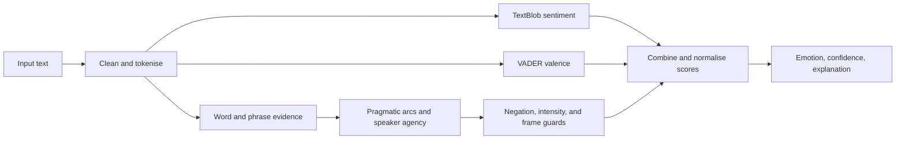

# qais-mle7y/HexSoftwares_Emotion_From_Text_Detector

- **分类**：一、去 AI 味 / Humanizer 库
- **链接**：https://github.com/qais-mle7y/hexsoftwares_emotion_from_text_detector
- **Stars**：0
- **语言**：Python
- **License**：MIT
- **Topics**：artificial-intelligence, emotion-detection, explainable-ai, hexsoftwares, internship-project, machine-learning, nlp, pytest, python, sentiment-analysis, streamlit, text-analysis, textblob, vader
- **GitHub 描述**：MoodLens AI is an explainable emotion-from-text detector built with Python and Streamlit. It classifies English text as Happy, Sad, Angry, or Neutral using TextBlob, VADER, and pragmatic context rules.
- **本地描述**：MoodLens AI is an explainable emotion-from-text detector built with Python and Streamlit. It classifies English text as Happy, Sad, Angry, or Neutral using TextBlob, VADER, and pragmatic context rules.
- **拉取时间**：2026-07-25 17:57:41

related:
  - methods/最强去AI味铁律.md
  - methods/改稿润色指令库.md
---

# MoodLens AI — Emotion from Text Detector

MoodLens AI is an explainable web application that classifies English text as
**happy**, **sad**, **angry**, or **neutral**. It combines TextBlob subjectivity,
VADER valence, and word- and phrase-level evidence so nuanced passages can be
separated into sadness and anger rather than placed in one generic category.

> HexSoftwares Artificial Intelligence Internship — Project 02

## Highlights

- Instant emotion classification with a confidence score
- Calibrated four-channel emotion signal with diminishing returns
- TextBlob polarity, VADER valence, and subjectivity insights
- Word and contextual-phrase evidence with a plain-English explanation
- Contrast-aware detection when positive wording masks sadness or passive-aggressive anger
- Discourse-pivot and descriptive-frame handling for pragmatic or quoted emotion language
- Final-outcome reasoning for tonal inversion, including stoic resignation, chaotic relief, and polite ultimatums
- Compositional pragmatic rules that check cue relationships, order, and speaker agency
- Negation and intensity handling, such as “not happy” and “very angry”
- Ready-made demo examples, recent-analysis history, and JSON export
- Local processing—no account, API key, or cloud service required
- Automated test coverage for the analysis engine

## Demo flow

1. Enter a sentence or load one of the four calibration passages.
2. Select **Analyse text signal**.
3. Review the verdict, calibrated confidence, waveform, and evidence.
4. Download the complete result as JSON if needed.

## Technology

- **Python** — application language
- **Streamlit** — interactive web interface
- **TextBlob** — sentiment polarity and subjectivity
- **VADER** — offline, lexicon-based sentiment valence
- **Pytest** — automated verification

## How it works



TextBlob calculates **polarity** from `-1` (negative) to `+1` (positive) and
**subjectivity** from `0` (factual) to `1` (personal). VADER provides a second,
offline valence score that is stronger on informal and emphatic language. A
compact, inspectable evidence layer separates sadness from anger using emotional
words, contextual phrases, discourse pivots, and the speaker's final lived outcome.
The pragmatic rule-book checks relationships such as obstacle → resolution,
precision → lost purpose, and praise → disproportionate cost. Sentiment strengthens
supported evidence instead of overriding it; agency and descriptive-frame gates
protect factual technical text. The detector also handles negation and intensity
and applies diminishing returns before normalising the four scores.

This hybrid approach is intentionally small and explainable. It is an educational
AI project, not a medical, psychological, or safety-assessment system.

## Run locally

### Windows PowerShell

```powershell
git clone https://github.com/qais-mle7y/HexSoftwares_Emotion_From_Text_Detector.git
cd HexSoftwares_Emotion_From_Text_Detector
python -m venv .venv
.\.venv\Scripts\Activate.ps1
python -m pip install -r requirements.txt
streamlit run app.py
```

Open [http://localhost:8501](http://localhost:8501) if the browser does not open
automatically. To stop the app, focus the PowerShell window and press `Ctrl+C`.
MoodLens uses Streamlit's viewer toolbar mode, so browser developer actions and the
single-key clear-cache shortcut are disabled.

### macOS or Linux

```bash
python3 -m venv .venv
source .venv/bin/activate
python -m pip install -r requirements.txt
streamlit run app.py
```

## Run the tests

```powershell
python -m pytest -v
```

## Project structure

```text
HexSoftwares_Emotion_From_Text_Detector/
├── app.py                         # Streamlit user interface
├── src/
│   ├── __init__.py
│   └── emotion_detector.py        # Analysis engine
├── tests/
│   └── test_emotion_detector.py   # Automated tests
├── requirements.txt
├── LICENSE
└── README.md
```

## Current limitations

- Designed primarily for short English text
- Sarcasm, irony, cultural context, and mixed emotions remain difficult
- Lexicon-based signals may miss unfamiliar words or slang
- Results communicate linguistic patterns, not a person's actual mental state

## Possible next steps

- Add multilingual detection
- Train and compare a supervised machine-learning classifier
- Add phrase-level highlighting and batch CSV analysis
- Deploy the Streamlit app for a public live demo

## License

Released under the `[MIT License](LICENSE)`.
