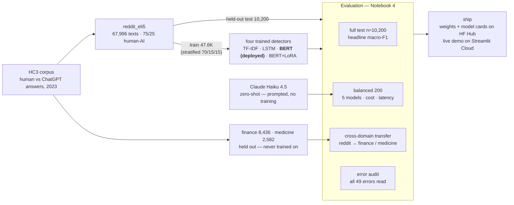

# lilhuang15/ai-generated-text-detector

- **分类**：一、去 AI 味 / Humanizer 库
- **链接**：https://github.com/lilhuang15/ai-generated-text-detector
- **Stars**：0
- **语言**：Jupyter Notebook
- **License**：None
- **Topics**：ai-detector, bert, bert-fine-tuning, haiku, lora, lstm, machine-learning, nlp
- **GitHub 描述**：Five-detector comparison for AI-generated text with cross-domain evaluation and a full error audit — BERT vs Claude live demo
- **本地描述**：Five-detector comparison for AI-generated text with cross-domain evaluation and a full error audit — BERT vs Claude live demo
- **拉取时间**：2026-07-25 18:01:22

---

# AI-Generated Text Detection — BERT vs Claude, with Cross-Domain Analysis

End-to-end NLP project: five approaches to detecting AI-generated text — trained, compared on
the same held-out data, error-audited, and shipped as a live demo. The headline isn't the F1;
it's *why* the detector works, when it doesn't, and the evidence for both.

**🔗 Live demo:** [ai-text-detector-lh.streamlit.app](https://ai-text-detector-lh.streamlit.app)
· **🤗 Model:** [bert-ai-text-detector-reddit](https://huggingface.co/lilhuang15/bert-ai-text-detector-reddit)
· **🤗 LoRA adapter:** [bert-ai-text-detector-reddit-lora](https://huggingface.co/lilhuang15/bert-ai-text-detector-reddit-lora)

## Results at a Glance

**Full held-out test** (n=10,200, natural 75/25 human/AI split):

| Model | Trainable params | Macro-F1 |
|---|---|---|
| TF-IDF + Logistic Regression | ~30K features | 0.982 |
| PyTorch LSTM | 3.9M | 0.9758 |
| **BERT full fine-tune** *(deployed)* | 110M | **0.9935** |
| BERT + LoRA | **296K (0.27%)** | 0.9877 |

<sub>Source: [`results/full_test_headlines.csv`](https://github.com/lilhuang15/ai-generated-text-detector/blob/main/results/full_test_headlines.csv) — recomputed
deterministically from the saved weights (Notebook 4 §4b); per-epoch training logs in
[`results/`](https://github.com/lilhuang15/ai-generated-text-detector/tree/main/results/).</sub>

**Controlled 5-model comparison** (balanced 200-sample subset — the affordable way to put a
paid LLM on identical footing):

| Model | Macro-F1 | AI-recall | AI-precision | Latency | Cost / 1K |
|---|---|---|---|---|---|
| TF-IDF + LogReg | 0.975 | 0.97 | 0.98 | <1 ms | $0 |
| PyTorch LSTM | 0.980 | 0.97 | 0.99 | ~3 ms | $0 |
| BERT full fine-tune | 0.970 | 0.98 | 0.96 | ~21 ms | $0 |
| BERT + LoRA | 0.995 | 0.99 | 1.00 | ~18 ms | $0 |
| Claude Haiku 4.5 zero-shot | 0.914 | **1.00** | **0.85** | ~760 ms | $0.25 |

<sub>Source: [`results/model_comparison.csv`](https://github.com/lilhuang15/ai-generated-text-detector/blob/main/results/model_comparison.csv).</sub>

> On n=200, one flipped sample ≈ 0.5 pp — subset rankings among the local models are noise
> (the full-test table above is the reliable ranking). The subset's job is the **Claude
> comparison**: the zero-shot LLM catches every AI text (recall 1.00) but false-flags humans
> (precision 0.85), and loses to a $0-marginal fine-tune by ~8 pp.


**Three findings:**
1. **Fine-tuning still wins in-domain (2026):** a 110M BERT at ~21 ms/$0 beats zero-shot
   Claude Haiku by ~8 pp.
2. **The detector transfers across domains — because it isn't detecting "AI-ness":** the
   expected cross-domain collapse didn't happen (−1.2 pp); the model tracks the *generator's
   style*, which is constant across topics.
3. **A single mechanism — a length prior — explains its errors:** every missed AI text is
   abnormally short (≤2nd percentile of AI training length), and the falsely-flagged humans
   write long and structured (median 166 words, double the human median; 96% above it —
   see Error Analysis).

## Data & Architecture

The whole pipeline in one picture — where the data goes, what gets trained, and on which
surfaces everything is judged:



## Problem

Since 2023, AI-text detection has been high-stakes (academic integrity, moderation, content
provenance) and famously unreliable — OpenAI retired its own detector over poor
cross-distribution generalization. So the interesting question is not "can a model hit high F1
on one benchmark" (it can, easily) but **what signal it actually learns and whether that
signal survives distribution shift**. This project measures both: a cross-domain transfer
experiment, and a 100%-coverage error audit of the deployed model.

## Data

- **Source:** [Hello-SimpleAI/HC3](https://huggingface.co/datasets/Hello-SimpleAI/HC3)
  (CC-BY-SA-4.0) — human vs ChatGPT (GPT-3.5) answers, English subsets only.
- **Training + in-domain test:** `reddit_eli5`, unrolled from paired Q&A into 67,996
  `(text, label)` samples; 75.5% human / 24.5% AI → class-weighted losses + **macro-F1**
  as the headline metric everywhere.
- **Held-out cross-domain sets (never trained on):** `finance` (8,436) and `medicine` (2,582).
- Stratified 70/15/15 split, seed 42; `max_length=256` WordPiece tokens chosen from EDA
  (95th-percentile length, capped).

## Methodology

One representative per paradigm, all evaluated on the same held-out data: classical feature
engineering (TF-IDF + LogReg), classical neural (LSTM, PyTorch), transfer learning
(BERT-base full fine-tune — the deployed model), parameter-efficient fine-tuning (LoRA on
Q/V attention, r=8), and a prompted LLM (Claude Haiku 4.5, zero-shot, forced single-digit
output, responses cached). All trained models use balanced class weights — the same imbalance
correction applied uniformly. Checkpoint selection: early stopping on validation F1 of the
minority (AI) class, best checkpoint restored.

## Cross-Domain Analysis

| Test set | Domain | Macro-F1 | Δ vs in-domain |
|---|---|---|---|
| reddit_eli5 (test) | in-domain | 0.9935 | baseline |
| finance | cross-domain | 0.9812 | −1.2 pp |
| medicine | cross-domain | 0.9821 | −1.1 pp |

<sub>Source: [`results/cross_domain_results.csv`](https://github.com/lilhuang15/ai-generated-text-detector/blob/main/results/cross_domain_results.csv).</sub>

I expected the standard detector story — a 10–25 pp collapse out of domain. It didn't happen,
and the error analysis explains why: the model keys on the **generator's house style**
(verbose, structured, polished 2023-ChatGPT prose), which barely changes between Reddit,
finance, and medicine. That flips the practical risk: for anyone deploying detection on
specialized text, the danger isn't *topic* shift — it's **generator drift** (newer models
write differently) and **style-based evasion**.

## Error Analysis

The 200-sample comparison yields 20 texts where any model erred (17 BERT-vs-Claude
disagreements + 3 both-wrong) — **all 20 manually read and categorized** against
pre-registered failure categories, then validated statistically on **every error the deployed
model makes on the full 10,200-sample test**:

- **Claude's 17 errors are all false positives on humans** (recall 1.000 / precision 0.855):
  it treats *polish* as AI — 9 structured human explanations, 6 short texts — and ignores
  local human markers (typos, hedges) in favor of global form.
- **BERT's errors are a pure length prior:** all **3** missed AI texts sit at the
  **≤2nd percentile** of AI training length (42/74/78 words vs median 174); the **46**
  falsely-flagged humans write long (median 166 words vs the human median of 82 — right at
  the AI median of 174; 96% above the human median).
- **Implications:** trivial evasion — ask the AI to answer briefly; asymmetric harm — the most
  articulate humans are the most likely to be falsely accused. Both are disclosed in the demo.

<sub>Source: [`results/bert_vs_claude_disagreements.csv`](https://github.com/lilhuang15/ai-generated-text-detector/blob/main/results/bert_vs_claude_disagreements.csv)
and [`results/bert_full_test_errors.csv`](https://github.com/lilhuang15/ai-generated-text-detector/blob/main/results/bert_full_test_errors.csv).</sub>


## Limitations

- Trained on 2023 GPT-3.5 text. Performance on GPT-4-class / 2026-model text is untested —
  and per the error analysis, **generator drift is the predicted failure axis**.
- English only.
- Short AI text evades detection (documented length prior); long structured human writing
  gets false-flagged. Balanced-subset precision does not equal production precision under a
  different base rate.
- MPS (Apple GPU) training is not bit-deterministic: retraining wobbles macro-F1 by ~±0.005.
  Canonical numbers are deterministic recomputes from the saved weights
  (`results/full_test_headlines.csv`, regenerated by Notebook 4 §4b).

## Repo Guide & Reproducing

```
notebooks/01_eda_and_data_prep.ipynb        EDA → data/processed/*.parquet splits
notebooks/02_baselines_tfidf_lstm.ipynb     TF-IDF + LogReg, PyTorch LSTM
notebooks/03_bert_finetune.ipynb            BERT full fine-tune + LoRA (+ HF Hub push)
notebooks/04_llm_comparison_crossdomain_errors.ipynb   Claude zero-shot, 5-model table,
                                            cross-domain eval, error analysis
src/claude_detector.py                      canonical Claude prompt/parsing (notebook + demo)
app.py                                      Streamlit demo (BERT vs Claude, side by side)
spaces_* + spaces_deploy.py                 optional HF Space mirror (Docker; HF PRO required)
results/                                    every number in this README lives here
```

The live demo runs on **Streamlit Community Cloud** (free tier) and loads the BERT weights
from the HF Hub repo above. As of 2026-07, HF Spaces hosting for Gradio/Docker apps is
PRO-only, so the HF Space files are kept as an optional mirror.

**Just run the demo** (any recent Python; same pinned versions the live app uses):

```bash
pip install -r requirements.txt
streamlit run app.py                                     # local demo (BERT-only without ANTHROPIC_API_KEY)
```

**Reproduce the research** — Python 3.11 required (pinned `numpy<2.0`/TF stack has no 3.12+ wheels):

```bash
conda create -n aidetect python=3.11 -y && conda activate aidetect
pip install -r requirements-dev.txt
jupyter notebook notebooks/01_eda_and_data_prep.ipynb   # then 02, 03, 04 in order
```

Claude calls need `ANTHROPIC_API_KEY` (copy `.env.example` → `.env`); Notebook 4 caches all
responses (`data/claude_responses_cache.json`), so re-runs cost $0. Training notebooks (02/03)
persist per-epoch metrics to `results/` and reload-verify their saved weights — see the
reproducibility note in Limitations before retraining them casually.

## Tech Stack

PyTorch · HuggingFace Transformers + PEFT · scikit-learn · Streamlit · Anthropic API

related:
  - methods/最强去AI味铁律.md
  - methods/改稿润色指令库.md
---

**Data citation:** Guo et al., 2023 — *How Close is ChatGPT to Human Experts?* (HC3),
[arXiv:2301.07597](https://arxiv.org/abs/2301.07597). License CC-BY-SA-4.0.
