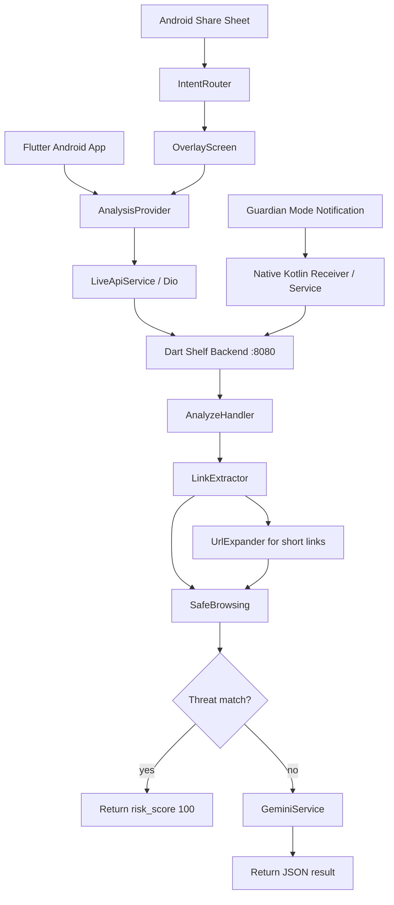

# nayzinminlwin/Eternal_Guardian--Everywhere_Scam_Detector

- **分类**：一、去 AI 味 / Humanizer 库
- **链接**：https://github.com/nayzinminlwin/eternal_guardian--everywhere_scam_detector
- **Stars**：0
- **语言**：Dart
- **License**：None
- **Topics**：ai, andriod, andriod-app, dart, flutter, gemini, google-safe-browsing, scam-detection
- **GitHub 描述**：Eternal Guardian, an Android app, makes scam analysis available where scams actually arrive: chats, shared text, links, and copied messages.
- **本地描述**：Eternal Guardian, an Android app, makes scam analysis available where scams actually arrive: chats, shared text, links, and copied messages.
- **拉取时间**：2026-07-25 18:01:34

---

!`[Eternal Guardian cover banner](docs/assets/Eternal_Guardian_CoverPic.png)`

# Eternal Guardian: Everywhere Scam Detector

An Android-first hackathon prototype by **Team KuCuba** that brings scam detection into everyday mobile moments: pasted chats, shared WhatsApp messages, suspicious links, and notification-driven checks.


Scam protection should not wait for users to open a separate security tool.
Eternal Guardian makes scam analysis available where scams actually arrive: chats, shared text, links, and copied messages.

---

## Table of Contents

- [Problem Statement](#problem-statement)
- [Our Solution](#our-solution)
- [Core Features](#core-features)
- [Demo Surfaces](#demo-surfaces)
- [Demo and Screenshots](#demo-and-screenshots)
- [Architecture](#architecture)
- [Tech Stack](#tech-stack)
- [How to Install and Run](#how-to-install-and-run)
- [API Overview](#api-overview)
- [Testing](#testing)
- [Current Prototype Status](#current-prototype-status)
- [Team](#team)
- [Known Limitations](#known-limitations)
- [Why This Matters](#why-this-matters)

## Problem Statement

Digital scams in Malaysia increasingly arrive through familiar channels: WhatsApp, SMS, social media DMs, delivery messages, tax notices, fake bank alerts, and shortened links.

Users are often asked to make a decision in seconds: click, pay, share an OTP, install an APK, or forward personal details. Existing safety advice is useful, but it usually lives outside the moment of risk.

Our interpretation is simple:

- scams succeed when pressure beats reflection
- link checking should happen before the tap
- scam analysis should be available from the OS share sheet
- known malicious links should be blocked quickly without wasting AI tokens
- explanations must be short, readable, and locally relevant to Malaysian scam patterns

## Our Solution

**Eternal Guardian** is a Flutter + Dart Shelf prototype by **Team KuCuba** that analyzes suspicious messages and links through a hybrid rule-based + AI pipeline.

Instead of forcing users to copy text into a browser or manually inspect domains, Eternal Guardian provides three everyday entry points:

- a core app screen for pasted suspicious messages
- an Android share-sheet overlay for text shared from apps like WhatsApp or SMS
- a pinned Guardian Mode notification for quick manual checks

The backend first extracts URLs and checks Google Safe Browsing. If a known malicious link is found, Eternal Guardian returns a high-risk warning immediately and skips Gemini. If the link is unknown or the message has no link, Gemini evaluates the message context and returns a score plus a concise explanation.

## Core Features

| Feature                        | What it does                                                                                                    | User value                                                                |
| ------------------------------ | --------------------------------------------------------------------------------------------------------------- | ------------------------------------------------------------------------- |
| **Hybrid Scam Analysis**       | Runs regex URL extraction, Safe Browsing lookup, then Gemini contextual analysis.                               | Balances speed, cost, and explanation quality.                            |
| **Known Threat Short-Circuit** | Returns `risk_score: 100` immediately when Safe Browsing flags a URL.                                           | Stops obvious malicious links fast and avoids unnecessary LLM calls.      |
| **Malaysian Scam Context**     | Gemini prompt includes local scam examples such as LHDN, PDRM, TAC/OTP theft, fake bank alerts, and task scams. | Makes explanations feel relevant to real local threats.                   |
| **Short Link Handling**        | Expands known shorteners with tight timeouts and adds hidden-link caution if expansion fails.                   | Helps users understand why hidden destinations are risky.                 |
| **Animated Risk Meter**        | Displays risk from 1-100 with green, yellow, and red zones.                                                     | Turns a backend score into a quick visual decision signal.                |
| **Share-Sheet Overlay**        | Opens from Android text sharing and auto-analyzes without an extra button.                                      | Lets users check suspicious messages without leaving the source app flow. |
| **Guardian Mode Notification** | Provides a persistent notification path for manual scam checks.                                                 | Gives users a fallback when sharing is awkward or unavailable.            |
| **Production API Mode**        | Always calls the configured backend API and shows retryable errors if analysis is unavailable.                  | Avoids misleading local estimates when real services fail.                |
| **Performance Tightening**     | Uses Flash Lite by default, in-memory caches, concurrent checks, and staged loading labels.                     | Improves both real and perceived latency.                                 |

## Demo Surfaces

The implemented prototype includes:

| Surface                    | Status      | Entry point                                                        |
| -------------------------- | ----------- | ------------------------------------------------------------------ |
| Home scan                  | Implemented | Open the app, paste/type text, tap **Analyze**                     |
| Android share overlay      | Implemented | Share text from another app into Eternal Guardian                  |
| Guardian Mode notification | Implemented | Toggle Guardian Mode, submit text from the persistent notification |
| Live backend mode          | Implemented | Configure `API_BASE_URL` and run or deploy the backend             |

## Demo and Screenshots

### 0. Main App

| Home Screen | Manual Scan |
| Home Screen | Manual Scan |
| --------------------------------------------------------------------------------------------- | --------------------------------------------------------------------------------------------- |
|  |  |

| Loading Page (~0.3 seconds)                                                                       | Loading Page (~2.5 seconds)                                                                       | Result Meter                                                                                    |
| ------------------------------------------------------------------------------------------------- | ------------------------------------------------------------------------------------------------- | ----------------------------------------------------------------------------------------------- |
|  |  |  |

### 1. Overlay (User never needs to exit the source app to analyze a suspicious message)

### 1. Overlay (User never needs to exit the source app to analyze a suspicious message)

| Share-via-EternalGuardian | Analysis Overlay |
| Share-via-EternalGuardian | Analysis Overlay |
| ----------------------------------------------------------------------------------------------------------------------- | ------------------------------------------------------------------------------------------------- |
|  |  |

### 2. Notification

| Guardian Notification Step1 | Guardian Notification Step2 | Guardian Notification Step3 |
| Guardian Notification Step1 | Guardian Notification Step2 | Guardian Notification Step3 |
| ----------------------------------------------------------------------------------------------------------------- | ----------------------------------------------------------------------------------------------------------------- | ----------------------------------------------------------------------------------------------------------------- |
|  |  |  |

| Safe Case                                                                                                         | Scam Case                                                                                                         |
| ----------------------------------------------------------------------------------------------------------------- | ----------------------------------------------------------------------------------------------------------------- |
|  |  |

## Architecture



### Main Components

- **Flutter app (`lib/`)**
  - Home screen, scan flow, result screen, share overlay, Guardian Mode toggle, and reusable scam-analysis widgets.
  - Provider manages the analysis state: idle, loading, complete, and error.
  - Dio powers the live backend client. Backend, network, and malformed-response failures surface as error states with retry.

- **Android integration (`android/`)**
  - Existing `MainActivity` handles text shares through Android `ACTION_SEND`.
  - Native Kotlin foreground service and notification components support Guardian Mode.
  - Kotlin notification flow calls the same backend contract directly and shows notification errors when the service is unavailable.

- **Backend API (`backend/`)**
  - Dart Shelf server exposes one route: `POST /analyze`.
  - A lightweight app-secret header gate rejects unauthenticated requests before analysis begins.
  - URL extraction and Safe Browsing run before Gemini to reduce latency and cost.
  - Gemini returns strict JSON with `risk_score` and `analysis_message`.

- **External services**
  - Google Safe Browsing identifies known malicious URLs.
  - Gemini performs contextual scam analysis for unknown or text-only cases.

## Tech Stack

| Layer               | Technology                                                                  |
| ------------------- | --------------------------------------------------------------------------- |
| Mobile frontend     | Flutter / Dart                                                              |
| State management    | Provider                                                                    |
| Flutter HTTP client | Dio                                                                         |
| Android native      | Kotlin, Foreground Service, RemoteViews                                     |
| Backend API         | Dart Shelf, shelf_router                                                    |
| Threat intelligence | Google Safe Browsing API                                                    |
| AI analysis         | Gemini 2.5 Flash Lite by default                                            |
| Environment config  | dotenv                                                                      |
| UI theme            | Bank Islam red theme, Poppins typography                                    |
| Testing             | Flutter tests, Dart analyzer, backend HTTP smoke tests, Android debug build |

## How to Install and Run

### Prerequisites

- Flutter SDK with Dart support
- Android SDK / Android Studio
- Dart SDK compatible with the backend package
- Google Gemini API key
- Optional Google Safe Browsing API key

### 1. Install Flutter Dependencies

```bash
flutter pub get
```

### 2. Configure the Backend

```bash
cd backend
dart pub get
cp .env.example .env
```

Fill `backend/.env`:

```env
GEMINI_API_KEY=your_gemini_key
GEMINI_MODEL=gemini-2.5-flash-lite
SAFE_BROWSING_API_KEY=your_safe_browsing_key
```

`SAFE_BROWSING_API_KEY` can be left empty for local fallback testing. The backend will skip Safe Browsing and continue to Gemini.
For Cloud Run, configure the same names as environment variables or Secret Manager values instead of relying on `.env`.

### 3. Run the Backend

```bash
cd backend
dart run bin/server.dart
```

Backend URL:

```text
http://localhost:8080/analyze
```

Android emulator URL from Flutter:

```text
http://10.0.2.2:8080/analyze
```

### 4. Run the Flutter App

```bash
flutter run
```

Build Android debug APK:

```bash
flutter build apk --debug
```

### 5. Configure the Live Backend URL

The app always uses the live backend. For emulator development, the default is:

```text
http://10.0.2.2:8080
```

For a physical device or production APK, build with a reachable backend URL:

```bash
flutter build apk --release --dart-define=API_BASE_URL=https://<your-production-backend>
```

### 6. Deploy Backend to Cloud Run

The repository includes a root `Dockerfile` for Cloud Run source builds. It compiles the Dart backend from `backend/` and starts the service on Cloud Run's `PORT`.

When configuring Cloud Run, set:

```env
GEMINI_API_KEY=<your Gemini key>
GEMINI_MODEL=gemini-2.5-flash-lite
SAFE_BROWSING_API_KEY=<your Safe Browsing key>
```

`PORT` is provided by Cloud Run automatically.

## API Overview

| Endpoint        | Purpose                                                   |
| --------------- | --------------------------------------------------------- |
| `POST /analyze` | Analyze a suspicious message, conversation block, or URL. |

### Request

Headers:

```http
x-app-secret: <app secret>
Content-Type: application/json
```

Body:

```json
{
  "text_payload": "Your message or suspicious link here"
}
```

### Response

```json
{
  "risk_score": 42,
  "analysis_message": "Short explanation in at most two sentences.",
  "analysis_source": "gemini"
}
```

### Score Meaning

| Score    | Meaning                                |
| -------- | -------------------------------------- |
| `1-30`   | Low risk / likely safe                 |
| `31-70`  | Caution / suspicious                   |
| `71-100` | High risk / likely scam                |
| `100`    | Known malicious URL from Safe Browsing |

Requests missing the expected `x-app-secret` header receive `403 Forbidden` and do not enter the analysis pipeline.
| `-1`     | Analysis temporarily unavailable       |

## Testing

Run backend analysis:

```bash
cd backend
dart analyze
```

Run Flutter tests:

```bash
flutter test
```

Analyze Flutter app and tests:

```bash
flutter analyze lib test
```

Build APK:

```bash
flutter build apk --debug
```

Backend smoke test:

```bash
curl -X POST http://localhost:8080/analyze \
  -H "Content-Type: application/json" \
  -d "{\"text_payload\":\"Maybank: Akaun anda dibekukan. Log masuk sekarang di maybank-secure-login.com\"}"
```

Recent validation logs live in:

```text
docs/test_logs/
```

## Current Prototype Status

| Area                             | Status                                                                         |
| -------------------------------- | ------------------------------------------------------------------------------ |
| Flutter core app                 | Implemented                                                                    |
| Bank Islam themed UI             | Implemented                                                                    |
| Analog risk meter                | Implemented                                                                    |
| Live backend API service         | Implemented                                                                    |
| Dart Shelf backend               | Implemented                                                                    |
| Safe Browsing integration        | Implemented                                                                    |
| Gemini scam analysis             | Implemented                                                                    |
| Short-link expansion and caution | Implemented                                                                    |
| Performance timing logs          | Implemented                                                                    |
| Android share-sheet overlay      | Implemented                                                                    |
| Guardian Mode notification path  | Implemented                                                                    |
| Android debug APK build          | Passing                                                                        |
| Full device testing              | Device-specific notification behavior still needs final demo-device validation |

## Team

| Name        | Role      | Responsibilities      | Contact / GitHub                                   |
| ----------- | --------- | --------------------- | -----------------------------------------------related:
  - methods/最强去AI味铁律.md
  - methods/改稿润色指令库.md
--- |
| Dhiyahudin  | Team Lead | Back-end support      | [@Dhyaddin](https://github.com/Dhyaddin)           |
| Arif Danial | Member    | Front-end development | [@adandadan](https://github.com/adandadan)         |
| Nay Zin     | Member    | Back-end development  | [@nayzinminlwin](https://github.com/nayzinminlwin) |

## Known Limitations

- Gemini latency can still vary because external model demand is outside the app's control.
- Full Android share overlay and Guardian Mode behavior should be validated on the exact physical demo device because notification permissions and RemoteInput behavior vary by Android version and OEM settings.
- The backend uses in-memory caches only; cache state resets when the server restarts.
- The prototype does not store scan history, user accounts, or persistent analysis results by design.
- `analysis_source` is included in backend JSON for internal transparency; clients consume `risk_score` and `analysis_message`.
- API keys must be configured locally in `backend/.env`; they are never stored in Flutter.
- The public backend uses a custom `x-app-secret` request header as a lightweight app gate. This is not a replacement for stronger production authentication because APK secrets can be extracted.

## Why This Matters

Scams work because they collapse the time between fear, confusion, and action.

Eternal Guardian adds a second opinion at the moment it matters: before the tap, before the transfer, before the OTP is shared, and before a suspicious link becomes a real loss.

By combining fast threat intelligence, localized AI reasoning, and Android-native entry points, Team KuCuba turns scam detection from a separate task into an everyday layer of protection through Eternal Guardian.

[Back to top](#eternal-guardian-everywhere-scam-detector)
