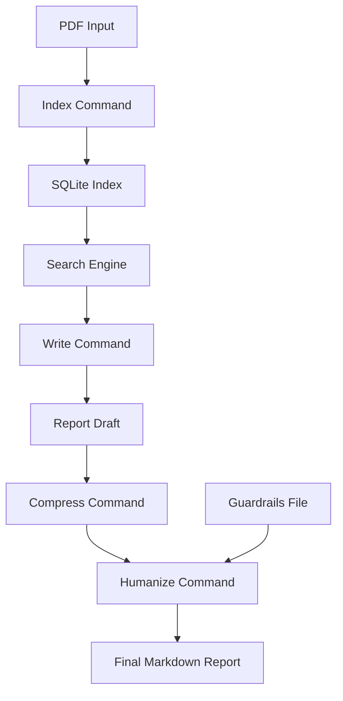

# Vtmpas/Egent-humanizer

- **分类**：一、去 AI 味 / Humanizer 库
- **链接**：https://github.com/vtmpas/egent-humanizer
- **Stars**：3
- **语言**：Python
- **License**：MIT
- **Topics**：—
- **GitHub 描述**：E(ssense) Agent is LLM compressing tool of processing large scientific texts like monographies. 
- **本地描述**：E(ssense) Agent is LLM compressing tool of processing large scientific texts like monographies.
- **拉取时间**：2026-07-25 18:08:59

related:
  - methods/最强去AI味铁律.md
  - methods/改稿润色指令库.md
---

# egent

`egent` is an open-source CLI for turning long PDF sources into grounded Markdown reports.
It parses a PDF into searchable chunks, builds a local SQLite index, lets an LLM retrieve evidence through explicit tools, and produces a structured report with page-based references.

The project is designed for source-grounded writing rather than free-form generation:
- a local index keeps retrieval transparent;
- the writing agent works through explicit search and patch tools;
- `compress` shortens a draft without rewriting the whole report from scratch;
- `humanize` rewrites local fragments with guardrails while preserving facts and references.

## Why This Project Exists
Many PDF-to-report workflows are either too opaque or too manual.
This project aims to sit in the middle:
- reproducible indexing with SQLite;
- explicit retrieval tools instead of hidden context stuffing;
- editable Markdown outputs;
- a simple CLI that stays hackable.

## Workflow



## Features
- PDF parsing with structural chunking.
- Hybrid retrieval over raw chunks and generated essences.
- Agentic writing through explicit tool calls.
- Configurable output language with English as the default.
- Report compression without losing citations.
- Humanization pass guided by `guardrails/ai_writing_signs.md`.

## Installation

### With `uv`

```bash
uv sync
```

Development tooling:

```bash
uv sync --group dev
```

### With `pip`

```bash
python -m venv .venv
source .venv/bin/activate
pip install -e .
```

## Configuration
Create a local `.env` file from `.env.example`:

```bash
cp .env.example .env
```

Supported environment variables:
- `OPENAI_API_KEY`
- `OPENROUTER_API_KEY`

The local `.env`, `.venv`, generated SQLite indexes, `report.md`, and `workspace.md` are ignored by `.gitignore`.

## Code Quality
The repository includes:
- `ruff` for linting and formatting;
- `.pre-commit-config.yaml` for local quality gates before commits.

Run the checks manually:

```bash
uv run ruff check --fix
uv run ruff format
```

If the project is inside a Git repository, install hooks with:

```bash
uv run pre-commit install
```

## Quick Start

1. Build an index:

```bash
egent index "/path/to/book.pdf"
```

2. Prepare a plan:

Use `examples/plan_template.md` as a starting point and adapt it to your source.

3. Generate the first draft:

```bash
egent write --plan "examples/plan_template.md" --pdf "/path/to/book.pdf" --language "english"
```

4. Compress the report if needed:

```bash
egent compress --pdf "/path/to/book.pdf" --pages 8
```

5. Run the guardrail-based rewrite pass:

```bash
egent humanize
```

## CLI Commands
- `egent index`: parse a PDF and build the local SQLite index.
- `egent write`: generate a report from a plan and the indexed source.
- `egent compress`: shorten a report toward a target page count.
- `egent humanize`: rewrite local windows of the report using the guardrails file.

## Repository Structure

```text
src/researcher/
  agent.py          Agent orchestration and post-processing
  agent_models.py   Dataclasses used by the agent pipeline
  agent_utils.py    Parsing, formatting, and humanize helpers
  cli.py            Click-based command-line interface
  config.py         Runtime configuration and defaults
  indexer.py        SQLite index builder and essence generation
  pdf_parser.py     PDF parsing and chunk construction
  prompts.py        Prompt templates and language rules
  retry.py          Shared async retry helper
  search.py         Retrieval engine and tool dispatch
  sql.py            Centralized SQL templates and query builders
  tool_schemas.py   Function-calling tool schemas
examples/
  plan_template.md  General report plan template
guardrails/
  ai_writing_signs.md
docs/
  architecture.md
```

## Guardrails
The `humanize` command uses `guardrails/ai_writing_signs.md` as a reference document for stylistic anti-patterns associated with AI-generated academic prose.
The file is intentionally kept separate from the core prompts so it can be reviewed, replaced, or extended independently.
The current guardrails reference is based on [Wikipedia:Signs of AI writing](https://en.wikipedia.org/wiki/Wikipedia:Signs_of_AI_writing).

## Current Limitations
- No automated tests yet.
- Model and provider choices are still configured through code and environment variables rather than a richer config system.
- The pipeline is optimized for long-form grounded summaries and reports, not for arbitrary PDF extraction tasks.

## TODO
- Add focused unit tests for plan parsing, report patching, and section splitting.
- Add smoke tests for the CLI workflow with mocked model calls.
- Make model/provider selection configurable from the CLI or a project config file.
- Add optional export formats beyond Markdown.

## License
MIT. See `LICENSE`.
