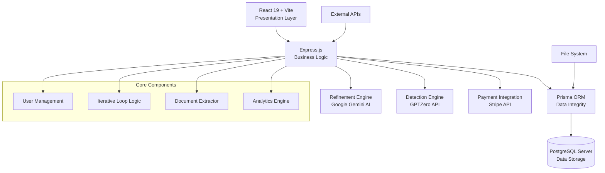

# Sappymukherjee214/AI-Humanizer

- **分类**：一、去 AI 味 / Humanizer 库
- **链接**：https://github.com/sappymukherjee214/ai-humanizer
- **Stars**：1
- **语言**：TypeScript
- **License**：ISC
- **Topics**：ai-humanizer, bypass-ai-detection, content-optimization, gemini-ai, ghostwriter, gptzero-bypass, machine-learning, nlp, nodejs-api, prisma-orm, react-19, research-grade-ai, typescript-project, undectectable-ai, vite-react
- **GitHub 描述**：A research-grade AI-to-Human text transformer featuring an iterative detection-refinement loop to bypass AI detectors and ensure high-quality, undetectable human-like content.
- **本地描述**：A research-grade AI-to-Human text transformer featuring an iterative detection-refinement loop to bypass AI detectors and ensure high-quality, undetectable human-like content.
- **拉取时间**：2026-07-25 18:15:25

---

# 🧠 AI Humanizer: The Ultimate AI-to-Human Text Transformer

[GitHub Repository](https://github.com/Sappymukherjee214/AI-Humanizer)

**A high-performance, research-grade platform designed to bypass AI detection and transform machine-generated content into high-quality, undetectable human-like prose.**

[](https://nodejs.org/)
[](https://react.dev/)
[](LICENSE)
[](https://gssoc.girlscript.tech/)


## 📋 Table of Contents

- [Overview](#-overview)
- [Architecture](#-architecture)
- [Key Features](#-key-features)
- [Quick Start](#-quick-start)
- [Installation](#-installation)
- [Usage](#-usage)
- [Development](#-development)
- [Testing](#-testing)
- [Contributing](#-contributing)
- [FAQ](#-faq)
- [License](#-license)

---

## 🎯 Overview

AI Humanizer is an advanced, full-stack application that solves the growing challenge of AI content detection and machine-like writing. Built with Node.js, React 19, and PostgreSQL, it provides users with a comprehensive **Iterative Detection-Refinement Loop**, ensuring AI-generated text consistently passes audits (like GPTZero) while maintaining impeccable flow.

### What Makes AI Humanizer Different

- **Evidence-Based Refinement**: Grounded in linguistic analysis and adversarial detection theory.
- **AI-Powered Analysis**: Real-time sentiment preservation and pattern detection via Gemini Pro.
- **Recursive Optimization**: Rewrites content until the AI Probability Score drops below **15%**.
- **Privacy-First**: Secure JWT-based authentication and modular processing of sensitive documents.
- **Research-Driven**: Incorporates findings on machine-sounding syntax to deliver human-like prose.

---

## 🏗️ Architecture



### System Components

| Component              | Technology         | Purpose                                  |
| ---------------------- | ------------------ | ---------------------------------------- |
| **Frontend UI**        | React 19 + Vite    | Ultra-fast, responsive web interface     |
| **Styling**            | Tailwind CSS       | Modern, premium utility-first styling    |
| **Animations**         | Framer Motion      | Fluid micro-interactions and transitions |
| **Backend Engine**     | Node.js, Express   | Core business logic and API delivery     |
| **Database**           | PostgreSQL         | Robust relational data persistence       |
| **ORM Layer**          | Prisma             | Type-safe database management            |
| **ML Content Core**    | Google Gemini      | Advanced text re-humanization services   |
| **Detection Core**     | GPTZero API        | Real-time AI detection scoring           |
| **Auth System**        | bcrypt, JWT        | Secure user authentication               |
| **Migration System**   | Prisma CLI         | Database schema evolution                |

### Data Flow

```
Input Text → Pattern Analysis → Refinement → AI Probability Audit → [Reprocess if > 15%] → Output → UI Update
```

---

## ✨ Key Features

### Core Humanization

- ✅ **Iterative Loop**: Up to 3 recursive passes for maximum undetectability.
- ✅ **Style Casting**: Specialized modes for Academic, Professional, and Creative needs.
- ✅ **Grammar Guard**: Automatic syntax correction while preserving tone.
- ✅ **Tone Consistency**: Ensures the core message remains indistinguishable from human writing.

### AI & Analytics

- **Real-time Scoring**: Integrated GPTZero audits with live reporting.
- **Plagiarism Guard**: Built-in verification to ensure original content.
- **Pattern Recognition**: Detects machine-like sentence structures and repetitive syntax.
- **Trend Analysis**: Visualize your "Humanization Journey" with interactive charts.
- **ML Integration**: Context-aware re-writing that understands cultural nuances.

### User Experience

- **File Support**: Drag and drop extraction for `.pdf`, `.docx`, and `.txt` files.
- **Multi-Export**: One-click download of humanized results in multiple formats.
- **Premium Dashboard**: Retractable sidebars, glassmorphism UI, and dark/light modes.
- **Secure Authentication**: Fully encrypted user data and session management.
- **Data Management**: Full export/delete capabilities for project history.

### Developer Experience

- 🧪 **Comprehensive Testing**: Dedicated test suites for both Frontend and Backend.
- 🔄 **Type-Safe Stack**: Full TypeScript integration across the entire application.
- 🐳 **Docker Ready**: Standardized environments for consistent development.
- 📖 **Self-Documenting API**: Clean, RESTful endpoint architecture.

---

## 🚀 Getting Started

### 1. Setup Environment

```bash
# Clone the repository
git clone https://github.com/Sappymukherjee214/AI-Humanizer.git
cd AI-Humanizer

# Initialize Backend
cd backend
npm install
# Create .env based on the template
cp .env.example .env

# Initialize Frontend
cd ../frontend
npm install
```

### 2. Launch Application

#### **A. Backend API (Primary)**

```bash
cd backend
npx prisma db push
npm run dev
```

#### **B. Frontend Client (Web)**

```bash
cd frontend
npm run dev
```

_The application will be available at http://localhost:5173._

---

## 🛠️ Developer Workflow

> [!TIP]
> **Prisma Studio**: Use `npx prisma studio` in the backend directory to instantly visualize and edit your local database.

---

> [!TIP]
> **Contributing Workflow**: If you are contributing specifically to the Web frontend, ensure the **Backend API** is running so the dashboard can fetch state.

> [!NOTE]
> For detailed architecture, sidecar management, and GSSoC'26 guidelines, see [CONTRIBUTING.md](https://github.com/Sappymukherjee214/AI-Humanizer/blob/main/CONTRIBUTING.md) and [SECURITY.md](https://github.com/Sappymukherjee214/AI-Humanizer/blob/main/SECURITY.md).

---

## 🎮 Usage

### For Users

1. **Launch**: Open both the frontend and backend servers.
2. **Setup**: Create your profile via the secure Sign In modal.
3. **Analyze**: Paste your AI text or upload a document for pattern analysis.
4. **Transform**: Select your specialization (e.g., "Academic") and click "Run Humanizer".
5. **Results**: View your AI score and export the humanized prose.

### For Developers

#### API Usage

```javascript
// Request for humanization
const response = await fetch("/api/humanize", {
  method: "POST",
  headers: { "Content-Type": "application/json" },
  body: JSON.stringify({ 
    text: "AI text...", 
    mode: "professional" 
  })
});

const data = await response.json();
console.log(data.humanized);
```

#### CLI Tools

```bash
# Database seeding
npx prisma db seed

# Type generation
npx prisma generate
```

---

## 🧪 Testing

### Run Test Suite

```bash
# All tests (Root)
npm run test

# Frontend specific
cd frontend && npm test

# Backend specific
cd backend && npm test
```

### Test Categories

- **Unit Tests**: Core function/component testing.
- **Integration Tests**: Database and service integration (Prisma).
- **Service Tests**: External API mocking (Gemini/GPTZero).
- **UI Tests**: Headless component and accessibility verification.

---

## 🤝 Contributing

We welcome contributions! Please see our [Contributing Guide](https://github.com/Sappymukherjee214/AI-Humanizer/blob/main/CONTRIBUTING.md).

### Development Workflow

1. Fork the repository
2. Create a feature branch: `git checkout -b feature/amazing-feature`
3. Make your changes with tests
4. Commit your changes: `git commit -m 'Add amazing feature'`
5. Push to the branch: `git push origin feature/amazing-feature`
6. Open a Pull Request

---

## ❓ FAQ

### General Questions

**Is this a plagiarism tool?**
No. It is a refinement tool for AI-generated text to restore human flow and tone.

**Are my documents stored?**
Data is stored securely in your private project history. You can delete it at any time.

**How are the results calculated?**
Results are based on an adversarial loop between the Refinement Engine (Gemini) and the Detection Audit (GPTZero).

### Technical Questions

**What are the system requirements?**
- Node.js v18.0.0+
- PostgreSQL v14+
- Modern Browser (Chrome, Firefox, Safari)

**How do I backup my data?**
Database backups are available via standard `pg_dump` or Prisma CLI export strategies.

---

## 🛡️ License

This project is licensed under the **ISC License** - see the [LICENSE](https://github.com/Sappymukherjee214/AI-Humanizer/blob/main/LICENSE) file for details.

---

## 🙏 Acknowledgments

- **Research Core**: Based on NLP findings on adversarial AI-detection patterns.
- **Open Source**: Built with React, Vite, Prisma, and PostgreSQL.
- **GSSoC 2026**: Special thanks to the GirlScript community for supporting this project.

related:
  - methods/最强去AI味铁律.md
  - methods/改稿润色指令库.md
---

**Built with ❤️ for authentic human expression and personal growth by Saptarshi Mukherjee**
