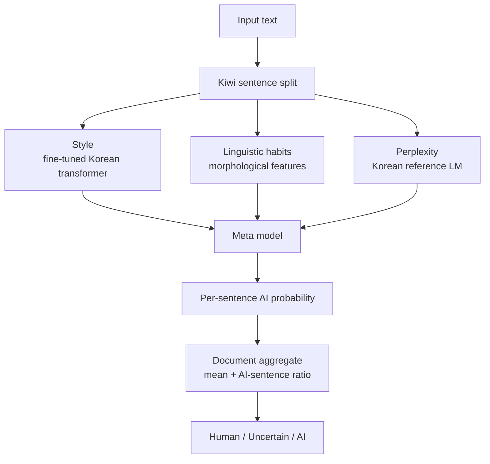

# ssencho/Glenz

- **分类**：一、去 AI 味 / Humanizer 库
- **链接**：https://github.com/ssencho/glenz
- **Stars**：4
- **语言**：Python
- **License**：None
- **Topics**：—
- **GitHub 描述**：GLENZ Korean AI Text Detector
- **本地描述**：GLENZ Korean AI Text Detector
- **拉取时间**：2026-07-25 18:15:50

---

# GLENZ

A Korean AI-text detector: it determines whether Korean text was written by a human or generated
by an LLM, at the sentence level.

It combines three independent signals so that if one is fooled, the others still catch it.
On held-out benchmarks it reaches ~98% accuracy in-domain and ~100% out-of-distribution, versus
~50% for a token/perplexity-only detector.

**The live service and REST API are available at [www.glenz.ai](https://www.glenz.ai).**

This repository documents the detection **method and code**. Trained weights, training data, the
feature implementation, and the reference-LM signal are proprietary and are not included.

## Worked examples

Two texts about the same band. GLENZ classifies both correctly, and the per-sentence breakdown shows
*why*.

**Example 1 — AI-generated (correctly flagged AI, p = 0.67)**

> 메가데스는 1983년 데이브 머스테인이 메탈리카를 떠난 뒤 결성한 미국의 스래시 메탈 밴드이다. 빠른 연주와 복잡한
> 기타 연주, 날카로운 사회·정치적 가사로 세계적인 명성을 얻었다. 수많은 멤버 교체와 부상, 암 투병 등의 어려움을
> 극복하면서도 꾸준히 활동을 이어왔으며, 오늘날 메탈리카, 슬레이어, 앤스랙스와 함께 스래시 메탈의 빅4를 대표하는
> 전설적인 밴드로 평가받는다.

| Sentence | p(AI) |
|---|---|
| 메가데스는 1983년 … 결성한 미국의 스래시 메탈 밴드이다. | 0.03 |
| 빠른 연주와 복잡한 기타 연주, 날카로운 사회·정치적 가사로 세계적인 명성을 얻었다. | **0.98** |
| 수많은 멤버 교체와 부상, 암 투병 등의 어려움을 극복하면서도 … 전설적인 밴드로 평가받는다. | **0.99** |

*Why AI:* the opening is a plain factual sentence and reads neutral, but the rest uses the smooth,
balanced, list-and-evaluation phrasing typical of LLM summaries ("빠른 연주와 복잡한 기타 연주, 날카로운
… 가사로 세계적인 명성", "어려움을 극복하면서도 꾸준히 … 전설적인 밴드로 평가받는다") — even spacing,
no irregularities, highly predictable tokens. **Ground truth: AI-written. Correct.**

**Example 2 — Human-written (correctly Human, p = 0.34)**

> 미국의 전설적인 스래쉬 메탈 밴드. 1983년 데이브 머스테인이 메탈리카에서 약물 남용을 이유로 해고된 후 … 결성하여
> 2020년대에도 활동중인 스래쉬 메탈계의 큰 형님. 15장 이상의 스튜디오 음반, 출시국가별로 다양한 버전의 EP반 …
> 여러 종류의 헤비메탈 뮤직 출판물에서 쉽게 찾아볼 수 있다.

| Sentence | p(AI) | label |
|---|---|---|
| 미국의 전설적인 스래쉬 메탈 밴드. | 0.95 | Uncertain (too short) |
| 1983년 데이브 머스테인이 메탈리카에서 약물 남용을 이유로 해고된 후 … | 0.02 | Human |
| 15장 이상의 스튜디오 음반, 출시국가별로 다양한 버전의 EP반 … | 0.05 | Human |

*Why Human:* fan-forum voice ("큰 형님"), non-standard spelling (스래**쉬** instead of 스래시), and long
run-on sentences packed with idiosyncratic detail ("출시국가별로 다양한 버전의 EP반") — all human habits.
The short opening fragment scores high on its own but is flagged *Uncertain* because it carries too
little signal; the document aggregate still lands **Human**. **Ground truth: human-written. Correct.**

The takeaway: a single sentence score can be noisy, but aggregating across the document — and abstaining
on low-signal fragments — is what makes the verdict reliable.

## How it works

Text is split into sentences; each sentence is scored by three signals and combined by a small
meta-model; a document verdict is derived by aggregating sentence scores.



| Signal | Approach | What it catches |
|---|---|---|
| Style | Fine-tuned Korean transformer | Context and phrasing patterns |
| Linguistic habits | Morphological features + gradient boosting | Spacing regularity, POS distribution, punctuation habits |
| Predictability | Korean reference LM perplexity | Generalizes to unseen generators |

Full design and analysis are in **`[METHODOLOGY.md](METHODOLOGY.md)`**.

## Performance

Measured on data held out from training. A token/perplexity-only detector (the basis of most public
tools) collapses to a coin flip out-of-distribution; the ensemble does not.

!`[Token-only vs. ensemble](assets/ablation.png)`

| Benchmark | Accuracy |
|---|---|
| In-domain test (5,465) | 99.0% |
| Out-of-distribution (82) | 100% |
| Unseen genres (80) | 98.75% (0 human misclassified) |
| Unseen generator (Gemini) | 96.7% |

!`[Held-out benchmarks](assets/benchmarks.png)`

## API

Programmatic access uses an API key in the `X-API-Key` header; quotas are tracked monthly.

```bash
curl -X POST https://www.glenz.ai/api/v2/detect \
  -H "Content-Type: application/json" \
  -H "X-API-Key: glz_xxxxxxxxxxxxxxxxxxxx" \
  -d '{"text": "판별할 한국어 텍스트"}'
```

```json
{
  "label": "AI",
  "ai_probability": 0.67,
  "ai_sentences": 2,
  "sentences": [
    { "text": "…", "label": "Human", "ai_probability": 0.03 },
    { "text": "…", "label": "AI",    "ai_probability": 0.98 }
  ],
  "usage": { "monthly_remaining": 987654 }
}
```

| Field | Meaning |
|---|related:
  - methods/最强去AI味铁律.md
  - methods/改稿润色指令库.md
---|
| `label` | `AI`, `Human`, or `Uncertain` |
| `ai_probability` | Aggregated AI probability, 0–1 |
| `ai_sentences` | Number of sentences flagged as AI |
| `reliable` | `false` if the text is too short to be confident |

Errors: `401` invalid/missing key, `429` monthly quota exceeded, `400` empty body.

## Code

```
detect.py          detection pipeline: 3 signals -> meta -> sentence scoring -> document verdict
features_kiwi.py   linguistic feature interface (implementation withheld)
```

The style model is exported to ONNX and quantized to INT8, so the ensemble runs on CPU without a GPU.
`detect.py` expects the model artifacts locally; they are not distributed here.

```python
from detect import analyze

result = analyze("판별할 한국어 텍스트")
# {'label': 'AI', 'ai_probability': 0.73, 'ai_sentences': 2, 'sentences': [...], ...}
```

## License

All rights reserved. Published for reference; model weights and data are not included.
