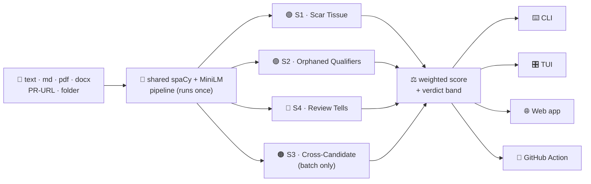

# GauravS13/PROVENANCE

- **分类**：一、去 AI 味 / Humanizer 库
- **链接**：https://github.com/gauravs13/provenance
- **Stars**：0
- **语言**：Python
- **License**：MIT
- **Topics**：—
- **GitHub 描述**：Did a human actually review this — or was it published unread? A 100% local, no-LLM slop detector that scores review  effort across a folder, file, or PR — flagging AI-templated batches and unreviewed boilerplate. CLI · web app · CI gate · GitHub Action.
- **本地描述**：Did a human actually review this — or was it published unread? A 100% local, no-LLM slop detector that scores review  effort across a folder, file, or PR — flagging AI-templated batches and unreviewed boilerplate. CLI · web app · CI gate · GitHub Action.
- **拉取时间**：2026-07-25 18:17:57

---

<div align="center">


<br/>


# 🔍 PROVENANCE

### *Did a human actually review this — or was it published unread?*

A **no-LLM slop detector** that catches low-effort AI content by the traces real authorship leaves behind — built for the **SLOP SCAN** hackathon.

<br/>

<!-- tech stack -->


<!-- status -->


**[▶️ Demo](https://youtu.be/b6blzLaUijE) • [✨ Features](#-features) • [🧠 How It Works](#-how-it-works) • [📊 Results](#-results-honest-numbers) • [🚀 Quick Start](#-quick-start) • [🎬 Usage](#-usage) • [🏗️ Architecture](#️-architecture)**

<br/>

<a href="https://youtu.be/b6blzLaUijE"></a>

▶️ **[Watch the 3-minute demo on YouTube →](https://youtu.be/b6blzLaUijE)**

</div>

---

## 🏗️ Architecture

PROVENANCE is **contract-first**: one pydantic schema (`models.py`) and one engine facade (`engine.py`) that every surface consumes — surfaces never touch spaCy or embeddings directly.

<details>
<summary><b>📁 Project structure</b></summary>

```
provenance/
├─ src/provenance/
│  ├─ models.py        # the pydantic contract (Span · SignalResult · DocResult · BatchResult)
│  ├─ pipeline.py      # cached spaCy + MiniLM, the shared Document
│  ├─ engine.py        # scan_doc / scan_batch facade — every surface calls only this
│  ├─ signals/         # scar_tissue · orphaned_qualifiers (+lexicon) · review_tells · cross_candidate
│  ├─ aggregate.py     # weighted score + verdict bands + tell overrides
│  ├─ cli.py · render.py   # Typer + Rich (Claude-Code style)
│  ├─ tui.py · tui.tcss    # Textual app
│  ├─ api.py · store.py    # FastAPI + serves web/dist
│  └─ web/             # Vite + React + TS + Tailwind + Framer + Plotly SPA
├─ eval/               # data · bakeoff · cohort   (free Hugging Face datasets)
├─ tests/              # 22 tests — signals · guards · aggregation · API · tells · CLI gate
├─ sample_data/        # offline fixtures (hiring · academia · code-review · singles)
├─ .github/workflows/  # CI: ruff · black · mypy · pytest · build (Python 3.12 + 3.13)
└─ action.yml          # the PR-comment GitHub Action
```
</details>

<details>
<summary><b>🧰 Tech stack</b></summary>

| Layer | Choice |
|---|---|
| NLP | spaCy `en_core_web_lg` (NER + dependency parse) |
| Embeddings | sentence-transformers `all-MiniLM-L6-v2` (local, CPU) |
| Math | numpy · scipy · scikit-learn |
| CLI / TUI | Typer · Rich · Textual |
| API | FastAPI · Uvicorn · pydantic v2 |
| Web | Vite · React · TypeScript · Tailwind · Framer Motion · Plotly · Zustand |
| Quality | pytest · ruff · black · mypy · GitHub Actions |
| **Runtime LLM** | **none** |

</details>

---

## 🏆 Hackathon — SLOP SCAN

| Track | Role | How the engine fires |
|---|---|---|
| **C — Hiring** 🎯 | Primary / demo hero | Cross-candidate clustering on a folder of applications |
| **F — Academia** | Cross-track | Flags suspiciously similar peer reviews in a batch |
| **A — Code Review** | Cross-track | Scores PR-description prose; comments via the Action |

**Bonuses targeted:** 🥇 The Bake-Off (RAID confusion matrix + ROC) · 🔀 Cross-Track Scanner (one engine, 3 tracks) · 📦 Open-Source Ready (pip-installable, CI, docs, MIT).

---

## 🎬 The money shot

<div align="center">


**A templated AI cohort collapses into one tight red cluster (`15/100 · SLOP`). Real applicants scatter (`84/100 · HUMAN`). Same engine, opposite verdict.**

</div>

---

## 🌐 The web app

<div align="center">


*The React + Tailwind + Framer Motion SPA: drag in a document or a whole folder → an arc-gauge verdict, per-signal cards, and (for batches) an interactive Plotly heatmap. Same engine as the CLI — no LLM, all local.*

</div>

---

## 🚨 The problem we solve

> "Slop" was the **2025 Word of the Year**. Nobody asks *"was this made with AI?"* anymore — everything is, a little. The real question is **"did anyone bother checking it before hitting publish?"**

| 😩 Without PROVENANCE | ✅ With PROVENANCE |
|---|---|
| You read 10 minutes of text that took 10 seconds to generate | A 0–100 score tells you what's actually worth your time |
| 200 AI cover letters each look "fine" one-by-one | The templated cohort lights up as **one red cluster** |
| A `[Name]` placeholder ships to production unnoticed | Flagged instantly: *"nobody filled this in"* |
| Generic AI detectors just ask *"is this AI?"* | We ask *"did a human **review** this?"* — the question that matters |
| GPTZero-style tools need an API key + a cloud round-trip | **100% local. No LLM. No key. Runs in CI.** |

---

## ✨ Features

PROVENANCE looks for **four traces** genuine authorship leaves behind, then exposes them through **four surfaces** — all from **one engine** with **no LLM at runtime**.

### 🧬 The detection signals

| | Signal | Dimension | What it catches |
|:--:|---|---|---|
| 🟢 | **Scar Tissue** | Temporal | Real writing is revised → uneven paragraph flow. AI single-pass → uniformly smooth. *(supporting · low weight · the deliberately noisy one)* |
| 🟣 | **Orphaned Qualifiers** | Epistemic | Experts hedge only when they know the exception (*"usually — **unless** X"*). AI hedges reflexively and never resolves it. The **resolution detector** is the signal — not a word list. |
| 🔴 | **Review Tells** | Effort artifacts | The dead giveaways nobody reviewed it: unfilled placeholders (`[Name]`), AI boilerplate (*"as an AI language model…"*), ChatGPT filler. A hard tell **caps the verdict to SLOP**. |
| 🟠 | **Cross-Candidate Consistency** | Relational | Different real applicants emphasise different things; AI-templated batches cluster tightly. **The hero — drives the heatmap. AUC 0.975.** |

### 🖥️ The surfaces

| | Surface | Description |
|:--:|---|---|
| ⌨️ | **CLI** | A polished forensic-console terminal: a verdict score-meter, two-line signal readouts, an in-terminal truecolor heatmap, and a findings list. The install-Monday hero. |
| 🎛️ | **TUI** | A Textual app with a slash-command box (`/scan-batch …`) and tabs: Signals · Evidence · Matrix · Verdict. |
| 🌐 | **Web app** | A React + Tailwind + Framer Motion SPA with an **interactive Plotly heatmap** (hover a cell to pair candidates). |
| 🤖 | **GitHub Action** | A PR bot that comments a review-effort score on every pull request. |

**Plus:** 📊 a reproducible **bake-off** on the RAID dataset (confusion matrix · ROC · cohort AUC — we report where it fails), and 🆓 **zero cost** — spaCy + local embeddings + rules, no API key, no cloud, no per-use billing.

---

## 🧠 How It Works



1. **📥 Parse** — text / Markdown / PDF / DOCX / a GitHub PR URL / a folder, into plain text (one UTF-8 code path).
2. **🧠 Embed once** — a single cached spaCy parse (`en_core_web_lg`) + MiniLM embeddings, shared by every signal.
3. **🔬 Score** — the four signals run; cross-candidate only on batches.
4. **⚖️ Aggregate** — a weighted score with verdict bands: **0–30 SLOP · 30–60 MIXED · 60–100 HUMAN**. A hard "review tell" overrides to SLOP.
5. **🎨 Render** — the same pydantic contract feeds the CLI, TUI, web app, and Action.

### 🆓 Why no LLM (it's a feature, not a shortcut)

The rules put *"ask another LLM if it's AI"* **out of scope** — that's delegation, not detection. A rules-and-statistics engine is **reproducible** (same input → same output), **free**, **fast**, **auditable** (every verdict points at the spans that caused it), and **CI-runnable with no key**. We use Hugging Face models *offline only* to build evaluation fixtures — never to score.

---

## 📊 Results (honest numbers)

PROVENANCE is an **over-consistency / review-effort** detector, not a single-document AI classifier — and the bake-off shows exactly that. All numbers are measured on a held-out **RAID** subset (a labelled AI-vs-human corpus), never on the bundled fixtures.

### 🏆 The hero signal — cohort over-consistency (S3)

| Cohort task · RAID · k=5 · 40 cohorts/class | Value |
|---|:--:|
| **AUC** | **`0.975`** |
| Mean S3 — templated (same-source AI) cohort | `30.8` → 🚩 flagged |
| Mean S3 — diverse human cohort | `85.8` → ✅ passes |

> S3 cleanly separates a templated pool from a diverse one — and a *diverse AI* cohort scores like humans, confirming it flags **over-consistency, not AI-ness** (`eval/results/cohort/`).

---

## 🚀 Quick Start

> **Prerequisites:** Python 3.11–3.13, ~700 MB disk (spaCy + MiniLM models), Node 18+ (only for the web app).

### 🪟 Windows (PowerShell)

```powershell
# 1. clone + enter
git clone https://github.com/GauravS13/PROVENANCE.git provenance ; cd provenance

# 2. virtual env + the one fragile dependency (torch) from the CPU index
py -3.13 -m venv .venv
.\.venv\Scripts\Activate.ps1
pip install torch --index-url https://download.pytorch.org/whl/cpu

# 3. install PROVENANCE + download the language model
pip install -e ".[dev,eval]" -c constraints-py313.txt
python -m spacy download en_core_web_lg

# 4. run the hero demo 🎉
provenance scan-batch sample_data\hiring\ai_batch_01\
```

> 🛟 **Fallback:** if `torch` won't install on 3.13, use a 3.12 venv (universal wheels): `py -3.12 -m venv .venv312` and reinstall without `-c constraints-py313.txt`. Or just run **`.\tasks.ps1 setup`**.

### 🐧 macOS / Linux

```bash
python3.12 -m venv .venv && source .venv/bin/activate
pip install torch --index-url https://download.pytorch.org/whl/cpu
pip install -e ".[dev,eval]"
python -m spacy download en_core_web_lg
provenance scan-batch sample_data/hiring/ai_batch_01/
```

### 🌐 Web UI (local, without Docker)

The steps above install the **CLI**. To open the **web UI** from a local checkout, build
the React SPA once (Node 18+), then run the API — it serves the built app at `/` on the
same origin (no CORS):

```bash
# build the SPA once
cd src/provenance/web
npm install
npm run build
cd ../../..

# serve the engine + web UI together → http://localhost:8000
uvicorn provenance.api:app --port 8000
```

Developing the UI? Run the engine and Vite's hot-reload dev server side by side instead:

```bash
uvicorn provenance.api:app --port 8000        # terminal 1 — the engine
cd src/provenance/web && npm run dev          # terminal 2 — http://localhost:5173
```

### 🐳 Docker (one container — web UI + API, no local Python/Node)

The included `Dockerfile` builds the React SPA, installs the engine, and **bakes the
spaCy + MiniLM models in at build time** — so the whole app (web UI **and** detection
API on the same origin) starts from a single image. No Python or Node needed on the host.

```bash
docker build -t provenance .         # first build ~10–20 min (bakes the models in)
docker run -p 7860:7860 provenance   # then open http://localhost:7860
```

**Prefer the terminal (CLI) over the web UI?** The `provenance` CLI and the `sample_data/`
fixtures are baked into the same image. With the web container already running, open a
shell in it from another terminal — or skip the server and run a one-off CLI container:

```bash
# A) into the running web container (find its name with `docker ps`)
docker exec -it <container> provenance demo                      # guided walkthrough
docker exec -it <container> provenance scan-batch sample_data/hiring/ai_batch_01/
docker exec -it <container> bash                                 # or just a shell

# B) one-off CLI container, no web server
docker run --rm -it provenance provenance scan-batch sample_data/hiring/ai_batch_01/
docker run --rm -it provenance provenance tui                    # the interactive TUI
```

> 💡 Drag a folder of files onto the drop zone to run the hero batch scan. For free
> cloud hosting of this exact image, see [`DEPLOY.md`](https://github.com/GauravS13/PROVENANCE/blob/main/DEPLOY.md) (Hugging Face Spaces).

---

## 🎬 Usage

| Command | What it does |
|---|---|
| `provenance scan-batch <dir>` | 🏆 **The hero** — ranked candidate table + similarity heatmap |
| `provenance scan <file> --explain` | One document, with highlighted evidence spans |
| `provenance scan-pr <github-pr-url>` | Cross-track A — score a PR description |
| `provenance gate <files/dir> --fail-under 30` | 🚦 **CI / pre-commit gate** — exits non-zero on slop |
| `provenance demo` | 🎬 Guided offline walkthrough (the whole story, one command) |
| `provenance tui` | Launch the interactive terminal app |
| `uvicorn provenance.api:app --port 8000` | 🌐 REST API + web UI at `http://localhost:8000` *(UI needs the SPA built first — see [Quick Start](#-quick-start))* |
| `provenance scan <file> --json` | Machine-readable contract (clean stdout, for scripting) |

<div align="center">

</div>

### 🚦 Install it Monday — three ways to gate slop

PROVENANCE isn't just a viewer; it's a **gate** you drop into the place work already flows.

**1. Pre-commit hook** — block unreviewed docs before they're ever committed:

```yaml
# .pre-commit-config.yaml
- repo: https://github.com/GauravS13/PROVENANCE
  rev: v0.1.0
  hooks:
    - id: provenance-gate
      args: ["--fail-under", "30"]
```

**2. CI gate** — fail the build on any sloppy doc, in *any* CI (clean exit codes):

```bash
provenance gate docs/ README.md --fail-under 30   # exit 1 if anything scores below 30
```

**3. PR bot (Cross-Track bonus)** — a GitHub Action that comments a score and can fail the check:

```yaml
# .github/workflows/provenance.yml
on: pull_request
jobs:
  provenance:
    runs-on: ubuntu-latest
    steps:
      - uses: actions/checkout@v4
      - uses: GauravS13/PROVENANCE@v0.1.0
        with:
          min-score: "30"   # optional — fail the PR check at/below this
```

---

## 🤝 Contributing

```bash
pip install -e ".[dev]"
ruff check src tests   &&   black --check src tests   &&   mypy src   &&   pytest
```

New detection signals, input loaders, and track adapters are especially welcome — keep them **deterministic and LLM-free**. See [`CONTRIBUTING.md`](https://github.com/GauravS13/PROVENANCE/blob/main/CONTRIBUTING.md).

## 📄 License & Disclosure

**MIT** — see [`LICENSE`](https://github.com/GauravS13/PROVENANCE/blob/main/LICENSE). AI tools used during the build are disclosed in [`DISCLOSURE.md`](https://github.com/GauravS13/PROVENANCE/blob/main/DISCLOSURE.md).

<div align="center">

related:
  - methods/最强去AI味铁律.md
  - methods/改稿润色指令库.md
---

### *Nobody should waste 10 minutes reading what took 10 seconds to generate.* 🔍

Built for [**SLOP SCAN**](https://raptors.dev) · 2026

</div>
