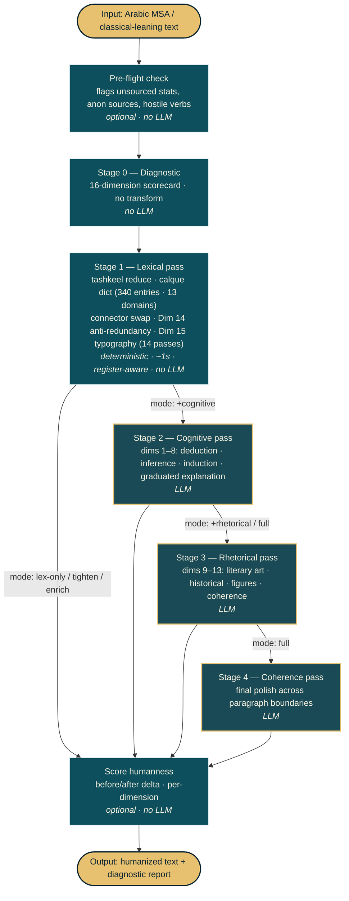

# drxvb/arabic-ai-text-humanizer

- **分类**：一、去 AI 味 / Humanizer 库
- **链接**：https://github.com/drxvb/arabic-ai-text-humanizer
- **Stars**：1
- **语言**：Python
- **License**：NOASSERTION
- **Topics**：—
- **GitHub 描述**：Arabic AI-text humanizer along 16 dimensions — provider-agnostic, OpenAI-compatible. 6 modes, 4 register policies, deterministic + LLM-augmented passes, cross-LLM-critique-informed lexical layer. Arabic only.
- **本地描述**：Arabic AI-text humanizer along 16 dimensions — provider-agnostic, OpenAI-compatible. 6 modes, 4 register policies, deterministic + LLM-augmented passes, cross-LLM-critique-informed lexical layer. Arabic only.
- **拉取时间**：2026-07-25 18:24:09

---

<p align="center">
  
</p>

# Arabic AI-Text Humanizer

> 🇸🇦 [اقرأ بِالعَرَبية](https://github.com/drxvb/arabic-ai-text-humanizer/blob/main/README.ar.md) — Arabic README in native MSA phrasing, not literal translation.

A **bilingual** AI-text humanizer that reduces AI fingerprints in **Arabic** (16 dimensions: cognitive structure, rhetorical figures, reader-respect, typography hygiene, connector-entropy) and **English** (5-axis Directness/Rhythm/Trust/Authenticity/Density rubric; deterministic lex pass; pattern catalogue adapted from [`hardikpandya/stop-slop`](https://github.com/hardikpandya/stop-slop) MIT). Built as an [Agent Skills](https://agentskills.io) skill — drop into Claude Code, Codex, Kimi, MiniMax, Gemini, or any compatible host.

The full specification, transformation protocol, dimension definitions, anti-patterns, and worked examples all live in **[`SKILL.md`](https://github.com/drxvb/arabic-ai-text-humanizer/blob/main/SKILL.md)**. This README is a one-screen overview.

## Status: **v2.16.0 — stable**

All four foundational `arabic-corpus-toolkit` contracts are adopted at runtime call sites: G1 (`arabic_normalize` before every AI-tell count), G2 (`asset_registry.is_compatible` for every Asset C/D/E load), G3 (`InfluenceTrace` emitted by `score_text` and `score_text_deep` on all paths including LLM fallback), G4 (n/a — toolkit ships the installer). Vendor rotation across {gemini, minimax, codex} for `score_text_deep`. Cross-LLM agreement via `score_text_multivendor`. Asset D + E consumer cutover complete.

**v2.16.0 ships** `evals/test_g1_normalize_regression.py` — 16 targeted before/after assertions that codify the G1 normalize-before-AI-tell-count contract. Closes Codex A3 carry-over (deferred 3+ releases) plus Kimi A5 #3 leverage action. The killer fixture (E) heavily-mutates input with tashkeel injection and verifies `score_text` still finds the same dictionary keys — the single most important regression gate against future contributors silently removing the G1 normalization call. 16/16 PASS plus the existing Arabic fragility 74/74 plus English fragility 33/33.

See `SKILL.md` Version history table for per-release detail v2.0 → v2.16.0.

## Historical: what shipped in v2.6.0 — Linguistic emergency triage + sacred-text guard

Acting on a multi-agent native-MSA-tier linguistic review (Arabic linguistics + translation architecture + scope critic + adversarial red-team + Kimi-style + Codex-style lenses), v2.6.0 surgically fixes **14 calque dictionary entries** that were actively damaging output and ships the **highest-severity missing feature** identified by the review: a sacred-text preservation guard.

### Dictionary triage (14 entries)

- **6 deleted** — bare-stem entries with no topic guards: `view`, `partition`, `trigger`, `process`, `task`, `worker`. Most catastrophic: `view → مشاهدة` would rewrite `رؤية 2030` (Saudi national vision) as `مشاهدة 2030`. Re-add in v2.6.1 with topic detectors.
- **6 fixed** — wrong direction or wrong replacement: `personalization` had its direction REVERSED (`الشخصنة` is modern attested; `التخصيص` reads as "privatization" in Saudi context); `fundraising` was the charity sense not VC; `venture capital → رأس المال المخاطر`; `fake news` sign-flip resolved; `global warming` separated from greenhouse effect per UN/IPCC; `grassroots → حركة قاعدية` (pan-Arab neutral).
- **2 annotated** — `refugee` / `displaced person` paired with `disambiguation_pair_id` + `political_sensitivity: high` to prevent silent swaps.

### New dictionary schema fields

`regional_sensitivity` (gulf/levant/maghreb/pan-arab) · `political_sensitivity` (none/low/medium/high/critical) · `disambiguation_pair_id` (links entries that must be jointly considered) · `disambiguation_warning` (free-text editorial guidance) · `applies_only_in_domain` (overrides broader domain field).

### New: `scripts/sacred_text_guard.py`

Detects Quranic verses (U+06D6–U+06ED tajweed-mark clustering), citation framing (`قال تعالى:`), hadith chains (`قال رسول الله ﷺ`, `روى البخاري عن`, `حدثنا X عن Y عن Z`), and the basmala. Returns `(start, end, reason)` spans that downstream transformations MUST preserve verbatim. Conservative by design — high precision, low recall. Exposes `mask_sacred_spans()` / `restore_sacred_spans()` helpers mirroring the code-block protection pattern. v2.6.0 ships the module; v2.6.1 wires it into `humanize_v2.py` automatically. Full reference in [`references/18-sacred-text-guard.md`](https://github.com/drxvb/arabic-ai-text-humanizer/blob/main/references/18-sacred-text-guard.md).

### Verification

- Arabic fragility: **66/66** (no regression — `humanize_v2.py` untouched)
- English fragility: **33/33** (no regression — `humanize_english.py` untouched)
- Multi-agent synthesis preserved at `M:\Main\AI\Corpus\humanizer-v2.6-multi-agent-synthesis.md`

## What was in v2.5.1 — Critical hotfix from multi-agent review

The v2.5.0 English path had **5 critical bugs** that the eval suite failed to catch because the tests were generated by the same mental model that wrote the bugs — they measured intent-consistency, not correctness. v2.5.1 fixed all five:

- **T1** `skip_when_context` was on the wrong axis: filler adverbs (`actually`, `literally`, `really`) were globally suppressed from deletion regardless of input. Now compares input ±2-word window to skip phrases.
- **T2** `--force-language en` on Arabic silently no-op'd; now refuses with explanatory stderr.
- **T3** Markdown code blocks were silently rewritten (`def navigate()` → `def handle()`). Now extracted before transformation, restored verbatim.
- **T7** Findings double-counted by span. Now de-duplicated by `(start, end)` before scoring.
- **T8** Case-preserving substitution: `Navigate` → `Handle` (was `handle`); `NAVIGATE` → `HANDLE`.

Plus: LICENSE adds Hardik Pandya copyright line (MIT clause-1 compliance); `--seed` flag added (was vapor-documented). Eval suite rewritten from **21 to 33 assertions** to test documented behavior end-to-end.

## What's new in v2.5.0 — English support

The humanizer is now **bilingual**. Arabic remains primary (16-dimension pipeline via `scripts/humanize_v2.py` — unchanged); English is the new secondary language via a separate, deterministic path.

### What ships with English support

- **`scripts/humanize_english.py`** — deterministic lex pass + 5-axis scorer; no LLM required. Three modes: `analyze` (flag only), `lex` (transform), `both` (transform + score before/after).
- **`corpus/english-patterns.json`** — machine-readable pattern catalogue. 7 lexical categories (throat-clearing openers, emphasis crutches, business jargon, filler adverbs, filler phrases, meta-commentary, vague declaratives), 6 structural categories (binary contrasts, negative listings, dramatic fragmentation, rhetorical setups, false agency, narrator-from-distance), 4 sentence-level categories (Wh- starters, paragraph-starter blacklist, lazy extremes, em-dashes).
- **`references/17-english-ai-tells.md`** — narrative reference with the 5-axis rubric definitions, the score → action ladder, and composition guidance for stop-slop + this script.
- **Language gate** — `detect_language()` refuses Arabic input on the English path and vice-versa (escape hatch: `--force-language en|ar`).

### 5-axis scoring (max 50; revise below 35)

| Axis | What it measures |
|---|---|
| **Directness** | Statements vs announcements. Drops on throat-clearing, emphasis crutches, vague declaratives. |
| **Rhythm** | Varied vs metronomic. Drops on consecutive same-length sentences, low sentence-length variance, staccato fragmentation. |
| **Trust** | Respects reader. Drops on meta-commentary, rhetorical setups, negative listings, filler phrases. |
| **Authenticity** | Sounds human. Drops on business jargon, false agency, narrator-from-distance. |
| **Density** | Anything cuttable. Drops on filler adverbs, filler phrases, lazy extremes, em-dashes. |

### Quick start

```bash
# Analyze English text (flag patterns, score; no transformation)
python scripts/humanize_english.py --text "Here's the thing: ..." --mode analyze --report

# Lex pass — safe deletions + jargon substitutions + em-dash normalization
python scripts/humanize_english.py --input draft.md --mode lex --output cleaned.md

# Both — transform AND score before/after, side by side
python scripts/humanize_english.py --input draft.md --mode both --report
```

### Why a separate path

The 16-dimension Arabic framework is built around features that don't transfer to English: classical-rhetorical figures (جناس / طباق / سجع), connector entropy specific to Arabic's coordinator-heavy syntax, tashkeel and kashida normalization, Arabic-specific typography. A 16-dim English path would be ⅔ inapplicable. Stop-slop's 5-axis rubric is tuned for English and ports cleanly. The two paths share the same skill identity but have separate scripts, separate evaluation suites (66/66 Arabic + 21/21 English), and explicit language gates.

### Attribution

Lexical / structural / sentence-level catalogue and the 5-axis rubric originate in [`hardikpandya/stop-slop`](https://github.com/hardikpandya/stop-slop) (MIT). Both `corpus/english-patterns.json` and `references/17-english-ai-tells.md` carry the attribution. Both projects are MIT-licensed.

## What was in v2.4.5

**Native-speaker dictionary corrections + a substring-substitution bug fix that protects every dictionary entry.** Two terminology corrections came from native review, and chasing them surfaced a regex-boundary bug in the substitution engine itself.

### 1. `swarm intelligence` — natural form changed to `ذكاء المجموعة`

The previous v2.4.0 rendering `ذكاء الأسراب` is *biologically* correct (swarms of birds, insects) but reads as a calque in Arabic CS writing. Native preference: **`ذكاء المجموعة`** (group intelligence). Both singular `ذكاء السرب` and plural `ذكاء الأسراب` now map to the same natural form via separate dictionary entries.

### 2. New entry: `سلوكا` → `أسلوبا` (mansoob accusative only)

AI translators sometimes render *"approach / method / manner"* as `سلوكاً` (the *behavior* sense, used in psychology / zoology) when `أسلوباً` (style, technique) is the intended sense. The key is **deliberately narrow** — keyed on the post-tashkeel mansoob form `سلوكا`, not bare `سلوك`, so legitimate `سلوك الحيوانات` ("animal behavior") is preserved untouched.

### 3. Word-boundary lookahead — engine-level fix

`lex_apply_calque_dictionary` previously used plain `str.replace`, which meant a calque key could match **inside** a longer Arabic word. Example: `ذكاء السرب` was a substring of `الذكاء السربي` (the adjectival form), so the old engine produced the malformed `الذكاء المجموعةي`. The new engine uses regex lookahead `(?![؀-ۿ])` so substitution only fires at a word boundary. This protects **all 340 dictionary entries** from similar bugs.

| Input | Old (v2.4.4) | New (v2.4.5) |
|---|---|---|
| `الذكاء السربي مذهل` | `الذكاء المجموعةي مذهل` ❌ | `الذكاء السربي مذهل` ✓ (untouched) |

Fragility suite: **66/66** (5 new T27–T28 sub-checks for the corrections + the boundary fix).

## What's new in v2.4.4

**Two previously-deferred rules from the 13-source Arabic-punctuation research, both implemented and register-gated.**

### 1. Itwadi's rule: `و` before each Arabic list item

Arabic lists retain `و` before each item *except the first* — opposite of English's "and only before the last item." Detection is conservative: only fires when 3+ comma-separated tokens are each a single Arabic word (≤20 chars), so short-clause commas like `كنت سعيداً، رأيت صديقاً` are correctly **not** treated as lists.

| Input | Output |
|---|---|
| `العربي، الرياضيات، الكيمياء` | `العربي، والرياضيات، والكيمياء` |

### 2. Register-gated ASCII→guillemets

Sources split between formal `«»` (academic / classical) and modern `""` (news / opinion). v2.4.4 honors both via register-gating: ASCII quotes are converted to guillemets **only in `--register classical`**; news, opinion, and technical preserve ASCII quotes.

| Register | Input | Output |
|---|---|---|
| classical | `قال "العلم نور"` | `قال «العلم نور»` |
| news | `قال "العلم نور"` | `قال "العلم نور"` *(preserved)* |

The typography stack inside `lex_dim15_typography` is now **14 passes** — see the [Typography pipeline](#workflow) note below.

## What's new in v2.4.3

**Parenthesis interior-spacing normalization** — researched 4 more Arabic style guides (Albuthi, Alukah academic, proof-reading-service, Kaplan International), bringing the total to **13 authoritative sources** consulted across v2.4.x.

Implemented via `typography_paren_interior_spacing()` with three sub-rules: strip space *after* `(` when followed by Arabic letter; strip space *before* `)` when preceded by Arabic letter; strip space between `)` and following Arabic punctuation. Latin paren padding (`OpenAI (شركة)`) is preserved by the existing `typography_paren_spacing` pass.

| Input | Output |
|---|---|
| `هذه جملة ( مع تعليق ) ثم نقطة` | `هذه جملة (مع تعليق) ثم نقطة` |
| `النص (الإيضاح) .` | `النص (الإيضاح).` |

Fragility suite at v2.4.3: 56/56 (5 new T23–T24 sub-checks).

## What's new in v2.4.2

**Authoritative-source-based punctuation rules.** Researched **9 Arabic style guides** (Al Jazeera Learning, Drasah, Loghate ×2, Mawdoo3, Mobt3ath, KSU College of Humanities, Itwadi, Shoair School) and implemented the rules where they universally agree.

### New rules

**1. No space BEFORE Arabic punctuation** (universal — all 9 sources):
> "الفاصلة ملاصقة للكلمة التي قبلها، مع وجود مسافة مع الكلمة التي بعدها" — *Loghate*

| Input | Output |
|---|---|
| `كلمة ، كلمة` | `كلمة، كلمة` |
| `النص .` | `النص.` |
| `سؤال ؟` | `سؤال؟` |

Covers `،`، `؛`، `؟`، `:`، `!`، `.` after Arabic letters.

**2. Comma → Semicolon before unambiguous causal connectors** (multiple sources):
> "تستخدم الفاصلة المنقوطة عند العلاقة السببية" — *Loghate, Al Jazeera, KSU, Mawdoo3*

| Input | Output |
|---|---|
| `كان مجتهداً، لذلك نجح` | `كان مجتهداً؛ لذلك نجح` |
| `أحب الكتاب، لأنه ممتع` | `أحب الكتاب؛ لأنه ممتع` |
| `شكرته، لذا أعد لي هدية` | `شكرته؛ لذا أعد لي هدية` |

**Conservative — only unambiguously causal connectors:** `لأن`، `لأنّ`، `لذلك`، `لذا`، `ومن ثَمَّ`. Connectors with non-causal senses (`إذ` = "when" or "because", `حيث` = "where" or "because") are **deliberately skipped** to prevent false conversions.

**3. Existing Latin→Arabic and post-space rules made explicit via fragility tests T19–T21** (no behavior change; tests now guard the contract):

| Mark | Latin | Arabic |
|---|---|---|
| Comma | `,` | `،` |
| Semicolon | `;` | `؛` |
| Question mark | `?` | `؟` |

### Deferred to v2.4.3

- **`و` (waw) before each Arabic list item** — Itwadi's "خرب، والرياضيات، والكيمياء" rule. Auto-fix requires multi-pass list-context detection; risk of false positives on clause-separator commas. Designing now.
- **LRM (Left-to-Right Mark) for Bidi runs** — render-time concern; not addressed at encoding level.

### Verification

- Lint PASS · Golden **20/20** · Fragility **51/51** (12 + 15 + 6 + 4 + 11 + 3 + 5 — T18–T22 are the v2.4.2 additions)

## What's new in v2.4.1

Two Arabic-typography fixes targeting AI tells that v2.4.0 didn't catch:

**1. Kashida (`ـ` Arabic tatweel, U+0640) stripped from output.** Per the [Shoair School design guide](https://shoairschool.com/basics-of-kashida-in-design/), kashida is for *display typography* (logos, posters, justified-prose typesetting) — **never** for encoded body text in machine-readable digital documents. AI translators sometimes inject it to "look more Arabic"; this is the opposite of professional convention. Stripping is universal across all registers. Example: `الكشيـدة الممـدودة` → `الكشيدة الممدودة`.

**2. Em-dash (`—`) → Arabic comma (`،`) in Arabic-context.** The em-dash is a Western-typography import; modern Arabic uses `،` for clause separation. Conversion is **context-aware** — only fires when an Arabic letter precedes the em-dash. English-context em-dashes are preserved.

| Input | Output | Why |
|---|---|---|
| `النص — التعليق` | `النص، التعليق` | Arabic on both sides → convert |
| `العملاء — تقنية حديثة` | `العملاء، تقنية حديثة` | Arabic on both sides → convert |
| `OpenAI — مؤسسة` | `OpenAI — مؤسسة` | Latin precedes em-dash → preserve |
| `fast — and reliable` | `fast — and reliable` | No Arabic → preserve |

**Fragility suite now 35/35** (12 original + 15 v2.2.x + 6 v2.3.0 + 4 v2.4.1 — added T15 for kashida strip + T16/T17 for em-dash context-awareness).

## What's new in v2.4.0

**Dictionary expansion — 93 → 338 entries (3.6× growth).** Adds process / workflow vocabulary, multi-agent / swarm / autonomous-agent terminology (modern AI vocabulary that emerged post-2023), expanded database / DevOps / security, plus new domains: crypto/Web3, climate, healthcare, geopolitics.

The agent/swarm category is particularly important — these terms had no Arabic translation conventions when most AI translators were trained, so the calques are reliable AI tells:

| English | AI-default calque (wrong sense in Arabic) | Natural Arabic |
|---|---|---|
| agent | `عميل` (customer/client) | `وكيل` (delegated authority — the autonomous-agent sense) |
| multi-agent system | `نظام متعدد العملاء` (multi-customer) | `نظام متعدد الوكلاء` |
| tool use | `استعمال الأداة` (singular tool) | `استخدام الأدوات` (plural — the technical term) |
| agent memory | `ذاكرة العميل` (customer's memory) | `ذاكرة الوكيل` |
| function calling | `استدعاء الوظيفة` (the job position) | `استدعاء الدوال` (functions, plural) |
| context window | `نافذة المحتوى` (content window) | `نافذة السياق` (context window) |
| chain of thought | `سلسلة الفكر` | `سلسلة التفكير` |
| scratchpad | `لوحة الخدش` (scratching board) | `مسودة` (draft) |
| zero-shot | `صفر لقطة` (zero-shot literal) | `بدون أمثلة` (without examples) |
| jailbreak | `الهروب من السجن` (escape from prison) | `كسر الحماية` (protection-breaking) |

End-to-end demo (real AI text → humanized):
```
IN:  نظام متعدد العملاء الجديد يستخدم استعمال الأداة لتنفيذ المهام.
     كل عميل مستقل لديه ذاكرة العميل ومهارة العميل.
     نموذج لغة كبير يدير حلقة الوكيل عبر نافذة المحتوى الواسعة.
     السحاب يدعم استدعاء الوظيفة وتجميع القمامة التلقائي.

OUT: نظام متعدد الوكلاء الجديد يستخدم استخدام الأدوات لتنفيذ المهام.
     كل وكيل ذكي لديه ذاكرة الوكيل ومهارة الوكيل.
     نموذج لغوي كبير يدير دورة عمل الوكيل عبر نافذة السياق الواسعة.
     السحاب يدعم استدعاء الدوال وجمع المهملات التلقائي.
```

**Distribution across 13 domains:** tech-software (44), tech-ai-agents (35), tech-ai-ml (9), tech-data (22), tech-security (31), tech-infra (36), tech-consumer (29), tech-crypto (15), business (43), news-journalism (44), politics (4), healthcare (11), climate (15).

Lex pipeline unchanged — same `lex_apply_calque_dictionary()` as v2.3.0, just driven by more data. Tests: lint PASS, golden **20/20**, fragility **31/31**.

## What's new in v2.3.0

**Calque-translation dictionary.** A corpus-validated lexicon of 93 English-calque → natural-Arabic translation pairs, generated by a multi-LLM swarm (Claude Sonnet) on 181 seed terms and cross-validated against an 8,850-article Arabic tech-news corpus (AITNews; 2.88M tokens). The new `lex_apply_calque_dictionary()` runs in `--register news` / `--register opinion`, replacing English-calque forms with the natural Arabic terms native journalists actually use.

Examples of what it catches:

| English source | AI-default calque (literal) | Natural Arabic (what AITNews actually uses) |
|---|---|---|
| startup | `بدء التشغيل` | `شركة ناشئة` |
| chief executive officer | `ضابط التنفيذ الرئيسي` | `الرئيس التنفيذي` *(428 corpus hits)* |
| social media | `الإعلام الاجتماعي` | `وسائل التواصل الاجتماعي` |
| monitoring | `مونيتورينغ` *(transliteration)* | `مراقبة` |
| cloud computing | `حوسبة السحاب` | `الحوسبة السحابية` *(363 hits)* |
| exploit (security) | `استغلال` | `ثغرة` *(772 hits)* |
| breaking news | `أخبار عاجلة` | `عاجل` *(130 hits)* |
| crackdown | `شد التشقق` *(broken)* | `حملة` *(345 hits)* |
| think tank | `خزان تفكير` *(literal)* | `مركز أبحاث` |
| machine learning | `تعلم المكينة` | `تعلم الآلة` |

Dictionary covers 9 domains: tech-software, tech-ai-ml, tech-data, tech-security, tech-infra, tech-consumer, business, news-journalism, politics. Each entry tagged with confidence (high if ≥5 corpus hits, medium otherwise). Source-of-truth in [`corpus/calque-dictionary.json`](https://github.com/drxvb/arabic-ai-text-humanizer/blob/main/corpus/calque-dictionary.json) — auditable JSON, no hidden tables in code.

Fragility suite now **31/31** (added T12–T14 for dictionary-load, multi-domain catches, register-gating).

## What's new in v2.2.0

The lex pipeline now applies two editorial passes that previous versions did only in documentation:

1. **Pipeline-calque → native Arabic.** `خط أنابيب` (the English "pipeline" calque, literally "line of pipes") is automatically replaced with `مسار عمل` / `مسار العمل` / `تسلسل العمل`. The skill catches this AI-translation tell on every lex pass.
2. **Hamza-safe tashkeel reduction.** Excessive diacritics in `--register news` / `opinion` are stripped per modern editorial convention. Hamza letter forms (`أ`, `إ`, `آ`, `ء`, `ؤ`, `ئ`, `ى`) and Arabic-Indic digits (`٠–٩`) are **always preserved** — they're distinct lexemes, not stylistic markers. `--register classical` / `technical` preserve all tashkeel.

Five new fragility tests guard these behaviors (T7–T11): hamza preservation (`إن` ≠ `أن`, `إما` ≠ `أما`), madda preservation (`قرآن`, `آلام`, `أحصنة`), Arabic-digit preservation, calque substitution, and register-gated tashkeel policy. See [Version history](#version-history) below for the full v2.0 → v2.2 progression.

## What it does

Rewrites AI-generated Arabic prose to be less mechanical at the *style* and *cognitive-structure* layer — adding visible reasoning steps, classical-rhetorical figures (when register allows), graduated explanation, scope markers, and reader-respect restraint. Includes a pre-flight safety check for factual/ethical/sourcing hazards.

Six transformation modes ranging from `lex-only` (deterministic, ~1s, no LLM) to `full` (4-pass cognitive + rhetorical + coherence). Four register policies (`classical / news / opinion / technical`) gate which transformations fire.

**Scope:** humanization, **not** localization. BCP47 locale tags, ICU MessageFormat plurals, and SSML are out of scope by design.

## Languages supported

| Language | Status |
|---|---|
| **Modern Standard Arabic (MSA), classical-leaning** | ✅ Primary target. All 16 dimensions calibrated for this register. |
| Arabic dialects (Egyptian, Levantine, Khaleeji, Maghrebi, …) | ❌ Not supported — lexical tables assume MSA |
| Code-switched Arabic + English | ❌ Untested |
| English | ❌ Out of scope — use a separate English-targeted humanizer |
| Bidi-mixed text (RTL + LTR runs) | ⚠️ Plain text only; Bidi marks not preserved |
| Quranic recitation marks | ⚠️ Preserved verbatim but not generated |

**Scope:** humanization (style cleaner), **NOT** localization. BCP47 locale tags, ICU MessageFormat plurals, and SSML are deliberately out of scope (see `SKILL.md`'s Scope section).

## Workflow



**No API key needed** for the pre-flight check, Stage 0 (diagnostic), Stage 1 (lex), or Score. **API key required** for Stages 2–4 (set `LLM_API_URL` / `LLM_API_KEY` / `LLM_MODEL` for any OpenAI-compatible endpoint).

Four register policies (`classical / news / opinion / technical`) gate *which* transformations fire inside Stage 1 — e.g., ASCII→guillemets quote conversion only in `classical`, tashkeel reduction only in `news` / `opinion`, sentence-length variance only in `classical` / `opinion`.

## Installation

| Your environment | How to install |
|---|---|
| **Claude Code, Codex CLI, MiniMax CLI, or any agent CLI that imports `.skill` ZIPs** | Download the matching `.skill` bundle from [Releases](https://github.com/drxvb/arabic-ai-text-humanizer/blob/main/../../releases) and unpack into your CLI's skills directory. Provider-tuned variants are available for Moonshot/Kimi, MiniMax, and Anthropic Claude (via OpenAI-compatible proxy). |
| **Kimi CLI** (does not import `.skill` archives) | Use **[`INSTALL-FOR-KIMI.md`](https://github.com/drxvb/arabic-ai-text-humanizer/blob/main/INSTALL-FOR-KIMI.md)** — a self-contained markdown installer. Hand the file to Kimi and ask it to recreate the skill tree. 30 file blocks embedded; 100% lossless round-trip verified. |
| **Manual install / forking** | `git clone` this repo and drop the directory wherever your CLI expects skills. The repo content IS the skill. |

## Quickstart

The skill is **provider-agnostic**. Configure any OpenAI-compatible chat-completions endpoint:

```bash
# Pick a provider:
export LLM_API_URL=https://api.openai.com/v1/chat/completions
export LLM_API_KEY=sk-...
export LLM_MODEL=gpt-4o-mini

# Run a deep humanization with diagnostic report:
python scripts/humanize_v2.py \
  --input input.txt --mode +cognitive --register news \
  --output humanized.txt --analyze
```

Deterministic mode needs no API:

```bash
python scripts/humanize_v2.py --input input.txt --mode tighten --register news --output cleaned.txt
```

`config.example.json` carries ready-made provider configurations (Moonshot, MiniMax, OpenAI, Together, Groq, DeepSeek, local Ollama).

## What's in the box

| Path | What |
|---|---|
| `SKILL.md` | The full skill specification — load this first |
| `scripts/humanize_v2.py` | Main multi-pass pipeline (lex / cognitive / rhetorical / coherence) |
| `scripts/analyze_deep.py` | 16-dimension diagnostic analyzer (no LLM; deterministic) |
| `scripts/preflight_check.py` | Factual / ethical / sourcing-hygiene flagger |
| `scripts/llm_transform.py` | Provider-agnostic LLM-call wrapper |
| `scripts/score_humanness.py` | Before/after humanness scorer |
| `scripts/mine_corpus.py` | Empirical-pattern miner (run against your own JSONL if you want to extend the corpus baseline) |
| `references/*.md` | 16 deep-dive files — one per humanness dimension |
| `corpus/empirical-patterns.json` | Pre-mined statistics (100K records / 1.31M sentences / 71.28M tokens across Qur'an, classical/modern, news, lexicon registers; mining took ≈87 seconds) |
| `examples/` | Six worked examples — actual input + actual output + analysis, all reproducible byte-deterministically (`lex-only` / `tighten` modes + `analyze_deep` + `preflight_check` — no API key needed) |
| `evals/run_golden.py` | 20 golden regression cases |
| `evals/test_known_fragility.py` | 12 fragility-class assertions (clause-preservation, pro-drop, env-gates) |
| `config.example.json` | Provider configuration reference |

## Verify on your machine

```bash
python evals/run_golden.py             # expect: 20/20 PASS
python evals/test_known_fragility.py   # expect: 12/12 PASS
```

Both suites are dependency-free Python 3 stdlib — no `pip install` required.

## Design notes (short)

- **Provider-agnostic.** No backend name lives in source code. Configure `LLM_API_URL` / `LLM_API_KEY` / `LLM_MODEL` for whichever OpenAI-compatible endpoint you want. CLI flags `--backend-url`, `--auth-token`, `--model` override per invocation.
- **Cross-LLM-critique-informed.** Lexical-pass behaviors (clause-preserving substitution, pro-drop deletion, quote-verb-rotation env-gate) come from a multi-LLM review of an earlier framework. See `evals/test_known_fragility.py` for the bug-class regression checks.
- **Arabic-only.** Targets MSA / classical-leaning register. Not for dialectal / colloquial / English text.

## Source-size + effort behind this release

| Metric | Value |
|---|---|
| Total source lines | **15,041** (3,611 Python + 2,722 Markdown + 8,708 JSON) — JSON growth driven by the calque dictionary expansion (93 → 340 entries) |
| Files in the skill | **53** — 16 references + 6 scripts + 2 evals + corpus + LICENSE + SKILL.md + .gitignore + config.example.json + README + README.ar.md + INSTALL-FOR-KIMI + 7 example narratives + 14 example fixtures |
| 16-dimension framework documentation | 16 deep-dive reference files, ~2,000 lines of Arabic+English explanatory text |
| Empirical corpus mining | **100,000 records sampled** → **1,310,649 sentences**, **71,278,688 tokens** across 4 register categories (Qur'an, classical/modern, news, lexicon). Mining time: **≈87 seconds**. Tracked: 50 connector types + 50 sentence-initial-token types. |
| Calque-translation dictionary | **340 entries** across **13 domains** (business 43, climate 15, healthcare 11, news-journalism 44, politics 4, tech-ai-agents 37, tech-ai-ml 9, tech-consumer 29, tech-crypto 15, tech-data 22, tech-infra 36, tech-security 31, tech-software 44). Generated by a multi-LLM swarm (Claude Sonnet, Codex, Gemini, Moonshot) on seed terms, cross-validated against the 8,850-article AITNews corpus (2.88M tokens), then native-reviewed. |
| Authoritative Arabic-style sources | **13 sources** consulted for the v2.4.x typography work (Al Jazeera Learning, Drasah, Loghate ×2, Mawdoo3, Mobt3ath, KSU College of Humanities, Itwadi, Shoair School, Albuthi, Alukah academic, proof-reading-service, Kaplan International) |
| Typography passes (`lex_dim15_typography`) | **14 passes** — URL/code protection, Arabic-English spacing, Latin→Arabic punctuation, post-punctuation space, Latin-content paren padding, number normalization, kashida strip, em-dash → Arabic comma, pre-punct space removal, comma→semicolon before causal connectors, paren interior spacing, list-`و` insertion, register-gated guillemets, whitespace collapse |
| Test runtime | Both suites finish in under 60 seconds total, Python 3 stdlib only, no `pip install` |
| Cross-LLM critique iterations | **4 independent perspectives** (cognitive-structure, rhetorical decomposition, transitions/literary-art, historical/coherence) folded into the 16-dimension framework |
| Worked examples shipped | **7 byte-deterministic examples** covering the four `register × mode` combinations, `analyze_deep` diagnostic, `preflight_check`, and the combined tashkeel-reduction + calque-substitution demonstration |
| Regression coverage | 20 golden cases + **66 fragility sub-checks** = 86 deterministic assertions, all passing |
| Distributable variants | **5 release assets** — 1 universal `.skill` bundle + 3 provider-tuned `.skill` bundles (Moonshot/Kimi, MiniMax, Anthropic-via-proxy) + 1 markdown installer for Kimi CLI |
| Provider-agnostic | Any OpenAI-compatible chat-completions endpoint (OpenAI, Moonshot, MiniMax, Together, Groq, DeepSeek, local Ollama, …) |

This is the v2.4.5 snapshot. Effort spans the lineage below: cognitive-framework design, cross-LLM critique synthesis, portability refactor, security audit, Arabic editorial polish, runtime tashkeel reducer, calque-dictionary swarm build, 13-source typography research, and native-reviewed terminology corrections.

## Version history

| Tag | Highlight |
|---|related:
  - methods/最强去AI味铁律.md
  - methods/改稿润色指令库.md
---|
| **v2.4.5** | Native-speaker dictionary corrections (`swarm intelligence` → `ذكاء المجموعة`; new `سلوكا` → `أسلوبا` mansoob entry) + word-boundary lookahead `(?![؀-ۿ])` in `lex_apply_calque_dictionary` fixing the substring-substitution bug that affected all 340 entries. Fragility 66/66 (T27–T28). |
| v2.4.4 | Two rules from the 13-source research: list-`و` insertion (Itwadi) + register-gated ASCII→guillemets (classical only). Typography stack now 14 passes. Fragility 61/61 (T25–T26). |
| v2.4.3 | Parenthesis interior-spacing normalization. 4 new style guides researched (Albuthi, Alukah, proof-reading-service, Kaplan) — 13 sources total. Fragility 56/56 (T23–T24). |
| v2.4.2 | Authoritative-source-based punctuation rules: no space before Arabic punctuation; comma → semicolon before unambiguous causal connectors (`لأن`، `لذلك`، `لذا`، `ومن ثَمَّ`). 9-source research baseline. Fragility 51/51 (T18–T22). |
| v2.4.1 | Kashida strip (universal); em-dash → Arabic comma (context-aware — only when Arabic letter precedes). Fragility 35/35 (T15–T17). |
| v2.4.0 | Dictionary expansion 93 → 338 entries (3.6× growth). New modern-AI vocabulary: multi-agent, swarm, autonomous-agent. New domains: crypto/Web3, climate, healthcare, geopolitics. Fragility 31/31. |
| v2.3.0 | Calque-translation dictionary introduced (`lex_apply_calque_dictionary`). 93 corpus-validated pairs from multi-LLM swarm + AITNews cross-validation (8,850 articles, 2.88M tokens). Fragility 31/31 (T12–T14). |
| v2.2.0 | `lex_reduce_tashkeel()` added — hamza-safe + digit-safe, register-gated. Pipeline-calque `خط أنابيب` → `مسار عمل` substitution. Fragility 27/27 (T7–T11). |
| v2.1.3 | Arabic editorial pass on documentation: pipeline-calque rename, ~96% tashkeel reduction in prose, classical quotations preserved within bracket pairs. |
| v2.1.2 | `examples/` directory with 6 byte-deterministic worked examples. README localization. |
| v2.1.1 | Corpus-stats refactor (replaced "8.5 GB" wording with lexicon stats). Multi-LLM CLI security audit. Hardcoded path leak in `empirical-patterns.json` redacted. |
| v2.1.0 | Provider-agnostic refactor — `BACKENDS` collapsed to `api`/`local`, universal `LLM_*` env vars. INSTALL-FOR-KIMI.md markdown installer added. |
| v2.0.0 | Initial public release — 16-dimension framework, 6 modes, 4 register policies, cross-LLM-critique-informed lexical layer. |

Full release notes per tag: [GitHub Releases](https://github.com/drxvb/arabic-ai-text-humanizer/blob/main/../../releases).

## License

[MIT](https://github.com/drxvb/arabic-ai-text-humanizer/blob/main/LICENSE). Copyright © 2026.

## Contributing

The skill is published as a stable artifact. Issues and discussion welcome; behavioural changes need a regression case added to `evals/` first.
