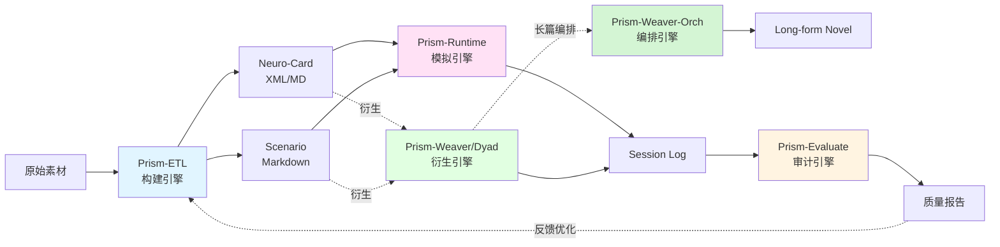

# 3akhp/neural-narratology

- **分类**：画龙补充 / 扩容入库 — 补充源
- **链接**：https://github.com/3akhp/neural-narratology
- **Stars**：0
- **语言**：TypeScript
- **License**：MIT
- **Topics**：agentic-workflow, character-ai, interactive-narrative, llm, nlp, prompt-engineering, reverse-engineering, roocode, vscode
- **GitHub 描述**：Research on LLM Interactive Narrative: From Reverse Engineering to Automated Foundry. (Phase I-III)
- **本地描述**：neural-narratology
- **拉取时间**：2026-07-25 19:11:21

---

# Neural Narratology (神经叙事学)

> **从逆向工程到自动化铸造：大型语言模型(LLM)交互式叙事与角色工程学研究**
> *From Reverse Engineering to Automated Foundry: A Study on LLM Interactive Narrative and Character Engineering*

[](https://github.com/3aKHP)
[](http://www.hit.edu.cn/)
[]()
[](./LICENSE)

---

## 📖 项目简介 (Introduction)

**Neural Narratology** 是一个针对大型语言模型（LLM）在交互式角色扮演（Role-Playing）领域应用的全栈研究计划。

本项目始于对商业 LLM-RP 平台的黑箱逆向分析，终于一套基于 IDE 原生环境的自动化角色铸造流水线。我们致力于回答并解决以下核心问题：
1.  **机制解构**：商业平台如何在有限上下文窗口下实现"人设不朽"？
2.  **理论构建**：如何定义一套标准化的协议，使 AI 角色具备深度逻辑与叙事动力学？
3.  **工程实践**：如何将角色创作从手工作坊式的 Prompt 编写，转化为工业化的 **Agentic Workflow**？

## 🧭 当前进度 (Current Focus)

> 已发布下一代协议 **v10.0 Tempered-Voice**（针对新一代 LLM 的语言习惯重做协议语言层）；工程化载体为独立姊妹项目 **[Prism Vesicle](https://github.com/3aKHP/prism-vesicle)**。**`[`shared/prism-driver/`](./shared/prism-driver/)`** 提供 Prism HAL，隔离七引擎协议与宿主工具实现；**`[`shared/rule-assets/`](./shared/rule-assets/)`** 编译 Vesicle Harness Pack，首个模块 **`[`shared/anti-ai-flavor/`](./shared/anti-ai-flavor/)`** 提供 Guidance、Detector 与 Judge rubric。v9.x 及更早协议与宿主实现作为历史演进档案保留。

---

## 🗺️ 研究路线图 (Roadmap)

本研究共分为三个递进阶段，分别对应了从"破解"到"构建"再到"自动化"的技术演进：

### `[🌒 Phase I: Echo (回响)](./01_Echo/)`
> **"Listen to the Ghost in the Machine."**

*   **核心任务**：商业平台黑箱逆向工程。
*   **关键成果**：
    *   揭示了 **"Single World-Simulator"** (单一世界模拟器) 架构。
    *   解构了 **Dynamic Persona Injection** (动态人设注入) 与轻量级 RAG 机制。
    *   提取了高级用户的"三层指令系统" (Jailbreak/Constitution/Knowledge)。
*   **📄 `[阅读研究报告](./01_Echo/"回响"项目研究报告-Repo-Git.pdf)`**

### `[🌓 Phase II: Resonance (共鸣)](./02_Resonance/)`
> **"Construct the Soul with Logic."**

*   **核心任务**：标准化 AI 角色创作路径。
*   **关键成果**：
    *   提出了 **ETL-XML-Axiom** 三位一体架构。
    *   发布了 **Protocol v5.0 (Legacy)**：综合性价比最高的剧本优先协议。
    *   发布了 **Protocol v6.0 (Omni-Foundry)**：引入动态状态机、逻辑门与 L-System 叙事分级的下一代协议。
    *   发布了 **Protocol v7.0 (Neuro-Weave)**：基于 Bio-XML 理念和认知公理的神经编织引擎，实现从"结构化数据容器"到"活体认知系统"的范式转变。
    *   发布了 **Protocol v8.0 (Compact-State Update)**：作为 FurryBar Engine 的 v8 主题更新，通过 YAML+Markdown 轻骨架压缩格式性文本开销，保护正文空间与注意力密度。
    *   发布 **Compact-State Lite**：面向单一 System Prompt 聊天宿主的角色主提示词生产层协议。
*   **📄 `[阅读研究报告](./02_Resonance/"共鸣"项目研究报告-Repo-Git.pdf)`**

### `[🌔 Phase III: Modulation (调制)](./03_Modulation/)`
> **"Control the Signal via Agents."**

*   **核心任务**：基于 IDE 原生环境的智能体辅助生产 (VibeCoding)。
*   **关键成果**：
    *   **Prism Engine 矩阵架构**：从初期的三位一体，扩展为包含 ETL（构建）、Runtime（模拟）、Evaluate（审计）、Weaver（衍生小说）、Dyad（衍生数据）、**Weaver-Orch**（长篇编排器）和 **Stage**（消费端沉浸式 RP）的**七大引擎**生态。
    *   基于 VSCode + RooCode 的自动化角色铸造流水线。
    *   实现了 **Zero-Copy** 工作流：利用智能体操作文件系统，实现从自然语言意图到结构化 XML/Markdown 的无缝转换。
    *   突破长上下文窗口限制的 **Chunked Writing Loop**（分块写入循环）技术。
    *   完整实现 v7.0 Neuro-Weave 理论框架（Prism-Engine-V7.x）。
    *   完整实现 v8.0 Compact-State 协议（Prism-Engine-V8.x），从 Bio-XML 转向 **YAML+Markdown 轻骨架**架构，新增 **Story Bible 世界状态层**、**结构化 Outline** 与 **Lite Persona Prompt** 输出。
    *   发布 **Prism Engine v8.1**：新增 **Weaver-Orch** 第六引擎（基于 Orchestrator 的长篇编排器）。
    *   **多宿主适配**：早期六引擎矩阵曾扩展至 RooCode、Codex CLI 和 Claude Code CLI 三个宿主环境；**自 v10.0 起以七引擎矩阵收窄为 Prism Vesicle 单一目标平台**（见 `[`Prism-Engine-V10.x`](./03_Modulation/Prism-Engine-V10.x/)`），Codex/Claude-Code 适配作为历史归档冻结于 v9.0。
*   **🛠️ `[获取工具链](./03_Modulation/)`**

### `[🌕 Phase IV: Projection (投射)](./04_Projection/)`
> **"Project the Character Across Platforms."**

*   **核心任务**：将 Prism 角色资产投射到多形态消费环境。
*   **姊妹项目 Prism Vesicle**：独立终端宿主 **[Prism Vesicle](https://github.com/3aKHP/prism-vesicle)**（Bun + TypeScript）是 Prism Engine 的直连 API 宿主，承担角色资产的生产与有状态试运行（Runtime 模拟器），系统提示词完全由 Prism 资产掌控。
*   **关键成果（规划中）**：
    *   **Core Profile**：平台无关角色描述规范，作为跨平台投射的统一内核。
    *   **消费环境解耦**：将 Core Profile 编译到无状态消费前端——SillyTavern（CCv3 Lorebook Decorators）与 RikkaHub（思维链自维护 HUD）。
*   **📄 `[阅读设计文档](./04_Projection/)`**

---

## 📂 目录结构 (Directory Structure)

```text
Neural-Narratology/
├── 01_Echo/                        # Phase I: 逆向分析报告与脱敏数据样本
│   ├── README.md
│   ├── backend_request_structure.yaml
│   ├── preset_meta_commands.txt
│   ├── RAG_inject.xml
│   ├── "回响"项目研究报告-Repo-Git.md
│   └── "回响"项目研究报告-Repo-Git.pdf
│
├── 02_Resonance/                   # Phase II: 核心协议与理论框架
│   ├── README.md
│   ├── v5_Legacy/                  # 社区标准版协议（剧本优先）
│   ├── v6_Omni_Foundry/            # 全息灵魂协议（动态状态机）
│   ├── v7_Neuro_Weave/             # 神经编织引擎（认知模拟）
│   ├── v8_Compact-State/           # Compact-State 主题更新（轻结构协议）
│   ├── v8_Compact-State_Lite/      # Compact-State Lite（单提示词人格协议）
│   ├── v9_State-Space/             # State-Space 人格拓扑引擎（状态空间导航）
│   ├── v9_State-Space_Lite/        # State-Space Lite（单提示词人格协议）
│   ├── v10_Tempered-Voice/         # Tempered-Voice 协议（强基底语言层重做）⭐ 最新
│   ├── "共鸣"项目研究报告-Repo-Git.md
│   └── "共鸣"项目研究报告-Repo-Git.pdf
│
├── 03_Modulation/                  # Phase III: 自动化工具链
│   ├── Prism-Engine-V10.x/         # V10.x 工程源文件(⭐ 最新,唯一目标平台 Prism Vesicle)
│   │   ├── prompts/                # 七引擎行为手册
│   │   ├── specs/                  # schema 定义
│   │   └── templates/              # 模板文件
│   ├── Prism-Engine-V8.x/          # V8.x 通用版本（六引擎 Compact-State）
│   │   └── presets/                # 六引擎预设 YAML 配置
│   ├── Prism-Engine-V8.x-Installer/ # V8.x 安装器、模板与 Rules 分发目录
│   ├── Prism-Engine-Codex/         # Codex CLI 宿主适配(历史归档,冻结于 v9.0)
│   │   ├── {etl,runtime,evaluate,weaver,weaver-orch,dyad}/
│   │   ├── shared/prompts/         # 宿主无关的引擎手册
│   │   └── scripts/                # Shell + PowerShell 脚本入口
│   ├── Prism-Engine-Claude-Code/   # Claude Code CLI 宿主适配(历史归档,冻结于 v9.0)
│   │   ├── {etl,runtime,evaluate,weaver,weaver-orch,dyad}/
│   │   ├── shared/prompts/         # 宿主无关的引擎手册
│   │   └── scripts/                # Shell + PowerShell 脚本入口
│   ├── Prism-Engine-V7.x/          # V7.x 通用版本（完整五引擎）
│   │   └── presets/                # 五引擎预设 YAML 配置
│   ├── Prism-Engine-V7.x-Installer/ # V7.x 安装器、模板与 Rules 分发目录
│   ├── Prism-Engine-V6.x/          # V6.x 多模型 ETL 专项
│   │   ├── Prism-ETL-Claude/       # Claude 优化版本
│   │   ├── Prism-ETL-Deepseek/     # Deepseek 优化版本
│   │   └── Prism-ETL-Gemini/       # Gemini 优化版本
│   ├── README.md
│   └── "调制"项目研究报告-Repo-Git.md
│
├── 04_Projection/                   # Phase IV: 消费环境解耦(有状态宿主见姊妹项目 Prism Vesicle)
│   ├── README.md
│   ├── Core-Profile/                # 平台无关角色描述规范
│   │   └── README.md
│   ├── Platforms/                   # 伪有状态消费前端编译层
│   │   ├── README.md
│   │   ├── SillyTavern/             # B 类:CCv3 Lorebook Decorators 编译
│   │   └── RikkaHub/                # C 类:思维链自维护 HUD
│   └── "投射"项目研究报告-Repo-Git.md  # 研究报告（占位）
│
├── shared/                          # 跨姊妹项目共享资产(与 Prism Vesicle 共享)
│   ├── README.md
│   ├── rule-assets/                 # 通用规则源校验、编译、测试与 Harness Pack
│   ├── prism-driver/                # Prism HAL / Driver ABI / Adapter Schema
│   └── anti-ai-flavor/              # 反 AI 味知识源(Guidance + Detector + Judge)
│       ├── README.md
│       ├── SCHEMA-SPEC.md
│       ├── knowledge-source.yaml
│       ├── candidates/               # 未晋级外部规则候选与证据状态
│       ├── docs/ARCHITECTURE.md
│       └── zh-CN/prose-craft-guide.md
│
└── README.md                       # 项目总览
```

## 🎯 核心特性 (Core Features)

### Phase II: 理论框架

| 版本 | 代号 | 核心理念 | 适用场景 |
|:---|:---|:---|:---|
| **v5.0** | Legacy | 剧本优先 | 快速创作、社区分享 |
| **v6.0** | Omni-Foundry | 全息灵魂 | 深度博弈、技术原型 |
| **v7.0** | Neuro-Weave | 认知模拟 | 心理真实感、可攻略性 |
| **v8.0** | Compact-State | 结构降维 | 工业化生产、上下文节流 |
| **v9.0** | State-Space | 人格拓扑 | 高保真模拟、边界管理 |
| **v10.0** | Tempered-Voice | 强基底约束与嗓音淬炼 | 新一代 LLM、语言层现代化、反 AI 味治理 ⭐ |
| **Core Profile** | Projection | 平台无关角色内核 | 多消费平台投射、协议去耦 🚧 |

### Phase III: 工程实现



**六大引擎矩阵**：
- **ETL Engine**: 从原始素材逆向重构为角色 XML/MD 和场景 MD。
- **Runtime Engine**: 执行基于文件的双向交互循环。
- **Evaluate Engine**: 提供日志质量审计与除虫指南。
- **Weaver Engine**: 突破上下文限制，将设定自动扩写为连载长篇小说。
- **Weaver-Orch Engine**: 基于 Orchestrator 的长篇编排器，通过 Write → Sync → Audit → Decision Gate 四阶段章节生命周期管理多章连载。
- **Dyad Engine**: 分饰两角，全自动演绎并生成高质量的大规模交互数据集。

## 🚀 快速开始 (Quick Start)

### 方案 A：使用自动化工具链（推荐）

如果您是 **角色创作者** 或 **Prompt 工程师**，推荐从 **Phase III** 开始体验：

1.  **克隆仓库**：
    ```bash
    git clone https://github.com/3aKHP/Neural-Narratology.git
    cd Neural-Narratology
    ```

2.  **配置环境**：
    - 安装 [VSCode](https://code.visualstudio.com/)
    - 安装 [RooCode Extension](https://marketplace.visualstudio.com/items?itemName=RooVeterinaryInc.roo-cline)
    - 若使用模板安装流，额外安装 VSCode 的 Project Templates 插件
    - 准备 LLM API-Key

3.  **加载工具链**（选择 V8.x 或 V7.x）：

    **推荐：V8.x Compact-State（最新）**
    - 先阅读 `[`03_Modulation/Prism-Engine-V8.x-Installer/README.md`](./03_Modulation/Prism-Engine-V8.x-Installer/README.md)`
    - 运行安装器：
      - `powershell -ExecutionPolicy Bypass -File .\03_Modulation\Prism-Engine-V8.x-Installer\Install.ps1 -Mode A -Backup`
      - 或 `powershell -ExecutionPolicy Bypass -File .\03_Modulation\Prism-Engine-V8.x-Installer\Install.ps1 -Mode B -Backup`

    **V7.x Neuro-Weave（经典）**
    - 先阅读 `[`03_Modulation/Prism-Engine-V7.x-Installer/README.md`](./03_Modulation/Prism-Engine-V7.x-Installer/README.md)`
    - 运行安装器：
      - `powershell -ExecutionPolicy Bypass -File .\03_Modulation\Prism-Engine-V7.x-Installer\Install.ps1 -Mode A -Backup`
      - 或 `powershell -ExecutionPolicy Bypass -File .\03_Modulation\Prism-Engine-V7.x-Installer\Install.ps1 -Mode B -Backup`

    若不使用安装器，可按 `[`03_Modulation/README.md`](./03_Modulation/README.md)` 手动加载引擎 preset 文件。

4.  **开始创作**：
    - 以安装生成的 `Prism-Engine-Universe-V8.0-Template`（或 V7.0）初始化项目，或直接打开 `[`03_Modulation/Prism-Engine-V8.x/`](./03_Modulation/Prism-Engine-V8.x/)` 作为工作区
    - 切换到 `Prism ETL Engine` 模式
    - 若原始素材是 `.docx`，可先运行：
      - `powershell -NoProfile -ExecutionPolicy Bypass -File .\03_Modulation\Prism-Engine-V8.x\source_materials\ConvertDocxToMdAndArchive.ps1`
      - 该脚本会在结束后（无论成功/失败）将自身移动到 `..\drafts\`
    - 输入：`Initialize Workflow A for [Character Name]`
    - 详细步骤参见 `[Phase III README](./03_Modulation/README.md)`

### 方案 B：手动使用协议

如果您希望深入理解理论或进行自定义开发：

1.  **选择协议版本**：
    - 新手推荐：`[v5.0 Legacy](./02_Resonance/v5_Legacy/)`
    - 深度博弈：`[v6.0 Omni-Foundry](./02_Resonance/v6_Omni_Foundry/)`
    - 心理真实感：`[v7.0 Neuro-Weave](./02_Resonance/v7_Neuro_Weave/)`
    - 轻结构工业化：`[v8.0 Compact-State](./02_Resonance/v8_Compact-State/)` ⭐
    - 单提示词聊天宿主：`[v8.0 Compact-State Lite](./02_Resonance/v8_Compact-State_Lite/)`

2.  **阅读协议文档**：
    - 每个版本目录下都有完整的 README 和 Step-by-Step 指南

3.  **手动执行工作流**：
    - 按照 Kernel → Driver → Stdlib 的顺序加载提示词
    - 逐步生成 Module A（角色）和 Module B（场景）

## 📚 学习路径 (Learning Path)

### 🎓 初学者路径
1. 阅读 `[Phase I 研究报告](./01_Echo/"回响"项目研究报告-Repo-Git.pdf)` 了解背景
2. 使用 `[Phase III 工具链](./03_Modulation/)` 快速上手
3. 体验 `[v5.0 Legacy](./02_Resonance/v5_Legacy/)` 理解基础概念

### 🔬 研究者路径
1. 深入研究 `[Phase II 报告](./02_Resonance/"共鸣"项目研究报告-Repo-Git.pdf)`
2. 对比 `[v5.0](./02_Resonance/v5_Legacy/)` / `[v6.0](./02_Resonance/v6_Omni_Foundry/)` / `[v7.0](./02_Resonance/v7_Neuro_Weave/)` / `[v8.0](./02_Resonance/v8_Compact-State/)` 的设计差异
3. 阅读 `[v8.0 Compact-State Lite](./02_Resonance/v8_Compact-State_Lite/)` 理解单提示词人格压缩路径
4. 分析 `[Phase III 源码](./03_Modulation/Prism-Engine-V8.x/.roo/)` 的工程实现

### 🛠️ 开发者路径
1. Fork 本仓库
2. 基于 `[V8.x Schema](./03_Modulation/Prism-Engine-V8.x/specs/)` 或 `[V7.x Schema](./03_Modulation/Prism-Engine-V7.x/specs/)` 自定义扩展
3. 修改 `[System Prompts](./03_Modulation/Prism-Engine-V8.x/.roo/)` 适配特定模型

## 🔬 技术亮点 (Technical Highlights)

### Bio-XML 协议 (v7.0)
- XML 标签作为"功能器官"而非文本容器
- 强制"过程导向"描述（如何运作 vs. 是什么）
- 参考：`[`Step1B - MainStdlib.md`](./02_Resonance/v7_Neuro_Weave/Step1B%20-%20MainStdlib.md)`

### Compact-State 轻骨架 (v8.0)
- 从 Bio-XML 转向 **YAML Frontmatter + Markdown Body** 轻骨架架构
- Module A 从 XML Neuro-Card 变为 Compact Character Card (`.md`)
- HUD 压缩为 4 行中文紧凑格式
- 叙事公理扩展为 10 条（Anti-AI-Flavor 提升为独立公理）
- 新增 Story Bible 世界状态层与结构化 Outline

### Compact-State Lite
- 面向单一 System Prompt 聊天宿主的轻量人格锻造协议
- 聚焦角色主提示词的部署可用性与人格持续性
- 对应 Phase III 中的 `workspace/lite/` 输出路径

### 三大认知公理
1. **感知滤镜**：定义角色如何过滤现实
2. **情感液压**：定义压力点和释放阀
3. **攻略性**：确保角色具有连接路径

### L-System 本能协议
- L1-L2（社交/浪漫）：情感共鸣、张力构建
- L3-L4（亲密/癖好）：感官沉浸、欲望释放
- L5（极端）：边界探索（需谨慎使用）

### Agentic Workflow
- 基于 RooCode 的文件系统操作 (Zero-Copy)
- STOP & WAIT 机制确保人机协同
- 六大引擎闭环（构建 → 模拟/衍生/编排 → 审计）

## 📊 项目统计 (Statistics)

> **统计口径（更新于 2026-03-10）**：仅统计仓库内可追踪资产；不含 `.git/` 与本地 `dev/` 工作目录。

- **研究阶段**: 4 个（`01_Echo` / `02_Resonance` / `03_Modulation` / `04_Projection`）
- **协议版本**: 6 个主要版本（v5.0, v6.0, v7.0, v8.0, v9.0, v10.0）+ 1 个 Lite Profile（Compact-State Lite）
- **Prism 工具链目录**: 10 个（`Prism-Engine-V10.x` + `Prism-Engine-V8.x` + `Prism-Engine-V8.x-Installer` + `Prism-Engine-Codex` + `Prism-Engine-Claude-Code` + `Prism-Engine-V7.x` + `Prism-Engine-V7.x-Installer` + `Prism-Engine-V6.x/` 下 3 个 ETL 专项目录）
- **引擎预设配置**: 6 个（ETL / Runtime / Evaluate / Weaver / Weaver-Orch / Dyad）
- **`.roo` 系统提示词**: 17 份（V8.x 6 份 + V8.x-Installer/Template 6 份 + V7.x 5 份）
- **Schema 与模板**: `schema_*.md` 12 份，`tpl_*` 12 份
- **研究报告**: Repo-Git 版本 Markdown 3 份，PDF 2 份

## ⚠️ 免责声明 (Disclaimer)

*   本项目涉及的逆向工程内容仅供学术研究与安全防御教学使用。
*   项目中提到的特定商业平台（代号 Platform-X / FurryBar）仅作为案例分析对象，不代表对其商业模式的评价。
*   所有敏感数据与个人信息均已进行脱敏处理。
*   L-System 中的高级别内容（L4-L5）涉及成人主题，使用者需自行承担法律责任并遵守当地法规。

## 🤝 致谢 (Acknowledgements)

感谢哈尔滨工业大学计算学部的学术环境支持。  
感谢开源社区对 v5.0 协议的反馈与迭代。  
感谢 RooCode 团队提供的强大 IDE 集成能力。

## 📮 联系方式 (Contact)

- **GitHub**: [@3aKHP](https://github.com/3aKHP)
- **Issues**: [提交问题或建议](https://github.com/3aKHP/Neural-Narratology/issues)

## 📄 许可证 (License)

本项目采用 `[MIT License](./LICENSE)` 开源协议。

related:
  - methods/QUICK_START.md
---
*Copyright © 2025 3aKHP. All rights reserved.*
