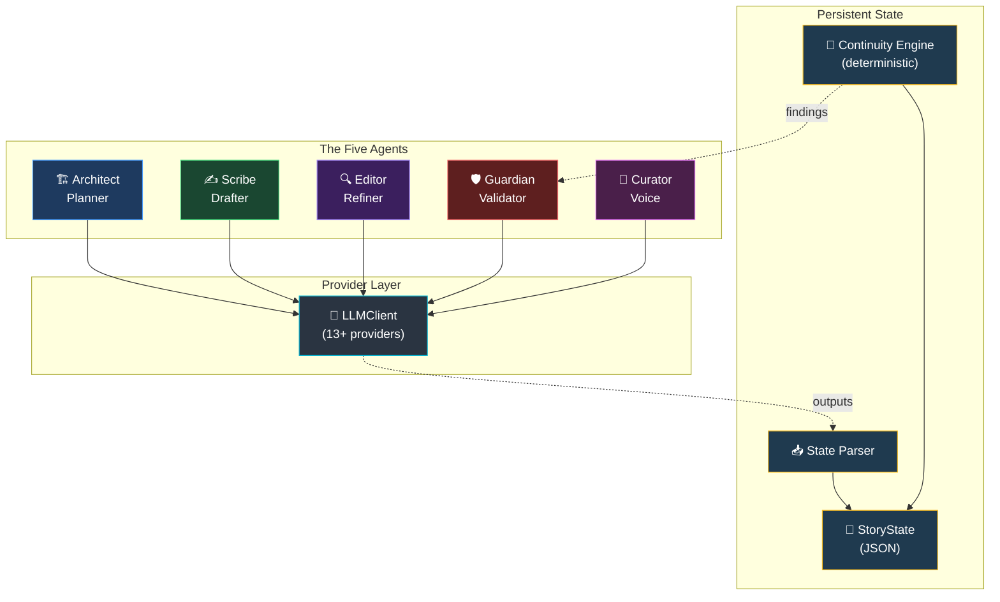
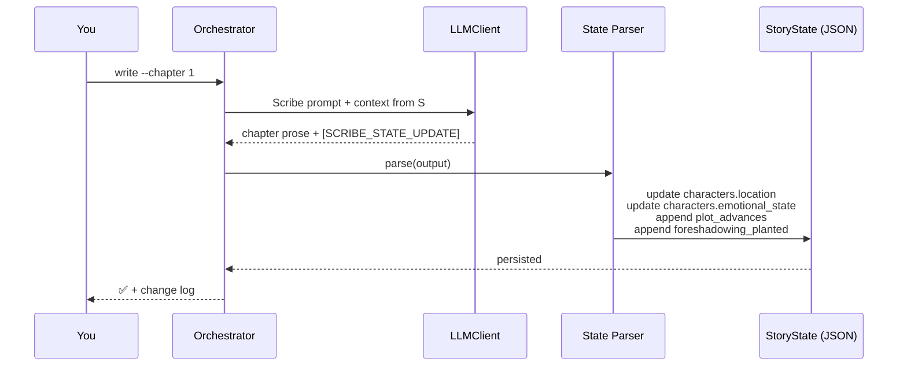
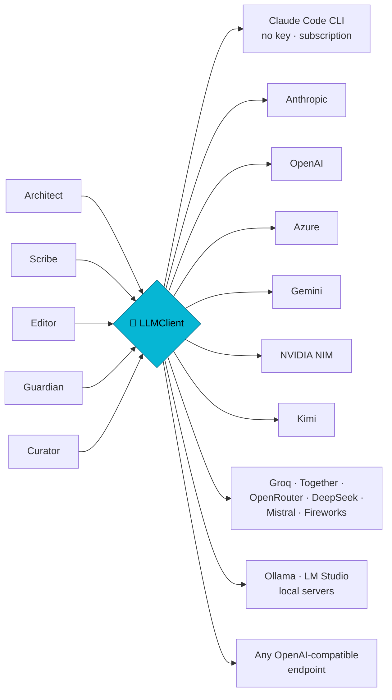

# mrigankad/novel-os

- **分类**：画龙补充 / 扩容入库 — 补充源
- **链接**：https://github.com/mrigankad/novel-os
- **Stars**：26
- **语言**：Python
- **License**：MIT
- **Topics**：agent-framework, ai-agents, ai-writing, automated-editing, creative-writing, fiction-writing, gemini, generative-ai, gpt, llm, multi-agent, narrative-ai, natural-language-processing, novel-writing, python, state-management, storytelling, text-generation, worldbuilding, writing-assistant
- **GitHub 描述**：Multi-agent AI framework that writes full-length novels with persistent story state, a deterministic continuity engine, and a five-role editorial pipeline.
- **本地描述**：novel-os
- **拉取时间**：2026-07-25 19:21:56

---

<div align="center">
  
</div>

<div align="center">
<h3>A Production-Grade Multi-Agent Fiction Writing Framework</h3>

<p><em>Write novels like a professional author — with an entire editorial team at your command.</em></p>

<br/>

[](https://python.org)
[](LICENSE)
[]()
[]()
[]()

<br/>

```
╔══════════════════════════════════════════════════════════════════╗
║                                                                  ║
║   "The difference between an amateur and a professional          ║
║    writer is a systematic process."                              ║
║                                                                  ║
║                              — Novel OS Philosophy               ║
╚══════════════════════════════════════════════════════════════════╝
```

</div>

---

## 🌟 What is Novel OS?

**Novel OS** is a complete **editorial infrastructure** for producing professional-quality novels using multiple specialized AI agents working in concert — with any LLM you choose (Claude, GPT, Gemini, Llama, Kimi, local models, anything OpenAI-compatible).

Traditional AI writing generates one response and forgets everything. Novel OS is different:

- 🧠 **Persistent memory** — agent outputs are parsed and merged into a central state file. Characters, locations, plot threads, foreshadowing, and quality scores accumulate chapter by chapter.
- 🤝 **Agents collaborate** — Architect → Scribe → Editor → Guardian → Curator, each handing off to the next with full context.
- 🛡️ **Deterministic + LLM validation** — a free local continuity engine catches dormant threads, unresolved foreshadowing, and timeline drift *before* the LLM Guardian runs.
- 🔌 **Provider-agnostic** — Anthropic, OpenAI, Azure, Gemini, NVIDIA NIM, Kimi, Groq, Together, OpenRouter, DeepSeek, Mistral, Fireworks, Ollama, LM Studio, or any OpenAI-compatible endpoint.

> Think of it as hiring a **full-time editorial team** — story architect, prose craftsman, line editor, fact-checker, voice coach — all working on your novel around the clock, on infrastructure that actually remembers what happened in chapter 3.

<p align="center"></p>

---

## 🏛️ Architecture



---

## 🎭 The Five Agents

| # | Agent | Role | Outputs |
|---|---|---|---|
| 1 | 🏗️ **Architect** | Story planner — designs 3-act structure, character arcs, beats | `outline.json`, expanded `chapter_NNN_outline.md` |
| 2 | ✍️ **Scribe** | Prose drafter — writes the chapter in deep POV | `chapter_NNN_draft.md` + `[SCRIBE_STATE_UPDATE]` block |
| 3 | 🔍 **Editor** | Line surgeon — 5 modes: line / developmental / pacing / dialogue / tension | `chapter_NNN_revised.md` + `[EDITOR_STATE_UPDATE]` with before/after scores |
| 4 | 🛡️ **Guardian** | Forensic fact-checker — character, timeline, world, plot continuity | `chapter_NNN_continuity_report.md` with `Status: PASS/WARNING/FAIL` |
| 5 | 🎨 **Curator** | Voice stylist — locks tone, prose rhythm, genre conventions | `[STYLE_STATE_UPDATE]` with consistency / genre / voice scores |

Every agent prompt now includes a strict **OUTPUT CONTRACT** that forces the LLM to emit machine-parseable update blocks — verified working with frontier models (Claude, GPT) and open-weight models (Llama 3.3 70B).

---

## 🔄 The Chapter Workflow


**Quality gates** — a chapter cannot be approved while `Status: FAIL` is on file. Resolve the issue and re-validate.

<p align="center"></p>

---

## 🧠 Persistent Memory — How State Actually Lives

The defining feature: **every agent's structured output is parsed and merged into a central JSON state**, so subsequent agents see what came before.



Captured per chapter: character locations, emotional states, last-appearance index, key events, foreshadowing planted/resolved, new information revealed, editor quality scores (before/after), continuity status & issues, style scores.

---

## 🔬 The Continuity Engine

Deterministic, free, instant — runs before the LLM Guardian on every `validate`, and on demand via `check`.

| Check | Severity | Catches |
|---|---|---|
| `dormant_thread` | warning | Active plot threads idle >3 chapters |
| `overdue_thread` | **critical** | Threads past their `target_resolution_chapter` still active |
| `unresolved_foreshadowing` | warning | Planted seeds with no matching `resolved` entry |
| `absent_character` | warning | Main characters silent >5 chapters |
| `never_appeared` | warning | Protagonists/antagonists who never showed up |
| `dead_character_state` | warning | Flagged-dead characters with active state |
| `missing_chapter_file` | **critical** | Chapter marked complete but no manuscript file |
| `status_drift` | info | Draft exists but status still `planned` |
| `thin_character` | info | Main characters with no `internal_desire` set |

```bash
python core/orchestrator.py check                 # check whole project
python core/orchestrator.py check --chapter 12    # check as-of a specific chapter
```

Findings are also injected into the LLM Guardian's prompt as context — the Guardian gets a head start instead of rediscovering obvious issues, and you don't spend tokens on them.

---

## 🔌 Provider-Agnostic LLM Layer

Pick any of these — auto-detected from whichever API key is present:

| Provider | `NOVEL_OS_LLM_PROVIDER` | Key env var |
|---|---|---|
| **Claude Code CLI (no API key — free with your subscription)** | `claude_cli` | — (just `claude login`) |
| Anthropic Claude | `anthropic` | `ANTHROPIC_API_KEY` |
| OpenAI | `openai` | `OPENAI_API_KEY` |
| Azure OpenAI | `azure` | `AZURE_OPENAI_API_KEY` + `AZURE_OPENAI_ENDPOINT` |
| Google Gemini | `gemini` | `GEMINI_API_KEY` |
| NVIDIA NIM | `nvidia` | `NVIDIA_API_KEY` |
| Kimi / Moonshot | `kimi` | `KIMI_API_KEY` |
| Groq | `groq` | `GROQ_API_KEY` |
| Together AI | `together` | `TOGETHER_API_KEY` |
| OpenRouter | `openrouter` | `OPENROUTER_API_KEY` |
| DeepSeek | `deepseek` | `DEEPSEEK_API_KEY` |
| Mistral | `mistral` | `MISTRAL_API_KEY` |
| Fireworks | `fireworks` | `FIREWORKS_API_KEY` |
| Ollama (local) | `ollama` | — |
| LM Studio (local) | `lmstudio` | — |
| **Any OpenAI-compatible endpoint** | `openai_compatible` | `NOVEL_OS_API_KEY` + `NOVEL_OS_BASE_URL` |



---

## 🚀 Quick Start

```bash
git clone https://github.com/mrigankad/Novel-OS.git
cd Novel-OS
pip install -r requirements.txt   # install only the SDKs you need
```

### 0 — Configure your LLM (one command)

Let the setup wizard detect what you already have — the Claude Code CLI, any API
key, or a local model server — test the connection, and write your `.env` for you:

```bash
python core/orchestrator.py setup        # or: python -m core.setup_wizard
```

> **No API key?** If you have the [Claude Code CLI](https://docs.claude.com/claude-code)
> installed and `claude login` done, Novel OS runs entirely on your subscription —
> the wizard picks it automatically, and there are zero per-token API charges.

Prefer to configure by hand? `cp .env.example .env` and set your key(s). If you run a
writing command with nothing configured, Novel OS offers the wizard automatically.

### 1 — Initialize

```bash
python core/orchestrator.py init --title "The Last Signal" --genre "Sci-Fi Thriller"
```

### 2 — Cast

```bash
python core/orchestrator.py character add --name "Lena Vasquez" --role protagonist
python core/orchestrator.py character add --name "Director Malk" --role antagonist
```

### 3 — Plan

```bash
python core/orchestrator.py plan outline --chapters 32
python core/orchestrator.py plan chapter --number 1 --pov "Lena Vasquez"
```

### 4 — Write, edit, validate

```bash
python core/orchestrator.py write --chapter 1                     # Scribe drafts
python core/orchestrator.py edit  --chapter 1 --mode line         # Editor polishes
python core/orchestrator.py check --chapter 1                     # free pre-check
python core/orchestrator.py validate --chapter 1                  # Guardian validates
python core/orchestrator.py approve  --chapter 1                  # gates on FAIL
```

Every phase command also accepts `--dry-run` to emit the prompt without calling the LLM — useful for hand-running in a chat UI.

### 5 — Track & export

```bash
python core/orchestrator.py status
python core/orchestrator.py export --format markdown
```

---

## 🖥️ Web UI (local)

A browser dashboard to view your projects, chapters, outlines, and drafts. Two
processes — the API and the React dev server:

```bash
# 1. Backend (from repo root)
pip install -r requirements.txt
export NOVEL_OS_PROJECTS_DIR=./projects   # folder of project dirs
uvicorn api.main:app --reload --port 8000

# 2. Frontend (in another terminal)
cd web && npm install && npm run dev      # http://localhost:5173
```

Each project is a folder under `NOVEL_OS_PROJECTS_DIR` containing
`outputs/state/story_state.json` (created by `python core/orchestrator.py init …`).

---

## 🗂️ CLI Reference

| Command | Purpose |
|---|---|
| `init --title --genre [--author]` | Bootstrap a new project |
| `character add --name --role` | Add a character (`protagonist`/`antagonist`/`supporting`/`minor`) |
| `character list` | List all characters with arc state |
| `plot add --name --description [--type --priority]` | Register a plot thread |
| `plot list` | List threads by priority and status |
| `plan outline --chapters --words` | Generate act structure |
| `plan chapter --number [--pov --summary] [--dry-run]` | Architect expands the chapter |
| `write --chapter [--draft-file --dry-run]` | Scribe drafts (or accept a file) |
| `edit --chapter --mode [--dry-run]` | Editor revises in one of 5 modes |
| `validate --chapter [--dry-run]` | Pre-check + LLM Guardian validates |
| `check [--chapter N]` | Deterministic engine only (no LLM) |
| `approve --chapter` | Mark complete (blocked while `Status: FAIL`) |
| `status` | Project dashboard |
| `export --format markdown` | Compile approved chapters |

---

## 📁 Project Structure

```
novel-os/
├── 📄 README.md                       ← you are here
├── 📄 AGENTS.md                       ← full agent specs
├── 📄 SYSTEM_OVERVIEW.md              ← architecture deep-dive
├── 📄 requirements.txt
├── 📄 .env.example                    ← provider configuration
│
├── 🐍 core/
│   ├── orchestrator.py                ← CLI + workflow
│   ├── state_manager.py               ← persistent JSON state
│   ├── llm_client.py                  ← 13+ provider abstraction
│   ├── state_parser.py                ← agent output → state mutations
│   └── continuity_engine.py           ← deterministic checks
│
├── 🤖 agents/                         ← each has prompt.md with OUTPUT CONTRACT
│   ├── architect/
│   ├── scribe/
│   ├── editor/
│   ├── continuity_guardian/
│   └── style_curator/
│
├── 📋 templates/                      ← story bible / character / outline starters
├── 📚 docs/                           ← WORKFLOWS.md, API.md
├── 🎬 examples/                       ← demo project + recent smoke run
├── 🎨 assets/                         ← mascot + optional generated imagery
│
└── 📤 outputs/                        ← (per project, gitignored)
    ├── state/story_state.json
    ├── manuscript/
    └── feedback/
```

---

## 💡 Why Novel OS Works

Great novels are not written — they are **engineered**. Professional authors use editors, fact-checkers, and style guides. They maintain character bibles, plot trackers, and timelines. Novel OS gives every writer that infrastructure, automated and systematic, **with state that actually accumulates** rather than dissolving between sessions.

| ❌ Without Novel OS | ✅ With Novel OS |
|---|---|
| Characters forget their backstory | Persistent character database with location, emotion, knowledge |
| Plot holes emerge 200 pages in | Continuity engine catches dormant threads & overdue resolutions |
| Style drifts between chapters | Curator scores and flags voice drift per chapter |
| Foreshadowing dropped silently | Planted/resolved tracked; orphans surfaced |
| Tension collapses in act two | Architect beats + Editor tension mode enforce escalation |
| Vendor lock-in to one LLM | 13+ providers, swap with one env var |

---

## 📖 Documentation

| Document | What's inside |
|---|---|
| [AGENTS.md](AGENTS.md) | Full system prompts and OUTPUT CONTRACT for each of 5 agents |
| [SYSTEM_OVERVIEW.md](SYSTEM_OVERVIEW.md) | Architecture deep-dive and design rationale |
| [docs/WORKFLOWS.md](docs/WORKFLOWS.md) | Step-by-step writing workflows |
| [docs/API.md](docs/API.md) | Programmatic API for custom integrations |

related:
  - methods/QUICK_START.md
---

<div align="center">

**Novel OS** — *Write novels like a professional author, with an entire editorial team at your command.*

*v1.1 | Production-Ready Fiction Framework | MIT License*

</div>
