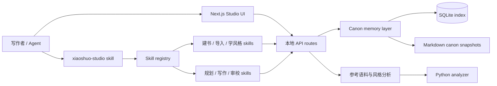
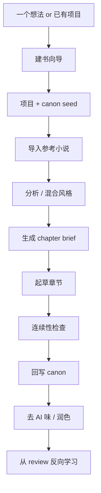

# zhao73/xiaoshuo-studio

- **分类**：画龙补充 / 扩容入库 — 补充源
- **链接**：https://github.com/zhao73/xiaoshuo-studio
- **Stars**：5
- **语言**：TypeScript
- **License**：MIT
- **Topics**：ai-agent, claude-code, codex, fiction-writing, nextjs, novel-writing
- **GitHub 描述**：Local fiction studio for long-form novel planning, canon memory, style learning, and skill-based writing workflows for Codex and Claude Code.
- **本地描述**：xiaoshuo-studio
- **拉取时间**：2026-07-25 19:28:51

---

# xiaoshuo

[](https://github.com/Zhao73/xiaoshuo-studio/actions/workflows/ci.yml)
[](./LICENSE)
[](./README.md)
[](./README.en.md)

面向长篇小说创作的本地工作台：建书向导、剧情记忆、参考小说技法学习、章节规划、连续性检查、skill 聚合入口，都放在同一个项目里。

`xiaoshuo` 主要解决这几类问题：

- 从一个模糊想法开始，一步步问答把小说搭起来
- 长篇连载不靠模型“自己记住”，而是靠 canon 和记忆层稳住连续性
- 把你本地收藏的小说样本导入进来，学习节奏、对白、钩子和推进方式
- 用一个总入口 skill `xiaoshuo-studio` 驱动整个项目，而不是记一堆零散 skill 名
- 开源后直接导出或安装 skill bundle，别人也能一键用起来

## 页面截图

### 首页

!`[Homepage screenshot](./docs/images/homepage.png)`

### 建书向导

!`[Wizard screenshot](./docs/images/wizard.png)`

## 核心能力

- 深度建书向导：像 Plan Mode 一样逐题问答，自动生成项目、初始 canon、首卷方案和第 1 章 brief
- Canon 记忆层：人物、时间线、伏笔、线头、世界规则都可结构化存储
- 参考小说学习：支持导入本地小说文件夹、切章、风格分析、混合风格卡
- 连续性检查：写完章节后检查人物状态、地点、规则是否打架
- Skill 聚合入口：只记 `xiaoshuo-studio`，它负责路由到合适的子 skill
- 开源分发：支持 `aggregator-only` 和 `full-bundle` 两种导出/安装模式

## 架构图



## 写作工作流



## 安装矩阵

| 目标 | 命令 |
| --- | related:
  - methods/QUICK_START.md
--- |
| 本地开发运行 | `npm install && npm run dev` |
| 本地完整验证 | `npm run lint && npm test && npm run build && pytest tests/python -q` |
| 为 Codex 导出一个总入口 skill | `npm run skills:export -- --target codex --mode aggregator-only` |
| 为 Codex 导出完整 skill bundle | `npm run skills:export -- --target codex --mode full-bundle` |
| 为 Claude Code 导出完整 skill bundle | `npm run skills:export -- --target claude --mode full-bundle` |
| 为 Codex 一键安装总入口 skill | `npm run skills:install -- --target codex --mode aggregator-only` |
| 为 Codex 一键安装完整 bundle | `npm run skills:install -- --target codex --mode full-bundle` |
| 为 Claude Code 一键安装完整 bundle | `npm run skills:install -- --target claude --mode full-bundle` |

默认目录：

- Codex 默认安装到 `~/.codex/skills`，除非设置了 `CODEX_HOME`
- Claude Code 默认安装到 `~/.claude/skills`，除非设置了 `CLAUDE_HOME`

## 快速开始

```bash
npm install
npm run dev
```

打开 `http://localhost:3000`，或者 Next.js 启动时显示的本地端口。

推荐第一轮使用顺序：

1. 打开 `/wizard/new-novel`
2. 走一遍深度建书问答
3. 确认自动生成的项目、canon seed、首卷方案和第 1 章 brief
4. 需要时导入参考小说
5. 按 canon-aware 的流程继续写作

## 总入口 Skill

如果你只想记一个 skill 名，使用：

```text
xiaoshuo-studio
```

它可以处理这类请求：

- “帮我一步步创建一本修仙小说”
- “导入这个本地小说文件夹并分析风格”
- “继续写第 12 章”
- “检查连续性然后回写 canon”

如果你想精细控制，也可以直接使用子 skill，例如：

- `novel-init-wizard`
- `novel-load-context`
- `novel-plan-next`
- `novel-draft-scene`
- `novel-continuity-review`
- `novel-update-canon`
- `webnovel-import-folder`
- `webnovel-analyze-style`
- `webnovel-write`

## Canon API

长篇记忆相关的主要本地接口：

- `GET /api/canon?projectId=<id>`
- `POST /api/canon/refresh`
- `POST /api/chapters/brief`
- `POST /api/chapters/continuity-check`
- `POST /api/chapters/update-canon`

建书向导接口：

- `POST /api/wizard/start`
- `POST /api/wizard/answer`
- `GET /api/wizard/session?sessionId=<id>`
- `POST /api/wizard/finish`

## 技法学习边界

这个项目的目标是 **学技法，不是克隆作者声线**。

推荐循环是：

1. 导入或抓取参考素材，并保留来源
2. 分析成可复用的指标和风格卡
3. 转成 anti-AI focus 和技法提示
4. 用这些约束写作或改稿
5. 把 review 结果反向变成练习和学习笔记

## 仓库工程化

这个仓库已经包含：

- GitHub Actions CI
- lint / test / build / Python test 验证门禁
- issue templates
- PR template
- `CODEOWNERS`
- `CONTRIBUTING.md`
- `SECURITY.md`
- MIT License

## 文档

- 详细工作流：`[docs/local-codex-studio.md](./docs/local-codex-studio.md)`
- skill 地图：`[docs/skills-map.md](./docs/skills-map.md)`
- 中文教程：`[docs/tutorial-zh.md](./docs/tutorial-zh.md)`
- 风格分析契约：`[docs/style-analysis-contract.md](./docs/style-analysis-contract.md)`

## Codex 要求

这个项目默认假设你本地已经安装并登录 Codex CLI：

```bash
codex --version
```

Web 应用会检查本地 Codex 可用性，但不会替代 `codex login` 或自定义 OpenAI API 登录流程。
