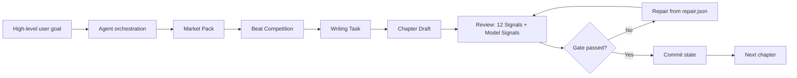

# zhougz520/novel-architect

- **分类**：画龙补充 / 扩容入库 — 补充源
- **链接**：https://github.com/zhougz520/novel-architect
- **Stars**：0
- **语言**：Python
- **License**：Apache-2.0
- **Topics**：agent-skill, ai-writing, chinese-webnovel, codex, llm-evaluation, long-form-fiction, novel-writing, review-gates, web-novel, writing-tools
- **GitHub 描述**：Agent skill for long-form Chinese serial web-novel workflows with review gates, state guards, and quality signals.
- **本地描述**：novel-architect
- **拉取时间**：2026-07-25 19:28:59

---

<div align="center">

!`[Novel Architect](./docs/assets/novel-architect-hero.png)`

# Novel Architect

**Agent skill for long-form Chinese serial web-novel workflows.**

[](#)
[](#)
[](./LICENSE)
[](./skill/novel-architect/SKILL.md)
[](./docs/reference/signals-and-gates.md)
[](./docs/guides/chapter-workflow.md)

English | `[简体中文](./README.zh-CN.md)`

</div>

---

## What Is Novel Architect?

Novel Architect is an agent skill for Chinese commercial serial web-novel production. It is designed for long-running fiction workflows where an agent must plan, draft, review, repair, and continue a story without losing reader pull, visible payoff, character voice, or continuity.

The goal is not "generate more text faster." The goal is to make an AI agent behave more like a small editorial production desk: it opens the book with a market plan, competes chapter beats before drafting, writes with self-contained context, reviews against quality signals, repairs failed chapters, and commits only after the gate passes.

It focuses on problems that usually break long-form AI fiction:

- weak openings that give readers no reason to continue;
- chapters without visible payoff, enemy loss, status change, relationship movement, or clear stakes;
- characters whose voices collapse into one generic AI tone;
- professional or niche topics that are not translated into reader-visible gains and losses;
- forgotten foreshadowing, costs, enemy threads, and reader promises after dozens of chapters;
- agents that keep writing forward even when the review gate says the chapter should not be committed.

## Why It Is Not Just a Prompt

Novel Architect combines agent literary judgment with deterministic Python state guards.



The agent handles creative judgment: market positioning, beat selection, chapter drafting, model-signal review, repair, and feedback diagnosis.

The Python layer handles deterministic work: project indexes, ledgers, hashes, first-three-chapter gates, signal merge, review gates, state rebuilds, and commit safety.

The main chapter loop remains:

```text
PREPARE -> WRITE -> REVIEW -> COMMIT
```

## 🧪 Production Validation

Novel Architect was developed and hardened through real long-form production, not only synthetic examples.

- The first production run produced and completed the Fanqie web novel [重生2021，开局百亿做空](https://changdunovel.com/t/Dlm4BCnTZh8/).
- That run covered a 140-chapter local creative artifact set and informed the workflow hardening that became v3.0.0.
- v3.0.0 is now being used for a second production project, `全城短剧成真，我专改必死剧本`.

See `[Production Validation](./docs/case-studies/production-validation.md)` for the public case-study notes.

No manuscript text, private project files, platform backend data, income information, contract details, or unpublished second-project content is included in this repository.

## 🧩 Core Capabilities

| Capability | What it protects |
|---|---|
| Market Pack | Platform fit, target reader, selling points, anti-selling points, title/intro direction, and first-ten-chapter retention plan. |
| First 3 Gate | Blocks normal chapter 4+ production until the first three chapters pass the dedicated review gate. |
| Beat Competition | Forces each chapter to compare stronger, riskier, and more emotional beat candidates before drafting. |
| Writing Task | Packages context, character voice, visible payoff, enemy loss, next-chapter pull, forbidden moves, and output rules for the drafting agent. |
| 12 Quality Signals | Reviews anti-AI texture, reader pull, visible payoff, character voice, domain translation, state guard, and other long-form risks. |
| Strictest Merge | Combines heuristic and model-produced signal variants by the strictest result; a model `pass` cannot override a heuristic `warn` or `fail`. |
| Reader Promise Ledger | Tracks promises introduced, paid off, overdue, or still open so hooks do not disappear. |
| Feedback Loop | Stores platform feedback and helps the agent diagnose whether the issue is entry packaging, first-three retention, chapter pacing, or market position. |

## 🚀 Quick Start

### 1. Clone and verify the development environment

```bash
git clone https://github.com/zhougz520/novel-architect.git
cd novel-architect
uv sync --group dev
uv run python -m novel_architect --version
```

### 2. Build the skill package

```bash
bash scripts/release.sh
```

The release artifact is created at:

```text
dist/novel-architect-skill-v3.0.0.zip
```

### 3. Install the skill in your agent tool

Unzip the release artifact and place the `novel-architect/` skill directory in a skill location supported by your agent tool.

Common locations:

| Tool | Common skill location |
|---|---|
| Codex | `~/.agents/skills/novel-architect/` or repository-level `.agents/skills/novel-architect/` |
| Claude Code | `~/.claude/skills/novel-architect/` |
| OpenCode | `~/.config/opencode/skills/novel-architect/` |

Tool paths can change across versions. Use your tool's current skill configuration as the source of truth.

### 4. Give the agent a high-level task

Do not manually drive every CLI command in normal use. Ask the agent to use the skill and let it run the workflow.

Example:

```text
Use the novel-architect skill to open a Chinese urban rebirth business web novel for Fanqie.
The first three chapters must establish protagonist pain, enemy pressure, first visible gain, and a strong reason to continue reading.
Do not write it like a financial meeting memo. Translate professional events into reader-visible money, power, status, relationships, secrets, resources, or safety stakes.
Run the CLI yourself, complete the market pack, first-ten retention plan, character voices, first-three trial production, and first3 review. Do not ask me to manually run routine commands.
```

Continuing a chapter:

```text
Use the novel-architect skill to continue the next chapter.
Inspect the project state yourself, run prepare, perform beat competition, read the writing task, draft the chapter, review it, save required model signals, repair from gate/repair output until gate.passed=true, then commit.
```

More examples: `[Prompt Recipes](./docs/guides/prompt-recipes.md)`.

## 🧭 Typical Workflows

| Scenario | Start here | Main docs |
|---|---|---|
| First-time setup | Install the skill and create a test project | `[Getting Started](./docs/guides/getting-started.md)` |
| New book | Market pack, character voices, first-ten retention, first-three trial production | `[New Book Workflow](./docs/guides/new-book-workflow.md)` |
| Continue writing | prepare -> beat -> write -> review -> repair -> commit | `[Chapter Workflow](./docs/guides/chapter-workflow.md)` |
| First three chapters fail | first3 review, review hash, score requirements, entry rewrite | `[First 3 and First 10](./docs/guides/first3-first10.md)` |
| Chapter gate fails | Read gate/repair output, revise, rerun signals | `[Repair and Feedback](./docs/guides/repair-feedback.md)` |
| Migrate old projects | Move from `volumes.json + gen-prompt` to the agent workflow | `[Migration Guide](./docs/guides/migration-from-gen-prompt.md)` |
| Contribute | Environment, tests, release, documentation sync | `[Development Guide](./docs/development/README.md)` |

## 🔍 Quality Signals

| Signal | Focus | Gate role |
|---|---|related:
  - methods/QUICK_START.md
---|
| `anti_ai` | Generic AI phrasing, hollow exposition, template texture | Hard |
| `story_logic` | POV, information flow, power/rule consistency | Hard |
| `state_guard` | Previous hooks, costs, enemy threads, forbidden moves | Hard |
| `emotion` | Emotional markers, relationship aftereffects, character arc | Quality |
| `blockbuster` | Pressure -> counterattack -> payoff -> cost | Quality |
| `visible_payoff` | Money, power, face, status, resources, enemy loss | Quality |
| `reader_pull` | Opening drive, middle suspense, ending pull | Quality |
| `title_hook` | Clickable title, chapter name, ending hook | Quality |
| `character_voice` | Distinct character voice and forbidden speech patterns | Quality |
| `domain_translation` | Whether professional details become reader-visible stakes | Quality |
| `novelty` | Repeated recent structures, routines, and ending hooks | Market |
| `continuity` | Foreshadowing, costs, enemy threads, reader promises | Market |

See `[Signals and Gates](./docs/reference/signals-and-gates.md)`.

## 📁 Project Structure

```text
novel-architect/
├── README.md                         # English public landing page
├── README.zh-CN.md                   # Simplified Chinese public landing page
├── LICENSE                           # Apache-2.0 license
├── AGENTS.md                         # Repository instructions for coding agents
├── docs/                             # User and contributor documentation
├── scripts/                          # format/lint/test/release helpers
├── skill/novel-architect/            # Released skill root
│   ├── SKILL.md                      # Runtime agent playbook
│   ├── LICENSE                       # License copy included in release bundles
│   ├── references/                   # Runtime specifications
│   └── src/novel_architect/          # Deterministic Python tool layer
├── tests/                            # Unit and integration tests
└── tools/final_merge_probe.py         # Pre-merge probe
```

## Who It Is For / Not For

Novel Architect is for:

- creators who want an agent-assisted workflow for Chinese commercial serial web novels;
- maintainers who care about long-run state, review gates, and repeatable chapter production;
- writers who want stronger visible payoff, turn-page motivation, character voice, and continuity;
- contributors interested in agent workflows that separate deterministic state checks from literary judgment.

It is not for:

- fully automatic hit-novel generation with no human premise, taste, or editorial direction;
- imitating a living author's exact style or copying an existing book;
- short literary experiments that do not need commercial serial gates;
- workflows that intentionally skip review gates to maximize raw word count.

## 📚 Documentation

Documentation index: `[docs/README.md](./docs/README.md)`.

- Users: start with `[Getting Started](./docs/guides/getting-started.md)`.
- Existing projects: see `[Migration from gen-prompt](./docs/guides/migration-from-gen-prompt.md)`.
- Contributors: see `[Development Guide](./docs/development/README.md)`, `[CONTRIBUTING.md](./CONTRIBUTING.md)`, and `[AGENTS.md](./AGENTS.md)`.
- Architecture: see `[System Architecture](./docs/architecture/README.md)`.
- CLI/files/signals: see `[Reference](./docs/reference/cli.md)`.
- Marketplace listing draft: see `[Skill Listing](./docs/marketplace/skill-listing.md)`.

## 🤝 Contributing

Read `[CONTRIBUTING.md](./CONTRIBUTING.md)` before opening an issue or pull request.

Minimum local checks:

```bash
bash scripts/format.sh
bash scripts/lint.sh
bash scripts/test.sh
python tools/final_merge_probe.py .
```

When changing runtime workflows, signals, gates, project files, or reader-promise behavior, update the relevant tests, `skill/novel-architect/SKILL.md`, `skill/novel-architect/references/`, and `docs/`.

## 📄 License

Novel Architect is licensed under the `[Apache License 2.0](./LICENSE)`.

## ❗ Disclaimer

Novel Architect is an independent open-source project. It is not affiliated with Fanqie, Codex, OpenAI, Claude Code, OpenCode, or any web-novel platform.

The project provides workflow automation, review scaffolding, and deterministic state checks. It does not guarantee publication, signing, revenue, ranking, reader growth, or platform approval.
